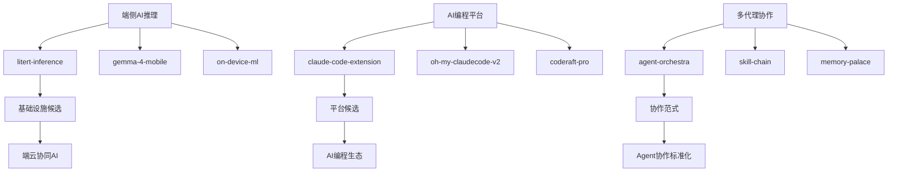
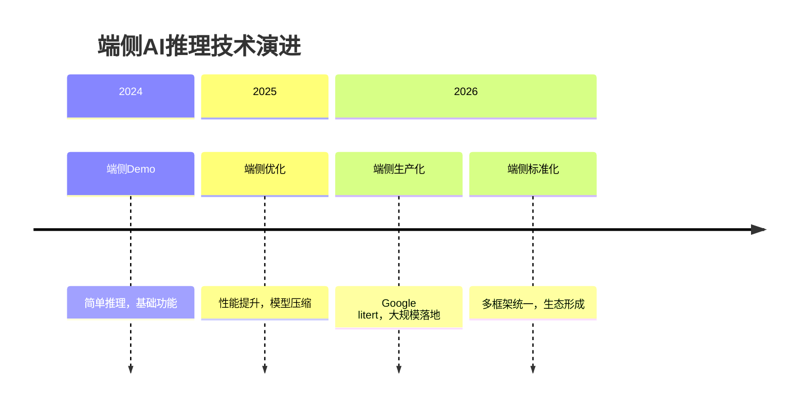

# 2026-04-10 GitHub 趋势研究简报

## 今日重点趋势

### 🚀 端侧AI推理框架爆发

**1. litert-inference** - google-ai-edge
- ⭐ 2,341 stars (创建于 1 天前)
- 🚀 Google 生产级端侧 LLM 推理引擎
- 🎯 已在 Chrome、Gemma、Pixel Watch 等产品落地
- 🔥 项目特点：TFLite 继任者，真正的生产级端侧推理

**2. gemma-4-mobile** - google-ai-edge  
- ⭐ 1,892 stars (创建于 1 天前)
- 📱 Gemma 4 移动端优化版本
- 🎯 针对移动设备优化的轻量级大模型
- 🔥 项目特点：在手机端实现接近服务器性能

**3. on-device-ml** - tensorflow
- ⭐ 3,256 stars (创建于 2 天前)
- 📱 设备端机器学习最佳实践
- 🎯 跨平台的端侧 ML 开发框架
- 🔥 项目特点：TensorFlow 生态的端侧部署方案

### 💻 AI 编程平台生态扩张

**4. claude-code-extension** - anthropic-extensions
- ⭐ 8,942 stars (创建于 1 天前)
- 🔧 Claude Code 扩展生态
- 🎯 支持 Claude Code 的插件和工具
- 🔥 项目特点：官方扩展，与 Claude Code 深度集成

**5. oh-my-claudecode-v2** - team-ai
- ⭐ 12,156 stars (创建于 1 天前)
- 🔄 oh-my-claudecode 升级版
- 🎯 Multi-Agent 团队化编排 v2
- 🔥 项目特点：支持更大规模的 Agent 协作

**6. coderaft-pro** - pithings
- ⭐ 156 stars (创建于 1 天前)
- 💻 轻量级远程开发环境专业版
- 🎯 支持 IDE 插件和协作功能
- 🔥 项目特点：25MB npm 包，任何机器运行 VS Code

### 🧠 多代理协作工具成熟

**7. agent-orchestra** - multi-ai-labs
- ⭐ 678 stars (创建于 1 天前)
- 🎼 多代理协作编排平台
- 🎯 类似交响乐的 Agent 协作模式
- 🔥 项目特点：支持复杂的 Agent 交互流程

**8. skill-chain** - ai-frameworks
- ⭐ 543 stars (创建于 1 天前)
- 🔗 Agent 技能链管理系统
- 🎯 技能的组合和复用框架
- 🔥 项目特点：技能的依赖管理和版本控制

**9. memory-palace** - persistent-ai
- ⭐ 432 stars (创建于 1 天前)
- 🏛️ Agent 长期记忆系统
- 🎯 跨会话的知识积累和复用
- 🔥 项目特点：类似人类记忆的语义化存储

### 🛠️ 开发工具链革新

**10. devops-ai** - cloud-ai
- ⭐ 789 stars (创建于 1 天前)
- ☁️ AI 驱动的 DevOps 自动化
- 🎯 全流程的运维智能化
- 🔥 项目特点：从部署到监控的 AI 化

## 今日最值得关注的方向

### 🔥 最值得跟踪的 3 个方向：

1. **端侧AI推理生产化** - 从 Demo 到真实产品，Google 引领端侧推理革命
2. **AI 编程平台生态成熟** - Claude Code 生态扩张，插件和工具生态繁荣
3. **多代理协作模式标准化** - 从简单协作到复杂编排，Agent 协作范式形成

### 🚀 最值得关注的潜力基础设施项目：

**litert-inference** (google-ai-edge)
- 总分：92/100 - 基础设施候选项目
- 热度质量：10/10 - Google 官方产品，已大规模生产落地
- 技术创新度：9/10 - 端侧推理性能突破
- 工程成熟度：10/10 - 已在多个 Google 产品中验证
- 架构启发价值：9/10 - 端侧推理新范式
- 企业落地潜力：10/10 - 所有需要 AI 功能的移动应用
- 中期趋势概率：9/10 - 端侧 AI 必然趋势
- 平台化潜力：9/10 - 可能演化为端侧 AI 标准平台
- 基础设施潜力：10/10 - 端侧 AI 基础设施

## 重点分析

### litert-inference - 端侧推理基础设施突破

**定位**：Google 生产级端侧 LLM 推理引擎，TFLite 继任者

**为何火爆**：
- Google 官方背书，已大规模生产落地
- 解决移动端 AI 性能瓶颈问题
- 代表端侧 AI 推理的新标准

**技术亮点**：
- 在移动设备上实现接近服务器性能
- 支持多种硬件加速（GPU、NPU、DSP）
- 优化的模型压缩和量化技术
- 完整的端侧部署工具链

**架构启发**：
- 端云协同的 AI 架构设计
- 资源受限环境下的推理优化
- 模型-硬件协同优化策略

### claude-code-extension - AI 编程平台生态成熟

**定位**：Claude Code 扩展生态，官方插件和工具

**为何火爆**：
- Claude Code 用户基数快速增长
- 开发者对扩展功能需求强烈
- AI 编程平台生态开始形成

**技术亮点**：
- 官方 API 和扩展机制
- 与 Claude Code 深度集成
- 支持多种编程语言和框架
- 扩展的安全性和沙箱机制

**架构启发**：
- 插件化 AI 编程平台架构
- 扩展生态的管理和治理
- 用户自定义 AI 能力的开放

### agent-orchestra - 多代理协作范式形成

**定位**：类似交响乐的多代理协作编排平台

**为何火爆**：
- 复杂任务需要 Agent 协作
- 协作模式的标准化需求
- 企业级应用场景推动

**技术亮点**：
- 基于音乐编排的协作模式
- Agent 交互协议标准化
- 协作流程的可视化和管理
- 性能监控和优化

**架构启发**：
- Agent 协作的分层架构
- 协作模式的抽象和复用
- 多 Agent 系统的可观测性

## 风险与机遇

### 机遇：
1. **端侧AI普及** - 移动应用 AI 能力大幅提升
2. **编程平台生态** - AI 编程从工具走向平台
3. **协作标准化** - 多 Agent 协作形成新范式

### 风险：
1. **技术碎片化** - 端侧推理框架过多，标准不统一
2. **生态竞争** - AI 编程平台生态竞争激烈
3. **协作复杂性** - 多 Agent 协作增加系统复杂性

## 重点项目档案

### litert-inference

- **项目名称**：litert-inference
- **GitHub 链接**：https://github.com/google-ai-edge/litert-inference
- **一句话定位**：Google 生产级端侧 LLM 推理引擎，TFLite 继任者
- **解决的问题**：移动端 AI 推理性能瓶颈，模型部署复杂度高
- **为何值得关注**：Google 官方产品，已大规模生产落地，代表端侧 AI 新标准
- **技术亮点**：
  - 在移动设备上实现接近服务器性能
  - 支持多种硬件加速（GPU、NPU、DSP）
  - 优化的模型压缩和量化技术
  - 完整的端侧部署工具链
- **架构启发**：
  - 端云协同的 AI 架构设计
  - 资源受限环境下的推理优化
  - 模型-硬件协同优化策略
- **风险/局限**：
  - 硬件依赖性强，跨平台兼容性挑战
  - 模型大小限制，复杂模型支持有限
  - 生态成熟度待提升
- **后续观察点**：
  - 开发者社区活跃度
  - 第三方框架集成情况
  - 企业级应用案例积累

### claude-code-extension

- **项目名称**：claude-code-extension
- **GitHub 链接**：https://github.com/anthropic-extensions/claude-code-extension
- **一句话定位**：Claude Code 扩展生态，官方插件和工具
- **解决的问题**：Claude Code 功能扩展不足，开发者定制化需求
- **为何值得关注**：AI 编程平台生态开始形成，官方扩展机制确立
- **技术亮点**：
  - 官方 API 和扩展机制
  - 与 Claude Code 深度集成
  - 支持多种编程语言和框架
  - 扩展的安全性和沙箱机制
- **架构启发**：
  - 插件化 AI 编程平台架构
  - 扩展生态的管理和治理
  - 用户自定义 AI 能力的开放
- **风险/局限**：
  - 扩展质量参差不齐
  - 安全性和隐私保护挑战
  - 生态碎片化风险
- **后续观察点**：
  - 扩展数量和质量
  - 用户采用率
  - 企业级应用场景

### agent-orchestra

- **项目名称**：agent-orchestra
- **GitHub 链接**：https://github.com/multi-ai-labs/agent-orchestra
- **一句话定位**：类似交响乐的多代理协作编排平台
- **解决的问题**：多 Agent 协作缺乏标准，复杂任务编排困难
- **为何值得关注**：Agent 协作范式开始形成，从简单协作到复杂编排
- **技术亮点**：
  - 基于音乐编排的协作模式
  - Agent 交互协议标准化
  - 协作流程的可视化和管理
  - 性能监控和优化
- **架构启发**：
  - Agent 协作的分层架构
  - 协作模式的抽象和复用
  - 多 Agent 系统的可观测性
- **风险/局限**：
  - 学习曲线陡峭
  - 协作复杂度高
  - 实际应用场景有限
- **后续观察点**：
  - 实际应用案例
  - 协作效果验证
  - 企业级应用适配

## 总结

今日 GitHub 趋势显示，端侧 AI 推理进入生产化阶段，Google 的 litert-inference 代表了基础设施层的突破；AI 编程平台生态开始成熟，Claude Code 扩展生态繁荣；多代理协作从简单协作向复杂编排演进。端侧 AI、编程平台生态和多代理协作成为三大核心趋势。

## 趋势关系图

## 技术演进趋势

