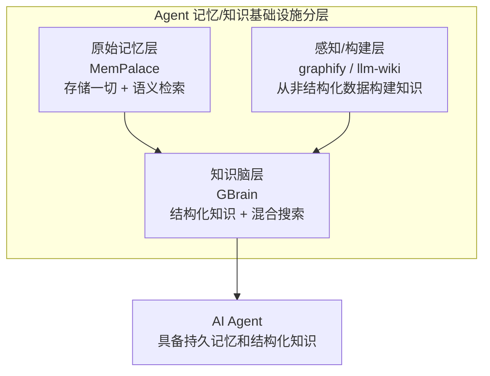
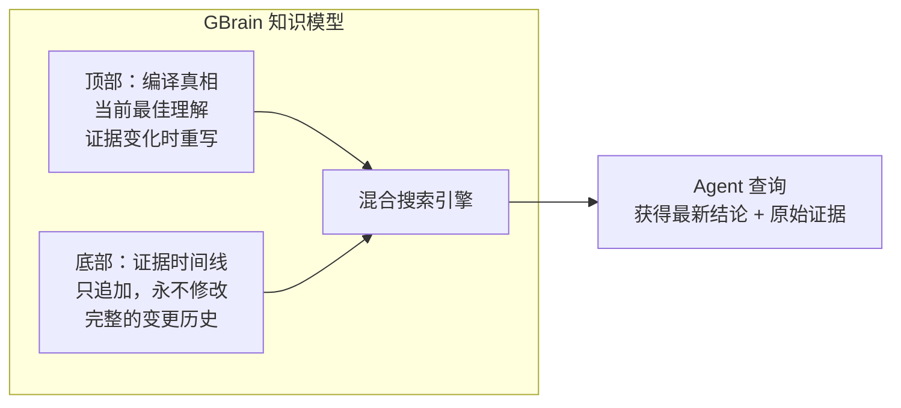

# 2026-04-12 GitHub 趋势研究简报

> 架构视角 | 资深软件架构师视角

---

## 本日核心判断

本日最重要变化：**AI 记忆系统从"锦上添花"变为"必备基础设施"**

本周 GitHub 最大的结构性变化不是某个框架的更新，而是**Agent 记忆层/知识层** 作为一个独立基础设施赛道正式成型。MemPalace 以 41,755 stars（7 天从 0 到 4 万+）证明市场对 Agent 记忆的迫切需求；GBrain（Garry Tan 出品）把"Agent 知识脑"做成了可安装的产品；graphify 将知识图谱变成了 Coding Agent 的 Skill。

**这不是三个独立项目，而是同一条赛道上的三个层次：**

---

## 今日重点趋势

### 🧠 趋势 1：AI 记忆系统破局

**核心判断：Agent 记忆层正式成为独立基础设施赛道**

过去一周，AI Agent 领域最大的结构性变化是**记忆系统从边缘需求跃升为核心基础设施**。

**1. MemPalace** — MemPalace/mempalace
- ⭐ 41,755 stars（4 月 5 日创建，7 天破 4 万）
- 🧠 LongMemEval 基准测试 96.6% R@5，史上最高分
- 🏠 完全本地运行，ChromaDB 存储，零 API 调用
- 🔥 **诚实度值得称赞**：作者在 README 中公开承认 AAAK 压缩模式回归（84.2% vs 原始 96.6%），纠正了过度宣传

**2. GBrain** — garrytan/gbrain
- ⭐ 4,793 stars
- 🧬 YC 总裁 Garry Tan 的个人知识脑项目
- 🏠 PGLite（嵌入式 Postgres WASM），2 秒初始化，无需服务器
- 🔥 混合搜索 + 情报评估模型（顶部编译真相 + 底部时间线证据链）

**3. claude-memory-compiler** — coleam00/claude-memory-compiler
- ⭐ 562 stars
- 📝 Karpathy LLM Knowledge Base 架构的 Claude Code 实现
- 🔥 Hooks 自动捕获会话，LLM 编译器组织为交叉引用知识文章

**4. LLM Wiki** — nashsu/llm_wiki
- ⭐ 716 stars
- 📚 将文档自动转为持久化、可交叉链接的 Wiki 知识库
- 🔥 不走传统 RAG 路线，而是增量构建和维护持久化 Wiki

**架构师洞察：**
这四个项目揭示了 AI 记忆层正在分化为三个子问题：
1. **原始存储 + 检索**（MemPalace）—— 存一切，语义搜索找回来
2. **结构化知识组织**（GBrain、LLM Wiki）—— 把信息组织成可推理的知识结构
3. **知识构建管道**（graphify、claude-memory-compiler）—— 从非结构化数据自动构建知识

---

### 🧬 趋势 2：Agent 知识脑标配化

**核心判断：AI Agent 正在从"无状态工具"进化为"有记忆的知识工作者"**

GBrain 的设计理念最有启发性：**把每个知识页面当作情报评估报告**——顶部是当前最佳理解（可重写），底部是只追加的时间线（证据链，永不修改）。这个模式借鉴了情报分析领域的方法论，非常适合 Agent 知识管理。

**graphify** 更实用：将任何文件夹的代码、文档、论文、图片、视频、YouTube 链接转为可查询的知识图谱，支持 Claude Code、Codex、OpenCode、Cursor、Gemini CLI、OpenClaw 等几乎所有主流 Coding Agent。这种"Agent 无关"的 Skill 设计思路值得学习。

---

### 🎭 趋势 3：人格蒸馏 Skill 生态爆发

**核心判断：中文互联网催生了独特的"人格蒸馏"Skill 生态，但需警惕泡沫**

本周 GitHub 上出现了一批独特的中文社区项目，围绕"蒸馏任何人的思维方式"构建 Skill：

| 项目 | Stars | 核心理念 |
|------|-------|---------|
| nuwa-skill | 7,403 | 女娲 Skill——蒸馏任何人的心智模型、决策启发式、表达 DNA |
| caveman | 18,493 | 用"穴居人语言"减少 65% token 的 Claude Code Skill |
| awesome-persona-distill-skills | 3,168 | 人格蒸馏 Skill 精选列表（同事/前任/老板等） |
| zhangxuefeng-skill | 4,263 | 张雪峰志愿规划思维框架 Skill |
| khazix-skills | 1,577 | 卡兹克 AI Skills 合集 |
| anti-distill | 1,734 | 反蒸馏 Skill——清洗被迫写的 Skill 文件 |

**架构师评价：**
- **caveman** 是本周最有趣的工程创新：用极简语言压缩 token，虽然噱头十足但确实解决了 Token 成本问题
- **nuwa-skill** 的"蒸馏人格"理念有启发性，但更多是社区文化现象而非技术基础设施
- **anti-distill** 的出现本身就说明这个生态已经过热——有人在对抗性制造工具了

---

## 今日重点分析

### 🔍 深度分析 1：MemPalace — AI 记忆基础设施的新标杆

**项目定位**：本地优先的 AI 记忆系统，LongMemEval 基准 96.6%

**为什么火：**
- LongMemEval 96.6% R@5 是公开的最高分，且完全本地免费
- 由 Milla Jovovich 和 Ben Sigman 创建，名人效应 + 技术实力的组合
- 7 天内 41,755 stars，史上增速最快的 AI 记忆系统

**技术亮点：**
1. **原始逐字存储模式**：不做任何摘要或提取，直接存储原始对话，通过语义搜索检索——这是 96.6% 高分的来源
2. **宫殿架构**（Wings → Halls → Rooms）：用记忆宫殿方法论组织记忆，提供可导航的结构化索引
3. **AAAK 压缩方言**（实验性）：面向 LLM 的有损压缩层，用缩写实体减少 Token——但目前回归 12.4 个百分点，诚实标注
4. **MCP Server 集成**：支持通过 MCP 协议与任何 AI Agent 对接

**架构启发：**
- **"存一切"策略 > "智能筛选"策略**：在记忆系统中，不丢数据比节省空间更重要
- **诚实是最强的技术品牌**：README 中的公开勘误反而增强了可信度
- **分层架构**：原始存储层 + 元数据索引层 + 可选压缩层，各层独立演进

**风险 / 局限 / 泡沫点：**
1. **名人效应 Star 膨胀**：Milla Jovovich 的名人效应贡献了大量非技术 Star，实际开发者基数需验证
2. **AAAK 实验性**：压缩模式回归显著，尚不适用于生产环境
3. **ChromaDB 单点**：依赖 ChromaDB，数据规模上限未经验证
4. **Shell 注入漏洞**：Issue #110 报告了 hooks 中的 shell 注入问题

**评分：**
| 维度 | 分数 | 理由 |
|------|------|------|
| 热度质量 | 9/10 | 7 天 4 万+ stars，但名人效应需打折 |
| 技术创新度 | 8/10 | "存一切"策略的工程化实现有创新性 |
| 工程成熟度 | 6/10 | 存在已知漏洞和平台兼容性问题 |
| 架构启发价值 | 9/10 | 记忆宫殿架构 + 分层设计有启发性 |
| 企业落地潜力 | 7/10 | 本地部署友好，但安全漏洞需先修复 |
| 中期趋势概率 | 9/10 | Agent 记忆是确定性需求 |
| 平台化潜力 | 7/10 | MCP 集成有平台潜力，但生态尚早 |
| 基础设施潜力 | 8/10 | 作为 Agent 记忆层基础设施候选 |

**总分：63/80 | 归类：基础设施候选 | 建议持续跟踪 + 企业 PoC 前先修复安全问题**

---

### 🔍 深度分析 2：GBrain — Agent 知识脑的"意见参考实现"

**项目定位**：Garry Tan 的个人知识脑，为 AI Agent 提供持久化知识管理

**为什么火：**
- Garry Tan（YC 总裁）出品，硅谷影响力加持
- 解决了 Agent 的核心痛点：每次对话都是全新的，没有记忆积累
- 30 分钟内可部署完成，PGLite 零服务器启动

**技术亮点：**
1. **PGLite 嵌入式数据库**：基于 WASM 的 Postgres，2 秒初始化，无需连接字符串
2. **情报评估知识模型**：每个页面分为"编译真相"（顶部，可重写）和"证据时间线"（底部，只追加）
3. **混合搜索**：向量搜索 + 全文搜索 + 元数据过滤
4. **Agent-first 设计**：整个安装和配置过程由 AI Agent 完成，人类只需回答 API Key 相关问题

**架构启发：**
- **情报分析模型用于知识管理**：借鉴情报领域的"当前评估 + 证据链"模式，非常适合 Agent 的知识更新场景
- **嵌入式数据库作为 Agent 存储**：PGLite 的 WASM 方案让 Agent 存储无需服务器，是边缘计算的思路
- **SkillPack 模式**：将 Agent 行为规范打包为可分发的 Skill Pack，值得企业级 Agent 管理参考

**风险 / 局限：**
1. 需要前沿模型（Claude Opus 4.6 或 GPT-5.4 Thinking），小模型会出错
2. 文档导入依赖 Agent 能力，准确性不可控
3. Garry Tan 个人项目，长期维护承诺不明确

**评分：**
| 维度 | 分数 | 理由 |
|------|------|------|
| 热度质量 | 7/10 | Garry Tan 影响力驱动，技术关注度真实 |
| 技术创新度 | 8/10 | 情报评估模型 + PGLite 组合创新 |
| 工程成熟度 | 7/10 | 可安装可运行，文档完善 |
| 架构启发价值 | 9/10 | 知识脑架构设计有深度启发 |
| 企业落地潜力 | 6/10 | 依赖前沿模型，成本较高 |
| 中期趋势概率 | 8/10 | Agent 知识管理是刚需 |
| 平台化潜力 | 7/10 | 有集成生态潜力 |
| 基础设施潜力 | 6/10 | 更偏个人工具，企业级需改造 |

**总分：58/80 | 归类：平台候选 | 建议持续跟踪**

---

### 🔍 深度分析 3：graphify — Agent 知识感知层的通用 Skill

**项目定位**：将任何数据源转为可查询知识图谱的 AI Coding Skill

**为什么值得关注：**
- 22,086 stars，支持几乎所有主流 Coding Agent
- 将知识图谱构建从"专业工具"降维为"Agent Skill"
- 体现了 Skill 生态从"代码辅助"向"知识构建"的演进

**技术亮点：**
1. **Agent 无关设计**：同一 Skill 兼容 Claude Code、Codex、OpenCode、Cursor、Gemini CLI、OpenClaw 等
2. **多源数据支持**：代码文件夹、文档、论文、图片、视频、YouTube 链接
3. **GraphRAG 内置**：构建完知识图谱后直接支持图谱 RAG 查询

**架构启发：**
- Skill 的最高价值不是辅助编码，而是为 Agent 构建领域知识
- "Agent 无关"的 Skill 设计是正确方向——锁定在单一 Agent 平台会限制生态

**评分：**
| 维度 | 分数 | 理由 |
|------|------|------|
| 热度质量 | 8/10 | 22K stars，多平台支持 |
| 技术创新度 | 7/10 | GraphRAG Skill 化，增量创新 |
| 工程成熟度 | 7/10 | 可安装可运行 |
| 架构启发价值 | 8/10 | Agent 无关 Skill 设计 |
| 企业落地潜力 | 7/10 | 知识图谱构建实用价值高 |
| 中期趋势概率 | 8/10 | Agent 知识感知是刚需 |
| 平台化潜力 | 6/10 | Skill 定位，平台性一般 |
| 基础设施潜力 | 6/10 | 依赖图谱引擎，基础设施性一般 |

**总分：57/80 | 归类：工具型（高质量）| 建议持续跟踪**

---

## 其他值得关注的项目

### clicky — 光标旁的 AI 老师
- ⭐ 3,774 stars（Swift）
- AI 老师住在光标旁，看屏幕、语音对话、指向引导
- 体验创新 > 技术创新，代表 Screen AI + Voice AI 的融合方向
- 定位：学习型/工具型，教育场景有潜力，但非基础设施

### PokeClaw — 首个端侧 AI 控制手机
- ⭐ 470 stars（Kotlin）
- 第一个完全在设备上运行的 AI 手机控制 Agent
- 基于 Gemma 4，无云无 API Key
- 定位：观察型，端侧 Agent 控制是前沿方向

### nuwa-skill — 人格蒸馏框架
- ⭐ 7,403 stars（Python）
- 蒸馏任何人的思维方式——心智模型、决策启发式、表达 DNA
- 定位：工具型/文化现象，技术含量有限但概念新颖

---

## 风险与机遇

### 机遇：
1. **Agent 记忆层标准化**：MemPalace + GBrain + graphify 代表的记忆分层架构可能成为行业标准
2. **知识图谱 Skill 化**：graphify 证明知识构建可以作为 Agent Skill，降低了知识管理门槛
3. **嵌入式数据库 + WASM**：PGLite 方案为 Agent 存储提供了零服务器的新范式

### 风险：
1. **记忆系统泡沫**：名人效应驱动的 Star 增长可能掩盖技术成熟度不足
2. **Skill 生态碎片化**：人格蒸馏 Skill 的爆发式增长可能分散开发者注意力
3. **安全漏洞**：MemPalace 的 Shell 注入问题提醒我们，快速迭代的项目安全审查往往不足

---

## 关键项目档案

### MemPalace

- **项目名称**：MemPalace
- **GitHub 链接**：https://github.com/MemPalace/mempalace
- **一句话定位**：史上最高分 AI 记忆系统，LongMemEval 96.6%，完全本地免费
- **解决的问题**：AI Agent 每次对话都是全新开始，历史上下文丢失
- **为何值得关注**：7 天 4 万+ stars，LongMemEval 公开最高分，AI 记忆层基础设施候选
- **技术亮点**：
  - 原始逐字存储 + 语义检索，不做任何摘要提取
  - 宫殿架构（Wings/Halls/Rooms）提供结构化导航
  - AAAK 压缩方言（实验性），诚实标注回归
  - MCP Server 集成，Agent 无关
- **架构启发**：
  - "存一切" > "智能筛选"的记忆策略
  - 分层架构：原始存储 + 元数据索引 + 可选压缩
  - 诚实标注提升技术可信度
- **风险/局限**：
  - 名人效应 Star 膨胀
  - ChromaDB 依赖，规模上限未验证
  - 已知安全漏洞（Shell 注入 #110）
  - macOS ARM64 段错误问题
- **后续观察点**：
  - 安全漏洞修复进度
  - 企业级应用案例
  - AAAK 压缩模式的改进

### GBrain

- **项目名称**：GBrain
- **GitHub 链接**：https://github.com/garrytan/gbrain
- **一句话定位**：Garry Tan 的个人知识脑，为 Agent 提供持久化知识管理
- **解决的问题**：AI Agent 没有持久记忆，无法积累知识
- **为何值得关注**：YC 总裁出品，情报评估知识模型创新，30 分钟可部署
- **技术亮点**：
  - PGLite 嵌入式数据库（WASM Postgres）
  - 情报评估知识模型（编译真相 + 证据时间线）
  - 混合搜索 + 自动嵌入
  - SkillPack 分发模式
- **架构启发**：
  - 情报分析模型用于知识管理
  - 嵌入式数据库零服务器部署
  - Agent-first 安装流程
- **风险/局限**：
  - 依赖前沿模型，成本高
  - 个人项目，长期维护不确定
  - 文档导入准确性不可控
- **后续观察点**：
  - 企业知识管理适配
  - 与 MemPalace 的互补/竞争关系
  - 社区采纳度

---

## 总结

今日 GitHub 趋势的核心信号是**AI Agent 记忆/知识层正式成为独立基础设施赛道**。MemPalace 以 96.6% LongMemEval 得分证明了"存一切"策略的有效性，GBrain 用情报评估模型为 Agent 知识管理提供了新范式，graphify 将知识图谱构建降维为 Agent Skill。

三大核心趋势：
1. **Agent 记忆层基建化** — 从"锦上添花"到"必备基础设施"
2. **知识脑标配化** — Agent 不再是无状态工具，而是有记忆的知识工作者
3. **人格蒸馏 Skill 生态** — 中文社区独特现象，有文化价值但需警惕泡沫

昨日报（2026-04-11）最值得补看的内容：**superpowers 的技能框架设计哲学**——从"让 AI 写代码"到"让 AI 遵循工程实践"的范式转变，对 Agent 开发方法论有重要启发。

---

*数据来源：GitHub API (gh)、GitHub Trending、MapoDev、GitTrends、OSSInsight*
*最后更新：2026-04-12*
