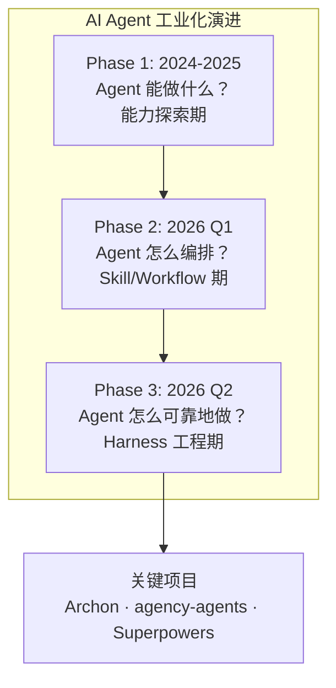
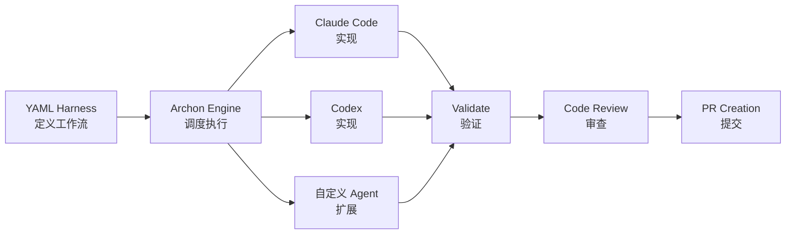
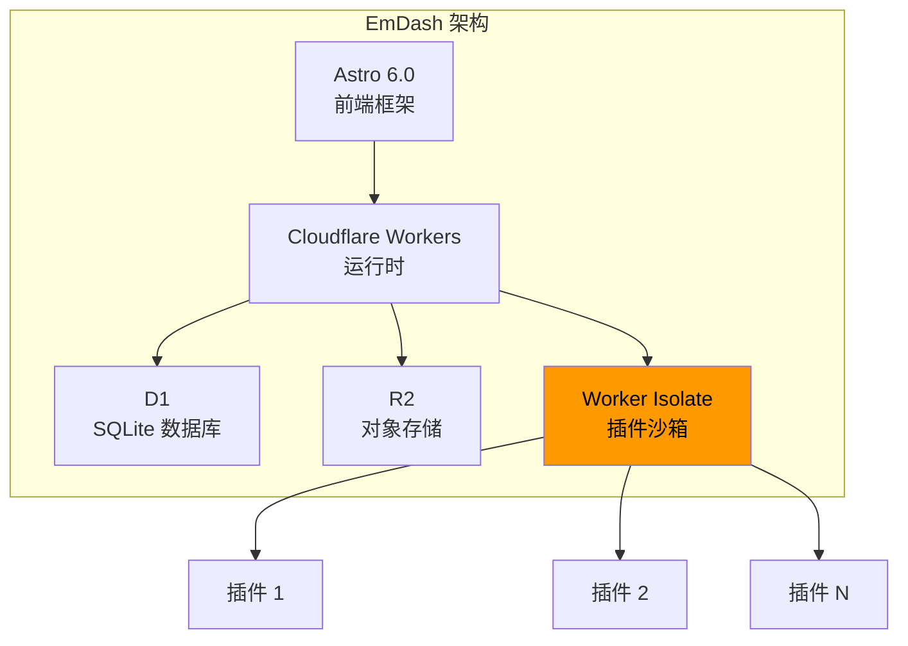

# 2026-04-13 GitHub 趋势研究简报

> 架构视角 | 资深软件架构师视角

---

## 本日核心判断

本周 GitHub 最重要变化：**AI Agent 从「创意工具」进入「工业工程」阶段**

三个信号同时出现：
1. **Archon** 以 "harness builder" 概念把 AI 编程从"提示词艺术"推进到"确定性工程"
2. **agency-agents** 单月暴涨 67K stars，证明市场对"开箱即用的 Agent 工具箱"有巨大需求
3. **MiroFish** 把群体智能从学术概念变成可调用的引擎

这标志着 2026 年 Q2 的核心叙事从"Agent 能做什么"转向"Agent 怎么可靠地做"。

---

## 今日重点趋势

### 🏗️ 趋势 1：AI Agent 工业化 — Harness 工程范式确立

**核心判断：AI Coding 正在复现 CI/CD 的历史路径**

Archon 的核心类比非常精准——**Dockerfile 标准化了基础设施部署，GitHub Actions 标准化了 CI/CD，而 Archon 要用 YAML 标准化 AI 编程工作流**。

这个定位击中了一个真实痛点：今天的 AI Coding Agent 输出不确定，同一条 prompt 跑两次结果可能天差地别。Archon 把"plan → implement → validate → review → PR"编码为可重复的 harness。

**为什么这比看起来更重要：**
- 企业级 AI Coding 的最大障碍不是能力，而是**可重复性**
- "harness" 概念把 AI 编程从"人跟 Agent 对话"变成"定义流程让 Agent 执行"
- 支持 CLI/Web/Slack/Discord/GitHub 多入口，说明定位是**团队工具**而非个人工具
- 16,000 stars 在 4 天内达成，增速健康

**风险点：**
- YAML 定义工作流的复杂度可能很快膨胀
- 对 Agent 的"可控性"假设建立在 Agent 行为可约束的前提上，这在 LLM 领域仍有根本性挑战
- 与 Claude Code、Codex 深度绑定，模型切换成本可能较高

---

### 🐟 趋势 2：群体智能与自进化 Agent 觉醒

**核心判断：群体智能从论文走向工程，但距离生产还有距离**

MiroFish 定位为"通用群体智能引擎"，提供预测、优化、协作能力。与 agency-agents 的"多 Agent 工具箱"不同，MiroFish 更偏底层算法引擎。

**值得关注的原因：**
- 群体智能是多 Agent 协作的理论基础，但长期停留在学术层面
- 如果 MiroFish 能把 Particle Swarm / ACO / 蜂群等算法包装成可调用的 API，可能成为 Agent 框架的基础依赖
- 25K+ stars 说明开发者对此方向有强烈兴趣

**风险点：**
- 目前缺乏足够的 benchmark 数据证明工程可用性
- "通用"群体智能引擎的抽象层可能过高，难以直接解决具体问题
- 泡沫风险中等——概念吸睛但落地案例不足

---

### 📱 趋势 3：端侧 AI 生态加速成型

**核心判断：Google 正在构建从模型到推理到部署的端侧 AI 完整闭环**

继上周 Gemma 4 发布后，本周端侧 AI 生态持续发酵：
- **Gemma 4** 31B dense 模型在手机端完全离线运行，Apache 2.0 许可
- **AI Edge Gallery** 支持下载模型到 iPhone/Android，支持 Agent Skills、Thinking Mode、多模态
- **LiteRT-LM** 作为 TFLite 的继任者，提供生产级端侧推理

**架构师关注点：**
- 端侧 AI 不再是"玩具"——31B 模型离线运行意味着相当多的企业场景可以在端侧完成
- Agent Skills + 端侧模型的组合预示着"端侧 Agent"时代的到来
- Apache 2.0 许可消除了企业使用的法律障碍

---

### 📐 趋势 4：EmDash — Cloudflare 对 WordPress 的正面宣战

**核心判断：这是 2026 年 Web 基础设施领域最重要的事件之一**

Cloudflare 在 4 月 1 日发布 EmDash——一个基于 Astro 6.0 + Cloudflare Workers 的全栈 TypeScript CMS。不是渐进式改良，而是**从插件隔离模型开始彻底重构 CMS 架构**。

**技术亮点：**
- 插件运行在沙箱化的 Worker Isolate 中——这解决了 WordPress 最根本的安全问题
- 全栈 TypeScript + D1 + R2，现代化技术栈
- Cloudflare 的全球边缘网络天然提供 CDN + 安全防护
- MIT 开源

**为什么是平台候选：**
- CMS 是 Web 生态的基础设施层，WordPress 占据了 43% 的网站
- Cloudflare 有网络、有基础设施、有开发者社区——这三点加起来构成平台基础
- 插件沙箱模型如果成功，可以推广到更多场景

**风险点：**
- "WordPress 继任者"的叙事过于宏大，容易让人用 WordPress 的标准衡量 EmDash
- 目前仍处于 Beta 阶段，插件生态几乎为零
- Cloudflare 锁定是真实风险——虽然 MIT 开源，但 Workers 运行时有迁移成本
- Matt Mullenweg 已经公开质疑 Cloudflare 锁定风险

---

## 重点项目深度分析

### 🏗️ Top 1: Archon — AI Coding 的 Dockerfile

**它是做什么的：** 首个开源 AI Coding harness builder。用 YAML 定义编码工作流（plan → implement → validate → review → PR），让 AI 编程可确定、可重复。

**它为什么火：** 击中了 AI Coding 的核心痛点——不确定性。每个用过 AI Coding Agent 的人都被"同一条指令产出天差地别"折磨过。Archon 的"harness"概念提供了一个工程化的解法。

**技术亮点：**
- YAML 工作流引擎，支持条件分支、并行执行、错误处理
- 多入口：CLI / Web / Slack / Discord / GitHub
- 支持 Claude Code + Codex 的 harness 模板
- TypeScript 实现，架构清晰

**架构启发：**

**定位判断：** 平台候选。如果 harness 概念被广泛接受，Archon 有潜力成为 AI Coding 工作流的事实标准。

**风险：** 过度依赖特定 Agent 实现；YAML 复杂度膨胀风险；LLM 不确定性是根本性挑战。

---

### 🐟 Top 2: MiroFish — 通用群体智能引擎

**它是做什么的：** 将群体智能算法（粒子群、蚁群、蜂群等）封装为可调用的通用引擎，提供预测、优化、协作能力。

**它为什么火：** 群体智能是多 Agent 系统的理论基础，长期停留在学术层面。MiroFish 尝试将其工程化。25K+ stars 证明开发者对"让 Agent 群体协作"有强烈需求。

**技术亮点：**
- 多种群体智能算法统一封装
- 预测 + 优化 + 协作一体化设计
- 声称支持多种应用场景

**定位判断：** 学习型→平台候选的过渡阶段。如果 API 设计得当且有足够的 benchmark，可能成为多 Agent 框架的基础依赖。

**风险：** "通用"意味着可能什么都不精；benchmark 数据不足；群体智能在 LLM Agent 中的实际效果未经验证。

---

### 📐 Top 3: EmDash — Cloudflare 的 CMS 新物种

**它是做什么的：** 全栈 TypeScript CMS，基于 Astro 6.0 + Cloudflare Workers + D1 + R2。用沙箱化 Worker Isolate 运行插件，从架构层面解决 WordPress 的安全顽疾。

**它为什么火：** Cloudflare 官方出品 + "WordPress 精神继任者"定位 + 4 月 1 日发布（真假难辨的话题性）。1,300 stars in hours。

**技术亮点：**
- 插件运行在 Cloudflare Worker Isolate 中——操作系统级隔离
- 全栈 TypeScript，类型安全
- D1（SQLite）+ R2（对象存储）作为存储层
- 边缘网络天然提供全球 CDN + DDoS 防护

**架构启发：** 插件沙箱模型值得所有需要插件系统的项目学习。WordPress 的安全问题本质上是插件在进程内运行导致的，Worker Isolate 提供了操作系统级的隔离。

**定位判断：** 平台候选。CMS 是 Web 的基础设施层，Cloudflare 有能力构建平台生态。

**风险：** Beta 阶段；插件生态为零；Cloudflare 锁定风险；与 WordPress 43% 的市场份额差距巨大。

---

## 风险与机遇

### ⚠️ 本日风险信号

1. **agency-agents 的月增 67K stars 异常**：一个 Shell 脚本集合月增 67K，泡沫嫌疑大。需要观察 star 质量和实际使用数据。
2. **Skills 生态饱和**：Substack 周报指出本周 trending 中近一半是 Claude Code skills / agent harnesses / skill registries。市场可能进入同质化竞争。
3. **端侧 AI 的隐私悖论**：Google 一方面推动端侧推理（隐私友好），另一方面通过 AI Edge Gallery 掌握了用户使用数据。

### 💡 本日机遇

1. **Harness 工程是新赛道**：Archon 证明了 AI Coding 工业化的需求，这个赛道会快速膨胀
2. **EmDash 对企业 CMS 市场的冲击**：安全架构优势可能让安全敏感行业快速迁移
3. **群体智能 + Agent**：如果 MiroFish 能与主流 Agent 框架集成，可能打开多 Agent 协作的新范式

---

## 评分汇总

### Archon
| 维度 | 评分 | 理由 |
|------|------|------|
| 热度质量 | 8 | 4天16K stars，多渠道热议 |
| 技术创新度 | 8 | Harness 概念新颖，YAML 工作流设计合理 |
| 工程成熟度 | 6 | 早期阶段，核心功能可用但生产验证不足 |
| 架构启发价值 | 9 | Dockerfile/Actions 的 AI Coding 等价物 |
| 企业落地潜力 | 7 | 解决企业 AI Coding 确定性痛点 |
| 中期趋势概率 | 8 | Harness 工程是自然演进方向 |
| 平台化潜力 | 7 | 有成为工作流标准的可能 |
| 基础设施潜力 | 6 | 更偏工具/平台层 |
| **总分** | **59/80** | **平台候选，深度跟踪** |

### MiroFish
| 维度 | 评分 | 理由 |
|------|------|------|
| 热度质量 | 7 | 月 trending 前列，stars 可观 |
| 技术创新度 | 7 | 群体智能工程化尝试 |
| 工程成熟度 | 4 | 缺乏 benchmark，生产验证不足 |
| 架构启发价值 | 7 | 多 Agent 协作的算法层 |
| 企业落地潜力 | 4 | 应用场景不够明确 |
| 中期趋势概率 | 5 | 概念吸睛但落地难度大 |
| 平台化潜力 | 5 | 需要与 Agent 框架深度集成 |
| 基础设施潜力 | 5 | 如果成为标准库则有潜力 |
| **总分** | **44/80** | **学习型，持续观察** |

### EmDash
| 维度 | 评分 | 理由 |
|------|------|------|
| 热度质量 | 8 | Cloudflare 官方 + WordPress 继任者叙事 |
| 技术创新度 | 8 | Worker Isolate 插件沙箱是架构级创新 |
| 工程成熟度 | 5 | Beta 阶段，核心功能可用但生态为零 |
| 架构启发价值 | 9 | 插件隔离模型值得所有插件系统学习 |
| 企业落地潜力 | 8 | 安全架构优势明显，TypeScript 栈友好 |
| 中期趋势概率 | 7 | CMS 市场有颠覆空间但窗口期有限 |
| 平台化潜力 | 8 | Cloudflare 有构建平台的能力和资源 |
| 基础设施潜力 | 7 | CMS 是 Web 基础设施层 |
| **总分** | **60/80** | **平台候选，深度跟踪 + PoC** |

---

## 项目归类

| 项目 | 归类 | 持续跟踪 | PoC 建议 |
|------|------|---------|---------|
| Archon | **平台候选** | ✅ 是 | 企业 AI Coding 工作流标准化 |
| MiroFish | 学习型 | ⚠️ 观望 | — |
| agency-agents | 工具型（泡沫嫌疑） | ⚠️ 短期关注 | — |
| EmDash | **平台候选** | ✅ 是 | 企业 CMS 评估 |

---

## 延续性追踪

### 昨日重点项目状态

| 项目 | 昨日判断 | 今日变化 | 判断调整 |
|------|---------|---------|---------|
| mempalace | 基础设施候选，深度跟踪 | 稳定在 42K+ | 维持判断 |
| GitNexus | 持续跟踪 | 25K+ stars，Wang Chujiang trending 首位 | 关注度持续上升 |
| superpowers | 深度跟踪 | 121K stars 稳定 | 维持判断 |
| EmDash | 新增跟踪 | 8,500+ stars，讨论热度持续 | 升级为平台候选 |

> 💡 **昨日补看提醒：** mempalace 的 LongMemEval 96.6% 结果值得深入阅读，如果关注 Agent 记忆层方向，建议优先查看 [mempalace 项目档案](projects/mempalace.html)。
