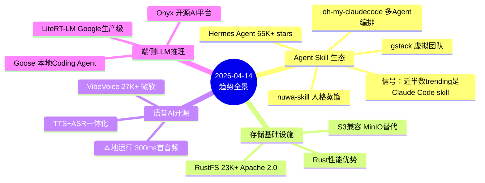
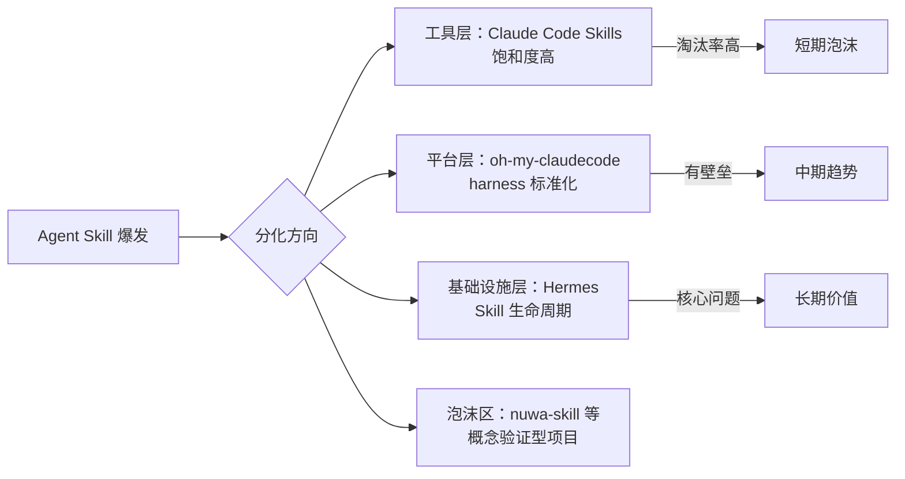
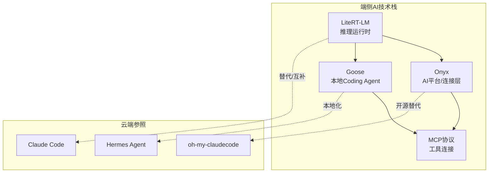

# 2026-04-14 GitHub 趋势研究简报

## 今日趋势概览

---

## 趋势一：Agent Skill 生态爆发与饱和并存

**核心数据：** 本周 GitHub Trending 前 100 个项目中，近半数是 Claude Code Skills、Agent Harness 或 Skill Registry。这是一个明确的信号：**Agent Skill 领域正在从创新期进入泡沫期。**

### Hermes Agent 持续霸榜

Hermes Agent（NousResearch）本周再增 32,572 stars，总星数突破 65K。核心看点：

- **v0.8.0 Browser Use 集成**：Agent 可以直接操作浏览器，从"对话工具"升级为"数字员工"
- **自我进化架构**：每次完成任务自动生成 Skill 文档，下次遇到类似任务直接复用
- **6 周 57K→65K**：增速仍然健康，但增长曲线开始趋平

**架构师视角：** Hermes 的核心创新不在 Agent 本身，而在于它把 **Skill 的生命周期管理**（创建→改进→持久化→复用）做成了闭环。这是一个可以沉淀的工程范式。

### gstack：YC 总裁的"一人团队"工作流

Garry Tan（YC 总裁）把个人 Claude Code 配置开源为 gstack，66K stars。23 个专化角色涵盖 CEO、设计师、工程经理、QA 等。

**判断：**
- ✅ 证明了"单 Agent + 角色切换"可以替代多 Agent 编排的很多场景
- ⚠️ 本质是 Claude Code 配置文件集合，技术门槛不高
- ⚠️ 66K stars 中很大部分来自 Garry Tan 的个人影响力，而非技术价值
- 🔍 关注点不在项目本身，在于它揭示的 **AI Coding 工作流标准化趋势**

### nuwa-skill：人格蒸馏赛道的代表

nuwa-skill 可以把任何公众人物的"思维方式"（心智模型、决策启发式、表达 DNA）蒸馏为 Claude Code Skill。生态中 20K+ combined stars 来自多个以人物命名的 Skill 仓库。

**判断：**
- 🧪 概念新颖（把人蒸馏为技能），但 **学术演示属性远大于工程价值**
- ⚠️ 人格蒸馏的伦理边界模糊
- ⚠️ 实质是对公开资料的 prompt 模板化，技术深度有限
- 📌 信号价值大于工具价值：它表明市场对"可迁移 AI 人格"的需求正在浮现

### 饱和信号分析

---

## 趋势二：存储基础设施 Rust 化浪潮

**RustFS** 本周在 GitHub Trending 上表现抢眼：23K+ stars，声称 4KB 小对象性能是 MinIO 的 2.3x。

### 为什么重要

1. **MinIO 的 AGPL-3.0 许可证问题**：大量企业无法在商业产品中使用 MinIO，RustFS 的 Apache 2.0 是直接痛点解决
2. **Drop-in 替换**：可以直接替换 MinIO 二进制文件，迁移成本接近零
3. **Rust 生态进入基础设施层**：从 tokio/axum 等框架层，向存储/数据库等基础设施层渗透

### 架构师判断

| 维度 | 评分 | 理由 |
|------|------|------|
| 热度质量 | 8 | MinIO 许可证问题真实存在，需求驱动 |
| 技术创新度 | 6 | 不是新概念，Rust 重写 + 许可证优势 |
| 工程成熟度 | 5 | 新项目，生产验证不足，benchmark 可信度待确认 |
| 架构启发价值 | 7 | "Rust 重写经典基础设施"模式值得参考 |
| 企业落地潜力 | 8 | Apache 2.0 + S3 兼容 + MinIO 替换路径清晰 |
| 中期趋势概率 | 7 | Rust 基础设施是明确趋势 |
| 平台化潜力 | 5 | 存储组件，平台属性有限 |
| 基础设施潜力 | 8 | 直接对标 MinIO，基础设施级 |

**总分：54/80**
**归类：基础设施候选**
**建议：深度跟踪，但生产采用前需独立验证 benchmark 和稳定性**

---

## 趋势三：语音 AI 开源化破局

**VibeVoice**（Microsoft）持续走强，27K+ stars。本周进入 HF Transformers，ASR 能力开放。

关键进展：
- **TTS + ASR 一体化**：不是 Whisper wrapper，是从头训练的语音 AI
- **90 分钟多发言人**：单次可生成 4 个发言人的对话音频
- **本地运行**：首个音频 <300ms，无需云端
- **ASR 进 HF Transformers**：意味着 pip install 即可用

**架构师判断：** VibeVoice + LiteRT-LM 的组合值得企业关注——端侧语音识别 + 端侧 LLM 推理，可以在嵌入式设备上构建完整的语音交互闭环。这是边缘 AI 的一个真实落地场景。

---

## 趋势四：端侧 LLM 推理进入生产阶段

Google 的 **LiteRT-LM** 已经在 Chrome、Chromebook Plus、Pixel Watch 等产品中落地。这不是实验项目，是生产级运行时。

配合 **Onyx**（开源 AI 平台，v3.2.2 发布于 4 月 11 日，50+ 连接器 + MCP 支持）和 **Goose**（Block 出品的本地 Coding Agent），端侧 AI 生态正在形成完整技术栈：

---

## 今日重点项目深度分析

### 1. RustFS：存储基础设施的 Rust 化标杆

**它是做什么的：** 用 Rust 重写的 S3 兼容对象存储系统，定位为 MinIO 的开源替代。

**它为什么火：**
- MinIO 切换 AGPL-3.0 后，大量企业用户被迫寻找替代方案
- Rust 在 I/O 密集型场景的性能优势
- Apache 2.0 许可证对商业友好
- Drop-in 二进制替换，迁移成本极低

**技术亮点：**
1. 4KB 小对象 2.3x 性能优势（对比 MinIO）
2. 二进制 <100MB，支持 ARM 到数据中心全平台
3. 与 MinIO/Ceph 共存和迁移支持

**风险：**
- 23K stars 中部分来自对 MinIO 许可证问题的情绪反应
- Benchmark 数据来自项目自身，缺乏第三方独立验证
- 新项目，生产环境运行时间和故障恢复能力未验证

**对架构师的启发：** "Rust 重写经典基础设施 + 更友好的许可证"是一个可复制的模式。不只是存储，数据库、消息队列、网关等领域都有类似机会。

### 2. Goose：Block 的本地 AI Coding Agent

**它是做什么的：** Block（Square 母公司）开源的本地 AI Coding Agent，模型无关，支持 3000+ MCP 工具。

**它为什么火：**
- Block 内部 60% 采用率，有真实企业验证
- Apache 2.0 完全免费，对比 Claude Code $200/月
- 本地运行，代码不离开开发机
- 3000+ MCP 工具连接，生态扩展性强

**架构启发：**
- "模型无关 + MCP 标准化" 可能是 AI Coding Agent 的正确架构方向
- Block 的内部验证（60% 采用率）说明企业级 AI Coding 工具的 PMF 已验证
- 与 Claude Code 的定位差异：Goose 偏"本地工具"，Claude Code 偏"云服务"

### 3. nuwa-skill：人格蒸馏的边界探索

**一句话判断：** 技术深度有限，但揭示了一个值得关注的趋势——AI 人格的可迁移性和标准化。

**风险提示：**
- 伦理边界模糊（未经授权蒸馏他人思维方式）
- 本质是 prompt 模板化，不具备不可替代性
- 20K+ combined stars 有明显炒作成分

---

## 持续跟踪项目状态更新

| 项目 | 上次评估 | 本次更新 | 变化 |
|------|---------|---------|------|
| Hermes Agent | 65K stars | 持续霸榜，v0.8.0 Browser Use | ↑ 基础设施潜力提升 |
| VibeVoice | 27K stars | ASR 进 HF Transformers | ↑ 落地价值提升 |
| GitNexus | 23K+ stars | 持续 trending | → 稳定 |
| oh-my-claudecode | 27K stars | 生态持续扩展 | → 稳定 |
| LiteRT-LM | ~2K stars | 已在 Chrome/Pixel Watch 落地 | ↑ 生产验证 |
| Onyx | 5,240/周 | v3.2.2 发布 | → 稳定 |
| archon | 16K stars | harness 概念获得关注 | ↑ 工程范式价值 |
| mempalace | 41K stars | 持续关注 | → 稳定 |

---

## 风险与机遇

### 风险
1. **Agent Skill 饱和泡沫**：近半数 trending 是 Claude Code skill，多数会被淘汰
2. **RustFS 生产验证不足**：benchmark 看起来好，但未经大规模生产验证
3. **nuwa-skill 伦理风险**：人格蒸馏的合规边界尚无定论

### 机遇
1. **端侧 AI 全栈成型**：LiteRT-LM + VibeVoice + Onyx/Goose 构成完整闭环
2. **存储基础设施替换窗口**：MinIO AGPL 迁移潮中，RustFS 窗口期明确
3. **本地 AI Coding Agent 赛道**：Goose 证明了本地化 + MCP 标准化的可行性

---

## 一句话点评

> Agent Skill 领域正在经历从"百花齐放"到"大浪淘沙"的拐点。Hermes 的 Skill 生命周期管理和 Archon 的 Harness 标准化代表工程沉淀方向；大量概念型 Skill 将被淘汰。与此同时，RustFS 和 VibeVoice 分别在基础设施和语音 AI 领域打开了真实的替代空间。

---

## 重点项目档案

- [RustFS](projects/rustfs.html) — 🦀 Rust S3 存储新势力
- [gstack](projects/gstack.html) — 🔷 YC 总裁的 Claude Code 虚拟团队
- [Goose](projects/goose.html) — 🪿 Block 本地 AI Coding Agent
- [nuwa-skill](projects/nuwa-skill.html) — 🏺 人格蒸馏技能框架

---

*本日报数据来源：GitHub Trending（周榜 + 月榜）、GitStars Substack、OSSInsight、Shareuhack Weekly、Trendshift.io、web_search 多源交叉验证*
*数据采集时间：2026-04-14 08:00 CST*
