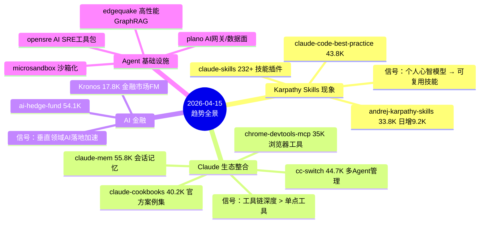
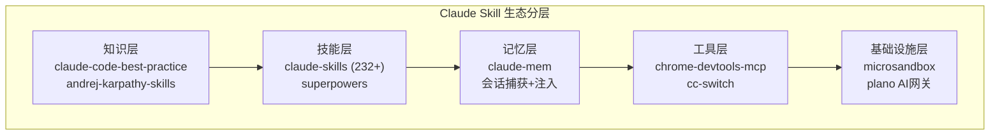
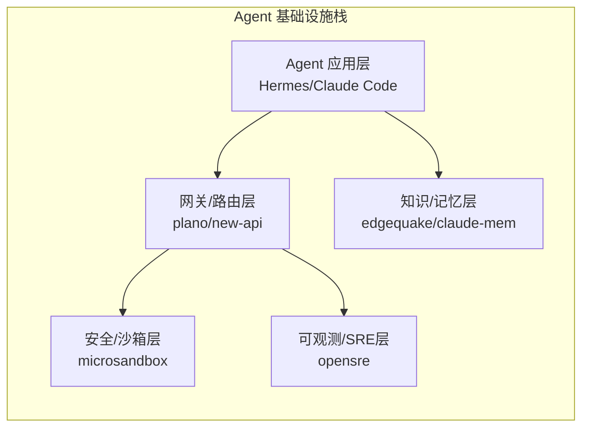

# 2026-04-15 GitHub 趋势研究简报

## 今日趋势概览

---

## 趋势一：Karpathy Skills 现象 —— 个人心智模型即技能

**核心数据：** `andrej-karpathy-skills` 今日日增 9,263 stars，周增 21,795 stars，总计 33,801 stars。一个单文件 CLAUDE.md 项目。

### 现象解读

这不是一个软件项目。这是一个 **CLAUDE.md 文件**——把 Andrej Karpathy 在 LLM 编程中的观察和最佳实践，提炼为 Claude Code 的行为指令。

**为什么它火：**

1. **Karpathy 效应**：AI 领域最有影响力的技术布道者之一，他的一篇推文就能驱动 10K+ stars
2. **痛点精准**：所有用 Claude Code 的人都在问"怎么让它更好用"——这个文件直接回答了
3. **门槛极低**：一个 markdown 文件，copy-paste 即用
4. **可蒸馏范式的验证**：证明"把专家的隐性知识显性化 → 结构化为 AI 指令"这条路走得通

### 与 nuwa-skill 人格蒸馏的对比

| 维度 | andrej-karpathy-skills | nuwa-skill |
|------|----------------------|------------|
| 方法 | 手工提炼专家思维模式 | 自动蒸馏公开资料 |
| 输出 | 单文件 CLAUDE.md | 多文件 Skill 包 |
| 质量控制 | 高（人审） | 低（自动生成） |
| 复用性 | 高（通用编程场景） | 低（人格模仿场景） |
| 工程深度 | 中（prompt engineering） | 低（模板化） |

**架构师判断：** Karpathy Skills 的真正价值不是这个文件本身，而是它验证了一个范式——**人类专家的心智模型可以结构化为 AI 的行为配置**。这是 Agent Skill 生态走向成熟的关键一步。

### 相关项目生态

围绕这一现象形成了完整的"AI 编程最佳实践"生态：

- **claude-code-best-practice**（43,782 stars）：从 vibe coding 到 agentic engineering 的实践指南
- **claude-skills**（11,098 stars）：232+ Claude Code 技能和 agent 插件集合，覆盖工程/营销/产品/合规
- **claude-cookbooks**（40,248 stars）：Anthropic 官方案例集

---

## 趋势二：Claude 生态工具链深度整合

**核心数据：** 今日 Trending 前 12 名中，7 个项目直接服务于 Claude Code / AI Agent 生态。不再是单个工具，而是完整的工具链。

### claude-mem：会话记忆的工程化

55,797 stars，日增 2,997。它做了什么：

1. **自动捕获**：记录 Claude Code 编码会话中的所有操作
2. **AI 压缩**：用 Claude Agent SDK 压缩会话历史
3. **上下文注入**：将相关记忆注入未来的编码会话

**技术栈：** TypeScript + ChromaDB + SQLite + Claude Agent SDK + Embeddings

**架构师视角：** claude-mem 代表了 AI Agent 记忆系统的第二种形态——不是通用记忆（如 mempalace），而是 **工作记忆**（Working Memory）。它关注的是"这个 AI 上次帮我做了什么"而不是"AI 知道什么"。这是 Agent 长期可用性的关键基础设施。

### cc-switch：多 Agent 桌面管理器

44,702 stars。一个 Tauri (Rust + TypeScript) 桌面应用，统一管理 Claude Code、Codex、OpenCode、openclaw、Gemini CLI 等多个 AI 编程工具。

**为什么值得关注：**
- 证明了 AI 编程工具的**多工具共存**是真实需求
- Tauri + Rust 桌面应用的技术选型（轻量、跨平台、高性能）
- Skills 和 MCP 的统一管理界面

### chrome-devtools-mcp：Agent 的浏览器之眼

35,007 stars，日增 218。让 AI Coding Agent 通过 MCP 协议直接操作 Chrome DevTools。

**架构判断：** MCP 协议正在从"文件系统/数据库"等后端工具，扩展到"浏览器/DevTools"等前端工具。这意味着 Agent 的感知边界在显著扩大——从代码编辑扩展到了运行时调试。

---

## 趋势三：AI 金融模型进入主流视野

两个金融 AI 项目同时出现在 Trending：

### Kronos：金融市场 Foundation Model

17,799 stars，MIT 许可。这是一个专门为金融市场语言训练的基础模型。

**核心问题：** 通用 LLM 不理解金融市场的特殊语言——订单簿、K 线、期权定价、风险敞口。Kronos 把这些领域知识 baked into model weights。

**为什么重要：**
- 证明 **垂直领域 Foundation Model** 路径可行
- 金融市场是信息密度最高的领域之一，如果 AI 能有效处理，其他垂直领域（法律、医疗）也能复制
- 与 ai-hedge-fund（54,140 stars）形成互补：一个做推理，一个做决策框架

### ai-hedge-fund：AI 对冲基金团队

54,140 stars，日增 1,007。多个 AI Agent 扮演不同角色的投资团队模拟。

**泡沫判断：** ⚠️ 高 stars 但需要警惕——这是教学/研究项目，不是真实交易系统。stars 主要来自"AI + 金融"的概念吸引力。但它揭示的趋势是真实的：**AI 在金融分析中的应用正在从"概念验证"走向"工具化"**。

---

## 趋势四：Agent 基础设施工具层成型

过去几周的关注点在 Agent 框架和 Skill 生态，本周看到了 **Agent 运行所需的基础设施工具**开始成熟：

### microsandbox：Agent 沙箱（5,365 stars）

安全、本地、跨平台、可编程的沙箱环境。解决 Agent 执行代码时的安全问题。

### plano：AI 原生代理/数据面（6,317 stars）

Rust 构建的 AI 网关，内置编排、安全、可观测性和智能 LLM 路由。

### edgequake：高性能 GraphRAG（1,754 stars）

Rust 重写的 GraphRAG，灵感来自 LightRAG。高性能文档→知识图谱转换。

### opensre：AI SRE 工具包（735 stars）

构建 AI SRE Agent 的开源工具包，集成 Datadog/Grafana/Slack。

---

## 今日重点项目深度分析

### 1. claude-mem：Agent 工作记忆基础设施

**它是做什么的：** Claude Code 插件，自动捕获、压缩、注入编码会话上下文。

**它为什么火：**
- 解决了 Claude Code 最被诟病的问题：会话间没有记忆
- 55K stars 说明这不仅是痛点，而且是大量用户愿意投入时间解决的痛点
- 底层技术栈成熟（ChromaDB + SQLite + Embeddings）

**技术亮点：**
1. **增量压缩**：不是简单存储完整会话，而是用 AI 提取关键决策和上下文
2. **RAG 检索**：基于向量相似度检索历史会话中的相关片段
3. **Agent SDK 集成**：利用 Claude Agent SDK 进行上下文理解

**架构启发：** claude-mem 的模式——"捕获 → 压缩 → 检索 → 注入"——是一个通用的 Agent 记忆架构，可以迁移到任何 AI 工具。

**风险：**
- 55K stars 可能包含大量跟随热度但未深度使用的用户
- 与 mempalace 等通用记忆系统的边界不清晰
- 依赖 Claude Agent SDK，Anthropic API 变更可能影响可用性

**评分：**
| 维度 | 评分 | 理由 |
|------|------|------|
| 热度质量 | 8 | 会话记忆是真实痛点 |
| 技术创新度 | 6 | RAG + 压缩不是新概念，但工程实现好 |
| 工程成熟度 | 7 | TypeScript + 成熟存储方案 |
| 架构启发价值 | 8 | 通用 Agent 记忆范式 |
| 企业落地潜力 | 7 | 可作为企业 AI 编程工具链组件 |
| 中期趋势概率 | 8 | Agent 记忆是刚需 |
| 平台化潜力 | 7 | 可扩展为通用记忆中间件 |
| 基础设施潜力 | 8 | Agent 记忆层 |

**总分：59/80 · 基础设施候选 · 深度跟踪**

### 2. andrej-karpathy-skills：心智模型即代码

**它是做什么的：** 单文件 CLAUDE.md，基于 Karpathy 对 LLM 编程陷阱的观察，改善 Claude Code 的编程行为。

**它为什么火：**
- Karpathy 在 AI 领域的影响力（前 Tesla AI 总监、OpenAI 联合创始人）
- LLM 编程的系统性方法论还非常稀缺
- 极低的采用门槛（复制一个文件）

**技术亮点：**
1. **隐性知识显性化**：把专家的"直觉"转化为结构化指令
2. **错误模式库**：不是告诉 AI 该做什么，而是告诉它不该做什么
3. **自适应提示**：根据代码上下文动态调整行为

**架构启发：** 这验证了"**编程方法论 → AI 行为配置**"的蒸馏路径。未来可能出现更多"编程大师 CLAUDE.md"，形成可组合的最佳实践库。

**风险：**
- 单文件，维护依赖个人，可持续性存疑
- Karpathy 效应带来的 stars 膨胀，实际工程价值需要时间验证
- 与 claude-code-best-practice 等项目内容可能重叠

**评分：**
| 维度 | 评分 | 理由 |
|------|------|------|
| 热度质量 | 7 | 名人效应显著 |
| 技术创新度 | 5 | prompt engineering，非技术创新 |
| 工程成熟度 | 4 | 单文件，无测试/CI |
| 架构启发价值 | 9 | 心智模型蒸馏范式的验证 |
| 企业落地潜力 | 6 | 思路可借鉴，但需定制 |
| 中期趋势概率 | 8 | 方法论 → AI 配置是趋势 |
| 平台化潜力 | 6 | 可形成最佳实践市场 |
| 基础设施潜力 | 4 | 非基础设施 |

**总分：49/80 · 工具型 · 关注方法论趋势**

### 3. chrome-devtools-mcp：Agent 的浏览器感知

**它是做什么的：** 通过 MCP 协议让 AI Agent 直接操作 Chrome DevTools。

**它为什么火：**
- MCP 是当前 Agent 工具互操作的标准协议
- DevTools 是前端开发的核心工具，Agent 能操作它意味着可以自主调试
- 日增稳定（218/day），说明是持续需求而非脉冲式关注

**技术亮点：**
1. **MCP 协议实现**：标准的工具描述和调用接口
2. **Puppeteer 集成**：成熟的浏览器自动化方案
3. **双向通信**：Agent 既能读取 DevTools 数据，也能执行操作

**架构启发：** 这代表了 MCP 协议的扩展方向——从后端工具（文件系统、数据库）到前端工具（浏览器、DevTools）。Agent 的感知边界在显著扩大。

**风险：**
- 安全性：Agent 操作浏览器可能带来安全风险
- 稳定性：依赖 Chrome 和 Puppeteer 的版本兼容

**评分：**
| 维度 | 评分 | 理由 |
|------|------|------|
| 热度质量 | 8 | 真实开发需求 |
| 技术创新度 | 7 | MCP + DevTools 组合创新 |
| 工程成熟度 | 7 | Puppeteer 成熟方案 |
| 架构启发价值 | 8 | Agent 感知边界扩展 |
| 企业落地潜力 | 8 | 前端开发自动化 |
| 中期趋势概率 | 9 | MCP 是标准协议 |
| 平台化潜力 | 7 | 可扩展为通用浏览器工具 |
| 基础设施潜力 | 7 | Agent 工具层基础设施 |

**总分：61/80 · 基础设施候选 · 深度跟踪 + PoC**

---

## 风险与机遇

### 本日风险信号

1. **Claude 生态锁定风险**：Trending 上 70% 的项目与 Claude Code 生态相关。如果 Anthropic 改变 API 定价或策略，整个生态将受冲击
2. **Skill 饱和加速**：232+ Claude Skills 已发布，信号质量在下降
3. **AI 金融泡沫**：ai-hedge-fund 和 Kronos 的 stars 主要来自概念吸引力，实际交易应用尚远

### 本日机遇

1. **Agent 记忆基础设施**：claude-mem 验证了"工作记忆"需求，这个模式可以泛化到所有 AI 工具
2. **MCP 协议扩展**：chrome-devtools-mcp 证明 MCP 可以覆盖前端工具，想象空间巨大
3. **垂直领域 Foundation Model**：Kronos 验证了金融领域 FM 的可行性，其他垂直领域可复制

---

## 重点项目档案

| 项目 | Stars | 日增 | 分类 | 判断 |
|------|-------|------|------|------|
| Hermes Agent | 84,317 | 8,301 | 基础设施候选 | 持续霸榜，增长健康 |
| claude-mem | 55,797 | 2,997 | 基础设施候选 | Agent 工作记忆，深度跟踪 |
| ai-hedge-fund | 54,140 | 1,007 | 工具型 | 教学/研究项目，关注趋势 |
| cc-switch | 44,702 | 633 | 工具型/平台候选 | 多Agent管理桌面工具 |
| claude-code-best-practice | 43,782 | 2,583 | 学习型 | 实践指南，方法论价值 |
| superpowers | 152,281 | 1,919 | 平台候选 | Agent 技能框架，持续跟踪 |
| claude-cookbooks | 40,248 | 931 | 学习型 | 官方案例集 |
| chrome-devtools-mcp | 35,007 | 218 | 基础设施候选 | Agent 浏览器工具，PoC |
| andrej-karpathy-skills | 33,801 | 9,263 | 工具型 | 心智模型蒸馏范式验证 |
| voicebox | 17,338 | 1,162 | 工具型 | 开源语音合成工作室 |
| Kronos | 17,799 | 963 | 生产可用 | 金融FM，垂直领域突破 |
| DeepTutor | 18,135 | — | 工具型 | Agent 驱动个性化学习 |
| PersonaPlex | 9,304 | — | 工具型/平台候选 | NVIDIA 人格复用框架 |
| microsandbox | 5,365 | 29 | 基础设施候选 | Agent 沙箱化 |

---

## 前日跟踪提醒

昨日（2026-04-14）最值得补看的内容：
- **RustFS**：Rust 重写的 MinIO 替代方案，Apache 2.0，4KB 小对象性能 2.3x MinIO。如果你在用 MinIO 且受 AGPL 限制，这个项目值得评估。

---

*数据来源：GitHub Trending (daily + weekly + 语言分类)、GitHub API、DuckDuckGo 搜索*
*采集时间：2026-04-15 08:55 CST*
