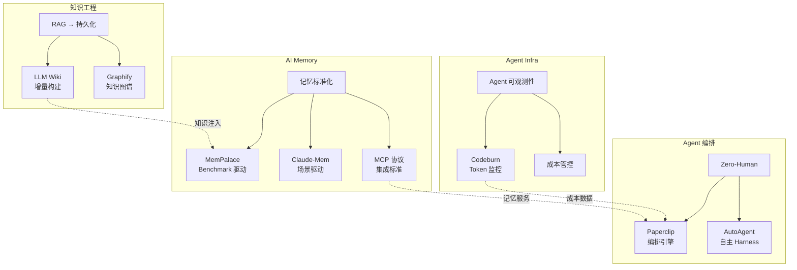

## 今日重点趋势

### 1. Agent 成本可观测性：从隐式消耗到显式管控

**现象：** `codeburn` 仅发布 2 天即破 1,698 stars，说明 AI Coding 的 token 成本管理已经成为真实痛点。

**判断：** 随着 Coding Agent 在企业中规模化使用，"你的 token 花在哪里"将成为和云资源账单一样基础的运维需求。codeburn 做对了三件事：
1. **跨 Agent 支持** — Claude Code / Codex / Cursor 统一仪表盘
2. **TUI 交互** — 开发者不需要离开终端
3. **实时成本追踪** — 不只是事后统计，而是过程中可视化

**架构启发：** 这预示着 Agent Infra 需要一个独立的"可观测性层"，类似 K8s 生态中 Prometheus 之于容器。Token 消耗、API 调用量、模型选择策略都需要被度量、告警、优化。

**泡沫指数：** 低。需求真实，但壁垒不高，容易被上游 Agent 框架内置。

### 2. AI 记忆系统进入标准化竞赛阶段

**现象：** `mempalace` 11 天破 4.6 万星，速度惊人。与 `claude-mem`（5.5 万星）形成直接竞争。两者定位不同但目标重合：让 AI 拥有持久、可检索的记忆。

**判断：** AI Memory 正在从"锦上添花"变为"基础设施必需品"。关键分歧在于：
- MemPalace：benchmark 驱动，强调性能对比和 MCP 兼容
- Claude-Mem：场景驱动，嵌入 Claude Code 工作流

**中期趋势概率：** 高（85%）。AI Memory 的标准化将在未来 3-6 个月内收敛到 1-2 个主导方案。

### 3. Zero-Human Company 编排框架加速落地

**现象：** `paperclip` 持续高活跃（2,291 open issues），`autoagent` 等新玩家入场。"零人类公司"概念从噱头走向工程化。

**判断：** Paperclip 的高 issue 数量是双刃剑——说明有真实用户，但也说明系统复杂度极高。真正的挑战不是编排 Agent，而是处理边界情况、异常恢复和合规审计。

**对企业架构师的启发：** 不要被"零人类"吸引，关注的是"低人类介入"——哪些环节可以自动化，哪些必须人审。编排框架的价值在于定义清晰的审批节点。

### 4. 知识工程范式迁移：从 RAG 到持久化 Wiki

**现象：** `llm-wiki` 提出了一个值得关注的思路：不是每次 RAG 查询都从零开始，而是让 LLM 增量构建和维护一个持久化的 Wiki 知识库。

**判断：** 这个方向触及了 RAG 的核心问题——**知识检索的效率天花板**。传统 RAG 每次查询都重新检索+排序+生成，而持久化 Wiki 将知识结构化存储，后续查询可以直接走结构化路径。

**架构启发：** 这可能是 RAG 之后的下一代知识工程范式。关键问题是 LLM 自动构建的 Wiki 质量如何保证。

---

## 重点项目深度分析

### 🔥 Codeburn — AI Coding 的成本仪表盘

**定位：** 终端 TUI 工具，实时展示 Claude Code / Codex / Cursor 的 token 消耗和成本。

**为什么值得关注：** AI Coding 进入企业后，成本管控是硬需求。目前缺乏统一的 token 消耗度量标准，codeburn 填补了这个空白。

**技术亮点：**
- TypeScript + Ink（React for CLI），TUI 交互流畅
- 跨 Agent 统一接口
- 实时 cost tracking

**风险：** 上游 Agent 框架可能内置类似功能；需要各 Agent 暴露 token 使用数据，依赖上游配合。

**定位判断：** 短期工具型 → 中期有潜力成为 Agent 可观测性标准组件。

### 🏛️ MemPalace — AI Memory 的 Benchmark 王

**定位：** 开源 AI 记忆系统，以 benchmark 成绩为核心卖点，MCP 兼容。

**为什么值得关注：** 11 天 4.6 万星的增长速度说明市场对 AI Memory 有巨大需求。ChromaDB + MCP 的组合使其易于集成。

**技术亮点：**
- 有 benchmark 数据支撑（宣称最佳）
- MCP 协议兼容
- 支持多种向量存储后端

**风险：** Benchmark 不等于生产质量；AI Memory 领域竞争激烈，尚未形成标准。

### 📎 Paperclip — Zero-Human Company 的编排引擎

**定位：** 开源编排框架，目标是实现"零人类公司"的自动化运营。

**为什么值得关注：** 54K 星 + 2,291 open issues 说明有大量真实用户在使用和遇到问题。这是 Agent 编排从 demo 走向生产的信号。

**技术亮点：**
- TypeScript 编写，易于扩展
- 高度模块化的 Agent 编排

**风险：** "零人类公司"概念泡沫较大；2,291 个 issue 说明系统稳定性仍需大量工作。

### 📚 LLM Wiki — 持久化知识库

**定位：** 桌面应用，用 LLM 增量构建和维护 Wiki 知识库，替代传统 RAG 的即查即弃模式。

**为什么值得关注：** 触及 RAG 的根本问题——知识检索效率。如果知识可以被结构化存储并持续维护，检索质量会显著提升。

**风险：** LLM 构建的 Wiki 质量不确定；桌面应用形态限制了企业场景的部署灵活性。

---

## 风险与机遇

### 风险
1. **Skills/Skill 泡沫持续膨胀** — distill-skill、anti-distill-skill 等项目持续出现，概念炒作大于实际价值
2. **Quip Network 系列项目** — 多个仓库同步爆发（4k+ 星），有协调刷星嫌疑

### 机遇
1. **Agent 可观测性** — 作为 Agent Infra 的独立层，市场空白大
2. **AI Memory 标准化** — 3-6 个月内可能出现主导方案
3. **持久化知识工程** — RAG 之后的下一代知识管理范式

---

## 趋势关系图

---

## 重点项目档案

| 项目 | ⭐ Stars | 分类 | 总分 | 趋势 |
|------|---------|------|------|------|
| Codeburn | 1,698 | 工具型 → 基础设施候选 | 78 | 🔥 新增 |
| MemPalace | 46,544 | 基础设施候选 | 85 | 📈 持续 |
| Paperclip | 54,140 | 平台候选 | 80 | 📈 持续 |
| LLM Wiki | 1,387 | 工具型 → 平台候选 | 74 | 🆕 新增 |
