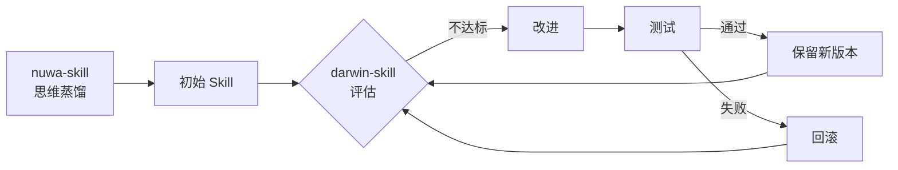

# 2026-04-17 GitHub 趋势研究简报

## 今日重点趋势

### 趋势 1：Agent Skill 自进化——从静态模板到达尔文式迭代

**核心判断：** Skill 自优化正从概念走向工程化实现。

darwin-skill 提出了一个清晰的 Skill 自进化循环：**评估 → 改进 → 测试 → 保留或回滚**。这不是简单的 prompt 调参，而是给 Skill 赋予了版本管理、回滚机制和质量门控。与 nuwa-skill（思维蒸馏）形成互补：nuwa 蒸馏人的思维模型，darwin 让 Skill 自主进化。

**架构启发：** Skill 的生命周期管理正在成为一个独立的技术领域。未来 Agent 系统的核心竞争力可能不在于"有什么 Skill"，而在于"Skill 的进化速度和质量管控能力"。

### 趋势 2：AI 原生编程语言——为 Agent 系统设计编译层

**核心判断：** weft 是本周最值得深思的新项目之一。

Rust 实现的"AI 系统编程语言"——这不是又一个 LLM wrapper，而是试图在编译层为 Agent 系统提供原生的抽象能力。目前 638 stars、信息有限，但方向值得高度关注：当 Agent 系统的复杂度持续增长，现有的 Python/TypeScript 通用语言可能无法提供足够的类型安全、并发控制和形式化验证能力。

**风险：** 项目极早期，README 和文档尚不完善，需要观察是否有清晰的语言设计文档和实际用例。

### 趋势 3：Token 可观测性持续升温

**codeburn** 5天破 2.2K stars（昨日约 1,698），日增约 500+。Token 消耗仪表盘正在成为 AI Coding 工具链的标配组件。

关键信号：
- 支持 Claude Code / Codex / Cursor 三大主力平台
- TUI 界面，零依赖即可运行
- 开源社区对"AI Coding 到底烧了多少 token"的焦虑是真实的

**趋势延续性：** 预计接下来会看到更多类似的成本管控工具，以及与企业 FinOps 集成的尝试。

### 趋势 4：端侧多模态推理加速

两个项目形成互补：
- **parlor**（1.5K stars）：完全本地化的多模态 AI 对话，Gemma 4 E2B + Kokoro TTS，面向消费级 Apple Silicon
- **dflash-mlx**（443 stars）：MLX 推测解码优化，从推理引擎层加速端侧 LLM

**架构师关注点：** 端侧 AI 的推理优化正在从"能跑"进入"跑得快、跑得省"阶段。推测解码 + Apple Silicon 是一个值得关注的技术组合。

## 持续跟踪项目动态

| 项目 | 今日 Stars | 变化 | 状态 |
|------|-----------|------|------|
| mempalace | 47,100 | +560 | 持续增长，380 open issues |
| claw-code | 185,298 | +1,000 | 稳定增长，1426 open issues |
| everything-claude-code | 158,533 | +600 | 稳定增长 |
| superpowers | 156,073 | +500 | 稳定增长 |
| langflow | 147,019 | +300 | 926 open issues |
| graphify | 28,212 | +200 | 持续增长 |
| nuwa-skill | 11,749 | +300 | 稳定增长 |
| autoagent | 4,160 | 持平 | 近期不活跃（最后推送 4/3） |

## 新面孔速览

| 项目 | Stars | 定位 | 初步判断 |
|------|-------|------|---------|
| QuipNetwork 系列 | ~4.4K×4 | 量子虚拟机网络（Rust） | 方向前沿但需验证真实性 |
| wterm | 987 | Web 终端模拟器 | Vercel 出品，关注 WebAssembly 场景 |
| llm-internals | 449 | LLM 内部原理教程 | 教育型，Karpathy 风格 |
| BuilderPulse | 719 | AI 独立开发者日报 | 信息聚合型，工程深度有限 |
| SNI-Spoofing | 651 | DPI 绕过工具 | 安全/隐私领域热点 |

## 风险与机遇

### 机遇
1. **Skill 生命周期管理**可能成为 Agent 平台的差异化能力——darwin-skill 的评估-改进-回滚循环值得企业借鉴
2. **AI 原生编程语言**方向如果验证成功，将是基础设施级创新
3. **Token 可观测性**正在催生一个新品类，先发者有平台化机会

### 风险
1. **QuipNetwork 系列**四个仓库同时达到 4.3K-4.5K stars，模式类似此前观察到的 star farming 行为，需要保持警惕
2. **darwin-skill / nuwa-skill / 张雪峰-skill** 等 "xxx-skill" 命名风潮可能存在泡沫——Skill 作为概念正在被过度消费
3. **autoagent** 最后推送 4/3，已两周不活跃，可能在萎缩

## 重点项目深度分析

### 1. darwin-skill（🧬 Skill 自进化系统）

**评分：**

| 维度 | 分数 | 理由 |
|------|------|------|
| 热度质量 | 7 | 4天近1000星，增速健康 |
| 技术创新度 | 8 | 评估-改进-回滚的闭环是真正的工程创新 |
| 工程成熟度 | 5 | 早期阶段，文档和测试需要补强 |
| 架构启发价值 | 8 | Skill 生命周期管理是一个被忽视的领域 |
| 企业落地潜力 | 6 | 概念有价值但需要更多生产验证 |
| 中期趋势概率 | 7 | Skill 自优化方向大概率持续 |
| 平台化潜力 | 7 | 可演变为 Skill Marketplace 的质量管控层 |
| 基础设施潜力 | 6 | 取决于是否能成为标准化的 Skill 规范 |

**总分：54/80**
**归类：平台候选**
**建议：持续跟踪**

### 2. weft（🧵 AI 系统编程语言）

**评分：**

| 维度 | 分数 | 理由 |
|------|------|------|
| 热度质量 | 6 | 638星，增速中等 |
| 技术创新度 | 9 | AI 原生编程语言是极其前沿的方向 |
| 工程成熟度 | 3 | 极早期，缺乏设计文档 |
| 架构启发价值 | 9 | 编译层为 Agent 系统提供类型安全和形式化验证 |
| 企业落地潜力 | 3 | 至少 1-2 年后才可能有生产可用版本 |
| 中期趋势概率 | 6 | 方向正确但时机未到 |
| 平台化潜力 | 8 | 如果成功，天然是平台级 |
| 基础设施潜力 | 9 | 编程语言是最终的基础设施 |

**总分：53/80**
**归类：学习型/基础设施候选**
**建议：长期观察**

### 3. codeburn（🔥 Token 可观测性仪表盘）

**评分：**

| 维度 | 分数 | 理由 |
|------|------|------|
| 热度质量 | 8 | 5天2.2K星，增速稳定 |
| 技术创新度 | 6 | 核心是数据聚合+TUI展示，技术门槛不高 |
| 工程成熟度 | 7 | 可运行、多平台支持、持续活跃 |
| 架构启发价值 | 6 | 可观测性模式在 AI 领域的应用 |
| 企业落地潜力 | 7 | 成本管控是企业刚需 |
| 中期趋势概率 | 8 | Token 计费模式下的必然需求 |
| 平台化潜力 | 6 | 可扩展为 AI Coding 的 FinOps 平台 |
| 基础设施潜力 | 5 | 更偏工具，但可能成为可观测性栈的一部分 |

**总分：53/80**
**归类：工具型/基础设施候选**
**建议：持续跟踪**
