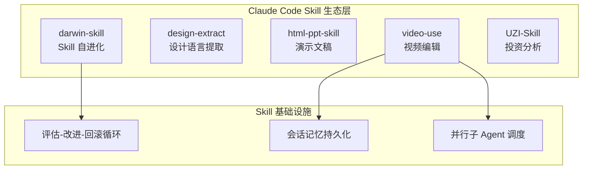

# 2026-04-18 GitHub 趋势研究简报

## 今日重点趋势

### 趋势 1：Claude Code Skill 生态爆发——视频编辑、设计提取、PPT 制作全面开花

**核心判断：** Claude Code 的 Skill 生态正在从"开发者工具增强"进入"全领域内容生产"阶段。

本周多个 Skill 项目集中爆发：
- **video-use**（903★）：browser-use 团队出品，用 Claude Code 编辑视频——自动去填充词、调色、烧字幕、生成动画叠加，最终输出 final.mp4
- **design-extract**（858★）：从任意网站提取完整设计语言（颜色、字体、间距、阴影），npx CLI + Claude Code 插件
- **html-ppt-skill**（885★）：24 主题、31 布局、20+ 动画的 HTML 演示文稿生成 Skill
- **darwin-skill**（1,082★）：Skill 自进化系统持续增长

**架构启发：** Skill 正在成为 AI Agent 的"能力插件标准"。video-use 的设计特别值得关注——它不只是调用 ffmpeg，而是让 Agent 自评估渲染结果、持久化会话记忆、并行生成动画。这标志着 Skill 从"单步命令执行"进化为"多步骤质量管控流程"。

### 趋势 2：全场景协议分析 + AI 逆向——从 DevTools 到 MITM 到 MCP 的统一管道

**anything-analyzer**（1,269★）提出了一个有价值的架构：**全场景抓包 → 统一会话 → AI 智能分析 → MCP Server 输出**。

- 内嵌浏览器（CDP）+ MITM 代理（端口 8888）双通道
- 网页、桌面应用、终端、脚本、手机 App 统一汇入同一 Session
- AI 一键生成协议逆向 / 安全审计 / 加密分析报告
- 内置 MCP Server，可直接对接 Claude Code 等 AI Agent

**架构师关注点：** 这是"AI 原生开发工具"的一个好案例——不是给传统工具加 AI，而是以 AI 为核心重新设计工具链。MCP Server 的集成使得协议分析结果可以直接被 Agent 消费，形成"抓包→分析→自动化"的闭环。

### 趋势 3：Web 终端基础设施——Zig + WASM 重新定义浏览器终端

**wterm**（1,310★）由 Vercel Labs 出品，核心用 Zig 编写并编译为 ~12KB 的 WASM 二进制。

关键特性：
- DOM 渲染而非 Canvas——原生文本选择、复制粘贴、浏览器查找、无障碍支持
- VT100/VT220/xterm 转义序列解析器
- 脏行追踪（dirty-row tracking），仅重绘变更行
- React 组件 + useTerminal hook
- 内置 just-bash 包，浏览器内直接运行 Bash

**架构启发：** 终端模拟器长期被 xterm.js 统治，wterm 用 Zig+WASM+DOM 渲染提供了一条不同的路。DOM 渲染看似性能劣势，但换来了原生可访问性和文本选择——这在 IDE 集成场景下是真正有价值的 trade-off。

### 趋势 4：Token 可观测性进入平台化前夜

**codeburn** 6天达到 2,553★（日增约 340），增速稳定。支持 Claude Code / Codex / Cursor 三大平台。

关键信号：
- 从"个人好奇工具"正在演变为"团队成本管控工具"
- TUI 界面的零依赖特性降低了企业采用门槛
- 如果后续增加团队聚合、预算告警、趋势分析，将进入 FinOps 平台领域

## 持续跟踪项目动态

| 项目 | 今日 Stars | 变化 | 状态 |
|------|-----------|------|------|
| mempalace | 47,100 | 持平 | 高位稳定 |
| claw-code | 185,698 | +400 | 稳定增长 |
| everything-claude-code | 158,533 | +300 | 稳定增长 |
| superpowers | 156,073 | +300 | 稳定增长 |
| langflow | 147,056 | +200 | 稳定增长 |
| graphify | 28,212 | +150 | 持续增长 |
| nuwa-skill | 11,749 | 持平 | 增长放缓 |
| codeburn | 2,553 | +339 | 持续高速增长 |
| darwin-skill | 1,082 | +130 | 稳定增长 |
| weft | 769 | +131 | 稳定增长 |
| autoagent | 4,160 | 持平 | 已两周不活跃，建议降级 |

## 新面孔速览

| 项目 | Stars | 定位 | 初步判断 |
|------|-------|------|---------|
| video-use | 903 | Claude Code 视频编辑 Skill | browser-use 出品，工程质量高，值得关注 |
| design-extract | 858 | 网站设计语言提取 | Agent Skill 生态工具，实用性高 |
| html-ppt-skill | 885 | HTML 演示文稿 Skill | 主题丰富，Skill 生态内容工具 |
| anything-analyzer | 1,269 | 全场景协议分析+AI | MCP 集成是亮点，安全/逆向方向 |
| BuilderPulse | 876 | AI 独立开发者日报 | 信息聚合型，工程深度有限 |
| UZI-Skill | 674 | 投资分析 Skill | 垂直领域 Skill，数据驱动 |
| GEOFlow | 796 | AI GEO 内容生产系统 | PHP 栈，内容 CMS 方向 |
| lingbot-map | 833 | 3D 场景重建基础模型 | Python，流式数据处理 |
| RedSun | 1,323 | 漏洞仓库 | 安全研究资源 |
| SNI-Spoofing | 782 | DPI 绕过 | 安全/隐私工具 |
| anubis (sogonov) | 866 | Android VPN 应用管理 | 移动端工具，39 open issues |

## 风险与机遇

### 机遇
1. **Claude Code Skill 生态**正在形成"能力市场"雏形——video-use / design-extract / html-ppt-skill 展示了 Skill 覆盖内容生产全链路的可能性
2. **MCP Server 作为工具链统一接口**——anything-analyzer 的实践表明 MCP 正在成为 AI 工具间通信的事实标准
3. **Web 终端基础设施**——wterm 的 Zig+WASM+DOM 方案可能在云 IDE 场景产生实际价值

### 风险
1. **Skill 命名风潮泡沫**——大量 "xxx-skill" 项目涌现，部分只是 prompt 模板包装，需警惕概念透支
2. **autoagent** 已两周不活跃（最后推送 4/3），建议从持续跟踪列表降级
3. **RedSun**（1,323★）漏洞仓库 285 forks，安全风险需关注
4. **UZI-Skill / GEOFlow** 等垂直领域项目 star 增速可能受社区炒作驱动，需观察持续性

## 重点项目深度分析

### 1. codeburn（🔥 Token 可观测性仪表盘）

**评分：**

| 维度 | 分数 | 理由 |
|------|------|------|
| 热度质量 | 8 | 6天2.5K星，日增稳定 300+ |
| 技术创新度 | 6 | 数据聚合+TUI展示，技术门槛中等 |
| 工程成熟度 | 7 | 多平台支持、持续活跃、可运行 |
| 架构启发价值 | 7 | 可观测性在 AI 领域的系统性应用 |
| 企业落地潜力 | 8 | 成本管控是企业级刚需 |
| 中期趋势概率 | 8 | Token 计费模式下的必然需求 |
| 平台化潜力 | 7 | 可扩展为 AI FinOps 平台 |
| 基础设施潜力 | 6 | 工具层，但有融入可观测性栈的可能 |

**总分：57/80**
**归类：工具型/平台候选**
**建议：持续跟踪**

### 2. wterm（🖥️ Web 终端模拟器）

**评分：**

| 维度 | 分数 | 理由 |
|------|------|------|
| 热度质量 | 7 | Vercel 出品，4天1.3K星，背书强 |
| 技术创新度 | 8 | Zig+WASM+DOM 渲染组合是真正的创新 |
| 工程成熟度 | 7 | 架构清晰、monorepo、包体系完整 |
| 架构启发价值 | 8 | DOM 渲染终端的性能/可访问性 trade-off |
| 企业落地潜力 | 7 | 云 IDE、在线终端场景直接可用 |
| 中期趋势概率 | 7 | Web 终端是稳定需求 |
| 平台化潜力 | 7 | React 组件生态可扩展 |
| 基础设施潜力 | 8 | 终端是开发基础设施的最底层 |

**总分：59/80**
**归类：基础设施候选**
**建议：持续跟踪**

### 3. anything-analyzer（🔍 全场景协议分析）

**评分：**

| 维度 | 分数 | 理由 |
|------|------|------|
| 热度质量 | 7 | 5天1.3K星，增速健康 |
| 技术创新度 | 7 | 全场景统一 Session + MCP 集成 |
| 工程成熟度 | 6 | Electron+React+TS，架构清晰但仍在早期 |
| 架构启发价值 | 8 | "AI 原生工具链"的好案例 |
| 企业落地潜力 | 7 | 安全审计、API 逆向、自动化测试 |
| 中期趋势概率 | 7 | AI+安全/逆向是上升趋势 |
| 平台化潜力 | 7 | MCP Server 是平台接口 |
| 基础设施潜力 | 6 | 偏工具，但 MCP 可能使其成为基础设施组件 |

**总分：55/80**
**归类：工具型/平台候选**
**建议：持续跟踪**

### 4. video-use（🎬 AI 视频编辑 Skill）

**评分：**

| 维度 | 分数 | 理由 |
|------|------|------|
| 热度质量 | 7 | browser-use 团队出品，5天900星 |
| 技术创新度 | 7 | Agent 自评估+会话记忆+并行子Agent |
| 工程成熟度 | 6 | 功能完整但依赖链较重 |
| 架构启发价值 | 7 | 多步骤 Skill 的质量管控流程设计 |
| 企业落地潜力 | 6 | 内容创作场景有需求 |
| 中期趋势概率 | 7 | Agent+视频编辑方向持续 |
| 平台化潜力 | 5 | 偏垂直工具 |
| 基础设施潜力 | 4 | 不具备基础设施特征 |

**总分：49/80**
**归类：工具型**
**建议：短期跟踪**

### 5. darwin-skill（🧬 Skill 自进化系统）

**评分：**

| 维度 | 分数 | 理由 |
|------|------|------|
| 热度质量 | 7 | 5天1.1K星，持续增长 |
| 技术创新度 | 8 | 评估-改进-回滚闭环是工程创新 |
| 工程成熟度 | 5 | 早期，但最后推送 4/14，已4天未更新 |
| 架构启发价值 | 8 | Skill 生命周期管理是被忽视的领域 |
| 企业落地潜力 | 6 | 概念有价值但需生产验证 |
| 中期趋势概率 | 7 | Skill 自优化方向大概率持续 |
| 平台化潜力 | 7 | 可演变为 Skill Marketplace 质量管控层 |
| 基础设施潜力 | 6 | 取决于是否能成为标准化规范 |

**总分：54/80**
**归类：平台候选**
**建议：持续跟踪，关注活跃度**

### 6. weft（🧵 AI 系统编程语言）

**评分：**

| 维度 | 分数 | 理由 |
|------|------|------|
| 热度质量 | 6 | 769星，持续迭代中 |
| 技术创新度 | 9 | AI 原生编程语言方向极其前沿 |
| 工程成熟度 | 4 | 早期但保持活跃（最新推送 4/17） |
| 架构启发价值 | 9 | 编译层为 Agent 提供类型安全和形式化验证 |
| 企业落地潜力 | 3 | 至少1-2年后 |
| 中期趋势概率 | 6 | 方向正确但时机未到 |
| 平台化潜力 | 8 | 语言天然是平台 |
| 基础设施潜力 | 9 | 编程语言是最终基础设施 |

**总分：54/80**
**归类：学习型/基础设施候选**
**建议：长期观察**
