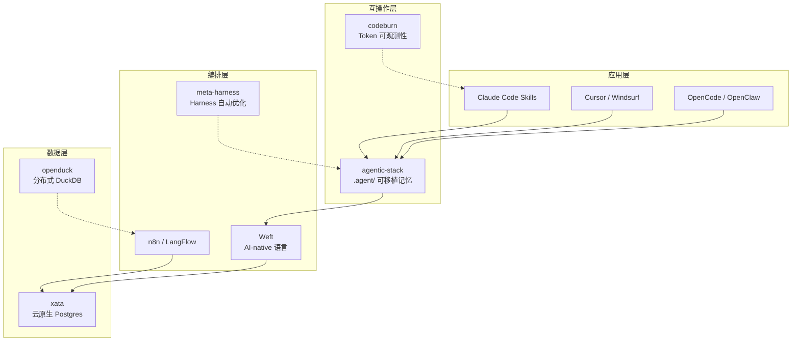

## 今日趋势概览

2026-04-19（周六），GitHub 生态呈现几个值得架构师注意的信号：

### 1. Agent 可移植性：从工具锁定走向跨 harness 互操作

**agentic-stack** (492⭐, 新建 4/15) 提出了一个精炼的方案：用 `.agent/` 目录统一存储 memory、skills、protocols，支持 Claude Code / Cursor / Windsurf / OpenCode / OpenClaw / Hermes / Pi 等所有主流 harness。这不是又一个 agent 框架，而是**互操作层**——让用户不被任何一个工具锁定。

**meta-harness** (444⭐, Stanford IRIS Lab) 从研究层面切入：自动搜索最优的 model harness 配置（决定模型工作时存储、检索、展示什么），而不是让人类手动调参。这对 coding agent 的 prompt engineering / scaffold 优化有直接价值。

**判断**：Agent 层的「可移植性」和「自动优化」是中期趋势。agentic-stack 解决的是当前多工具并存的现实痛点，meta-harness 解决的是 harness 设计的自动化问题。两者共同指向一个方向——Agent 的记忆和技能应该独立于具体工具。

### 2. AI-native 编程语言 Weft：从调用 LLM 到 LLM 作为原语

**Weft** (824⭐, Rust 实现) 是本周最值得关注的概念创新。它不封装 API，而是把 LLM、Human、HTTP、存储等做成语言的**一等节点**。核心亮点：

- **First-class humans**：程序中途暂停，发送表单给人，等几天后恢复，一个节点搞定
- **Durable execution**：基于 Restate，程序可跨崩溃/重启存活
- **双视图**：同一段程序，代码视图给 AI，图形视图给人类，编辑任一端另一端同步

这是 LangGraph / n8n / Temporal 的语言层替代。当前处于早期（作者明确说 breaking changes 预期中），但方向正确。

**架构师启发**：如果你的系统频繁涉及 LLM 调用 + 人工审批 + 异步等待，Weft 的思路值得研究。Durable execution + 类型安全的语言层组合，是 workflow engine 演进的一个合理方向。

### 3. 分布式数据基座：DuckDB 分布式化与 Postgres 云原生化

**openduck** (447⭐, Rust) 给 DuckDB 加了分布式能力——双执行引擎 + 差分存储。DuckDB 已经是分析领域的 SQLite，openduck 在尝试让它走向分布式场景。

**xata** (601⭐, Go) 开源的云原生 Postgres 平台，支持 copy-on-write 分支和 scale-to-zero。对标 Neon/Supabase 的自托管版本。

**判断**：数据分析的「本地优先 → 按需分布式」演进路径正在成型。openduck 还很早期，但方向有意义。xata 的 copy-on-write branching 对开发环境管理有实际价值。

### 4. 3D 场景重建：lingbot-map 的 streaming 前馈模型

**lingbot-map** (1778⭐, Python) 是一个前馈 3D 基础模型，从流式数据重建场景。不像 NeRF/Gaussian Splatting 需要多视角优化，它是 feed-forward 的——单次前向传播出结果。对实时 3D 重建（机器人、AR、自动驾驶）有直接价值。

---

## 重点项目深度分析

### Top 1: agentic-stack — Agent 可移植性的第一个严肃方案

**解决什么问题**：当前开发者同时使用 Claude Code、Cursor、Codex 等多个 coding agent，每个工具的 memory、skills、配置互不兼容，切换工具等于丢失上下文。

**技术亮点**：
- `.agent/` 目录包含 memory、skills、protocols 三个子目录
- 通过 brew 一行命令安装，自动适配目标 harness 的配置格式
- 知识在工具间保持连续性

**定位**：工具型，但有机会演化为 Agent 记忆的事实标准。

**风险**：
- 暂无任何 harness 官方支持此格式
- 维护多 harness 适配层的工作量会随工具版本更新而增大
- 单人项目（@AV1DLIVE），长期维护存疑

### Top 2: Weft — AI-native 编程语言

**解决什么问题**：LLM 调用、人工审批、异步流程在传统语言中需要大量胶水代码。Weft 把这些做成语言原语。

**技术亮点**：
- Rust 实现，编译时检查架构完整性
- 内置 Restate 做 durable execution
- 递归折叠：100 节点系统在顶层看起来像 5 个块
- 双视图（代码 + 图形）

**定位**：学习型 → 可能演进为平台候选。

**风险**：
- 2 个月大，明确声明 breaking changes
- 节点目录小且固定
- 编程语言的成功率极低

### Top 3: openduck — 分布式 DuckDB

**解决什么问题**：DuckDB 是分析场景的 SQLite，但不支持分布式。openduck 补上这块。

**技术亮点**：
- Rust 实现
- 双执行引擎（本地 + 分布式）
- 差分存储

**定位**：工具型，有基础设施候选潜力。

**风险**：
- 非常早期，447 星
- DuckDB Labs 官方有自己的分布式方案规划
- 性能和稳定性尚未验证

---

## 风险与机遇

**机遇**：
- Agent 可移植性需求真实且紧迫，agentic-stack 抓住了窗口期
- Weft 代表了 workflow/orchestration 层的语言化方向，值得持续观察
- 分布式 DuckDB 生态位存在空白

**泡沫信号**：
- 大量 Claude Code Skill 项目（html-ppt-skill, logo-generator-skill 等）属于短期热点，工程价值有限
- 本周 Skill 类项目集中爆发，有跟风炒作成分

---

## 重点项目评分汇总

| 项目 | 热度 | 技术创新 | 工程成熟 | 架构启发 | 落地潜力 | 趋势概率 | 平台化 | 基础设施 | 总分 | 归类 | 跟踪 |
|------|------|----------|----------|----------|----------|----------|--------|----------|------|------|------|
| agentic-stack | 6 | 7 | 6 | 8 | 7 | 7 | 7 | 5 | 53/80 | 工具型 | ✅ |
| weft | 7 | 9 | 4 | 9 | 5 | 7 | 8 | 6 | 55/80 | 学习型 | ✅ |
| openduck | 5 | 7 | 4 | 7 | 6 | 6 | 5 | 8 | 48/80 | 工具型 | ✅ |
| lingbot-map | 7 | 7 | 5 | 6 | 5 | 6 | 4 | 4 | 44/80 | 学习型 | ⚠️ |
| meta-harness | 5 | 8 | 5 | 8 | 4 | 7 | 5 | 3 | 45/80 | 学习型 | ✅ |

---

## 项目档案

详见 `projects/` 目录下各项目独立档案。

---

## Mermaid：本周 Agent 生态分层关系图

---

*本报告由 GitHub 趋势研究代理自动生成。数据采集时间：2026-04-19 06:00 CST。*
