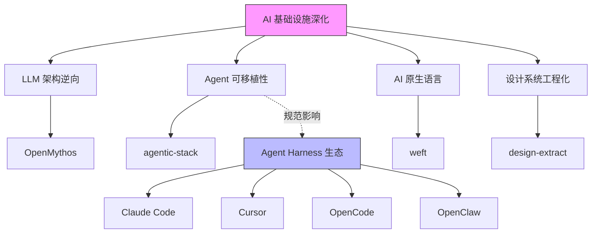

# 2026-04-21 GitHub 趋势研究简报

## 今日趋势概览

今天 GitHub Trending 呈现出明显的「AI 基础设施深化」特征：不再是简单的 Agent 封装，而是开始深入到架构逆向、跨平台可移植规范、AI 原生语言设计等基础设施层。

### 趋势 1：LLM 架构逆向工程（⭐ 88）

**OpenMythos** 3 天内从 0 涨到近 4000 star，865 fork，这是近期罕见的理论项目爆发。它试图从公开文献逆向重建 Claude 的内部架构（注意力机制、循环 Transformer 等），本质上是对闭源模型架构的学术级解构。

**判断**：不是泡沫。这类项目的价值不在于"复刻 Claude"，而在于：
1. 推动对 LLM 架构设计的公开讨论
2. 为开源模型架构演进提供理论参照
3. 证明学术逆向工程社区正在形成

### 趋势 2：Agent 可移植性规范（⭐ 82）

**agentic-stack** 提出了一个值得关注的问题：当 Agent 在 Claude Code、Cursor、OpenCode、OpenClaw 等不同 Harness 之间迁移时，如何保持记忆、技能和协议的一致？它用 `.agent/` 文件夹定义了一套可移植规范。

**判断**：这是一个**平台候选**级别的方向。如果 Agent 真的成为工作单元，可移植性就是必须解决的基础设施问题。但目前项目还太早期（750 star，1 个 contributor 明显），更偏概念验证。

### 趋势 3：AI 原生编程语言（⭐ 78）

**Weft** 用 Rust 实现了一种"为 AI 系统设计的编程语言"。这是一个小众但前沿的方向——现有编程语言都是为人类设计的，如果 AI 成为主要的代码生产者，是否需要新的语言范式？

**判断**：探索价值高，但短期不落地。类似 Babel/Butter 在编译器领域的尝试，需要 2-3 年才能看到实际采纳。归为**观察型**。

### 趋势 4：设计系统提取进入工程化（⭐ 76）

**design-extract** 不是一个简单的 CSS 抓取工具。它支持 DTCG token 标准、语义/原子/复合三层 token 体系、MCP Server 集成、iOS/Android/Flutter 多平台输出。这意味着它正在把"设计系统提取"变成一个工程化流程。

---

## 重点项目深度分析

### 🧠 OpenMythos — Claude 架构逆向重建

| 维度 | 评分 | 理由 |
|------|------|------|
| 热度质量 | 8 | 3 天 4K star，学术讨论驱动而非营销 |
| 技术创新度 | 9 | LLM 架构逆向是全新赛道 |
| 工程成熟度 | 4 | 理论项目，无可运行系统 |
| 架构启发价值 | 9 | 对理解 SOTA 模型架构极具启发 |
| 企业落地潜力 | 3 | 短期无直接落地路径 |
| 中期趋势概率 | 7 | 学术逆向工程将形成持续社区 |
| 平台化潜力 | 5 | 可能成为开源架构设计的参照平台 |
| 基础设施潜力 | 4 | 理论影响 > 工程影响 |

**总分：49/80 | 归类：学习型 | 建议持续跟踪**

核心风险：Anthropic 可能对逆向其架构表示关注；理论重建与实际架构的偏差不可验证。

### 🔄 Agentic Stack — 跨 Harness 可移植 Agent 规范

| 维度 | 评分 | 理由 |
|------|------|------|
| 热度质量 | 7 | 750 star，增速稳定 |
| 技术创新度 | 8 | 首个系统化解决 Agent 可移植性的项目 |
| 工程成熟度 | 5 | 概念验证阶段，实际跨平台兼容待验证 |
| 架构启发价值 | 9 | 触及 Agent 生态的核心互操作性问题 |
| 企业落地潜力 | 7 | 多工具链团队有直接需求 |
| 中期趋势概率 | 8 | Agent Harness 分化必然催生统一规范 |
| 平台化潜力 | 8 | .agent/ 规范可成为事实标准 |
| 基础设施潜力 | 7 | 属于 Agent 生态的连接层基础设施 |

**总分：59/80 | 归类：平台候选 | 建议持续跟踪**

核心风险：Harness 厂商有动力锁定而非开放；规范可能被更有资源的团队重新定义。

### 🧵 Weft — AI 原生编程语言

| 维度 | 评分 | 理由 |
|------|------|------|
| 热度质量 | 6 | 906 star，Rust 社区关注 |
| 技术创新度 | 9 | AI-native 语言设计是全新领域 |
| 工程成熟度 | 4 | 早期实现，编译器功能有限 |
| 架构启发价值 | 8 | 重新思考"为 AI 设计的语言"范式 |
| 企业落地潜力 | 2 | 至少 2 年内无落地可能 |
| 中期趋势概率 | 5 | 可能成为学术研究方向而非工程工具 |
| 平台化潜力 | 6 | 若成功可成为 AI 编程的标准语言 |
| 基础设施潜力 | 5 | 语言是终极基础设施，但成功概率低 |

**总分：45/80 | 归类：观察型 | 建议持续跟踪**

---

## 值得关注的其他项目

| 项目 | Star | 一句话 |
|------|------|--------|
| lingbot-map | 3194 | Feed-forward 3D 场景重建，流式数据处理 |
| html-ppt-skill | 1642 | Agent Skill 做 PPT，生态分化继续 |
| RedSun | 1638 | 安全漏洞仓库，安全社区关注 |
| UZI-Skill | 965 | A 股量化分析 Agent Skill，金融 AI 分化 |
| xata | 680 | 开源云原生 Postgres 平台，分支与缩容到零 |
| aube | 318 | Rust 写的 Node.js 包管理器，替代 npm |

---

## 风险与机遇

**风险**：
1. OpenMythos 类项目可能引发法律争议，闭源模型厂商可能采取行动
2. Agent 可移植性规范过早标准化可能限制创新
3. AI 原生语言赛道太小众，可能成为"永远的未来"

**机遇**：
1. LLM 架构逆向工程可能催生新的开源架构设计社区
2. Agent 可移植性是真正的基础设施需求，先发规范有网络效应
3. 设计系统提取的工程化是 DevOps + Design 的交叉创新

## 趋势关系图

## 重点项目档案

今日重点项目的完整档案见：
- [OpenMythos](../projects/openmythos.md)
- [Agentic Stack](../projects/agentic-stack.md)
- [Weft](../projects/weft.md)
- [Design Extract](../projects/design-extract.md)
- [Aube](../projects/aube.md)

---

*本报告由 GitHub Researcher 自动生成 · 2026-04-21*
