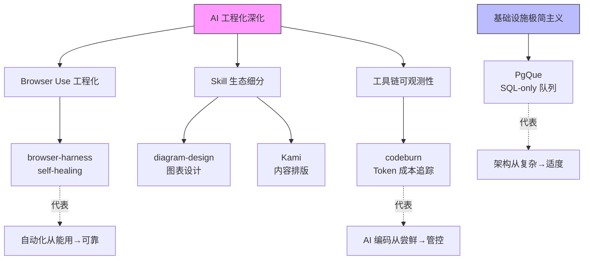

# 2026-04-22 GitHub 趋势研究简报

## 今日趋势概览

今天 GitHub Trending 的核心信号是**已验证方向的持续强化**和**基础设施极简主义的回归**。Browser Use 赛道不再需要证明方向正确，而是在工程细节上竞争（self-healing 能力）；Claude Code Skill 生态从"什么都做"进入专业细分（设计、排版、图表）；同时，PgQue 代表了一种反趋势：用最简单的方式解决排队问题。

### 趋势 1：Browser Use 赛道的工程深化（⭐ 85）

**browser-harness** 从 browser-use 组织独立出来，4 天 4347 star，370 fork。与之前的 browser-use 主项目不同，它聚焦在 **self-healing** —— 当页面结构变化时自动修复定位器。这是 Browser Use 从"能用"到"可靠"的关键跨越。

**判断**：Browser Use 已从热点变为**确立赛道**。self-healing 能力是区分玩具和基础设施的关键。browser-use 团队拆分出独立仓库说明他们在认真做工程分层。

### 趋势 2：Claude Code Skill 进入设计工具细分（⭐ 80）

**diagram-design**（1303⭐）和 **Kami**（1354⭐）代表了 Claude Code Skill 生态的新阶段：不再是通用 Skill，而是面向具体设计场景的专业工具。diagram-design 做 13 种编辑级图表，Kami 做内容排版。

这意味着 Skill 生态正在经历**从工具到工艺**的转变——用户不再满足于"能生成 HTML"，而是要求"生成的设计师级别的输出"。

**判断**：中期趋势。Skill 细分化是生态成熟标志，但单个 Skill 的生命周期可能较短（被 Harness 内置能力替代）。

### 趋势 3：极简主义基础设施回归（⭐ 75）

**PgQue** 用一个 SQL 文件 + pg_cron 实现消息队列，913 star。在大家都追求"云原生、微服务、分布式"的时候，这种"你已经有 Postgres，再加一个 SQL 文件就有队列"的思路正在获得共鸣。

**判断**：不是反云原生，而是**适度架构**思潮的体现。对于中小规模场景（绝大多数企业内部工具），Postgres 足以承担队列角色。这是**工具型**项目，但有演化为**基础设施候选**的可能——如果它能证明在生产中可靠。

### 趋势 4：Agent 工具链可观测性成为刚需（⭐ 78）

**codeburn** 3239 star，追踪 Claude Code / Codex / Cursor 的 Token 消耗。这从侧面验证了 AI 编码工具在企业中已经被认真使用——才会有人关心成本。

---

## 重点项目深度分析

### 🌐 Browser Harness — Self-healing 浏览器自动化

| 维度 | 评分 | 理由 |
|------|------|------|
| 热度质量 | 9 | 4 天 4.3K star，browser-use 团队出品，工程背景强 |
| 技术创新度 | 8 | Self-healing 定位器是真正的工程创新 |
| 工程成熟度 | 6 | 新项目，但背后有成熟团队 |
| 架构启发价值 | 8 | 自愈能力的架构模式可迁移到其他自动化领域 |
| 企业落地潜力 | 8 | RPA + AI 的企业需求真实存在 |
| 中期趋势概率 | 9 | Browser Use 方向已确立 |
| 平台化潜力 | 7 | 可成为 Browser Use 的基础设施层 |
| 基础设施潜力 | 7 | Self-healing 能力可能下沉为标准能力 |

**总分：62/80 | 归类：平台候选 | 建议持续跟踪**

核心风险：Playwright/Puppeteer 可能内置类似能力；与 browser-use 主项目的关系和演进路线不明确。

### 📊 Diagram Design — Claude Code 的编辑级图表

| 维度 | 评分 | 理由 |
|------|------|------|
| 热度质量 | 7 | 1303 star，稳定增长 |
| 技术创新度 | 5 | SVG 图表生成并非新技术，亮点在 Skill 封装 |
| 工程成熟度 | 6 | 13 种图表类型覆盖面广 |
| 架构启发价值 | 5 | Skill 封装模式的又一个实例 |
| 企业落地潜力 | 6 | 技术文档/报告生成场景有需求 |
| 中期趋势概率 | 6 | 可能被 Harness 内置能力替代 |
| 平台化潜力 | 3 | 单一功能工具 |
| 基础设施潜力 | 2 | 无平台化可能 |

**总分：40/80 | 归类：工具型 | 可选跟踪**

### 🐘 PgQue — 零臃肿 Postgres 队列

| 维度 | 评分 | 理由 |
|------|------|------|
| 热度质量 | 7 | 913 star，PLpgSQL 项目能到这个数说明切中痛点 |
| 技术创新度 | 6 | 不是新技术，是"正确使用已有技术"的智慧 |
| 工程成熟度 | 7 | 单 SQL 文件，审计容易，但生产验证待观察 |
| 架构启发价值 | 8 | "你不需要消息队列，你需要正确使用 Postgres"的架构哲学 |
| 企业落地潜力 | 8 | 内部工具/中小规模场景直接可用 |
| 中期趋势概率 | 7 | 极简主义基础设施是长期思潮 |
| 平台化潜力 | 5 | 可能成为 Postgres 生态的标准扩展 |
| 基础设施潜力 | 6 | 若生产验证通过，可作为轻量级基础设施组件 |

**总分：54/80 | 归类：工具型 → 基础设施候选 | 建议持续跟踪**

核心风险：大规模吞吐下性能未验证；缺少死信队列等企业级特性。

### 🔥 Codeburn — AI 编码 Token 成本追踪

| 维度 | 评分 | 理由 |
|------|------|------|
| 热度质量 | 8 | 3239 star，验证了 AI 编码成本是真实痛点 |
| 技术创新度 | 6 | 成本追踪本身不新，但跨 Harness 聚合是亮点 |
| 工程成熟度 | 7 | TUI 交互设计精良，支持三大主流工具 |
| 架构启发价值 | 6 | 可观测性在 AI 工具链中的重要性 |
| 企业落地潜力 | 8 | 企业 AI 编码成本管控的直接需求 |
| 中期趋势概率 | 8 | AI 编码工具用量增长必然伴随成本追踪需求 |
| 平台化潜力 | 5 | 可能被 IDE/平台内建 |
| 基础设施潜力 | 4 | 工具级而非基础设施级 |

**总分：52/80 | 归类：生产可用 | 建议持续跟踪**

---

## 值得关注的其他项目

| 项目 | Star | 一句话 |
|------|------|--------|
| OpenMythos | 6615 | 持续增长，Claude 架构逆向，理论讨论热度不减 |
| Kami | 1354 | tw93 出品，内容排版工具，设计社区关注 |
| agentic-stack | 1231 | 跨 Harness 可移植 Agent 规范，方向正确 |
| anything-analyzer | 1607 | 全能协议分析 + MITM 代理 + MCP Server |
| lingbot-map | 3860 | Feed-forward 3D 场景重建，CV 社区关注 |
| BuilderPulse | 1043 | AI 驱动的独立开发者每日情报 |

---

## 风险与机遇

**风险**：
1. Browser Use 赛道可能过度拥挤，多个团队做类似事情
2. Claude Code Skill 细分化可能导致生态碎片化
3. PgQue 类极简方案在大规模场景下可能暴露缺陷

**机遇**：
1. Self-healing Browser Use 可能在 RPA+AI 场景形成新基础设施层
2. Agent 可观测性（codeburn 类）是 AI 编码企业化的必要条件
3. 极简主义基础设施可能改变中小企业技术选型思路

## 趋势关系图

## 重点项目档案

今日重点项目的完整档案见：
- [Browser Harness](../projects/browser-harness.md)
- [Codeburn](../projects/codeburn.md)
- [Diagram Design](../projects/diagram-design.md)
- [Kami](../projects/kami.md)
- [PgQue](../projects/pgque.md)

---

*本报告由 GitHub Researcher 自动生成 · 2026-04-22*
