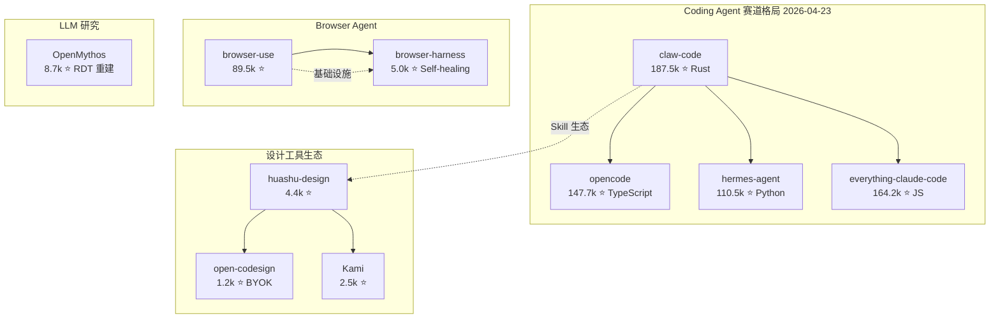

## 今日趋势概览

### 趋势 1：LLM 架构逆向工程热潮 — OpenMythos

**OpenMythos** 在 4 天内收获 8.7k stars，成为本周最火热的新项目之一。它基于公开研究文献，从第一性原理重建 Claude 的 "Mythos" 架构 — 实现了 Recurrent-Depth Transformer (RDT) 三阶段结构（Prelude → Recurrent Block → Coda），支持 MLA/GQA 注意力切换和稀疏 MoE。

**架构师视角：** 这代表了两个趋势交汇：
1. 闭源模型架构正在被社区逆向工程并以开源形式复现
2. Recurrent-Depth / compute-adaptive 推理正在成为新一代 LLM 架构的关键范式

**风险点：** 纯理论重建，无官方验证；实际训练效果未知；更多是研究教育价值而非生产可用。

### 趋势 2：Claude Code 设计工具生态全面爆发

本周 Claude Code Skill 生态进入设计工具细分领域，多个项目同时爆发：

- **huashu-design** (4.4k ⭐)：HTML 原生设计 Skill，20 个设计哲学 + 5 维评审 + MP4 导出
- **open-codesign** (1.2k ⭐)：开源 Claude Design 替代品，Electron 桌面应用，支持 Claude/GPT/Gemini/Kimi/GLM/Ollama
- **Kami** (2.5k ⭐，延续跟踪)：内容驱动的好纸张体验

**架构师视角：** 这不再是简单的 prompt engineering，而是正在形成「设计能力即 Skill」的完整生态。关键信号：
- 从单一工具到多模型 BYOK 平台化演进
- HTML/CSS/SVG 作为 Agent 输出格式正在成为事实标准
- 设计 → 代码的自动化链路正在被 Agent 原生接管

### 趋势 3：Browser Agent 自愈能力成为标配

**browser-harness** (5.0k ⭐) 延续昨日爆发态势，进一步验证 Browser Use 赛道的持续性。Self-healing 能力（自动修复选择器失败、页面变更）正在从差异化特性变成基础能力要求。

### 趋势 4：Coding Agent 赛道稳定格局

Coding Agent 赛道格局进一步稳定：
- **claw-code** (187.5k ⭐) — Rust 实现，持续领跑
- **opencode** (147.7k ⭐) — TypeScript 开源 coding agent
- **hermes-agent** (110.5k ⭐) — Nous Research，6.3k open issues 显示社区极度活跃
- **everything-claude-code** (164.2k ⭐) — Agent harness 性能优化系统

## 重点项目深度分析

### Top 1: OpenMythos — Claude 架构逆向重建

**是什么：** 基于 Recurrent-Depth Transformer 的 Claude Mythos 架构开源复现。三阶段设计（Prelude → Recurrent Block → Coda），支持 MLA/GQA 注意力和 MoE 前馈。

**为什么火：** 闭源模型架构逆向工程 + compute-adaptive 推理范式 + Anthropic 技术路线的公开验证，三重因素叠加。

**技术亮点：**
1. Recurrent Block 支持可变推理深度（`max_loop_iters`）— 这是 test-time compute 的核心机制
2. MLA/GQA 双注意力实现 — 对应不同规模下的效率/质量权衡
3. 稀疏 MoE with routed + shared experts — 模型规模扩展的关键

**定位：** 学习型 / 研究型。当前是架构复现，不是生产级推理引擎。

### Top 2: browser-harness — 自愈浏览器 Agent

**延续跟踪。** 4 天 5.0k stars，browser-use 官方团队出品。Self-healing 定位器、自动重试、页面变更适应 — 这些正在成为 Browser Agent 的基础能力。

**架构启发：** 将"容错"从可选特性提升为架构级能力，是 Agent 基础设施成熟的关键信号。

### Top 3: open-codesign — 开源设计 Agent 平台

**是什么：** Electron 桌面应用，支持多模型（Claude/GPT/Gemini/Kimi/GLM/Ollama），BYOK 本地优先。

**为什么值得关注：** 代表了 Agent 工具从"单模型绑定"向"多模型 BYOK"平台的演进方向。这可能是设计类 Agent 工具平台化的早期信号。

## 风险与机遇

**风险：**
- OpenMythos 纯理论重建，无实际训练验证，可能存在大量工程细节偏差
- Claude Code 设计 Skill 爆发式增长，但同质化严重，大部分是 HTML 模板 + prompt 包装
- Coding Agent 赛道格局虽稳定，但 open issues 数量巨大（hermes-agent 6.3k），说明成熟度仍不足

**机遇：**
- Recurrent-Depth Transformer 可能成为下一代 LLM 架构标准，值得深入研究
- Browser Agent self-healing 正在成为基础设施级能力
- 多模型 BYOK 模式可能成为 Agent 工具的通用架构模式

## 重点项目档案

> 完整档案见 `projects/` 目录：
> - `projects/openmythos.md` — 新增
> - `projects/huashu-design.md` — 新增
> - `projects/open-codesign.md` — 新增
> - `projects/browser-harness.md` — 更新
> - `projects/claw-code.md` — 更新
