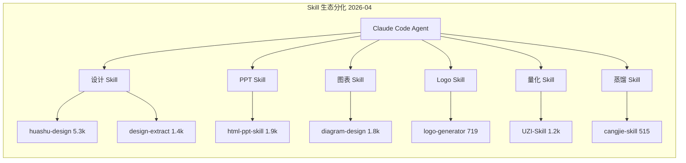
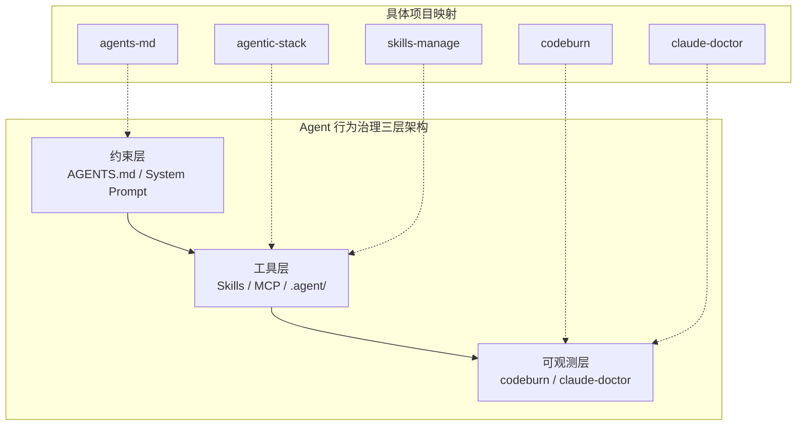

## 今日趋势概览

### 趋势 1：Claude Code Skill 生态分化为垂直子赛道

上周还是"设计工具爆发"，本周已经分化为多个垂直子赛道：

| 子赛道 | 代表项目 | Stars |
|--------|---------|-------|
| 设计系统 | huashu-design, design-extract, web-design-skill | 5.3k+ / 1.4k+ / 715 |
| PPT/演示 | html-ppt-skill, open-codesign | 1.9k+ / 1.9k+ |
| 图表 | diagram-design | 1.8k |
| Logo | logo-generator-skill | 719 |
| 量化交易 | UZI-Skill | 1.2k |
| 书籍蒸馏 | cangjie-skill | 515 |

**架构师判断：** Skill 正在从"一个 Skill 做所有事"走向"每个垂直场景一个专用 Skill"。这与微服务拆分逻辑一致——当通用工具无法满足领域深度时，垂直化是必然路径。关键信号：
1. 每个 Skill 都自带评审机制和输出质量标准（5 维评审、WCAG 合规等）
2. HTML/CSS/SVG 作为通用输出格式已经确立
3. MCP Server 作为 Skill 与 Agent 的接口协议正在普及

### 趋势 2：AI Coding 成本可观测性成为刚需

**codeburn** (3.5k ⭐) 本周快速上升，提供 Claude Code / Codex / Cursor 的 Token 消耗实时 TUI 面板。同时 **claude-doctor** (511 ⭐) 提供 Claude Code 会话诊断。

**架构师判断：** Coding Agent 进入企业级采纳阶段后，成本可观测性是第一个刚需。当前 Agent 的 Token 消耗是黑盒，企业无法做预算规划和 ROI 评估。codeburn 和 claude-doctor 分别从用量监控和会话诊断两个角度切入，未来会合并为完整的 FinOps for AI 工具链。

### 趋势 3：LLM 推理内核性能竞赛白热化

本周两家中国 AI 公司同时发布高性能推理内核：

- **TileKernels** (592 ⭐, DeepSeek)：基于 tilelang 的内核库
- **FlashKDA** (383 ⭐, Moonshot AI)：Kimi Delta Attention 专用内核

**架构师判断：** 这是 FlashAttention 范式在国产模型中的延伸。DeepSeek 和 Moonshot 都在用底层内核优化来降低推理成本、提升吞吐。趋势信号：
1. 模型竞争已经从参数量转向推理效率
2. 自定义 CUDA/tilelang 内核正在成为模型公司的核心工程能力
3. 开源内核库有助于构建生态壁垒

### 趋势 4：Coding Agent 行为治理与跨平台移植

三个项目从不同角度解决"如何管理 Agent 行为"：

- **agentic-stack** (1.5k ⭐)：跨平台可移植 .agent/ 文件夹，记忆+技能+协议一体化
- **agents-md** (489 ⭐)：注入 AGENTS.md 让 Agent 表现如资深工程师（反谄媚、反无脑重构、强制验证循环）
- **skills-manage** (870 ⭐)：桌面 App 统一管理 20+ 平台的 Skill

**架构师判断：** Agent 的"行为治理"正在成为独立问题域。从 Skill 管理、行为约束到跨平台移植，正在形成 AgentOps 的完整工具链。

## 重点项目深度分析

### Top 1: codeburn — AI Coding Token 成本可观测性

**是什么：** 交互式 TUI Dashboard，实时展示 Claude Code / Codex / Cursor 的 Token 消耗明细、成本趋势、项目级对比。

**为什么火：** AI Coding 进入企业采纳阶段，Token 成本是管理层最关心的数字。codeburn 填补了"花多少钱→花在哪→如何优化"的空白。

**技术亮点：**
- TUI 实时渲染，零侵入式接入
- 多 Agent 统一仪表盘（Claude Code + Codex + Cursor）
- 项目级、会话级、模型级粒度分析

**定位判断：** 工具型，但具备平台化潜力（可扩展为 AI FinOps 平台）。短期刚需，中期可能被 IDE 原生能力吸收。

**风险：** 依赖各 Agent 的日志格式，API 不稳定时容易失效；如果 IDE 原生集成成本监控，工具价值会快速下降。

### Top 2: TileKernels — DeepSeek 推理内核库

**是什么：** DeepSeek 出品的基于 tilelang 的高性能推理内核库。tilelang 是一种面向 GPU 编程的 DSL。

**为什么值得关注：** DeepSeek 作为当前最活跃的开源模型公司之一，其底层内核工程能力直接反映在推理效率和成本上。TileKernels 开源意味着社区可以复用这些优化。

**架构启发：** 模型推理优化的战场已经从模型架构下沉到 CUDA 内核级别。tilelang 作为一种 GPU 编程抽象，可能成为 FlashAttention 之后的下一个标准工具。

**定位：** 基础设施候选。值得持续跟踪。

### Top 3: agents-md — Agent 行为治理

**是什么：** 一个即插即用的 AGENTS.md 文件，注入 Karpathy 四原则和 Boris Cherny 的 Claude Code 工作流，让任何 Coding Agent 表现如资深工程师。

**技术亮点：**
- 反谄媚机制（kills sycophancy）
- 反无脑重构（stops drive-by refactors）
- 强制验证循环（forces verification loops）
- 跨 Agent 兼容（Claude Code / Codex / Gemini CLI / Cursor）

**架构启发：** 这代表了 Agent 行为治理的"配置即代码"范式。用 markdown 文件定义 Agent 行为约束，轻量且可版本控制。

**定位：** 学习型 + 工具型。理念先进但高度依赖 LLM 的指令遵循能力，实际效果因模型而异。

## 风险与机遇

**泡沫识别：**
- Skill 生态碎片化风险：太多细分 Skill 可能导致管理复杂度超过收益
- gpt2api / chatgpt2api 类项目（逆向 API 网关）面临法律和稳定性双重风险
- UZI-Skill 量化交易 Skill：营销话术大于实际价值，需谨慎

**真实机会：**
- AI FinOps（成本可观测性）是确定性刚需
- 推理内核优化是模型公司的核心竞争力，开源生态正在加速
- Agent 行为治理正在成为独立问题域
- 跨平台 Agent 配置/记忆/技能可移植性

## 持续跟踪项目状态

| 项目 | Stars | 状态 | 备注 |
|------|-------|------|------|
| claw-code | 187.8k | 稳定领跑 | Coding Agent 第一 |
| opencode | 148.3k | 稳定 | 开源第二梯队 |
| OpenMythos | 9.7k | 持续增长 | 日增约 1k stars |
| browser-harness | 5.8k | 稳定 | Self-healing 标配 |
| huashu-design | 5.3k | 稳定 | 设计 Skill 领先 |
