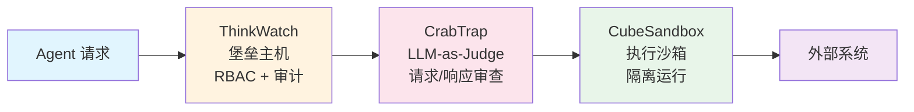

## 今日趋势概览

### 趋势 1：AI Agent 安全基础设施成型

本周最重要的信号不是某个新 Agent，而是围绕 Agent 的**安全基础设施**正在快速成型。三个项目从不同角度切入：

| 角度 | 项目 | 语言 | Stars |
|------|------|------|-------|
| AI 堡垒主机 | ThinkWatch | Rust | 444 |
| LLM-as-Judge 代理 | CrabTrap | Go | 424 |
| Agent 沙箱 | CubeSandbox | Rust | 3.9k |

**架构师判断：** Agent 从"玩具"到"生产"的跨越，安全是最后一公里。三个项目形成完整的安全链路：

这三层架构分别解决：谁在访问（身份）、请求是否安全（内容审查）、执行是否可控（沙箱隔离）。企业级 Agent 部署必备。

**关键信号：**
1. ThinkWatch 用 Rust 实现，说明 Agent 安全对延迟敏感，Go 的 GC 停顿不可接受
2. CrabTrap 的 LLM-as-Judge 模式是用 AI 审 AI，这是安全领域的新范式
3. CubeSandbox 来自腾讯，说明大厂已经把 Agent 沙箱当作基础设施投入

### 趋势 2：AI Memory 层竞争从 API 转向嵌入式

**MemPalace** 逼近 50K stars（20 天内），但更值得注意的是 **Graymatter** 用 3 行 Go 代码实现持久记忆，声称降低 90% Token 消耗。

两种路线正在形成：
- **MemPalace 路线：** 独立 Memory 服务，API 调用，benchmark 驱动
- **Graymatter 路线：** 嵌入式 Memory，零依赖，极简集成

**架构师判断：** Memory 层正在经历从"独立服务"到"嵌入式库"的分化。类似数据库领域从独立 DB 到 embedded SQLite 的路径。Graymatter 代表的极简路线可能更适合中小规模 Agent，MemPalace 的 benchmark 驱动路线适合大规模部署。

### 趋势 3：Rust 正在成为 Agent Runtime / Sandbox 首选语言

本周新出现的高分项目，Rust 占比显著提升：

| 项目 | 领域 | 语言 | Stars |
|------|------|------|-------|
| CubeSandbox | Agent 沙箱 | Rust | 3.9k |
| ThinkWatch | AI 堡垒主机 | Rust | 444 |
| Obscura | 无头浏览器 | Rust | 2.3k |
| claw-code-parity | Coding Agent | Rust | 6.7k |

**架构师判断：** Rust 在 Agent 基础设施层的渗透已经不是趋势预测，而是既定事实。无 GC、零成本抽象、内存安全——这三个特性在低延迟代理、沙箱隔离、并发执行场景下是硬需求。Go 在 Agent 应用层仍然强势，但基础设施层正在被 Rust 蚕食。

### 趋势 4：Coding Agent 替代实现涌现

**gopher-code** (698 ⭐) 把 Claude Code 从零用 Go 重写，零 Node.js 依赖，单二进制分发。虽然 star 数不高，但信号明确：开发者对 Electron/Node.js 依赖链的不满正在转化为行动。

### 趋势 5：Browser Automation 进入 Self-healing 阶段

**browser-harness** (6.4k ⭐) 持续增长，本周 **Obscura** (2.3k ⭐) 作为 Rust 实现的无头浏览器加入。Browser Use 生态从简单的 DOM 操作进化到自愈式 Harness。

## 重点项目深度分析

### Top 1: ThinkWatch — 企业级 AI 堡垒主机

**是什么：** 用 Rust 实现的企业级 AI API 和 MCP 访问堡垒主机。统一代理 OpenAI、Anthropic、Gemini 和自托管 LLM，提供 RBAC、审计日志、限流和成本追踪。

**为什么重要：** 企业部署 Agent 的第一道门。当前大多数企业直接把 API Key 写在 Agent 配置里，零审计、零限流、零成本控制。ThinkWatch 在 Agent 和 LLM API 之间加了一层企业级网关。

**技术亮点：**
1. Rust 实现，低延迟代理，适合高并发 Agent 调用
2. MCP 协议支持，说明它不只是 LLM 代理，更是 Agent 工具层的统一入口
3. RBAC + 审计 + 限流 + 成本追踪四合一

**定位：** 基础设施候选。AI 时代的 API Gateway，类似 Kong/Nginx 在微服务中的角色。

**风险：** Rust 生态的 Agent 开发者基数小；大厂可能自建类似能力（Azure API Management 已经有 AI 相关功能）。

### Top 2: CubeSandbox — 腾讯出品的 AI Agent 沙箱

**是什么：** 腾讯云出品的即时、并发、安全的轻量级沙箱，专为 AI Agent 设计。Rust 实现。

**为什么重要：** Agent 需要执行代码、访问文件系统、调用外部工具，沙箱是隔离这些行为的必备基础设施。腾讯背书说明大厂已经认可"Agent 沙箱"作为基础设施层。

**技术亮点：**
1. Rust 实现，轻量级（对比 Docker 重沙箱）
2. 即时启动、并发支持
3. 面向 AI Agent 的专用 API 设计

**定位：** 基础设施候选。如果质量过关，可能成为 Agent 沙箱的事实标准。

**风险：** 腾讯开源项目的长期维护承诺不确定；需要验证与 Docker/gVisor 的实际隔离性对比。

### Top 3: CrabTrap — LLM-as-a-Judge 安全代理

**是什么：** Brex 出品的 HTTP 代理，用 LLM-as-a-Judge 模式审查 Agent 的请求和响应，防止 Prompt Injection、数据泄露等安全问题。

**为什么重要：** 传统 WAF 规则无法理解自然语言中的恶意意图。用 LLM 审查 LLM 是当前最可行的 Agent 安全方案。

**技术亮点：**
1. LLM-as-a-Judge 模式：AI 审 AI
2. HTTP 代理形式，零侵入接入
3. 来自 Brex（金融科技公司），说明已在生产环境验证

**定位：** 基础设施候选。Agent 安全链路中的内容审查层。

### Top 4: Graymatter — 三行代码的 Agent 持久记忆

**是什么：** Go 实现的极简 Agent 记忆层。三行代码集成，声称降低 90% Token 消耗同时保持质量。

**技术亮点：**
1. 极简 API，零配置
2. 降低 Token 消耗而非增加——通过智能压缩历史上下文
3. Go 实现，适合嵌入式集成

**定位：** 工具型。如果效果属实，可能成为 Agent Memory 的 "SQLite 路线"。

**风险：** Star 数低（277），尚未经过大规模验证；"90% Token 降低"需要独立验证。

## 持续跟踪项目状态

| 项目 | Stars | 状态 | 备注 |
|------|-------|------|------|
| MemPalace | 49.5k | 爆发增长 | 本周逼近 50K |
| CubeSandbox | 3.9k | 快速增长 | 腾讯出品，Rust |
| browser-harness | 6.4k | 稳定增长 | Self-healing 标配 |
| claw-code | 188k | 稳定领跑 | Coding Agent 第一 |
| opencode | 149k | 稳定 | 开源第二梯队 |
| Obscura | 2.3k | 新增 | Rust 无头浏览器 |

## 风险与机遇

**泡沫识别：**
- QuipNetwork 系列（量子 VM/协议）：多仓库同步增长，fork/star 比例异常（forks 极少），可能是刷量或小圈子炒作
- caveman（45K stars）：用"原始人语言"削减 Token 的 Skill，娱乐性大于实用性
- gpt2api：逆向 ChatGPT API，法律和稳定性风险极高

**真实机会：**
- Agent 安全基础设施（堡垒主机 + 安全代理 + 沙箱）是确定性刚需
- Rust 在 Agent 基础设施层的渗透是中期趋势
- Memory 层的嵌入式路线（Graymatter 模式）值得关注
- Browser Automation 的 Self-healing 能力正在成熟

## 评分汇总

### ThinkWatch
| 维度 | 分数 | 理由 |
|------|------|------|
| 热度质量 | 6 | Star 不高但方向精准 |
| 技术创新度 | 8 | MCP + RBAC + 审计一体化 |
| 工程成熟度 | 5 | 早期，Rust 项目 |
| 架构启发价值 | 9 | AI API Gateway 范式 |
| 企业落地潜力 | 8 | 企业部署 Agent 必备 |
| 中期趋势概率 | 8 | 确定性刚需 |
| 平台化潜力 | 7 | 可扩展为 AI API Management |
| 基础设施潜力 | 9 | 明确的网关定位 |
| **总分** | **60/80** | **基础设施候选** |

### CubeSandbox
| 维度 | 分数 | 理由 |
|------|------|------|
| 热度质量 | 8 | 3.9K，腾讯背书 |
| 技术创新度 | 7 | 轻量沙箱，Rust |
| 工程成熟度 | 6 | 有腾讯投入但开源时间短 |
| 架构启发价值 | 8 | Agent 隔离层范式 |
| 企业落地潜力 | 9 | 沙箱是企业部署刚需 |
| 中期趋势概率 | 8 | Agent 沙箱是确定方向 |
| 平台化潜力 | 7 | 可扩展为 Agent Runtime |
| 基础设施潜力 | 9 | 明确的基础设施定位 |
| **总分** | **62/80** | **基础设施候选** |

### CrabTrap
| 维度 | 分数 | 理由 |
|------|------|------|
| 热度质量 | 5 | 424 stars |
| 技术创新度 | 8 | LLM-as-a-Judge 安全审查 |
| 工程成熟度 | 6 | Brex 生产验证 |
| 架构启发价值 | 8 | AI 审 AI 范式 |
| 企业落地潜力 | 8 | Agent 安全刚需 |
| 中期趋势概率 | 7 | 新范式需验证 |
| 平台化潜力 | 6 | 功能较聚焦 |
| 基础设施潜力 | 7 | 安全代理层 |
| **总分** | **55/80** | **基础设施候选** |

### Graymatter
| 维度 | 分数 | 理由 |
|------|------|------|
| 热度质量 | 4 | 277 stars |
| 技术创新度 | 7 | 极简 Memory 嵌入 |
| 工程成熟度 | 4 | 太早期 |
| 架构启发价值 | 8 | Memory 的 SQLite 路线 |
| 企业落地潜力 | 6 | 简单场景可用 |
| 中期趋势概率 | 6 | 需验证效果 |
| 平台化潜力 | 5 | 功能聚焦 |
| 基础设施潜力 | 6 | Memory 是基础设施 |
| **总分** | **46/80** | **工具型** |
