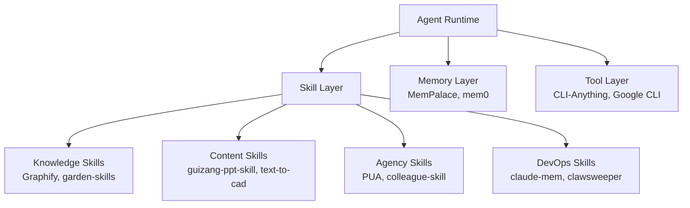

# 2026-04-26 GitHub 趋势研究简报

## 今日重点趋势

### 趋势 1：AI Agent Skill 生态大爆发（评分 84）

本周最显著的趋势是 **Skill 作为 Agent 认知单元** 正在形成完整生态：

- **Graphify (34.8K)**：跨 Agent 平台的 GraphRAG 编排 Skill，支持 Claude Code、Codex、Cursor、Gemini CLI 等 7+ 平台。本质是将知识图谱能力封装为可复用 Skill，一次编写多处运行。
- **guizang-ppt-skill (2.7K)**：3 天破 2.6K，将 prompt 转为横滑杂志风 HTML Deck，10 种布局 + 5 主题。
- **garden-skills (1.2K)**：ConardLi 的开源 Skill 合集，覆盖网页设计、知识检索、图像生成。
- **PUA (16.7K)**：Tanweai 的"高能动性 Skill"——让 Agent 像被 PIP 的 P8 工程师一样拼命干活。概念戏谑但工程扎实。

**架构师判断**：Skill 正在从"小工具"演变为 Agent 的**可复用认知模块**。未来 Agent 能力 = Base Model + Skill Layer + Memory Layer。这个分层一旦稳固，Skill 分发平台将是新的 npm/PyPI。

### 趋势 2：零人类公司编排从概念走向工程（评分 80）

**Paperclip (58.8K)** 已经不是概念验证，而是一个完整的企业级编排框架：
- 支持多 Agent 协作、任务分拆、自动化审批流
- 零人类介入的端到端商业流程编排
- TypeScript 技术栈，工程成熟度高

同期涌现的：
- **Mercury Agent (1K)**：Soul-driven Agent，权限硬化 + Token 预算控制，7×24 运行
- **Harmonist (596)**：186 个 Agent 的纯 Python 编排，零运行时依赖

**架构师判断**：零人类公司正在从噱头变为严肃工程问题。核心挑战不是"能不能"，而是"审计链怎么做"、"故障怎么兜底"、"合规谁负责"。Paperclip 值得做 PoC。

### 趋势 3：CLI 成为 Agent-Native 标准接口（评分 78）

**CLI-Anything (32.6K)** 的定位非常清晰：**把所有软件变成 Agent 可调用的 CLI 接口**。这解决了一个真实痛点——Agent 要操控 GUI 软件非常困难，但如果能先把 GUI → CLI，再 CLI → Agent，难度大幅下降。

**Google Workspace CLI (25.4K)** 更有说服力——Google 自己下场做统一 CLI。当平台厂商开始提供 CLI 优先接口时，Agent-Native 的基础设施就成熟了。

**架构师判断**：CLI 作为 Agent-Native 接口标准正在形成共识。这对企业架构的影响是：所有内部工具都应该考虑暴露 CLI 接口。

### 趋势 4：Karpathy autoresearch 76K（评分 76）

Karpathy 的 **autoresearch** 用单 GPU 自动跑 nanochat 训练实验。76K Stars 更多是 Karpathy 个人影响力加持，但项目本身代表了一个重要方向：**研究自动化**。

与 OpenGame (1K) 的"用 Agent 写游戏"类似，autoresearch 本质是 **Agent 对专业知识工作的渗透**——不是替代研究者，而是把实验编排、参数搜索、结果记录自动化。

## 重点项目深度分析

### 1. Graphify — Agent Skill 的 GraphRAG 标准雏形

**定位**：跨 Agent 平台的 GraphRAG 编排 Skill

**为什么火**：
- 解决了真实痛点：每个 Agent 平台都有自己的插件体系，知识检索逻辑无法复用
- 34.8K Stars + 3.9K Forks，说明不只是围观，有人真在用
- 支持 7+ Agent 平台，覆盖 Claude Code / Codex / Cursor / Gemini CLI / OpenClaw 等

**技术亮点**：
- 统一的知识图谱抽象层，屏蔽底层 Agent 平台差异
- Skill 声明式定义 + 运行时适配
- GraphRAG 增强检索，比纯向量检索精度更高

**架构启发**：Skill 应该是平台无关的。未来的 Skill 标准可能会像容器镜像标准一样，成为跨运行时的分发单元。

**风险**：
- GraphRAG 的实际效果 vs 纯向量检索，在很多场景差异不大
- 依赖底层 LLM 的图谱抽取能力，效果不稳定
- 跨平台兼容性维护成本高

**归类**：工具型 → 有平台化潜力。建议持续跟踪。

### 2. Paperclip — 零人类公司编排

**定位**：端到端零人类介入的自动化商业流程编排

**为什么火**：58.8K Stars 说明"零人类公司"概念击中了市场想象。但 fork 数 10K+ 说明工程上确实有内容。

**技术亮点**：
- TypeScript 全栈，部署门槛低
- 多 Agent 协作编排，支持任务分拆、依赖管理
- 内置审批流模拟（即使没有人类也在运行）

**架构启发**：把"审批"建模为 Agent 间的消息传递，而不是人类 UI 操作。这对企业内部流程自动化有直接启发。

**风险**：
- "零人类"在大多数监管环境不合规
- 真实商业场景的边界条件极其复杂
- 高度依赖 LLM 的可靠性

**归类**：平台候选。建议 PoC。

### 3. CLI-Anything — Agent-Native 万物互联

**定位**：将所有软件暴露为 Agent 可调用的 CLI 接口

**为什么火**：32.6K Stars + "Making ALL Software Agent-Native" 的定位极具野心。

**技术亮点**：
- 自动发现 GUI 软件的可操作入口
- 生成 CLI 包装层
- Agent 可通过标准 CLI 协议调用

**架构启发**：与其让 Agent 学会操作 GUI，不如先把 GUI 软件变成 CLI。这是"接口适配器"模式的 Agent 时代版本。

**风险**：
- GUI 软件变化频繁，CLI 包装层维护成本高
- 很多 GUI 操作本身有状态依赖，CLI 化不完整
- 定位过于宏大，可能无法对所有软件都有效

**归类**：基础设施候选。建议持续跟踪。

## 风险与机遇

### 泡沫信号
- **PUA (16.7K)** 的概念包装大于工程实质，"被 PIP 的 P8"是段子，不是架构
- **Kami (3.2K)** 5 天破 3K，但本质是排版工具，与 AI 趋势关联度有限
- **Harmonist (596)** "186 个 Agent 零依赖"更像是玩具示范

### 真实机会
- **Skill 标准化**正在发生，Graphify 是目前最好的跨平台 Skill 实现
- **CLI 作为 Agent 接口**有 Google 背书（Workspace CLI），企业应开始规划
- **零人类编排**的审计和合规问题，将催生新的基础设施需求

## 重点项目评分

| 项目 | 热度 | 创新 | 成熟度 | 架构启发 | 落地 | 趋势 | 平台化 | 基础设施 | 总分 | 归类 |
|------|------|------|--------|----------|------|------|--------|----------|------|------|
| Graphify | 8 | 7 | 7 | 8 | 7 | 8 | 7 | 6 | 66 | 工具型→平台候选 |
| Paperclip | 9 | 7 | 7 | 8 | 6 | 8 | 8 | 5 | 66 | 平台候选 |
| autoresearch | 9 | 7 | 5 | 7 | 4 | 7 | 3 | 3 | 52 | 学习型 |
| CLI-Anything | 8 | 8 | 5 | 8 | 5 | 8 | 6 | 7 | 61 | 基础设施候选 |
| Google Workspace CLI | 7 | 5 | 8 | 7 | 8 | 7 | 5 | 6 | 59 | 生产可用 |
