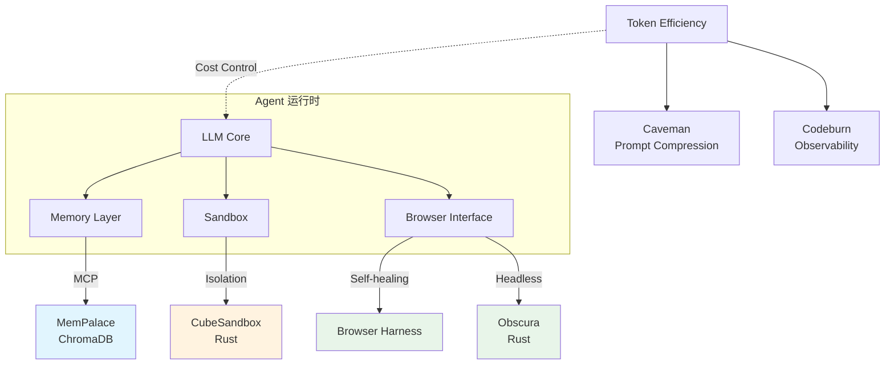

# 2026-04-27 GitHub 趋势研究简报

## 今日重点趋势

### 1. AI Memory 系统走向产品化（Score: 83）

MemPalace 以 49.8K stars 领跑 AI Memory 赛道，22 天从 0 到近 50K，增速惊人。核心卖点是"最高 benchmark"——不是概念验证，而是可量化的性能优势。配合 MCP 协议和 ChromaDB，已经具备接入主流 Agent 工具链的能力。

**架构师判断：** AI Memory 正在从"LLM 的临时上下文"演进为"持久化知识层"。这对 Agent 架构影响深远——有了可靠的 Memory 层，Agent 才能真正做长期任务、跨会话协作。MemPalace 的 MCP 集成意味着它想成为 Agent 生态的标准 Memory 后端。

**风险点：** 492 个 open issues 说明工程成熟度还在爬坡。benchmark 领先 ≠ 生产可靠。

### 2. Token 效率成为 Agent Skill 新焦点（Score: 80）

Caveman（47.1K stars）用极端方式暴露了一个真实痛点：**Agent 的 token 消耗是可观测性和成本控制的核心挑战**。它用"原始人语言"（简化表述）砍掉 65% token，本质上是一种极端的 prompt 压缩策略。

同日 Codeburn（4.1K stars）也从可观测性角度切入——TUI Dashboard 实时展示 Claude Code / Codex / Cursor 的 token 消耗。

**架构师判断：** Token 效率正在成为 Agent 工程的新维度。这不是优化技巧，而是架构层面的考量——如何在保证输出质量的前提下最小化 token 消耗。Caveman 的"原始人语言"是 meme，但背后的 prompt 压缩思路有工程价值。Codeburn 的可观测性方向更具长期价值。

### 3. Agent 沙箱基础设施升温（Score: 78）

腾讯 CubeSandbox（4.2K stars, Rust）专注 AI Agent 的即时并发安全沙箱。Obscura（6.0K stars, Rust）则定位为 AI Agent 专用无头浏览器。

两者都是 Rust 实现，都瞄准 Agent 运行时基础设施。

**架构师判断：** Agent 沙箱正在从"nice to have"变成"must have"。当 Agent 需要执行代码、访问网络、操作文件系统时，隔离和安全性是硬需求。腾讯入场说明大厂已经意识到这个基础设施层的战略价值。

### 4. Browser Use 生态纵深发展（Score: 76）

Browser Harness（7.1K stars）主打"自愈"——当页面结构变化时，LLM 能自动适应。这是 Browser Use 从"能跑 demo"到"能跑生产"的关键一步。

## 最值得关注的方向

1. **AI Memory 作为 Agent 基础设施层** — 这是让 Agent 从"一次性工具"变成"可持续系统"的关键
2. **Token 经济学** — 从压缩到可观测，Agent 的运营成本正在被工程化
3. **Agent 安全沙箱** — 大厂入场，基础设施化趋势明确

## 重点项目深度分析

### MemPalace：AI Memory 赛道的领跑者

- **定位：** 开源 AI 记忆系统，声称 benchmark 最优
- **为什么火：** 填补了 LLM 缺乏持久记忆的空白，MCP 集成降低接入门槛
- **技术亮点：** ChromaDB 向量存储、MCP 协议支持、benchmark 驱动的性能优化
- **架构启发：** Memory 作为独立中间件层，而不是 LLM 的内部能力
- **风险：** 492 open issues，fork 增长快但贡献者质量待验证
- **判断：** 基础设施候选，值得持续跟踪和 PoC

### Caveman：Token 压缩的极端实验

- **定位：** Claude Code Skill，用简化语言减少 token
- **为什么火：** meme 效应 + 真实痛点（token 成本）
- **技术亮点：** prompt 压缩策略，验证了简化表述对输出质量影响可控
- **风险：** 21 天未更新，可能是昙花一现；65% 压缩率的场景泛化性存疑
- **判断：** 工具型/观察型，工程启发大于实际使用价值

### Obscura：Rust 写的 Agent 专用无头浏览器

- **定位：** AI Agent 专用 headless browser
- **为什么火：** Rust 性能 + AI Agent 专用优化
- **技术亮点：** 原生 Rust 实现、面向 Agent 的 API 设计
- **架构启发：** Agent 专用浏览器 vs 通用浏览器 + 插件，是两条路线之争
- **风险：** 生态薄弱，与 Playwright/Puppeteer 的兼容性未知
- **判断：** 基础设施候选，值得跟踪

### CubeSandbox：腾讯的 Agent 沙箱

- **定位：** 即时、并发、安全、轻量的 Agent 沙箱
- **为什么火：** 腾讯背书 + Rust 实现 + Agent 安全刚需
- **技术亮点：** Rust 安全隔离、并发沙箱、轻量级
- **判断：** 基础设施候选，企业落地潜力高

## 风险与机遇

**风险：**
- Agent Skill 生态碎片化加剧——不同 Agent 平台的 Skill 格式不统一
- Token 压缩类项目（Caveman）可能是短期 meme，不具备中期价值
- Browser Use 生态过热，泡沫概率上升

**机遇：**
- AI Memory 层正在成为新的基础设施机会
- Agent 沙箱是大厂必争之地，Rust 生态优势明显
- Token 可观测性（Codeburn 方向）是未被充分挖掘的工具链机会

## 重点项目评分

| 项目 | 热度 | 技术创新 | 工程成熟 | 架构启发 | 落地潜力 | 中期趋势 | 平台化 | 基础设施 | 总分 | 归类 |
|------|------|---------|---------|---------|---------|---------|--------|---------|------|------|
| MemPalace | 9 | 7 | 5 | 9 | 7 | 8 | 7 | 8 | 60/80 | 基础设施候选 |
| Caveman | 9 | 4 | 4 | 5 | 3 | 4 | 2 | 2 | 33/80 | 工具型 |
| Obscura | 7 | 7 | 5 | 7 | 6 | 7 | 5 | 7 | 51/80 | 基础设施候选 |
| Browser Harness | 7 | 7 | 6 | 7 | 7 | 7 | 6 | 5 | 52/80 | 平台候选 |
| CubeSandbox | 6 | 7 | 5 | 8 | 8 | 8 | 6 | 8 | 56/80 | 基础设施候选 |
| Codeburn | 5 | 5 | 6 | 6 | 7 | 7 | 4 | 3 | 43/80 | 工具型 |

---

*本报告由 GitHub Researcher 自动生成 · 2026-04-27*
