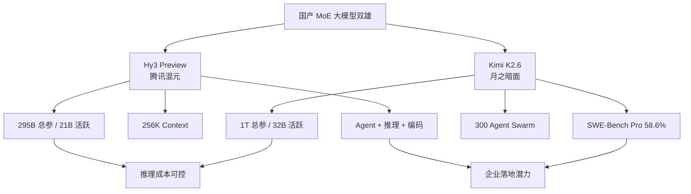

# 2026-04-28 GitHub 趋势研究简报

## 今日重点趋势

### 1. 国产大模型 MoE 密集发布：Hy3 + Kimi K2.6 双雄并立（Score: 85）

这一周是中国大模型开源的集中爆发期。4 月 23 日腾讯发布 Hy3 Preview（295B MoE，21B 活跃参数），4 月 20 日月之暗面发布 Kimi K2.6（1T MoE，32B 活跃参数），两者都选择了 MoE 架构 + 开源路线，但定位不同：

- **Hy3 Preview** 侧重通用能力 + Agent 任务，是腾讯重建训练基础设施后的首个交付物（90 天重建）
- **Kimi K2.6** 狠抓 Agentic Coding——SWE-Bench Pro 58.6%，超过 GPT-5.4（57.7%）和 Claude Opus 4.6（53.4%），且支持 300 Agent Swarm 并行编排

**架构师判断：** MoE 已成为国产大模型的标准架构选择。核心逻辑是：**用总参数量撑起能力天花板，用稀疏激活控制推理成本**。对企业落地而言，21B-32B 活跃参数意味着可以用合理的 GPU 资源跑出接近前沿的效果。Kimi K2.6 的 Agent Swarm 能力尤其值得关注——300 个子 Agent 并行、4000 协调步，已经超出"单 Agent 补全"的范式。

**关键信号：**
- Hy3 由前 OpenAI 研究员姚顺雨主导，90 天完成基础设施重建到模型交付
- Kimi K2.6 的 SWE-Bench Pro 成绩首次让开源模型在这个核心指标上超过闭源模型
- 两者都选择了 Modified MIT License，商业友好

### 2. Code Intelligence 走向 MCP-Native：GitNexus 28K+ Stars（Score: 82）

GitNexus 从 2025 年 8 月发布，到 2026 年 2 月病毒式传播后飙升至 28K+ stars。核心卖点：**把代码仓库变成知识图谱，通过 MCP 协议暴露给 AI Agent**。

它解决的痛点极其精确：当前 AI Coding Agent（Claude Code、Cursor、Codex）都是"函数级编辑"——它们在改代码时看不到依赖链、调用链、执行流。GitNexus 把整个仓库索引成结构化图谱，让 Agent 获得"系统级视野"。

**架构师判断：** 这是一个典型的 **AI 基础设施补丁**。MCP 协议让 GitNexus 可以无缝接入 Claude Code、Cursor 等工具，而不需要改变 Agent 本身的架构。这种"侧补丁"模式是 AI 工具链演进中最务实的路径——不需要重写 Agent，只需要给它更好的上下文。

**风险点：** 零服务器架构虽然酷，但在大型 monorepo 上的性能尚未验证。Graph RAG 的查询精度和延迟也是未知数。

### 3. Claude Code Skill 生态爆发：PPT / Design / CAD 全覆盖（Score: 79）

Claude Code 的 Skill 生态正在快速长出各种垂直能力：

- **guizang-ppt-skill**（3.4K stars）：把 Prompt 变成横滑杂志风 HTML，10 种布局 + 5 种主题
- **huashu-design**（8.3K stars）：HTML 原生设计 Skill，4 天破 8K
- **text-to-cad**（940 stars）：开源 CAD 模型生成 Harness
- **gpt-image-2 生态**：GPT-Image-2 的工业级提示词引擎和模板库

这些 Skill 的共同特点是：**用单一文件（通常是 HTML/CSS/JS）交付完整的垂直能力**。这不是框架，不是 SDK，而是一种新的"AI 原生"交付形态。

**架构师判断：** Skill 正在成为 AI Agent 的"插件"标准。当前形态还很原始（基本上是 Prompt Template + 输出模板），但趋势明确——Agent 的能力边界不再由 Agent 框架决定，而由 Skill 生态决定。Andrej Karpathy Skills（93.8K stars）本身就是这个趋势的引爆点。

### 4. Agent 编排协议化：Harmonist 零依赖 186 Agent（Score: 76）

Harmonist（741 stars）提出了一个有趣的定位：**零运行时依赖 + 机械协议执行 + 186 Agent**。它的核心思路是不依赖任何外部框架（LangChain、CrewAI 等），通过纯协议层编排大量 Agent。

同日出现的 Mercury Agent（1.5K stars）也走了类似路线——"Soul-driven" Agent，内置权限控制、Token 预算、多渠道能力。

**架构师判断：** Agent 编排正在经历一个"去框架化"的阶段。早期是 LangChain/CrewAI 模式（重框架），现在趋势是**协议定义 + 轻量实现**。这与微服务从 Spring Cloud 到 Service Mesh 的演进路径类似。

---

## 持续跟踪项目状态

| 项目 | 上次 Stars | 今日 Stars | 变化 | 判断 |
|------|-----------|-----------|------|------|
| claw-code | 187.5K | 188.8K | +1.3K | 稳定增长，增速放缓 |
| hermes-agent | 118K | 120.5K | +2.5K | 持续增长 |
| andrej-karpathy-skills | 90.8K | 93.8K | +3K | Skill 生态核心资产 |
| oh-my-codex | 16K | 26.4K | +10.4K | 强力增长 |
| Vaultwarden | 59K | 59.4K | +400 | 稳定 |
| VoxCPM2 | 15K | 16.1K | +1.1K | 稳定增长 |
| Ollama | 168K | 170.2K | +2.2K | 稳定 |

---

## 今日重点项目深度分析

### Top 1: Kimi K2.6 — 开源 Agentic Coding 的新标杆

**它是什么：** 月之暗面（Moonshot AI）发布的 1T MoE 模型，32B 活跃参数，256K Context，核心能力是 Agentic Coding 和 Agent Swarm 编排。

**它为什么火：**
1. SWE-Bench Pro 58.6%，首次开源模型超过 GPT-5.4（57.7%）和 Claude Opus 4.6（53.4%）
2. 300 Agent Swarm 并行编排，4000 协调步——这不再是"单 Agent 补全"，而是"Agent 集群工程"
3. 12 小时自主运行能力，适合处理大型长期任务
4. Modified MIT License，商业友好

**真正的技术亮点：**
- **Agent Swarm 架构**：不是单 Agent 循环调用工具，而是 300 个子 Agent 并行执行、协调、汇总
- **长 Horizon 执行**：12 小时自主运行不中断，对任务规划和错误恢复要求极高
- **MoE 稀疏激活**：1T 参数只激活 32B，推理成本控制在可接受范围

**定位：** 基础设施候选。如果 Agent Swarm 被验证可靠，它可能成为 Agentic Coding 的底座模型。

### Top 2: Hy3 Preview — 腾讯 90 天重建的答卷

**它是什么：** 腾讯混元团队在重建训练基础设施后的首个模型。295B MoE，21B 活跃参数，256K Context。

**架构师视角的关键信息：**
- 前期由前 OpenAI 研究员姚顺雨主导
- 2026 年 2 月拆毁旧基础设施重建，90 天交付——这个速度本身就是工程能力的证明
- 侧重复杂推理、指令遵循、上下文学习、编码、Agent 任务
- RMB 1.2/M input token 的定价，成本竞争力强

**当前局限：** GitHub 只有 262 stars，说明模型刚刚发布，社区接受度尚未验证。但腾讯生态内的集成（微信、QQ、腾讯云）是它的天然优势。

### Top 3: GitNexus — AI Agent 的"代码透视镜"

**它是什么：** 浏览器端运行的代码知识图谱引擎，把仓库索引成结构化图谱，通过 MCP 暴露给 AI Agent。

**关键价值：**
- 解决了 AI Agent "只见函数，不见系统" 的核心缺陷
- MCP 协议让它可以无侵入地接入 Claude Code、Cursor、Codex
- 零服务器——全部在浏览器端运行，数据不离开本地

**评分：**

| 维度 | 分数 | 理由 |
|------|------|------|
| 热度质量 | 8 | 持续增长，非一次性爆发 |
| 技术创新度 | 8 | Graph RAG + MCP + Zero-Server 组合独特 |
| 工程成熟度 | 6 | 大型 monorepo 性能未验证 |
| 架构启发价值 | 9 | "侧补丁"模式对 AI 工具链演进有启发 |
| 企业落地潜力 | 7 | MCP 集成降低了接入门槛 |
| 中期趋势概率 | 8 | Code Intelligence 是 Agent 的刚需 |
| 平台化潜力 | 7 | MCP 协议是平台化基础 |
| 基础设施潜力 | 8 | 可能成为 Agent 的标准"眼睛" |

**总分：61/80 | 归类：基础设施候选 | 建议持续跟踪**

---

## 风险与机遇

### 🔴 本日风险信号

1. **Skill 生态的"馒头效应"**：Claude Code Skill 正在快速涌现，但大部分是 Prompt Template 包装，真正的工程创新稀少。guizang-ppt-skill 和 huashu-design 本质上是 HTML 模板 + Prompt，技术壁垒极低。
2. **MoE 模型推理成本的不确定性**：虽然稀疏激活降低了单次推理成本，但 300 Agent Swarm 的总成本可能远超预期。Agent Swarm 的经济模型尚未被验证。

### 🟢 本日机遇信号

1. **MCP 协议正在成为 Agent 工具链的标准接口**：GitNexus、MemPalace 等项目都选择了 MCP 集成，这意味着 MCP 可能成为 Agent 生态的"USB 接口"。
2. **国产 MoE 模型的企业落地窗口**：Hy3 和 Kimi K2.6 都选择了 Modified MIT License + 低定价策略，企业落地成本极低。窗口期可能只有 3-6 个月。

---

## 重点项目评分汇总

### Kimi K2.6

| 维度 | 分数 | 理由 |
|------|------|------|
| 热度质量 | 9 | SWE-Bench Pro 登顶 + 900% 搜索增速 |
| 技术创新度 | 9 | 300 Agent Swarm 是真正的架构创新 |
| 工程成熟度 | 7 | GA 发布一周，API 稳定性待验证 |
| 架构启发价值 | 9 | Agent Swarm 可能改变 Coding Agent 范式 |
| 企业落地潜力 | 8 | Modified MIT + 低成本 + API 可用 |
| 中期趋势概率 | 8 | Agentic Coding 是确定趋势 |
| 平台化潜力 | 7 | 需要生态支撑 |
| 基础设施潜力 | 9 | 可能成为 Agent Swarm 的标准底座 |

**总分：66/80 | 归类：基础设施候选 | 建议持续跟踪 + PoC 评估**

### Hy3 Preview

| 维度 | 分数 | 理由 |
|------|------|------|
| 热度质量 | 5 | 刚发布，GitHub 262 stars |
| 技术创新度 | 7 | 90 天基础设施重建是工程亮点 |
| 工程成熟度 | 5 | Preview 阶段 |
| 架构启发价值 | 7 | MoE + Agent 任务的训练方法论 |
| 企业落地潜力 | 8 | 腾讯生态 + 低定价 + MIT License |
| 中期趋势概率 | 7 | 腾讯投入 + 姚顺雨团队 |
| 平台化潜力 | 6 | 需要社区验证 |
| 基础设施潜力 | 7 | 21B 活跃参数适合私有部署 |

**总分：52/80 | 归类：观察型 | 建议持续跟踪，等待社区验证**

---

## 昨日回顾提醒

2026-04-27 日报中最值得补看的内容：**MemPalace（49.8K stars）**——AI Memory 系统的领跑者，如果你正在评估 Agent 的持久记忆层方案，值得一看。

---

*本报告基于 GitHub Trending 数据、gh API 查询、以及多个开源趋势追踪平台综合分析。数据获取时间：2026-04-28 06:00 CST。*
