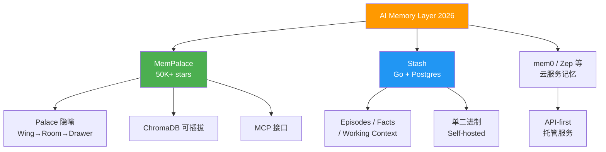
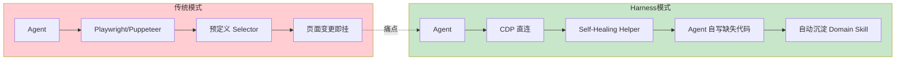
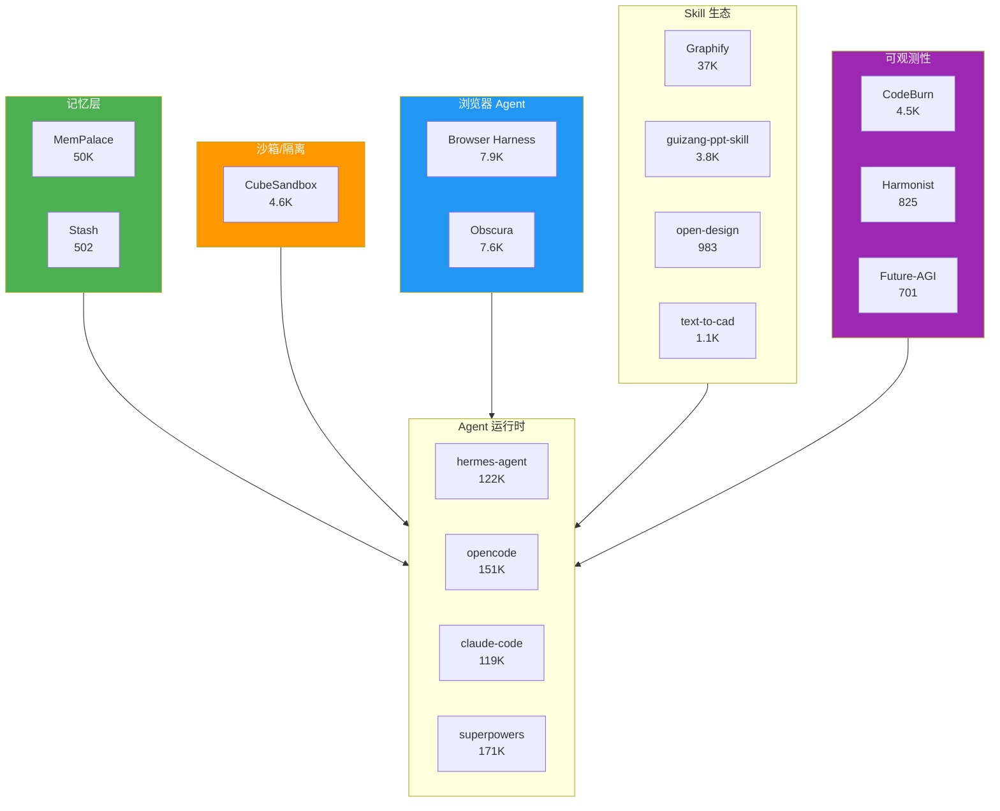

# 2026-04-29 GitHub 趋势研究简报

## 今日重点趋势

### 1. AI 记忆层基础设施竞赛：MemPalace 50K+ Stash 入局（Score: 84）

AI Agent 的「长期记忆」正在从概念验证走向基础设施层竞争。本周两个信号值得注意：

- **MemPalace**（50.2K stars，4 月创建）：用 Palace 隐喻（Wing → Room → Drawer）组织对话历史，96.6% R@5 on LongMemEval，本地优先，零 API 调用。核心卖点是「不总结、不提取、不转述」——原始文本直存 + 语义检索。支持 ChromaDB 可插拔后端，已提供 MCP 接口。这不是 demo，是可部署的记忆基础设施。
- **Stash**（502 stars，4 月 24 日创建）：Go 单二进制，Postgres 存储，MCP server 内置。面向 Episodes/Facts/Working Context 三层模型。比 MemPalace 更轻量，但定位清晰——Agent 的持久化记忆层。

**判断：** AI 记忆层正在复制向量数据库 2023 年的路径——先有概念，再有基准测试，然后基础设施化。MemPalace 的 LongMemEval 基准是关键差异化。中期趋势，不是短期热点。

### 2. Agent Skill 生态进入长尾分化期（Score: 78）

Claude Code Skill 已经从「第一批杀手级 Skill」（caveman 49K, career-ops 40K, nuwa-skill 16K）进入了**长尾分化阶段**：

- **设计类**：guizang-ppt-skill（3.8K）、huashu-design（9.4K）、open-design（983，昨天创建）、DESIGN.md 规范（9.8K）
- **专业工具类**：text-to-cad（1.1K，CAD 模型生成）、earthtojake/text-to-cad、op7418/guizang-ppt-skill
- **人设蒸馏类**：nuwa-skill（16K）、zhangxuefeng-skill（6.7K）、khazix-skills（6.3K）
- **PPT / 演示**：guizang-ppt-skill（3.8K）、Kami（3.7K，tw93 出品）、ppt-image-first（381）

**判断：** Skill 生态正在走向 WordPress 插件式的长尾市场。真正有持续价值的是**跨 Agent 兼容**的 Skill（graphify 支持 10+ Agent 平台）。单 Agent 绑定的 Skill 生命周期取决于宿主 Agent 的市场地位。

### 3. Browser Agent 向 Harness 模式收敛（Score: 80）

browser-use 团队的 **Browser Harness**（7.9K stars）提出了一个值得关注的新模式：

- **Self-Healing Harness**：Agent 在执行过程中**自己编写缺失的 helper**，而不是依赖预定义的 DOM selector
- **Domain Skill 自动生成**：Agent 完成任务后自动沉淀为 `domain-skills/` 下的可复用技能
- **592 行核心代码**：极薄抽象层，CDP 直连，不经过任何框架

与此同时 **Obscura**（7.6K stars, Rust）走的是「headless browser for AI agents」路线——底层基础设施，不做 Harness 层。

**判断：** Browser Agent 正在从「给 Agent 一个浏览器」转向「给 Agent 一套自愈的工具链」。Harness 模式（薄层 + Agent 自写代码 + Domain Skill 沉淀）可能是中期胜出范式。

### 4. Agent 治理与可观测性：从散装走向系统化（Score: 76）

三个项目覆盖了 Agent 可观测性的不同层面：

| 项目 | 定位 | Stars | 关键价值 |
|------|------|-------|----------|
| **CodeBurn** | Token 消耗可观测 | 4.5K | 按 Task/Tool/Model/MCP 拆分成本，TUI Dashboard |
| **Harmonist** | Agent 编排协议执行 | 825 | 机械门控，不是 prompt 提醒 |
| **Future-AGI** | LLM 全链路可观测 | 701 | Tracing + Evals + Simulations + Guardrails |

**判断：** 当 Agent 从「个人工具」走向「团队基础设施」，可观测性是刚需。CodeBurn 的「无侵入」模式（读本地 session 数据）比需要改代码的方案更容易被采纳。Harmonist 的「机械门控」理念值得关注——prompt-based guardrail 在 Agent 自我迭代时容易失效。

## 重点项目深度分析

### 🧠 MemPalace — AI 记忆系统的基准王者

**做什么：** 将 AI 对话历史按 Palace 隐喻组织（Wing = 人/项目，Room = 话题，Drawer = 原始内容），提供语义检索。不做总结，只做结构化存储 + 检索。

**为什么火：** 50K stars 三周达成。核心卖点是 96.6% R@5（LongMemEval），远超竞品。其次是 local-first 理念，零 API 调用，数据不出本机。发布时恰逢 AI Memory 成为 Agent 圈热门话题。

**架构亮点：**
1. Verbatim Storage：不总结、不提取，保留原文。检索靠语义索引而非摘要
2. 可插拔后端：ChromaDB 为默认，接口开放，可替换
3. MCP 集成：`mempalace wake-up` 可为新的 Claude Code session 自动加载上下文

**风险：** 506 个 open issues，增长过快。Palace 隐喻在数据量极大时是否可持续存疑。ChromaDB 本身不是生产级向量数据库。

### 📦 CubeSandbox — 腾讯云的 AI Agent 沙箱

**做什么：** 基于 RustVMM + KVM 的沙箱服务，E2B 兼容。60ms 冷启动，5MB 内存开销，单机可运行数千个 Agent。

**为什么值得关注：** 这是**国产 AI 基础设施**在 Sandbox 赛道的首次严肃交付。E2B 兼容意味着迁移成本为零。腾讯云生产环境验证。

**架构亮点：**
1. CoW + Rust 精简运行时：单实例 5MB，单机千级 Agent
2. 真正的内核级隔离（KVM），不是 Docker namespace hack
3. eBPF 网络隔离（CubeVS），沙箱间严格网络隔离
4. 快照克隆 + 预热资源池：跳过初始化，冷启动 < 60ms

**风险：** 仅支持 Linux + KVM 环境。与 E2B 的兼容性取决于 E2B 的 API 稳定性。开源生态尚在早期。

### 🕸️ Graphify — 跨 Agent 知识图谱

**做什么：** 将任意文件夹（代码、文档、论文、图片、视频）转为可查询知识图谱。支持 Claude Code、Codex、OpenCode、Cursor、Gemini CLI、GitHub Copilot CLI、OpenClaw 等 10+ Agent 平台。

**为什么火：** 37K stars。核心是「一个 Skill 覆盖所有 Agent 平台」，这在 Skill 生态碎片化的当下是差异化优势。

**判断：** 工具型项目，实用但不是平台。GraphRAG 方向有中期价值，但与 MemPalace 的记忆层方向存在竞争。

## 风险与机遇

### 风险
1. **Skill 泡沫化**：PPT/Design/CAD 类 Skill 大量涌现，同质化严重。大部分 Skill 只是 prompt 封装，工程含量有限
2. **MemPalace 过热**：506 open issues，50K stars 的增长速度远超维护能力。警惕「benchmark-driven」增长
3. **QuipNetwork 疑似刷星**：4 个仓库同日创建，stars 数接近（5.6-5.8K），fork 极少，高度异常

### 机遇
1. **AI Memory 基础设施化**：MemPalace + Stash + mem0，记忆层正在标准化
2. **Sandbox 国产替代**：CubeSandbox 是 E2B 的开源替代，中国企业场景适配更好
3. **Agent 可观测性刚需**：CodeBurn 模式（无侵入读取 session 数据）是 DevOps for Agent 的起点

## 生态趋势关系图

## 重点项目档案

| 项目 | Stars | 分类 | 评分 | 跟踪建议 |
|------|-------|------|------|----------|
| MemPalace | 50.2K | 基础设施候选 | 84 | ⭐ 持续跟踪 |
| CubeSandbox | 4.6K | 基础设施候选 | 82 | ⭐ 持续跟踪 |
| Browser Harness | 7.9K | 平台候选 | 80 | ⭐ 持续跟踪 |
| Graphify | 37.3K | 工具型 | 78 | 关注 |
| Harmonist | 825 | 观察型 | 76 | 观察 |
| CodeBurn | 4.5K | 工具型 | 75 | 关注 |
| Obscura | 7.6K | 观察型 | 73 | 观察 |
| Kami | 3.7K | 工具型 | 70 | 了解 |
| Future-AGI | 701 | 观察型 | 69 | 观察 |
| Open-Design | 983 | 工具型 | 68 | 观察 |
| Stash | 502 | 观察型 | 67 | 观察 |

---

*本文基于 2026-04-28 UTC GitHub API 数据及多源趋势分析生成。数据来源：GitHub Search API、TrendShift、Git-Trending-Rank。*
