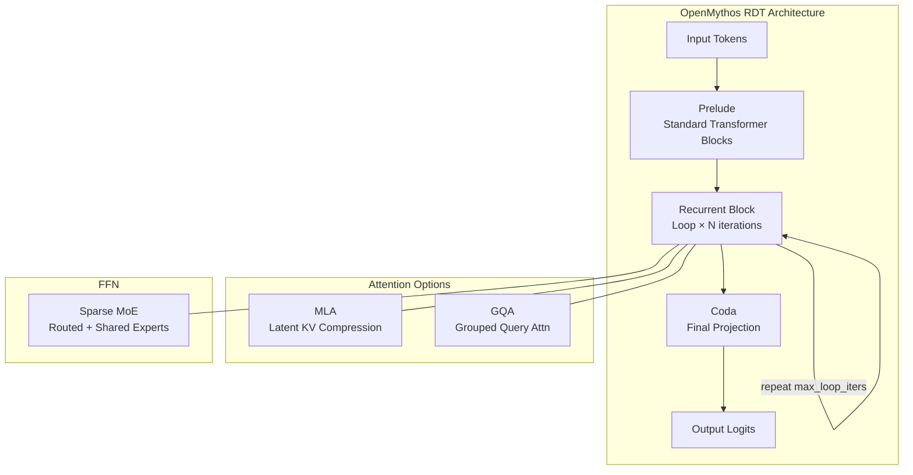
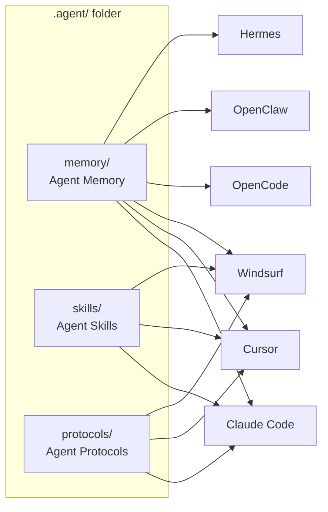
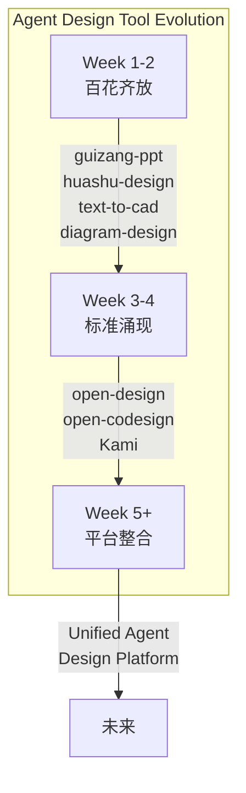

# 2026-04-30 GitHub 趋势研究简报

## 今日重点趋势

### 1. Claude Mythos 架构逆向工程：OpenMythos 11K+ Stars 重建 RDT（Score: 85）

本周最值得关注的项目不是产品级工具，而是一个纯研究型仓库：**OpenMythos**（11.2K stars，12 天创建）。

Kyeman Gomez 团队基于公开论文，理论重建了 Anthropic Claude 的 "Mythos" 架构。核心创新点：

- **Recurrent-Depth Transformer (RDT)**：三层架构 — Prelude（标准 Transformer Blocks）→ Recurrent Block（可配置循环次数）→ Coda。核心思想：推理时计算深度可变，类似人类"想多久取决于问题多难"。
- **MLA / GQA 双注意力**：支持 Multi-Head Latent Attention（DeepSeek 风格 KV 压缩）和 Grouped Query Attention 切换。
- **Sparse MoE Feed-Forward**：路由专家 + 共享专家，激活参数量远小于总参数量。

**架构师视角**：这不是"又一个 Transformer 变体"。RDT 代表了一个重要方向 — **推理时计算量自适应**。当前主流 LLM 的推理成本是固定的（每一 token 计算量相同），RDT 打破了这个限制。如果这个方向被验证，将改变整个推理基础设施的设计。

**风险**：这仍是理论重建，未经 Anthropic 确认。实际 Mythos 架构可能差异巨大。但作为社区驱动的架构探索，已展现出极高价值。

### 2. AI Agent 记忆层进入本地优先时代：OpenChronicle + Mercury Second Brain（Score: 82）

昨日我们追踪了 MemPalace 50K+ 和 stash 进入记忆层赛道。今天两个新信号强化了这个趋势：

**OpenChronicle**（1.9K stars，9 天创建）— 对标 OpenAI Chronicle 的开源替代：
- AX Tree（无障碍树）优先策略，非截图优先。理由：结构化文本成本更低、意图捕获更准、去重更容易
- 本地优先，Markdown 落盘 + SQLite 索引
- MCP 客户端直接可用，但不绑定任何协议
- 目前 v0.1.0，仅支持 macOS，alpha 阶段

**Mercury Agent**（1.8K stars，10 天创建）— 内置 Second Brain：
- SQLite + FTS5 全文搜索，10 种记忆类型
- 自动提取、冲突解决、自动整合
- 与 Soul-Driven 人格系统（soul.md / persona.md）联动

**架构判断**：记忆层的竞争维度正在收敛为三个：
1. **捕获方式**：AX Tree vs 截图 vs API Hook vs 纯对话日志
2. **存储格式**：Markdown + SQLite（本地） vs ChromaDB（向量） vs 云端
3. **开放性**：MCP 兼容 vs 独立协议

OpenChronicle 的 AX Tree 策略值得关注 — 它选择了一条成本最低、信号最纯的路。如果这条路被验证，未来 Agent 记忆层的标准接口可能不是向量搜索，而是结构化上下文流。

### 3. Agent 可移植性标准化：agentic-stack .agent/ 文件夹（Score: 79）

**Agentic Stack**（1.8K stars，15 天创建）提出了一个简洁但重要的概念：

> "One brain, many harnesses."

核心是一个可移植的 `.agent/` 文件夹，包含 memory + skills + protocols，可以在 Claude Code、Cursor、Windsurf、OpenCode、OpenClaw、Hermes 之间迁移，切换工具不丢失知识。

**为什么重要**：当 Agent 生态从单一工具走向多工具并存，Agent 的"人格"和"经验"如何跨工具迁移成为一个真实痛点。`.agent/` 文件夹本质上是在做 Agent 的「家目录标准化」。

**架构启发**：类似 `.env` 标准化了环境变量、`.github/` 标准化了 CI/CD，`.agent/` 有潜力成为 Agent 配置的行业标准目录结构。

### 4. Open Design 生态整合与内容工具进化（Score: 77）

**Open Design**（4.1K stars，2 天创建！）— 这两天增长最快的项目。定位为 Claude Design 的开源替代：
- 71 个品牌级 Design Systems（Linear、Stripe、Vercel、Airbnb 等）
- 19 个 Composable Skills（prototype、deck、mobile、dashboard 等）
- BYOK 全层，支持 Claude Code / Codex / Cursor / Gemini CLI / OpenCode / Qwen / Copilot
- Apache 2.0 开源

**tw93/Kami**（3.8K stars，10 天创建）— "好内容值得好纸张"，内容排版工具。简洁的产品直觉，来自阿里系前端工程师。

**趋势延续**：Claude Code Skill 生态从上周的 PPT / Design / CAD 分化，本周进入整合期 — Open Design 把多个 Skill 整合进统一框架，这是从"百花齐放"到"标准涌现"的信号。

## 最值得关注的方向

### 🔥 推理时计算自适应（Compute-Adaptive Inference）

OpenMythos 的 RDT 架构指向一个重要趋势：**推理成本不再固定**。如果深度可变的推理成为主流，将影响：
- 推理服务定价模型（按思考深度计费 vs 按 token 计费）
- GPU 调度策略（复杂问题需要更长循环）
- 推理框架设计（需要支持动态循环退出条件）

### 🔥 Agent 记忆层标准化窗口期

过去一周出现了 MemPalace、stash、OpenChronicle、Mercury Second Brain 四个记忆层项目。窗口正在关闭 — 6 个月内很可能出现事实标准。

## 风险与机遇

### ⚠️ 风险

1. **OpenMythos 是理论重建**：未经 Anthropic 确认，可能完全偏离实际架构。社区过度追捧理论模型存在误导风险。
2. **记忆层碎片化**：四五个项目各搞一套存储格式，短期不会收敛，用户面临锁定风险。
3. **Open Design 增速过快**：2 天 4K stars，部分来自生态项目的 Star 互相带动，实际活跃用户需要持续观察。

### ✅ 机遇

1. **agentic-stack 的 .agent/ 标准**如果被主流 Coding Agent 采纳，将成为基础设施层。
2. **OpenChronicle 的 AX Tree 策略**如果被验证优于截图方案，将降低 Agent 记忆层 80% 的成本。
3. **TileKernels**（DeepSeek 出品）代表国内厂商开始输出 GPU Kernel 层基础设施。

## 重点项目档案

今日重点项目档案详见：
- [OpenMythos](projects/openmythos.html)
- [Browser Harness](projects/browser-harness.html)
- [OpenChronicle](projects/openchronicle.html)
- [Open Design](projects/open-design.html)
- [Agentic Stack](projects/agentic-stack.html)
- [Mercury Agent](projects/mercury-agent.html)

## 延续观察

| 项目 | 首次追踪 | 当前状态 | 趋势 |
|------|----------|----------|------|
| MemPalace | 2026-04-29 | 50.2K stars | → 稳定增长 |
| Browser Harness | 2026-04-29 | 8.4K stars（+500） | → 持续上升 |
| Harmonist | 2026-04-29 | 893 stars | → 缓慢增长 |
| Kami | 2026-04-30 | 3.8K stars | ↑ 快速增长 |
| TileKernels | 2026-04-30 | 1.3K stars | → 新出现 |

---

*本报告由 GitHub Researcher 自动生成 | 2026-04-30*
