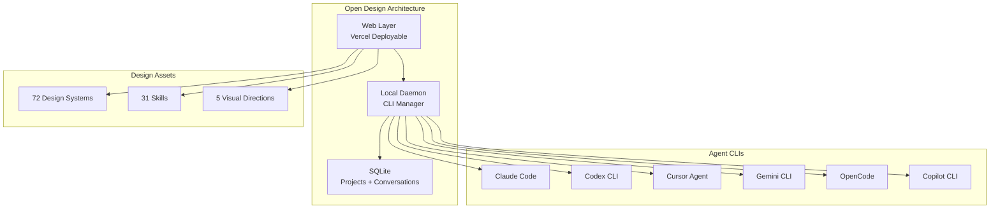

# 2026-05-01 GitHub 趋势研究简报

## 今日重点趋势

### 1. CVE-2026-31431 "Copy Fail"：Linux 内核 AEAD 本地提权漏洞曝光（Score: 90）

**theori-io/copy-fail-CVE-2026-31431** 在 24 小时内冲到 1.6K stars。这不是一个普通的安全研究项目 — 它暴露了 Linux 内核中存在 **9 年的 page-cache 损坏漏洞**。

**漏洞机制**：
- `algif_aead` 运行 AEAD 加密时使用 in-place 模式（`req->src == req->dst`）
- 当通过 `splice()` 从普通文件传入数据时，目标 scatterlist 直接指向文件的 page-cache 页
- `authencesn(hmac(sha256), cbc(aes))` 算法执行时，会在 page-cache 中写入 4 字节的 AAD `seqno_lo` 字段
- **结果**：攻击者可以静默修改 page-cache 中的文件内容，而磁盘文件不变

**利用路径**：
1. 修改 `/etc/passwd` 的 page-cache 副本，将当前用户 UID 改为 0
2. 调用 `su` 获取 root shell
3. 纯 Python 3.10+ 标准库即可利用，无需编译

**影响范围**：
| 发行版 | 内核版本 |
|--------|----------|
| Ubuntu 24.04 LTS | 6.17.0-1007-aws |
| Amazon Linux 2023 | 6.18.8 |
| RHEL 10.1 | 6.12.0 |
| SUSE 16 | 6.12.0 |

**架构师视角**：这个漏洞的严重性在于两点：
1. **无磁盘痕迹**：攻击只修改内存中的 page-cache，磁盘文件完好，传统文件完整性检测失效
2. **历史积累**：底层 bug 自 2017 年 commit `72548b093ee3` 引入，已存在 9 年

影响所有运行未打补丁内核的云服务器和容器宿主机。如果企业 Linux 基础设施尚未完成内核升级，这是一个 **P0 级安全问题**。

```mermaid
graph LR
    A[攻击者<br/>普通用户] --> B[splice 文件到 algif_aead]
    B --> C[AEAD in-place 写入]
    C --> D[4 字节 seqno_lo 写入<br/>page-cache]
    D --> E[/etc/passwd 内存副本被修改]
    E --> F[UID → 0]
    F --> G[su → root shell]
    
    style D fill:#ff4444,color:#fff
    style G fill:#ff0000,color:#fff
```

### 2. Open Design 近 8K Stars：Agent Design Tool 进入平台化阶段（Score: 83）

**nexu-io/open-design** 两天从 4.1K → 8.0K stars，接近翻倍。这个 Claude Design 的开源替代正在快速整合 Agent Design 生态：

**当前能力**：
- **72 个品牌级 Design Systems**（Linear、Stripe、Vercel、Airbnb、Tesla、Notion、Apple、Figma 等）
- **31 个 Composable Skills**（27 prototype 模式 + 4 deck 模式）
- **10 个 Coding Agent CLI** 自动检测（Claude Code、Codex、Cursor、Gemini CLI、OpenCode、Qwen、Copilot、Hermes、Kimi、Pi）
- **BYOK 全层**：无 CLI 时可用 OpenAI 兼容代理接入任意模型
- **Claude Design 导入**：可直接导入 Claude Design 导出的 ZIP 文件继续编辑
- **SQLite 持久化**：项目、对话、模板全部本地存储

**架构亮点**：
- Local daemon 架构：web 层可部署到 Vercel，daemon 在本地管理 CLI 进程
- 5 种视觉方向（Editorial Monocle、Modern Minimal、Warm Soft、Tech Utility、Brutalist Experimental）
- 每种方向都有确定性 OKLch 色板 + 字体栈

**平台化判断**：Open Design 正在从"单一工具"向"Agent Design 平台"进化。它不造 Agent — 它利用用户已有的 CLI Agent，提供了一个统一的设计工作流层。这种"不造轮子、编排已有工具"的架构选择，比自建 Agent 运行时更可持续。



**风险**：增速过快部分来自生态项目的 Star 交叉带动。87 个 open issues 表明项目稳定性仍需验证。但作为 Agent Design 赛道的最完整开源方案，值得持续跟踪。

### 3. DeepSeek TileKernels：GPU Kernel 层开源基础设施浮出水面（Score: 80）

**deepseek-ai/TileKernels**（1.4K stars）是 DeepSeek 出品的 GPU Kernel 库，基于 TileLang DSL 构建。这不是一个普通的开源项目 — 它代表国内头部 AI 厂商开始输出 **GPU Kernel 层的基础设施能力**。

**核心模块**：
- **Gating** — Top-k 专家选择和评分（MoE 路由）
- **MoE Routing** — Token-to-expert 映射，融合扩展/缩减 + 权重归一化
- **Quantization** — FP8/FP4/E5M6 量化，融合 SwiGLU+量化算子
- **Engram** — Engram 门控核，融合 RMSNorm + 前向/反向传播
- **Manifold HyperConnection** — Sinkhorn 归一化 + 混合分割/应用

**技术要求**：SM90/SM100 架构 GPU + CUDA 13.1+。部分 Kernel 已在 DeepSeek 内部训练和推理中使用。

**架构师视角**：这释放了一个重要信号 — 大模型的竞争已经从模型层下沉到 Kernel 层。TileKernels 覆盖的 MoE、量化、Engram 门控都是下一代大模型架构的关键算子。开源这些 Kernel 意味着：
1. DeepSeek 在构建 GPU Kernel 生态壁垒
2. 下层基础设施的标准化正在加速
3. 对依赖闭源 Kernel 的推理框架构成竞争压力

**风险**：SM90/SM100 限制意味着只有 H100/B200 级硬件可用，大部分开发者无法直接验证。

### 4. Agent 安全治理新范式：协议硬强制 + 免费推理聚合（Score: 78）

两个方向看似无关，实则都指向 **Agent 安全边界**：

**Harmonist**（945 stars）— "不让 LLM 跳过规则"：
- 首个开源 Agent 框架将 **协议执行作为机械门控** 而非提示词请求
- 186 个预置 Agent，零运行时依赖（纯 Python 标准库）
- 430+ 测试用例
- 支持结构化验证记忆 + 供应链完整性检查
- 集成 Cursor、Claude Code、Copilot、Windsurf、Aider

**架构创新**：Harmonist 的核心主张是 "thin agent frameworks leave enforcement to the prompt"（薄框架把执行留给提示词）。它用 hook 机制在每次代码变更前检查：是否运行了必要的 reviewer？记忆是否更新？供应链是否完整？不满足条件则阻断。

**FreeLLMAPI**（783 stars）— 聚合 14 家免费 LLM Provider：
- OpenAI 兼容端点，路由选择最佳可用模型
- 自动 failover，逐 key 追踪用量
- 加密存储密钥
- 月 1.3B+ tokens 免费推理能力

**安全思考**：FreeLLMAPI 聚合了 14 个免费 API，看似方便，但存在明确的合规风险 — 它可能在多个 Provider 的 ToS 边界上操作。对于个人实验可用，但**绝不能用于生产环境**。

## 最值得关注的方向

### 🔴 P0 安全：Linux 内核 CVE-2026-31431 紧急修复

这个漏洞不是理论可能 — 它有完整的 PoC 代码，纯 Python 即可利用。如果企业 Linux 基础设施存在以下情况，应立即排查：
- 运行 Ubuntu 24.04 LTS、Amazon Linux 2023、RHEL 10.x、SUSE 16
- 内核版本低于补丁版本
- 容器宿主机暴露给非信任用户

### 🔥 Agent Design Tool 平台化

Open Design 两天翻倍的背后是整个 Agent Design 赛道的整合信号。从"百花齐放的 PPT/CAD/Design Skills"到"统一框架 + 可插拔 Skills"，这个演进路径与当年的 IDE 插件生态高度相似。

### 🔥 GPU Kernel 开源趋势

DeepSeek TileKernels + TileLang 意味着大模型竞争进入 Kernel 层。当模型架构趋同，性能差异将来自底层 Kernel 的优化质量。

## 风险与机遇

### ⚠️ 风险

1. **CVE-2026-31431 的 PoC 已公开**：exploit 代码已开源，攻击门槛极低。48 小时内可能出现自动化利用工具。
2. **Open Design 增速存疑**：892 forks 中有多少是真实活跃用户需要观察。87 open issues 表明稳定性不足。
3. **FreeLLMAPI 的合规灰色地带**：聚合 14 家免费 tier 可能在使用条款的边界上操作，不适合企业场景。

### ✅ 机遇

1. **Harmonist 的协议硬强制模式**如果被主流 Agent 框架采纳，将成为 Agent 安全层的事实标准。
2. **TileKernels 开源**降低了 MoE 模型的推理门槛，对自建推理集群的企业有价值。
3. **World2Agent 的 Sensor 协议**如果建立标准，将解决 Agent 对物理世界感知的碎片化问题。

## 延续观察

| 项目 | 首次追踪 | 当前状态 | 变化 |
|------|----------|----------|------|
| Open Design | 2026-04-30 | 8.0K stars | ↑ 4.1K → 8.0K（+95%） |
| OpenMythos | 2026-04-30 | 11.2K stars | → 稳定 |
| OpenChronicle | 2026-04-30 | 1.9K stars | → 稳定 |
| Harmonist | 2026-04-29 | 945 stars | ↑ 893 → 945 |
| TileKernels | 2026-04-30 | 1.4K stars | → 新出现 |
| Copy Fail CVE | 2026-05-01 | 1.6K stars | 🆕 首次追踪 |
| FreeLLMAPI | 2026-05-01 | 783 stars | 🆕 首次追踪 |
| World2Agent | 2026-05-01 | 588 stars | 🆕 首次追踪 |
| dbx | 2026-05-01 | 391 stars | 🆕 首次追踪 |

## 其他值得关注

- **cursor/cookbook**（2.6K stars）— Cursor 官方食谱仓库，刚刚创建，可能成为 Cursor 生态的参考手册
- **Fokkyp/SoftwareCopyright-Skill**（488 stars）— 中国软著申请材料自动生成 Skill，实用工具
- **t8y2/dbx**（391 stars）— Tauri + Rust 轻量级数据库客户端，支持 8 种数据库，DBeaver 的轻量替代
- **ps5-linux/ps5-linux-loader**（792 stars）— PS5 HV exploit + Linux bootloader，主机黑客社区热点
- **future-agi/future-agi**（770 stars）— LLM/Agent 应用的评估+观测+改进平台，Apache 2.0

---

*本报告由 GitHub Researcher 自动生成 | 2026-05-01*
