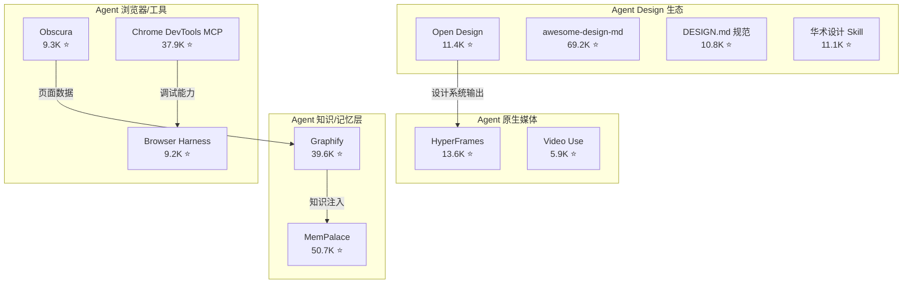
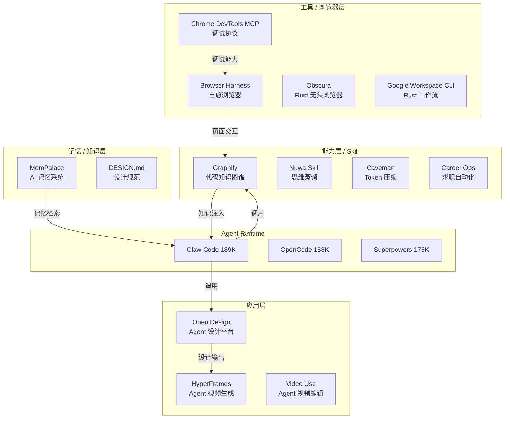

# 2026-05-02 GitHub 趋势研究简报

## 今日趋势总览

---

## 趋势 1：Agent Design 赛道爆发，Open Design 4天翻倍至 11.4K

**判断：中期趋势，平台化加速**

Open Design（nexu-io/open-design）自 4月28日创建以来，从 8K 飙升至 11.4K，4天增速 43%。这不是单纯的 Star 增长——它的 Design System 数量从 71 扩展到 72，Skills 从 19 扩展到 31，已经从一个 Skill 演化为**设计平台**。

关键数据：
- 11.4K stars / 1,288 forks / 100 open issues / 活跃贡献者 37+
- BYOK 模式，支持 Claude Code / Codex / Cursor / Gemini / OpenCode / Hermes 等 10+ Agent
- 输出格式覆盖：Web / Desktop / Mobile / Slides / Images / Videos / HyperFrames
- Apache-2.0 开源

**架构师视角：** Agent Design 正在从"给 Agent 加设计能力"向"以 Agent 为核心的设计工作流"演变。Open Design 的定位是**设计系统的 Agent 化中间层**——它不替代 Figma，而是让 Agent 理解设计系统并直接输出产品级 UI。这是 Vibe Coding 向 Vibe Design 的关键跃迁。

**与同赛道的对比：**
- awesome-design-md (69.2K)：静态资源集合，无运行时能力
- DESIGN.md 规范 (10.8K)：格式定义，无工具链
- 华术设计 (11.1K)：中文社区 Skill，更偏 HTML 原生

Open Design 是目前唯一同时具备**运行时 + 多Agent支持 + 输出格式覆盖**的候选平台。

---

## 趋势 2：Graphify 逼近 40K，跨 Agent 知识图谱 Skill 生态新基座

**判断：中期趋势，基础设施候选**

Graphify (safishamsi/graphify) 从 4月26日的 37.3K 增长到今天的 39.6K，日均增速约 460 stars，持续加速。更关键的是它从 v0.5 升级到 v0.6.2，修复了 6+ 类问题（Windows 路径、跨语言噪声、有向图、否定模式等），说明工程成熟度在快速提升。

关键数据：
- 39.6K stars / 4,372 forks / 220 open issues
- 支持 Claude Code / Codex / OpenCode / Cursor / Gemini CLI / OpenClaw 等 10+ 平台
- 基于 Tree-sitter 的代码解析 + Leiden 算法的社区检测
- v0.6.2 新增：Kim Thinking 支持、内联注释、查询加速、缓存竞态修复

**架构师视角：** Graphify 的核心价值不是"知识图谱"本身，而是**让 Coding Agent 获得全局代码理解能力**。当一个 Agent 在修改代码时，它不仅看到当前文件，而是通过 Graphify 获得整个代码库的模块依赖、调用链、数据流图。这是 Agent 从"文件级编辑"向"仓库级理解"的关键基础设施。

---

## 趋势 3：HeyGen HyperFrames — Agent 原生视频生成范式

**判断：短期热点，但范式值得关注**

HyperFrames (heygen-com/hyperframes) 提出了一个有趣的范式：**用 HTML 描述视频帧，Agent 生成 HTML，渲染引擎输出视频**。13.6K stars，TypeScript 实现。

关键数据：
- 13.6K stars / 创建于 2026年4月
- 核心理念：Write HTML → Render Video
- 面向 Agent 的视频生成 API
- TypeScript / Apache-2.0

**架构师视角：** 这代表一个新趋势——**Agent 原生媒体生成**。传统视频生成是模型直接输出像素（Sora/Runway），而 HyperFrames 是 Agent 写结构化描述（HTML），然后由渲染引擎转换为视频。这条路径的优势是：Agent 可以精确控制每一帧，与现有 Web 技术栈无缝衔接，且输出可解释、可编辑。

风险点：HeyGen 是商业公司，HyperFrames 更像是其 API 的开源前端入口，真正的视频渲染能力仍依赖 HeyGen 后端。独立性不足。

---

## 趋势 4：QuipNetwork 量子虚拟机 — 高 Star 低 Fork 的可疑信号

**判断：疑似刷星，建议观望**

QuipNetwork 在4月2日同日创建三个项目：
- quip-protocol-rs: 5,803 stars / 30 forks
- xq-rs: 5,734 stars / 17 forks
- xq-py: 5,675 stars / 13 forks

**异常信号：**
1. Star/Fork 比例极度不正常（200:1 到 400:1），正常热门项目通常在 10:1 到 30:1
2. 三个项目几乎同一时间创建，star 数高度相似（5.6K-5.8K）
3. 创建后仅推送过一次代码（4月2日），之后无任何更新
4. 无 README 描述、无 issue 讨论、无贡献者社区
5. 描述中提到"量子虚拟机"和"Substrate fork"，但无任何技术验证

**结论：** 高度疑似刷星项目。从区块链/加密领域常见的 pattern 来看，这是典型的"制造热度"行为。**不建议跟踪，不生成项目档案。**

---

## 持续跟踪项目动态

### MemPalace (50.7K ⬆️)
- 从 50.2K 微涨至 50.7K，增速放缓但已稳守 50K+
- 最新提交修复了 MCP Server 的 collection reopen crash（#1289）
- 核心贡献者 igorls 261 commits，工程成熟度持续提升
- **判断：** AI Memory 赛道的标准候选者，继续深度跟踪

### Browser Harness (9.2K ⬆️)
- 从 8.4K 增至 9.2K，稳步增长
- 新增 VOUCHED.td 贡献者信任机制，有意思的治理实验
- 199 commits，核心团队 MagMueller (76) + sauravpanda (56)
- **判断：** Browser Agent 赛道的 Harness 标准候选，继续深度跟踪

### Chrome DevTools MCP (37.9K ⬆️)
- 从 35K 增至 37.9K，日均约 300 stars
- Agent 浏览器调试能力的标准接口
- **判断：** MCP 生态的重要基础设施，继续跟踪

### Claw Code (189.5K)
- 仍居 GitHub Star 榜首，189.5K stars
- 但最近一次 push 是 4月30日，活跃度有所下降
- **判断：** 现象级项目，关注其生态演化

---

## 风险与机遇

### 机遇
1. **Agent Design 平台化** — Open Design 正在定义一个新赛道，将设计系统的消费方从人类设计师扩展到 AI Agent，这是 Vibe Coding 的自然延伸
2. **知识图谱作为 Agent 基础设施** — Graphify 证明了"Agent 原生知识图谱"有真实需求，未来可能成为 Coding Agent 的标准配置
3. **Agent 原生媒体** — HyperFrames 虽然有商业化风险，但 HTML→Video 的范式值得 PoC

### 风险
1. **QuipNetwork 类刷星项目增多** — 加密/量子概念的 repo 通过刷星制造虚假热度，需要更强的甄别能力
2. **Agent Skill 生态碎片化** — 每天涌现大量新 Skill（caveman 52K、career-ops 41K），但质量参差不齐
3. **MemPalace 增速放缓** — 从暴涨期进入平台期，需要关注是否有新的增长驱动力

---

## 重点项目评分

### Open Design
| 维度 | 分数 | 理由 |
|------|------|------|
| 热度质量 | 9 | 4天翻倍，fork/star 比健康，贡献者多样 |
| 技术创新度 | 8 | BYOK + 多Agent + 多输出格式，设计系统 Agent 化 |
| 工程成熟度 | 7 | 100 open issues 但修复活跃，v1 前期 |
| 架构启发价值 | 9 | Agent 作为设计系统消费方的架构模型 |
| 企业落地潜力 | 7 | 需要 Agent 基础设施就绪 |
| 中期趋势概率 | 8 | Vibe Design 是 Vibe Coding 的自然延伸 |
| 平台化潜力 | 9 | 设计系统 + Agent + 多输出，天然平台 |
| 基础设施潜力 | 7 | 更偏平台层，不是底层基础设施 |
| **总分** | **64/80** | **平台候选，建议持续跟踪** |

### Graphify
| 维度 | 分数 | 理由 |
|------|------|------|
| 热度质量 | 9 | 逼近40K，日增460，fork比健康 |
| 技术创新度 | 8 | Tree-sitter + Leiden + 跨Agent |
| 工程成熟度 | 8 | v0.6.2，修复活跃，质量可控 |
| 架构启发价值 | 9 | 代码即图谱，Agent 全局理解 |
| 企业落地潜力 | 8 | 直接提升 Coding Agent 效果 |
| 中期趋势概率 | 8 | Agent 知识层是刚需 |
| 平台化潜力 | 7 | Skill 形态，平台化需要更多 |
| 基础设施潜力 | 9 | Agent 理解代码库的标准路径 |
| **总分** | **66/80** | **基础设施候选，强烈建议持续跟踪** |

### HyperFrames
| 维度 | 分数 | 理由 |
|------|------|------|
| 热度质量 | 8 | 13.6K，HeyGen 品牌加持 |
| 技术创新度 | 8 | HTML→Video 范式创新 |
| 工程成熟度 | 6 | 早期项目，依赖 HeyGen 后端 |
| 架构启发价值 | 8 | Agent 原生媒体生成架构 |
| 企业落地潜力 | 6 | 商业依赖风险 |
| 中期趋势概率 | 7 | Agent 媒体生成是真实趋势 |
| 平台化潜力 | 6 | 受限于 HeyGen 生态 |
| 基础设施潜力 | 5 | 非底层，更偏应用层 |
| **总分** | **54/80** | **工具型，建议观察** |

---

## Mermaid：Agent 生态分层图（2026-05-02）

---

*研究日期：2026-05-02 | 数据来源：GitHub Search API via gh CLI | 项目数：10 | 趋势方向：4*
