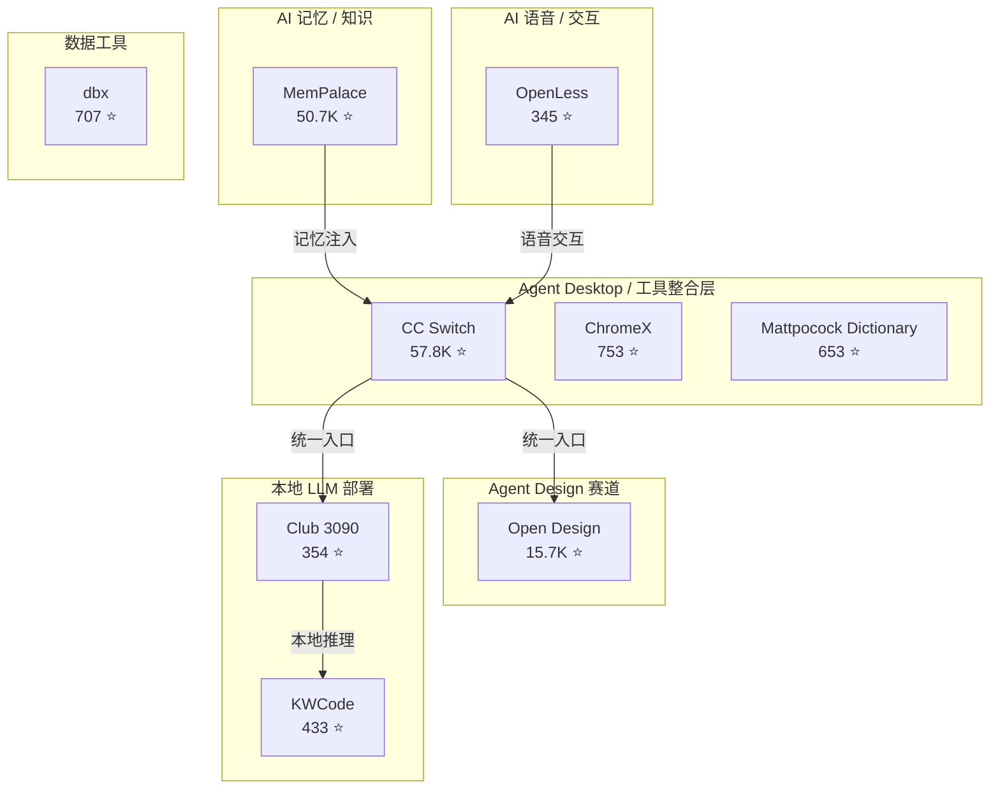

# 2026-05-03 GitHub 趋势研究简报

## 今日趋势总览

---

## 趋势 1：Agent Desktop 基座稳固：CC Switch 57K+，多 Agent 统一管理成刚需

**判断：中期趋势，平台化加速**

CC Switch（farion1231/cc-switch）本周稳定在 57.8K stars，是 Agent 工具链整合的关键节点。它把 Claude Code、Codex、OpenCode、OpenClaw、Gemini CLI 等多个 Coding Agent 统一到同一个桌面应用中管理，支持 Provider 切换、MCP 管理、Skills 管理。

**关键数据：**
- 57,825 ⭐，3,752 forks，116 subscribers
- 日均 commit 活跃（最近 5 个 commit 均在 2 天内）
- Tauri + Rust 技术栈，跨平台支持
- Open Issues 703，社区活跃度高

**架构师视角：** CC Switch 的价值不在单一功能，而在于它正在成为 Agent 的"控制面板"。当开发者同时使用 Claude Code、Codex、OpenCode 等多个 Agent 时，统一管理 Provider、API Key、MCP Server、Skills 是真实的工程痛点。CC Switch 正在把这个痛点变成平台机会。

**风险：** CC Switch 本身不提供 Agent 能力，只是管理入口。如果 Agent 生态收敛到 1-2 个主导者，CC Switch 的价值会下降。目前 703 个 Open Issues 也暗示工程成熟度有待提升。

---

## 趋势 2：Open Design 持续爆发至 15.7K，Agent Design 赛道从概念到产品

**判断：中期趋势，平台化确认**

Open Design（nexu-io/open-design）5 天内从 4.1K 增长到 15.7K（+283%），GitHub 上最热的 Agent 原生设计工具。71 套设计系统 + 19 Skills + 支持 10+ Agent CLI（Claude Code、Codex、Cursor、Gemini、OpenCode、Qwen、Copilot、Hermes、Kimi CLI）。

**关键数据：**
- 15,738 ⭐，1,768 forks，57 subscribers
- 最近 commit 非常活跃：Skills 扩展、PPTX 导出增强、日语文档、Pet Companion 集成
- Apache-2.0 许可证

**热度分析：** Star 增速仍然保持在日增 1K+ 的水平，但 fork 数（1,768）与 star 的比例正常（约 11%），说明这不是刷星。commit 活跃度极高，多个贡献者在并行开发。Topics 覆盖了从 agent-skills 到 vibe-coding 的完整链路。

**架构师视角：** Open Design 代表的是"Agent 原生创作工具"这个品类。它不是 Figma 的替代品，而是 Agent 时代的 Canva — 用 Agent Skill 来驱动设计、原型、视频、PPT 的全链路生成。对架构师的启发是：**当 Agent 成为用户界面时，创作的定义会从"操作工具"变成"描述意图"。**

---

## 趋势 3：消费级 GPU LLM 部署：3090 Club 社区方案快速迭代

**判断：短期热点，但代表真实需求**

Club 3090（noonghunna/club-3090）是一个社区驱动的 LLM 部署方案，专门面向 RTX 3090 显卡用户。支持 vLLM、llama.cpp、SGLang 多引擎，当前主打 Qwen3.6-27B 的 1× 和 2× 卡配置。

**关键数据：**
- 354 ⭐，19 forks，12 subscribers
- 日均多 commit，非常活跃
- 从 v7.65 到 v7.69 快速迭代
- Apache-2.0 许可证

**架构师视角：** 这个项目 Star 不高，但信息密度极高。它代表了一个趋势：**当模型小到可以在消费级 GPU 上运行时，部署知识的门槛会从"需要 ML 工程师"降到"需要一份 recipe"。** Club 3090 本质上是一份精心调优的 recipe 集合。对企业内部的 AI 基础设施团队，这种"recipe as code"的模式值得参考。

**风险：** 项目极度依赖特定硬件（RTX 3090），受众有限。社区的长期维护能力存疑。

---

## 趋势 4：AI 语音输入新赛道：OpenLess 挑战 Wispr Flow

**判断：值得观察的早期信号**

OpenLess（appergb/openless）是一个开源语音输入工具：按住快捷键说话，松开即得到 AI 润色后的文字，可插入任何应用。macOS 和 Windows 双平台支持。

**关键数据：**
- 345 ⭐，30 forks
- Rust + Tauri + Swift 技术栈
- MIT 许可证
- 最近在修复 LLM model 配置和 PR-Agent 流程

**架构师视角：** 语音输入是 AI 与操作系统交互的"最后一公里"。Wispr Flow 已经证明了这个品类的商业可行性。OpenLess 的技术栈选择（Rust + Tauri）保证了轻量和跨平台。但关键问题是：**语音输入的核心竞争力不在 ASR（可以用 Whisper），而在 prompt engineering 和上下文理解。** OpenLess 目前看起来更偏 ASR + LLM 的简单串联，护城河不深。

---

## 重点项目深度分析

### Top 1：CC Switch — Agent Desktop 基座

**评分：**

| 维度 | 分数 | 理由 |
|------|------|------|
| 热度质量 | 9 | 57K+ stars，3.7K forks，比例健康 |
| 技术创新度 | 6 | 技术栈扎实但无突破，创新在于产品定位 |
| 工程成熟度 | 6 | 703 Open Issues，活跃但不稳定 |
| 架构启发价值 | 8 | 多 Agent 统一管理是真实架构问题 |
| 企业落地潜力 | 7 | 可用于内部 Agent 工具链管理 |
| 中期趋势概率 | 8 | Agent 生态碎片化短期不会收敛 |
| 平台化潜力 | 8 | 已具备 MCP + Skills 管理的基座能力 |
| 基础设施潜力 | 6 | 更偏工具/平台层，非基础设施 |

**总分：58/80**
**归类：平台候选**
**建议：持续跟踪**

---

### Top 2：Open Design — Agent 原生设计工具

**评分：**

| 维度 | 分数 | 理由 |
|------|------|------|
| 热度质量 | 9 | 15.7K stars（5天），增速惊人 |
| 技术创新度 | 7 | Skill 驱动设计是新模式，非技术突破 |
| 工程成熟度 | 7 | 多人协作，commit 活跃 |
| 架构启发价值 | 8 | Agent 原生创作工具的范式参考 |
| 企业落地潜力 | 6 | BYOK 模式适合内部部署 |
| 中期趋势概率 | 8 | Vibe Design 需求真实且在增长 |
| 平台化潜力 | 9 | 71 DS + 19 Skills + 10 Agent CLI 支持 |
| 基础设施潜力 | 5 | 更偏应用层 |

**总分：59/80**
**归类：平台候选**
**建议：持续跟踪**

---

### Top 3：Club 3090 — 消费级 GPU LLM 部署

**评分：**

| 维度 | 分数 | 理由 |
|------|------|------|
| 热度质量 | 5 | 354 stars，绝对值不高 |
| 技术创新度 | 5 | 不算创新，但 engineering value 高 |
| 工程成熟度 | 6 | 快速迭代中 |
| 架构启发价值 | 8 | Recipe-as-code 模式值得参考 |
| 企业落地潜力 | 4 | 过于面向消费级硬件 |
| 中期趋势概率 | 7 | 本地 LLM 部署是确定性趋势 |
| 平台化潜力 | 4 | Recipe 集合，非平台 |
| 基础设施潜力 | 5 | 更偏知识库 |

**总分：44/80**
**归类：工具型**
**建议：有限跟踪**

---

## 风险与机遇

### 风险
1. **CVE-2026-31431 余波**：theori-io/copy-fail-CVE-2026-31431 已达 2,876 stars，rootsecdev/cve_2026_31431 另有 424 stars。Linux 内核安全漏洞的 PoC 公开意味着攻击面暴露，企业需确认补丁状态。
2. **刷星甄别**：bonused/monthly-bonus-stake（416 stars）是明显的赌博推广 spam，github.com/trending 的数据需持续过滤。
3. **Agent 工具碎片化**：本周新出现 chromex（Codex Chrome side-panel）、codex-plusplus（Codex tweak）、kwcode（本地模型 coding 窗口）等项目，Agent 工具链正在快速碎片化，短期对开发者造成选择困难。

### 机遇
1. **Agent Desktop 基座**：CC Switch 的 57K+ stars 证明多 Agent 统一管理是刚需，这个品类的平台化机会确定。
2. **Agent Design 赛道**：Open Design 5 天翻 4 倍，Skill 驱动的设计工具正在成为新范式。对企业的启发是：内部设计系统可以用 Agent Skill 的方式标准化。
3. **本地 LLM 部署 recipe 化**：Club 3090 代表的趋势是"部署知识 → 可执行 recipe"，企业可以建立类似的内部 recipe 库。

---

## 重点项目档案

今日重点关注以下项目档案更新：
- **CC Switch**：更新 stars 至 57.8K，记录 Provider 管理和 MCP 集成进展
- **Open Design**：更新 stars 至 15.7K，记录 Skills 和 Design Systems 扩展
- **Club 3090**：新建档案，记录社区 LLM 部署方案
- **OpenLess**：新建档案，记录 AI 语音输入工具
- **dbx**：更新 stars 至 707，记录 SQL 补全增强
- **MemPalace**：更新 MCP Server 集成修复记录
