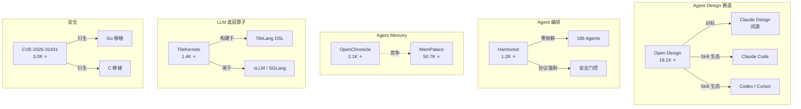

# 2026-05-04 GitHub 趋势研究简报

## 今日概览

周日 GitHub 活跃度相对平稳，但几个关键方向持续发酵。Open Design 以 19.1K stars 领跑本周新项目增速榜，Agent Design 赛道已从蓝海变成红海。安全领域 CVE-2026-31431 的 PoC 在 3 天内冲到 3K stars，影响了所有主流企业 Linux 发行版。DeepSeek 开源 TileKernels 让 LLM 底层算子优化进入开源视野。

---

## 趋势一：Open Design 突破 19K — Agent Design 赛道红海化

**数据：** 19,127 stars（+3,427 /24h），2,114 forks，Apache-2.0

Open Design 在 6 天内从 4K 冲到 19K，增速略有放缓但绝对增量仍然惊人。关键信号：

- **forks 达到 2,114** — 不仅是围观，有大量二次开发
- **open issues 110** — 活跃的用户反馈和 feature request
- **19 Skills + 71 Design Systems** — 产品矩阵快速扩展
- **BYOK 全层** — 支持 Claude Code / Codex / Cursor / Gemini / OpenCode / Qwen / Copilot / Hermes / Kimi CLI

**架构师判断：**
Open Design 已经不是"工具"了，它正在变成 Agent Design 赛道的平台层。71 个 Design Systems 本身就是护城河 — 不是模型能力的护城河，而是设计资产和生态的护城河。但这种增速不可持续，预计 25K 附近会遇到第一个瓶颈。需要观察它能否从"开源 Claude Design 替代"进化为"Agent 原生设计平台"。

**风险点：**
- 过度依赖 Claude Design 的对标定位，缺乏独立的产品叙事
- 19 个 Skills 的质量参差不齐，部分可能是概念验证
- BYOK 模式下用户实际使用成本不低

---

## 趋势二：CVE-2026-31431 — Linux 内核级提权漏洞席卷安全社区

**数据：** 3,012 stars，628 forks（3天）

Theori（xint.io）披露的 Linux 内核 `algif_aead` 漏洞持续发酵。这是一个 9 年历史的 bug（2017 年引入），允许非特权用户通过 page-cache 损坏获取 root 权限。

**影响范围：**
- Ubuntu 24.04 LTS（6.17.0-1007-aws）
- Amazon Linux 2023（6.18.8）
- RHEL 10.1（6.12.0）
- SUSE 16（6.12.0）

**衍生项目爆发：**
- `rootsecdev/cve_2026_31431`（451 stars）— Python exploit POC
- `badsectorlabs/copyfail-go`（304 stars）— Go 语言实现
- `tgies/copy-fail-c`（260 stars）— C 语言跨平台移植

**架构师判断：**
这是 P0 级别的安全事件。3 天内出现 Python/Go/C 三种语言实现 + 多个衍生工具，说明安全社区反应强烈。对企业而言，关键是：所有运行未打补丁内核的云服务器和容器宿主机都在风险范围内。这个漏洞之所以重要，是因为它打破了"内核加密 = 安全"的假设 — AEAD 实现本身的 bug 导致了安全机制的失效。

---

## 趋势三：DeepSeek TileKernels — LLM 底层算子库开源

**数据：** 1,418 stars，117 forks，MIT 许可

DeepSeek 开源了用 TileLang 构建的 GPU 算子库，覆盖 LLM 训练和推理中最关键的底层操作：

- **Gating** — Top-k 专家选择和评分（MoE 路由核心）
- **MoE Routing** — Token-to-expert 映射，融合扩展/约减
- **Quantization** — FP8/FP4/E5M6 量化，融合 SwiGLU+量化
- **Engram** — Engram 门控内核，融合 RMSNorm，前向/后向传播
- **Manifold HyperConnection** — Sinkhorn 归一化和混合拆分/应用

**架构师判断：**
TileKernels 的价值不在于"又一个 GPU 算子库"，而在于它暴露了 DeepSeek 在 MoE 架构上的底层优化方向。特别是 Engram 和 Manifold HyperConnection 这两个模块，暗示了 DeepSeek 模型架构的新探索。对基础设施团队而言，这些算子可以直接用于 vLLM/SGLang 等推理框架的性能优化。

**关键信息：** 要求 SM90（H100）或 SM100（B200）架构，CUDA 13.1+，门槛较高。

---

## 趋势四：DPI 绕过方案集中爆发

**数据：**
- `denuitt1/mhr-cfw` — 1,943 stars（7天），Python，通过 GAS + Cloudflare Workers 域前置
- `therealaleph/MasterHttpRelayVPN-RUST` — 1,566 stars，Rust 移植版

**mhr-cfw 技术路线：**
1. 客户端流量 → Google Apps Script（GAS）中继
2. GAS 转发 → Cloudflare Workers
3. 利用 TLS SNI 隐藏实现 DPI 绕过

**架构师判断：**
这类项目的技术实现并不复杂（本质上就是域前置），但 star 增速反映了当前网络环境的现实需求。对企业架构师而言，更重要的是理解这种流量的特征和检测方法 — 如果企业网络需要做流量审计，这类域前置方案是必须了解的。

**风险：**
- 域前置依赖 CDN/GAS 的容忍度，随时可能被封堵
- 项目代码质量一般，49 个 open issues
- 不适合作为生产级方案

---

## 其他值得关注的项目

### OpenChronicle（2.1K stars）
开源本地优先的 Agent 记忆系统，定位为 OpenAI Chronicle 的开源替代。模型无关、可检查、可扩展。Agent Memory 赛道又多了一个选手，与 MemPalace（50.7K）形成互补 — MemPalace 偏 MCP 集成，OpenChronicle 偏本地优先。

### text-to-cad（1.4K stars）
开源 Text-to-CAD 引擎，用自然语言生成 CAD 模型。MIT 许可，支持 WebAssembly。这是"AI + 专业工具"赛道的又一个实例 — 不是替代 CAD 工程师，而是降低 CAD 使用的门槛。

### World2Agent（1.2K stars）
标准化 AI Agent 感知真实世界的开放协议。方向有意思但早期，Apache-2.0，仅 26 forks。

---

## 趋势关系图

---

## 风险与机遇

### 泡沫信号
- **Open Design 增速放缓迹象** — 从日增 4K 降到日增 3.4K，虽然仍是高增长，但二次导数转负
- **DPI 绕过方案** — 技术门槛低，生命周期受制于平台政策，不适合长期投入

### 真实机遇
- **DeepSeek TileKernels** — LLM 底层算子优化是长期刚需，SM90/SM100 的要求说明这是面向下一代硬件的投资
- **OpenChronicle** — Agent Memory 赛道持续分化，本地优先 + 模型无关是差异化路线
- **Harmonist** — 零依赖 Agent 编排在生产环境有真实价值，186 个预置 Agent 提供了开箱即用的起点

---

## 重点项目评分

| 项目 | 热度质量 | 技术创新 | 工程成熟 | 架构启发 | 企业落地 | 中期趋势 | 平台化 | 基础设施 | 总分 | 归类 |
|------|---------|---------|---------|---------|---------|---------|--------|---------|------|------|
| Open Design | 9 | 7 | 7 | 8 | 6 | 8 | 8 | 5 | 58 | 平台候选 |
| CVE-2026-31431 | 9 | 9 | 7 | 7 | 10 | 4 | 2 | 3 | 51 | 安全研究 |
| TileKernels | 7 | 9 | 8 | 9 | 7 | 9 | 6 | 9 | 64 | 基础设施候选 |
| Harmonist | 6 | 8 | 7 | 8 | 7 | 7 | 7 | 6 | 56 | 平台候选 |
| mhr-cfw | 7 | 5 | 4 | 5 | 3 | 4 | 2 | 2 | 32 | 工具型 |
| OpenChronicle | 6 | 7 | 6 | 7 | 6 | 8 | 5 | 7 | 52 | 基础设施候选 |
| text-to-cad | 6 | 8 | 7 | 7 | 5 | 7 | 4 | 4 | 48 | 工具型 |

---

## 昨日回顾提醒

昨日（2026-05-03）最值得补看的内容：
- **CC Switch 57K+** — Agent 桌面基座稳定增长，从工具型升级为平台候选
- **Club 3090** — 消费级 GPU LLM 部署 recipe 集，对"如何在有限硬件上跑大模型"有参考价值

---

*Generated by GitHub Researcher · 2026-05-04*
