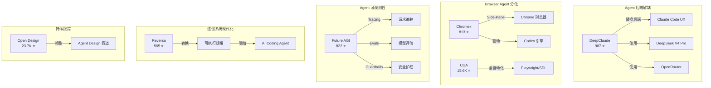

# 2026-05-05 GitHub 趋势研究简报

## 今日趋势概览

今日 GitHub 趋势呈现一个清晰信号：**Agent 生态正在从"前端 UX 竞争"转向"后端基础设施竞争"**。

DeepClaude 的出现（用 DeepSeek V4 Pro 替换 Claude Code 的 Anthropic 后端）标志着 Agent 社区开始认真思考成本和后端可替换性。这不是简单的"省钱"——这是 Agent 后端解耦的开端。如果 Agent 的交互体验标准化了（Claude Code CLI 风格已成为事实标准），那么后端模型的替换就变成了一个纯工程决策。

同时，Browser Agent 赛道也在分化：Chromex 不走 Playwright/Selenium 路线，而是直接嵌入 Chrome Side-Panel，用 Codex 引擎处理页面上下文。这代表了一种更轻量的 Browser Agent 范式——不需要启动独立浏览器实例。

---

## 趋势 1：Agent 后端解耦 — DeepClaude 开辟降本新路径（Score: 82）

### 核心发现

DeepClaude 的核心理念极其简单：**保持 Claude Code 的交互体验不变，把后端换成便宜的模型**。它支持 DeepSeek V4 Pro、OpenRouter 或任何 Anthropic 兼容后端。

**为什么重要：**
- Claude Code 的 UX 已成为 Agent CLI 的事实标准
- 后端模型的成本差异巨大（17x 是 DeepClaude 声称的数字）
- 这暗示了一个趋势：**Agent 前端和后端正在解耦**
- 类似于浏览器可以切换搜索引擎，Agent 前端可以切换后端模型

**风险判断：**
- 17x 降本的前提是 DeepSeek V4 Pro 的代码能力接近 Claude Opus，这在复杂任务上仍有差距
- 协议兼容性是脆弱的——Anthropic 后端变更可能导致 DeepClaude 失效
- 这更像是一个"降成本玩具"，不是企业级方案

**定位：工具型。** 架构启发价值高（后端解耦），但产品化程度低。

---

## 趋势 2：Browser Agent 轻量化 — Chromex 的 Side-Panel 路线（Score: 78）

### 核心发现

Chromex 是一个 Codex 驱动的 Chrome Side-Panel 助手。它不走传统 Browser Agent 的 Playwright 路线，而是：
- 直接嵌入 Chrome 浏览器的 Side-Panel
- 利用 Codex 引擎处理当前页面上下文
- 支持标签页管理、语音输入、图片工作流

**为什么值得注意：**
- Browser Agent 不一定需要"模拟浏览器操作"
- 对于知识工作者的日常场景，Side-Panel 范式比 Playwright 范式更自然
- 813 stars，6 天达到，fork 比例高（71 forks），说明有实际使用

**架构启发：**
- Browser Agent 存在两条路线：**重量级（全浏览器自动化）** vs **轻量级（浏览器嵌入助手）**
- Chromex 代表轻量路线，trycua/cua（15.6K stars）代表重量路线
- 轻量路线更适合个人效率场景，重量路线更适合自动化测试/RPA 场景

**定位：工具型。** 但 Browser Agent 赛道值得持续跟踪。

---

## 趋势 3：Agent 可观测性赛道升温 — Future AGI（Score: 80）

### 核心发现

Future AGI 是一个开源的 LLM/Agent 评估观测全栈平台，Apache 2.0 协议，功能覆盖：
- **Tracing**：请求链路追踪
- **Evals**：模型评估框架
- **Simulations**：Agent 模拟测试
- **Datasets**：数据集管理
- **Gateway**：LLM 网关
- **Guardrails**：安全护栏

**为什么重要：**
- Agent 系统的调试、观测、评估是企业落地的核心痛点
- 这个赛道目前没有明确的赢家（LangSmith 是闭源的、Phoenix 是 Arize 的）
- Apache 2.0 + 可自托管 = 企业友好
- 11 天 822 stars，有真实 issue 和 PR 活动

**与同类项目对比：**
- **LangSmith** — 闭源，LangChain 官方，生态绑定深
- **Phoenix (Arize)** — 开源，偏 ML Observability
- **Future AGI** — 开源，更偏 Agent 全生命周期，协议更友好

**定位：平台候选。** 评估观测赛道的企业落地潜力高。

---

## 趋势 4：遗留系统 Agent 化 — Reversa（Score: 76）

### 核心发现

Reversa 的目标是将遗留系统转换为 AI Coding Agent 可执行的规格文档。这个方向很有意思：
- 技术债务是企业 IT 的永恒痛点
- AI Coding Agent 需要清晰的规格才能有效工作
- Reversa 做的是"规格提取"，而不是直接"代码转换"

**真实价值判断：**
- 方向正确——但 565 stars 规模尚小
- 11 天，fork 比例高达 40%（226 forks / 565 stars），说明有人在尝试
- 核心挑战：遗留系统的歧义性极高，自动化规格提取的准确率存疑

**定位：工具型，偏实验。** 方向值得持续关注，但当前产品成熟度不足以企业落地。

---

## 持续跟踪项目更新

### Open Design（23.7K stars，+4.6K）
7 天从 4K 到 23.7K，Agent Design 赛道绝对领跑者。增速有所放缓（日增从 4K 降到 3K），但仍在高位。**判断不变：平台候选，赛道红海化。**

### Copy Fail CVE-2026-31431（3.1K stars）
安全事件热度趋稳，衍生 PoC 项目继续涌现。**短期热点，无需持续跟踪。**

### Harmonist（1.26K stars）
稳定，无重大更新。零依赖 Agent 编排的定位仍独特。**继续跟踪。**

### TileKernels（1.4K stars）
稳定。DeepSeek GPU 算子库，中长期基础设施价值。**持续跟踪。**

---

## 趋势关系图

---

## 风险与机遇

### 泡沫信号
- **DeepClaude 17x 降本** — 真实场景下能力差距是否可接受？需要实际验证
- **Open Slide** — Agent 生成 PPT 是刚需吗？还是伪需求？
- **Dictionary of AI Coding** — 内容质量决定生命力，github 做词典类项目持久性存疑

### 真实机遇
- **Agent 后端解耦** — DeepClaude 可能是个粗糙的实现，但方向是真实的。当 Agent UX 标准化后，后端就是成本和性能的纯工程决策
- **Agent 可观测性** — Future AGI 填补了一个真实空白。企业落地 Agent 系统时，评估、追踪、护栏是刚需
- **Browser Agent 轻量化** — Side-Panel 范式比 Playwright 范式更适合日常效率场景

---

## 重点项目评分

| 项目 | 热度质量 | 技术创新 | 工程成熟 | 架构启发 | 企业落地 | 中期趋势 | 平台化 | 基础设施 | 总分 | 归类 |
|------|---------|---------|---------|---------|---------|---------|--------|---------|------|------|
| DeepClaude | 7 | 7 | 5 | 9 | 4 | 8 | 5 | 4 | 49 | 工具型 |
| Chromex | 6 | 7 | 6 | 7 | 5 | 7 | 4 | 3 | 45 | 工具型 |
| Future AGI | 7 | 7 | 7 | 8 | 8 | 8 | 8 | 6 | 59 | 平台候选 |
| Reversa | 5 | 7 | 5 | 7 | 5 | 6 | 4 | 3 | 42 | 工具型 |
| Open Design | 9 | 7 | 7 | 8 | 6 | 8 | 8 | 5 | 58 | 平台候选 |
| Open Slide | 5 | 5 | 6 | 5 | 4 | 5 | 3 | 2 | 35 | 工具型 |
| Dictionary of AI Coding | 6 | 3 | 6 | 4 | 3 | 5 | 2 | 1 | 30 | 学习型 |

---

## 昨日回顾提醒

昨日（2026-05-04）最值得补看的内容：
- **TileKernels（1.4K stars）** — DeepSeek 开源 GPU 算子库，MoE/量化/Engram 全覆盖，LLM 底层基础设施方向
- **OpenChronicle（2.1K stars）** — OpenAI Chronicle 开源替代，本地优先 Agent Memory，与 MemPalace（50.7K stars）形成差异化竞争

---

*Generated by GitHub Researcher · 2026-05-05*
