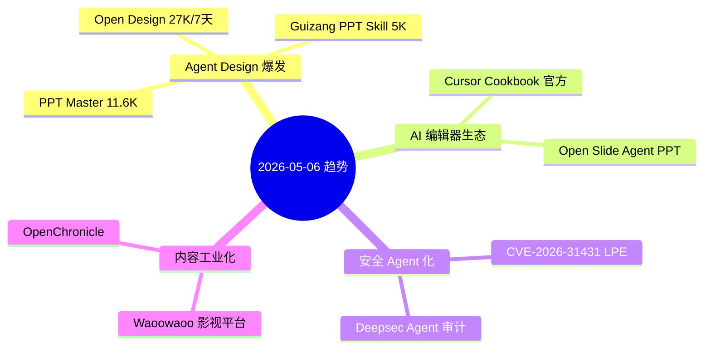

# 2026-05-06 GitHub 趋势研究简报

## 今日趋势概览

---

## 趋势 1：Agent Design 赛道爆发（评分 88）

**核心信号：** Open Design 7 天从 0 到 27.3K stars，fork 2987，Apache 2.0 许可证。这不仅仅是又一个设计工具——它标志着 **Agent 作为设计工具的核心引擎** 正在成为共识。

**三层分析：**

1. **表层热度**：Claude Design 开源替代 + 支持 10 种 Agent CLI（Claude Code / Codex / Cursor / Gemini / OpenCode / Qwen / Copilot / Hermes / Kimi CLI），覆盖面极广
2. **技术实质**：19 Skills + 71 brand-grade Design Systems + Sandboxed preview + 多格式导出（HTML/PDF/PPTX/MP4），工程完成度惊人——这不是 PoC，是接近生产可用的平台
3. **架构意义**：Agent-Design 作为一种模式，正在从"用 AI 画图"升级为"Agent 驱动的设计系统"——包含设计规范、组件库、输出管线的完整链路

**关联项目：**
- **Guizang PPT Skill**（5K stars）：聚焦 Claude Code Skill，将 Agent 设计能力封装为可复用 Skill
- **PPT Master**（11.6K stars）：从文档到原生 PPTX，证明 AI 内容生成已进入"输出格式工业化"阶段

**架构师判断：** Agent Design 不是短期热点。它正在形成独立的技术栈层：Agent Runtime → Design Skills → Design Systems → Output Pipeline。这个分层一旦稳定，将产生新的基础设施机会。

---

## 趋势 2：AI 编辑器生态成熟（评分 80）

**Cursor Cookbook**（3.5K stars）是 Cursor 官方首次系统化输出 AI 编辑器最佳实践。它的意义不在于内容本身，而在于：
- AI 编辑器的使用范式正在标准化
- "Cookbook" 模式成为 AI 工具的标准文档形态
- 标志着 AI 编辑器从"尝鲜工具"进入"工程化使用"阶段

**Open Slide**（1.3K stars）则为 Agent 构建了专用的演示框架——Agent 不再只是"生成 Markdown"，而是能输出结构化的演示内容。这是 Agent Output 格式多元化的一个缩影。

---

## 趋势 3：安全领域 Agent 化（评分 82）

**CVE-2026-31431**（3.3K stars）是一个 9 年之久的 Linux 内核本地提权漏洞，由 Theori 的 Xint Code 发现。单从 star 数看它不像传统安全研究项目，但它的热度说明：
- 社区对底层安全漏洞的关注度正在上升
- 漏洞发现工具（如 Xint Code）正在被重视

**Deepsec**（1K stars）是 Vercel 出品的 Coding Agent 驱动安全审计工具。用 Agent 扫代码找漏洞——这是安全工具 Agent 化的明确信号。

**架构师关注点：** 安全审计 Agent 化意味着 DevSecOps 流程可能被重塑。当前 Deepsec 还在早期，但方向正确。

---

## 趋势 4：AI 内容生产工业化（评分 76）

**Waoowaoo**（12K stars）定位"工业级 AI 影视生产平台"，从短片到真人长片，好莱坞标准工作流。这是 AI 视频赛道的又一重磅玩家。

**判断：** AI 视频生产正在从"单点工具"向"全流程平台"演进。但当前阶段，大部分项目仍处于 PoC 到早期产品的过渡期，真正能产出商业级内容还需要时间。

---

## 重点项目深度分析

### Top 1：Open Design — Agent Design 的标杆

| 维度 | 评分 | 理由 |
|------|------|------|
| 热度质量 | 9 | 7天27K，fork 2987，增速惊人 |
| 技术创新度 | 8 | Agent + Design System + Multi-format pipeline |
| 工程成熟度 | 8 | 19 Skills + 71 Design Systems，完成度高 |
| 架构启发价值 | 9 | 定义了 Agent-Design 技术栈的分层 |
| 企业落地潜力 | 7 | BYOK 模式适合企业，但设计系统本地化是挑战 |
| 中期趋势概率 | 9 | Agent Design 已成独立赛道 |
| 平台化潜力 | 8 | Design System + Skill 生态可扩展 |
| 基础设施潜力 | 7 | 有潜力成为设计基础设施，但竞争激烈 |

**总分：65/80**
**归类：平台候选**
**持续跟踪：是**

### Top 2：PPT Master — AI PPT 生成的工业化标杆

| 维度 | 评分 | 理由 |
|------|------|------|
| 热度质量 | 8 | 11.6K stars，半年稳定增长 |
| 技术创新度 | 7 | 原生 PPTX 输出（非图片），有差异化 |
| 工程成熟度 | 8 | 支持原生动画和形状，可用性高 |
| 架构启发价值 | 7 | 文档解析 → 结构化 → PPTX 渲染的管线设计 |
| 企业落地潜力 | 8 | 直接解决企业 PPT 制作痛点 |
| 中期趋势概率 | 7 | AI 生成内容（AIGC）是确定趋势 |
| 平台化潜力 | 6 | 更偏工具，但可扩展为内容生成平台 |
| 基础设施潜力 | 4 | 不太可能成为基础设施 |

**总分：55/80**
**归类：生产可用**
**持续跟踪：是**

### Top 3：CVE-2026-31431 — 安全研究里程碑

| 维度 | 评分 | 理由 |
|------|------|------|
| 热度质量 | 8 | 3.3K stars，安全社区广泛讨论 |
| 技术创新度 | 9 | 9年未发现的内核 LPE，Xint Code 工具创新 |
| 工程成熟度 | 6 | 安全 PoC，非产品 |
| 架构启发价值 | 7 | 揭示了内核安全审计的盲区 |
| 企业落地潜力 | 5 | 直接影响：需要立即修补 |
| 中期趋势概率 | 7 | 安全审计自动化是中期趋势 |
| 平台化潜力 | 3 | 单一 CVE，无平台潜力 |
| 基础设施潜力 | 2 | 无 |

**总分：47/80**
**归类：安全研究**
**持续跟踪：关注 Xint Code 工具演进**

---

## 风险与机遇

### 风险
1. **Agent Design 泡沫风险**：Open Design 增速过快（7天27K），可能包含跟风 star。需观察 30 天留存率
2. **PPT 工具同质化**：Guizang PPT Skill + PPT Master + Open Slide 同时爆发，赛道拥挤
3. **Waoowaoo 商业模式不明**：12K stars 但许可证为 "Other"，需关注商业化路径

### 机遇
1. **Agent Design 技术栈正在成型**：这是继 Agent Runtime、Agent Memory 之后的第三个独立 Agent 子领域
2. **AI 编辑器生态标准化**：Cursor Cookbook 标志着 AI 编辑器进入"最佳实践"阶段
3. **安全 Agent 化**：Deepsec + CVE-2026-31431 表明安全审计 Agent 有真实需求

---

## 项目档案

- **Open Design** → [projects/open-design.html](projects/open-design.html)
- **Guizang PPT Skill** → [projects/guizang-ppt-skill.html](projects/guizang-ppt-skill.html)
- **Cursor Cookbook** → [projects/cursor-cookbook.html](projects/cursor-cookbook.html)
- **CVE-2026-31431** → [projects/copy-fail-cve-2026-31431.html](projects/copy-fail-cve-2026-31431.html)
- **PPT Master** → [projects/ppt-master.html](projects/ppt-master.html)
- **Deepsec** → [projects/deepsec.html](projects/deepsec.html)
- **Waoowaoo** → [projects/waoowaoo.html](projects/waoowaoo.html)
- **OpenChronicle** → [projects/open-chronicle.html](projects/open-chronicle.html)
