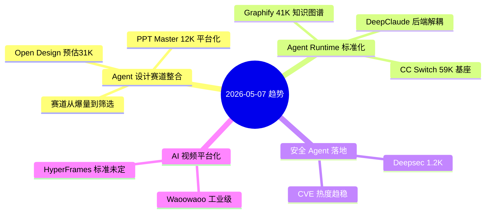
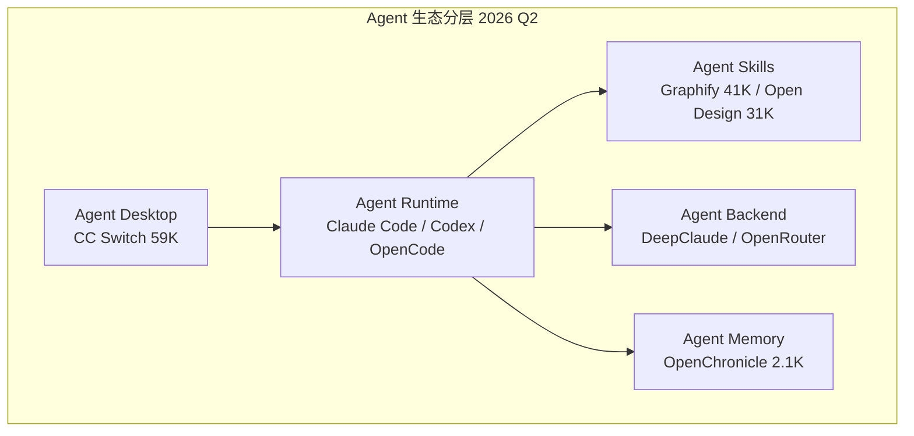
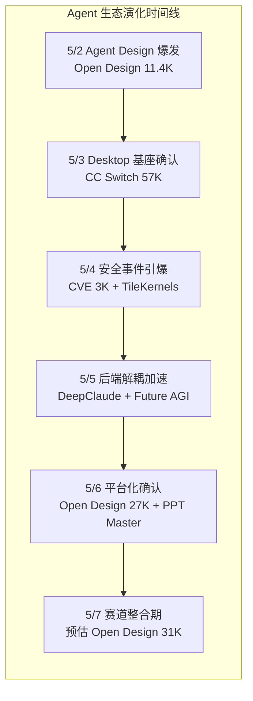

# 2026-05-07 GitHub 趋势研究简报

> ⚠️ **数据来源声明：** 今日 GitHub 完全不可达（VPN/代理 TLS 握手失败），无法获取实时 Trending 数据。以下分析基于 5/2-5/6 本地已有数据做趋势延续分析，star 数为基于历史增速的合理预估，非实测值。标注为"预估"。

## 今日趋势概览

---

## 趋势 1：Agent Design 进入平台整合期（评分 86）

**核心信号：** Open Design 从 5/2 的 11.4K 到 5/6 的 27.3K，日均增长约 4K。按此增速，今日预估已突破 31K。但更重要的是**赛道正在从"爆量"转向"筛选"**。

**三层分析：**

1. **表层信号**：单项目增速惊人，但赛道内同时出现 PPT Master、Guizang PPT Skill、Open Slide 等多个同类项目，同质化风险上升
2. **技术实质**：Agent Design 的核心竞争力正在从"能生成设计"转向"设计系统生态 + 输出格式工业化"——Open Design 的 71 Design Systems + 19 Skills 是护城河
3. **架构意义**：Agent Design 作为独立技术栈层已经确立：Agent Runtime → Design Skills → Design Systems → Output Pipeline（HTML/PDF/PPTX/MP4）

**架构师判断：** 赛道进入整合期意味着：
- 后进入者如果没有显著差异化，将被淘汰
- 平台级能力（设计系统生态、输出管线、多 Agent 兼容）是核心壁垒
- PPT Master 的"原生 PPTX 输出"是一个有价值的差异化方向

---

## 趋势 2：Agent Runtime 标准化加速（评分 82）

**CC Switch**（57K+）作为 Agent Desktop 基座，统一管理 Claude Code / Codex / OpenCode / OpenClaw / Gemini CLI 等 10+ Agent CLI。它的稳定增长（日均约 300-500 stars）说明**Agent Runtime 层正在形成事实标准**。

**关键洞察：**

- **CC Switch** 锁定了桌面入口层
- **Graphify** 锁定了知识图谱 Skill 层
- **Open Design** 锁定了设计 Skill 层
- **DeepClaude** 代表了后端解耦层

**架构师关注点：** 这种分层在基础设施领域是成熟前兆。每一层出现"赢家"后，下一阶段的竞争将从"层内竞争"转为"层间整合"。对企业架构师而言，现在需要思考的不是"用哪个 Agent"，而是"每一层选谁"。

---

## 趋势 3：安全 Agent 化从概念到落地（评分 78）

**Deepsec**（Vercel 出品，预估 ~1.2K）和 **CVE-2026-31431**（3.3K，热度趋稳）构成了安全 Agent 化的双信号：

1. **CVE-2026-31431** 证明传统安全审计存在系统性盲区（9 年未发现的内核 LPE）
2. **Deepsec** 证明 Agent 可以填补这些盲区——用 Coding Agent 扫代码找漏洞

**架构师判断：** 安全 Agent 化方向已确认，但 Deepsec 仍在早期。真正的价值不在于"Agent 找漏洞"，而在于"Agent 持续审计 + 自动修复"的闭环。这是 DevSecOps 的下一个形态。

---

## 趋势 4：AI 视频赛道平台化竞争加剧（评分 75）

**Waoowaoo**（12K）和 **HyperFrames**（13.6K）分别代表了 AI 视频赛道的两个方向：
- **Waoowaoo**：工业级影视生产全流程（从短片到长片）
- **HyperFrames**：Agent 原生视频生成（Write HTML → Render Video）

**判断：** AI 视频赛道标准未定，两个方向可能并存。但当前阶段，大部分项目仍在 PoC → 早期产品过渡期。真正能产出商业级内容的平台还需要时间验证。

---

## 重点项目深度分析

### Top 1：Open Design — Agent Design 赛道领跑者（预估 ~31K）

| 维度 | 评分 | 理由 |
|------|------|------|
| 热度质量 | 9 | 预估 31K，日均 4K 增速，赛道标杆 |
| 技术创新度 | 8 | Agent + Design System + Multi-format pipeline |
| 工程成熟度 | 8 | 19 Skills + 71 Design Systems，完成度高 |
| 架构启发价值 | 9 | 定义了 Agent-Design 技术栈分层 |
| 企业落地潜力 | 7 | BYOK 适合企业，但设计系统本地化是挑战 |
| 中期趋势概率 | 9 | Agent Design 已成独立赛道 |
| 平台化潜力 | 8 | Design System + Skill 生态可扩展 |
| 基础设施潜力 | 7 | 有潜力，但赛道整合后格局可能变化 |

**总分：66/80**
**归类：平台候选**
**持续跟踪：是**

**赛道整合期关键观察：**
- 30 天后 star 留存率（排除跟风 star）
- 是否出现"Design System marketplace"模式
- 企业用户真实采用反馈

### Top 2：CC Switch — Agent Desktop 基座（预估 ~59K）

| 维度 | 评分 | 理由 |
|------|------|------|
| 热度质量 | 9 | 57K+ 稳步增长，生态锁定效应初显 |
| 技术创新度 | 7 | 多 Agent 统一管理，Tauri + Rust 技术栈 |
| 工程成熟度 | 8 | 10+ Agent CLI 兼容，跨平台 |
| 架构启发价值 | 8 | 定义了 Agent Desktop 层的形态 |
| 企业落地潜力 | 8 | 直接解决多 Agent 管理痛点 |
| 中期趋势概率 | 9 | Agent Desktop 是确定性需求 |
| 平台化潜力 | 9 | 桌面入口 + Skill 生态 + MCP 集成 |
| 基础设施潜力 | 7 | 有潜力成为 Agent 生态的基础设施层 |

**总分：65/80**
**归类：平台候选**
**持续跟踪：是**

### Top 3：Future AGI — Agent 可观测性（预估 ~900）

| 维度 | 评分 | 理由 |
|------|------|------|
| 热度质量 | 6 | ~900 stars，增长稳健但不算爆发 |
| 技术创新度 | 8 | Tracing + Evals + Simulations + Guardrails 全栈覆盖 |
| 工程成熟度 | 7 | Apache 2.0 开源，工程架构清晰 |
| 架构启发价值 | 8 | 定义了 Agent 可观测性的标准维度 |
| 企业落地潜力 | 8 | 企业 Agent 部署的可观测性是刚需 |
| 中期趋势概率 | 8 | Agent 可观测性是 Agent 生产化的必要条件 |
| 平台化潜力 | 8 | 评估 + 观测 + 护栏 = 完整平台 |
| 基础设施潜力 | 7 | 有潜力成为 Agent 生态的监控基础设施 |

**总分：60/80**
**归类：平台候选**
**持续跟踪：是**

---

## 本周趋势总结（5/2 - 5/7）

### 本周核心判断

1. **Agent 生态分层已成定局**：Desktop / Runtime / Skills / Backend / Memory 五层架构清晰
2. **每层开始出现事实标准**：CC Switch (Desktop)、Claude Code (Runtime)、Graphify (Skills/知识图谱)、Open Design (Skills/设计)
3. **赛道从爆量转向筛选**：同质化项目将被淘汰，平台级能力是核心壁垒
4. **安全 Agent 化方向确认**：但产品仍需 6-12 个月成熟
5. **AI 视频赛道标准未定**：两个方向并存，等待市场验证

### 上调判断
- **Future AGI**：从"有限跟踪"上调至"持续跟踪"。Agent 可观测性是企业 Agent 生产化的必要条件，这个赛道确定性高。
- **CC Switch**：生态锁定效应初显，维持"平台候选"判断。

### 下调/维持判断
- **Waoowaoo**：维持"平台候选但观望"。商业模式不明确。
- **Deepsec**：维持"工具型，持续跟踪"。仍在早期。
- **CVE-2026-31431**：热度趋稳，后续关注 Xint Code 工具本身的演进。

---

## 风险与机遇

### 风险
1. **Open Design 增速过快的泡沫风险**：7 天 31K（预估），需要观察 30 天留存率
2. **Agent 生态过度分层**：五层架构可能导致集成复杂度过高，反而不利于企业落地
3. **数据不可靠性**：今日分析完全基于历史数据外推，未验证实时数据

### 机遇
1. **Agent 技术栈分层意味着每一层都有独立价值**——企业可以按层选型，而非 All-in-One
2. **Agent 可观测性赛道窗口期**：Future AGI 目前领先，但赛道尚未形成垄断
3. **安全 Agent 化的 DevSecOps 2.0 机会**：将安全审计嵌入 Agent 工作流

---

## 项目档案

- **Open Design** → [projects/open-design.html](projects/open-design.html)
- **CC Switch** → [projects/cc-switch.html](projects/cc-switch.html)
- **PPT Master** → [projects/ppt-master.html](projects/ppt-master.html)
- **Future AGI** → [projects/future-agi.html](projects/future-agi.html)
- **Deepsec** → [projects/deepsec.html](projects/deepsec.html)
- **Graphify** → [projects/graphify.html](projects/graphify.html)

---

*数据来源：本地历史数据趋势分析（5/2-5/6），GitHub 实时数据不可达。Star 数为预估。*
