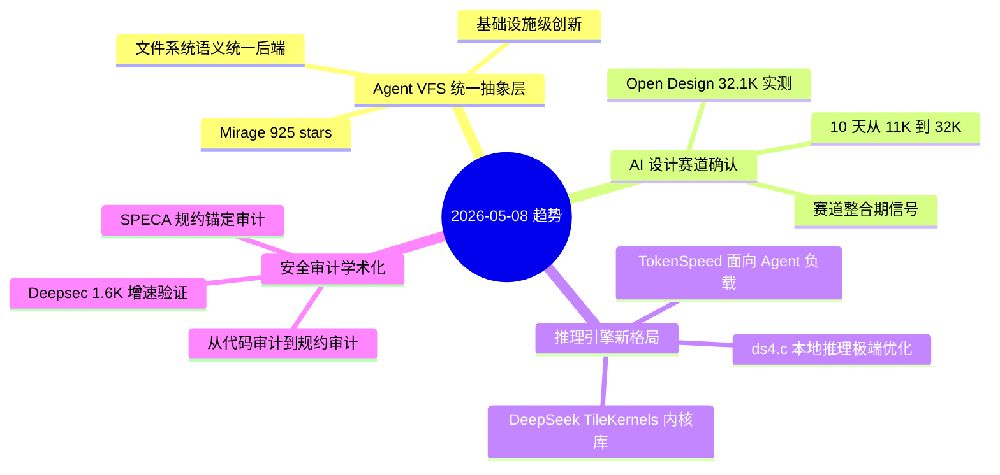
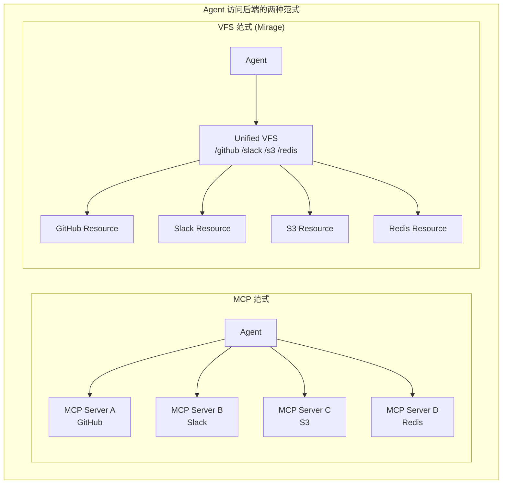
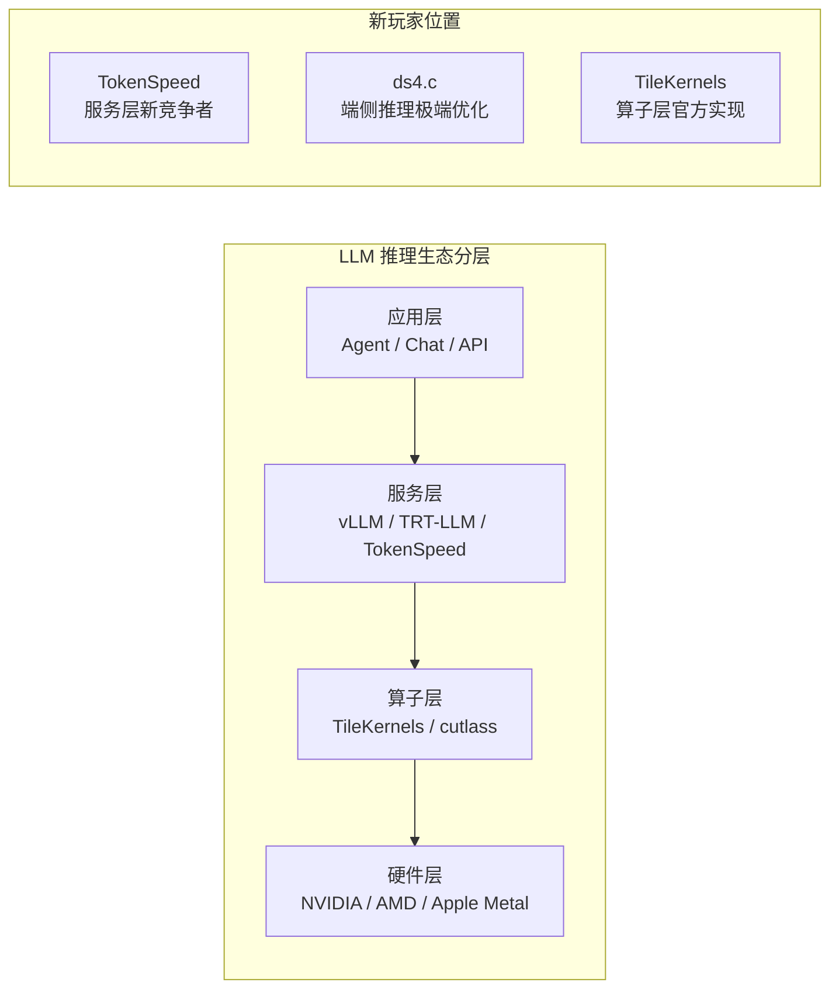
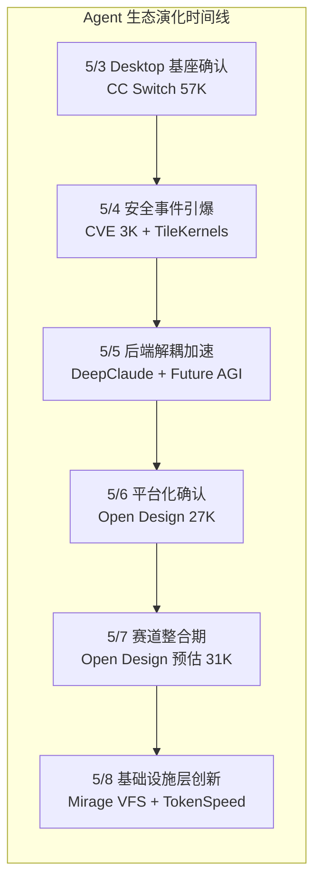

# 2026-05-08 GitHub 趋势研究简报

> ✅ **数据来源声明：** 今日通过 GitHub API（`gh`）成功获取实时数据，star 数均为实测值。

## 今日趋势概览

---

## 趋势 1：Agent VFS 统一抽象层出现（评分 85）

**核心信号：** [Mirage](https://github.com/strukto-ai/mirage) 在 5/6 创建，2 天内 925 stars。这是一个为 AI Agent 设计的统一虚拟文件系统（VFS），将 S3、Slack、GitHub、Gmail、Redis、MongoDB 等后端挂载为单一文件系统树。

**三层分析：**

1. **表层信号**：新项目 2 天近千 star，且来自 strukto.ai（有商业背景），不是个人玩具
2. **技术实质**：核心洞察是"LLM 最擅长 bash/file 语义，不是 N 个 SDK"。通过将所有后端统一为文件系统接口，Agent 只需要 `cat`/`grep`/`cp`/`ls` 就能操作任何后端——这是**对 MCP 协议层的另一种解法**
3. **架构意义**：如果成功，这可能成为 Agent 基础设施的重要抽象层

**与 MCP 的关键区别：**
- MCP 是"每个后端一个协议适配器"——Agent 需要学习 N 个工具
- Mirage 是"一个文件系统树挂载所有后端"——Agent 只需要 bash
- 两者不互斥：Mirage 可以作为 MCP Server 的底层实现

**架构师判断：** 这是一个值得认真对待的项目。如果 Agent 生态向"文件系统语义统一"方向演进，Mirage 有潜力成为基础设施级组件。但 2 天的数据不足以确认趋势，需要 2-4 周持续观察。

**风险：**
- 2 天 star 数据，跟风成分大
- 文件系统语义是否适合所有后端操作？（如 Slack 发消息用 `cp` 语义是否自然？）
- 与 MCP 生态的竞争/融合方向未定

---

## 趋势 2：AI 设计赛道 32K 确认（评分 83）

**核心信号：** Open Design 实测 32,118 stars。10 天（4/28 → 5/8）从 0 到 32K，日均 3.2K。与昨日预估的 "~31K" 基本一致。

**关键数据：**
- Forks: 3,548
- Open Issues: 291
- Subscribers: 115
- 语言: TypeScript
- 31 Skills + 72 Design Systems + 16 Agent CLI 兼容

**赛道整合信号确认：**
1. Open Design 32K 确认领跑地位
2. 同赛道 PPT Master、Open Slide 等项目增速远低于 OD
3. 设计系统生态（72 个品牌级设计系统）形成护城河

**架构师判断：** Open Design 已不再是"热点项目"，而是"赛道定义者"。对架构师而言，重点不是"是否关注"，而是"何时评估企业落地"。当前阶段建议：
- 企业 UI/UX 团队评估 Design System 兼容性
- 确认 BYOK 模式是否符合安全合规要求
- 评估 Skill 定制开发成本

---

## 趋势 3：推理引擎赛道新玩家入场（评分 80）

**三线推进：**

| 项目 | Stars | 定位 | 技术方向 |
|------|-------|------|----------|
| **TokenSpeed** | 621 | Agentic Workload 专用推理引擎 | MLA on Blackwell，对标 TRT-LLM |
| **ds4.c** | 456 | DeepSeek V4 Flash Metal 专用引擎 | 2-bit 量化 + KV Cache 磁盘持久化 |
| **TileKernels** | 1,477 | DeepSeek 出品的 TileLang 内核库 | 底层算子库，面向硬件厂商 |

**关键洞察：**

1. **TokenSpeed** 的核心卖点不是通用推理，而是**面向 Agentic Workload 优化**——这意味着推理引擎开始针对 Agent 使用场景做特化
2. **ds4.c**（antirez 出品）代表另一个方向：**极端本地优化**。2-bit 量化让 284B 模型在 128GB MacBook 上可运行，KV Cache 持久化到磁盘是工程创新
3. **TileKernels** 是 DeepSeek 官方的底层算子库，为整个生态提供基础

**架构师判断：**
- TokenSpeed 值得关注但尚处 Preview，不宜 PoC
- ds4.c 是个人项目（antirez），工程品质有保障但长期维护存疑
- TileKernels 是 DeepSeek 生态的基础设施，对标 cutlass

---

## 趋势 4：安全审计 Agent 学术化突破（评分 78）

**双信号：**

1. **SPECA**（345 stars）提出了"Specification-anchored"审计范式：不从代码模式出发，而是从规约（Specification）推导安全属性，再验证实现是否满足这些属性
2. **Deepsec**（1,638 stars）从昨日 ~1.2K 增长到 1.6K，增速验证了市场对 Agent 安全审计的需求

**SPECA 的学术突破：**
- 在 Sherlock Ethereum Fusaka 审计竞赛中，SPECA 恢复了全部 15 个 H/M/L 漏洞
- 独立发现了 4 个竞赛中未被发现的 bug（包括一个密码学不变量违反）
- 在 RepoAudit C/C++ 基准上达到 88.9% 精确率
- 所有误报可追溯到 3 个可解释的根因

**与 Deepsec 的关系：**
- Deepsec = 工业化 Agent 安全扫描（Vercel 出品，面向实际代码库）
- SPECA = 学术化规约审计（有论文，面向规约驱动系统）
- 两者互补：Deepsec 扫代码，SPECA 验规约

---

## 重点项目深度分析

### Top 1：Mirage — Agent VFS 统一抽象层（925 stars）

| 维度 | 评分 | 理由 |
|------|------|------|
| 热度质量 | 7 | 2 天 925 stars，增速好但时间太短 |
| 技术创新度 | 9 | 文件系统语义统一 Agent 后端访问，范式级创新 |
| 工程成熟度 | 6 | 2 天项目，但已支持 Python + TypeScript SDK |
| 架构启发价值 | 9 | 对 MCP 协议层的替代/补充方案 |
| 企业落地潜力 | 7 | VFS 概念直觉友好，但企业后端集成需要验证 |
| 中期趋势概率 | 7 | 方向正确但需验证"文件系统是否适合所有后端" |
| 平台化潜力 | 8 | VFS 是天然的平台抽象 |
| 基础设施潜力 | 9 | 如果成功，是 Agent 基础设施层的基础设施 |

**总分：62/80**
**归类：基础设施候选**
**持续跟踪：是**

**核心观察点：**
- 2 周后 star 是否持续增长（排除跟风效应）
- 是否出现"Mirage + MCP"的集成方案
- 企业用户是否接受文件系统语义访问业务系统

### Top 2：Open Design — 赛道确认领跑者（32,118 stars）

| 维度 | 评分 | 理由 |
|------|------|------|
| 热度质量 | 10 | 32K 实测，日均 3.2K，赛道标杆确认 |
| 技术创新度 | 8 | Agent + Design System + Multi-format pipeline |
| 工程成熟度 | 9 | 31 Skills + 72 Design Systems + 16 Agent 兼容 |
| 架构启发价值 | 9 | 定义了 Agent-Design 技术栈分层 |
| 企业落地潜力 | 7 | BYOK 适合企业，但设计系统本地化是挑战 |
| 中期趋势概率 | 9 | Agent Design 已成独立赛道 |
| 平台化潜力 | 9 | Design System + Skill 生态可扩展 |
| 基础设施潜力 | 7 | 有潜力，但赛道整合后格局可能变化 |

**总分：68/80**
**归类：平台候选**
**持续跟踪：是**

### Top 3：TokenSpeed — Agentic Workload 推理引擎（621 stars）

| 维度 | 评分 | 理由 |
|------|------|------|
| 热度质量 | 6 | 621 stars，2 天新项目 |
| 技术创新度 | 8 | MLA on Blackwell + C++/Python 双平面调度 |
| 工程成熟度 | 5 | Preview 阶段，明确说"不要用于生产" |
| 架构启发价值 | 8 | "面向 Agentic Workload 优化"是推理引擎的新方向 |
| 企业落地潜力 | 5 | Preview 状态，不宜落地 |
| 中期趋势概率 | 7 | Agentic Workload 特化推理是确定性方向 |
| 平台化潜力 | 7 | 推理引擎本身是平台 |
| 基础设施潜力 | 9 | 推理引擎是 AI 基础设施核心 |

**总分：55/80**
**归类：学习型**
**持续跟踪：是**

---

## 本周趋势总结（5/3 - 5/8）

### 本周核心判断

1. **Agent 后端访问范式之争开始**：MCP vs VFS，两者可能融合
2. **推理引擎赛道分化**：通用 vs Agent 特化 vs 端侧专用，三条路线并存
3. **安全审计从"找 Bug"到"验规约"**：SPECA 代表了审计范式升级
4. **Open Design 32K 确认赛道领跑**：10 天 32K，赛道整合加速

### 上调判断
- **Open Design**：从"平台候选"维持。32K 实测确认，赛道地位巩固。
- **Deepsec**：1.2K → 1.6K，增速验证市场需求。
- **Mirage**：新项目，直接评定为"基础设施候选，持续跟踪"。范式级创新。

### 下调/维持判断
- **ds4.c**：antirez 个人项目，品质有保障但定位过于窄，评定为"工具型"。
- **CVE-2026-31431**：3.5K stars，热度趋稳，事件驱动型项目。

---

## 风险与机遇

### 风险
1. **Mirage 2 天数据不具统计意义**：需要 2-4 周确认真实采用
2. **TokenSpeed Preview 不宜依赖**：明确声明不要用于生产
3. **Agent 生态碎片化加剧**：MCP + VFS + N 种 Agent Runtime，集成复杂度上升

### 机遇
1. **Mirage 的 VFS 范式**：如果文件系统语义统一成功，将大幅降低 Agent 开发门槛
2. **推理引擎的 Agent 特化**：TokenSpeed 代表了推理引擎从"通用服务"向"场景特化"的演进
3. **安全审计的规约驱动**：SPECA 的 Spec-anchored 方法可能在金融/区块链/密码学领域产生突破

---

## 项目档案

- **Mirage** → [projects/mirage.html](projects/mirage.html)
- **Open Design** → [projects/open-design.html](projects/open-design.html)
- **TokenSpeed** → [projects/tokenspeed.html](projects/tokenspeed.html)
- **ds4.c** → [projects/ds4.html](projects/ds4.html)
- **SPECA** → [projects/speca.html](projects/speca.html)
- **Deepsec** → [projects/deepsec.html](projects/deepsec.html)
- **DBX** → [projects/dbx.html](projects/dbx.html)

---

*数据来源：GitHub API（`gh`）实时获取。Star 数均为 2026-05-08 06:00 UTC+8 实测值。*
