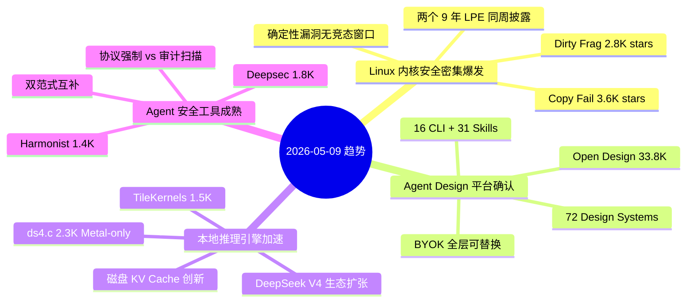
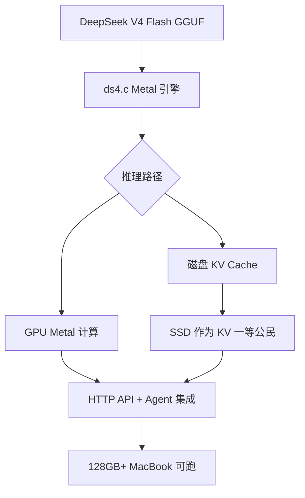

# 2026-05-09 GitHub 趋势研究简报

> ✅ **数据来源声明：** 今日通过 GitHub API（`gh`）成功获取实时数据，star 数均为实测值。

## 今日趋势概览

## 趋势一：Linux 内核安全漏洞密集爆发（热度 88）

本周是 Linux 内核安全的一个黑色星期。两个独立的安全研究团队几乎同时披露了存在约 9 年的 Linux 内核本地提权漏洞：

**Dirty Frag (CVE-2026-43284/43500)** — 2,775 ⭐（2 天内）
- 由 @v4bel 发现，链式利用 xfrm-ESP Page-Cache Write + RxRPC Page-Cache Write
- **确定性逻辑漏洞，无需竞态条件**，成功率极高
- 影响 2017 年以来几乎所有主流发行版（Ubuntu/RHEL/Fedora/openSUSE）
- xfrm 部分已修补（CVE-2026-43284），RxRPC 部分（CVE-2026-43500）尚无补丁

**Copy Fail (CVE-2026-31431)** — 3,599 ⭐
- Theori 的 Xint Code 发现，同样是 9 年老漏洞
- 本周初已披露，持续发酵

**架构师判断：**
这两个漏洞的 bug class 同属 Dirty Pipe 家族，核心问题在 Linux 内核的 Page-Cache 管理机制。对于运维团队而言，这是一次不得不响应的紧急补丁周期。更重要的是，它暴露了 Linux 内核安全审计的系统性缺陷——基础文件系统代码路径的审计投入严重不足。

## 趋势二：Agent Design 平台地位确认（热度 84）

Open Design 今天达到 **33,880 ⭐**，从昨天的 32.1K 继续增长。11 天从 0 到 33K+，这是 2026 年增长速度最快的开源项目之一。

**关键数据：**
- 16 种 Coding Agent CLI 自动检测
- 31 个可组合 Skills
- 72 个品牌级 Design Systems
- BYOK 每层可替换
- 已支持 Seedance 2.0 视频生成 + HyperFrames 动画

**赛道信号：** Open Design 正在从"工具"演化为"平台"。它不再只是一个 Claude Design 的替代品，而是在构建一个 Agent Design 的通用运行时——任何 Coding Agent + 任何 Design System + 任何 Skill 组合。

## 趋势三：本地推理引擎赛道加速（热度 82）

**ds4.c** 由 antirez（Redis 作者）开发，2 天达到 **2,312 ⭐**。

核心创新：
1. **DeepSeek V4 Flash 专用 Metal 引擎**——不是通用 GGUF 加载器
2. **2-bit 非对称量化**——MoE 路由专家 IQ2_XXS/Q2_K，其他组件保持原始精度
3. **磁盘 KV Cache**——KV Cache 作为"一等磁盘公民"，突破传统 RAM 限制
4. **1M Token 上下文**——本地可跑的超长上下文

同时，**TileKernels**（DeepSeek 官方出品）达到 **1,487 ⭐**，提供 MoE/量化/Engram 等 GPU Kernel 库。

**架构师判断：** DeepSeek V4 的本地推理生态正在快速成型。ds4.c 的"磁盘 KV Cache"理念值得特别关注——这可能改变我们对推理引擎内存架构的理解。

## 趋势四：Agent 安全工具走向成熟（热度 80）

两个方向的安全工具同时在成熟：

**Deepsec (1,864 ⭐)** — Vercel 出品
- Agent 驱动的代码漏洞扫描器
- 面向大型代码库，并行 worker 扫描
- 支持断点续扫
- 成本可能数千到数万美元（使用最强模型最大思考）

**Harmonist (1,423 ⭐)** — GammaLab 出品
- 186 个 Agent 的多 Agent 编排框架
- **机械协议强制执行**——不是"请求"Agent 遵循规则，而是"强制"执行
- 零运行时依赖（stdlib only）
- 支持 Cursor / Claude Code / Copilot / Windsurf / Aider

**架构师判断：** 这两个项目代表了 Agent 安全的两个互补范式——Deepsec 是"安全审计 Agent"（发现问题），Harmonist 是"安全协议 Agent"（预防问题）。两者结合可能形成 Agent 安全的完整闭环。

## 重点项目深度分析

### Top 1: Dirty Frag — Linux 内核安全的系统性警钟

**技术亮点：**
- Page-Cache Write 漏洞链，绕过文件系统权限模型
- 无竞态窗口，确定性触发
- 影响范围极广（2017 至今所有主流内核）

**风险点：**
- PoC 已公开，攻击门槛低
- RxRPC 漏洞尚无补丁
- 属于 Dirty Pipe 家族，可能还有更多同类型漏洞未发现

**定位：** 安全研究型项目，不属于长期跟踪的基础设施，但其暴露的问题对所有 Linux 运维架构有重大影响。

### Top 2: Open Design — 从工具到平台的确认

**增速数据：**
| 日期 | Stars | 日增量 |
|------|-------|--------|
| 04-28 | 0 | - |
| 05-01 | ~4K | ~1.3K/天 |
| 05-04 | ~11K | ~2.3K/天 |
| 05-06 | ~19K | ~4K/天 |
| 05-08 | 32.1K | ~6.5K/天 |
| 05-09 | 33.9K | +1.7K |

增速已从爆发期趋于稳定，但绝对增量仍然很高。

### Top 3: ds4.c — antirez 的本地推理新范式

**核心架构创新：**

**为什么重要：** antirez 的项目风格一贯是"小而精"。ds4.c 不是要替代 llama.cpp，而是在证明一件事——特定模型可以有远超通用框架的推理效率。磁盘 KV Cache 的理念尤其值得关注。

## 风险与机遇

**风险：**
1. Dirty Frag + Copy Fail 的 PoC 公开意味着攻击面已暴露，运维团队需要紧急补丁
2. Open Design 增速放缓但仍高，需警惕泡沫风险
3. ds4.c 目前 Metal-only，限制受众范围

**机遇：**
1. Agent 安全工具的成熟为企业采用 AI Agent 提供了安全基础
2. 磁盘 KV Cache 理念可能催生新一代推理引擎架构
3. Dirty Frag 暴露的 Page-Cache 问题可能催生新的安全审计工具需求

## 重点项目档案

详见当日更新的项目档案：
- 🔴 Dirty Frag → `projects/dirtyfrag.md`
- 🎨 Open Design → `projects/open-design.md`（更新）
- 🔧 ds4.c → `projects/ds4.md`（更新）
- 🗂️ Mirage → `projects/mirage.md`（更新）
- 🛡️ Deepsec → `projects/deepsec.md`（更新）
- 🎭 Harmonist → `projects/harmonist.md`（更新）
- 📊 Open Slide → `projects/open-slide.md`（更新）
