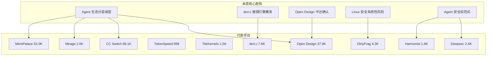
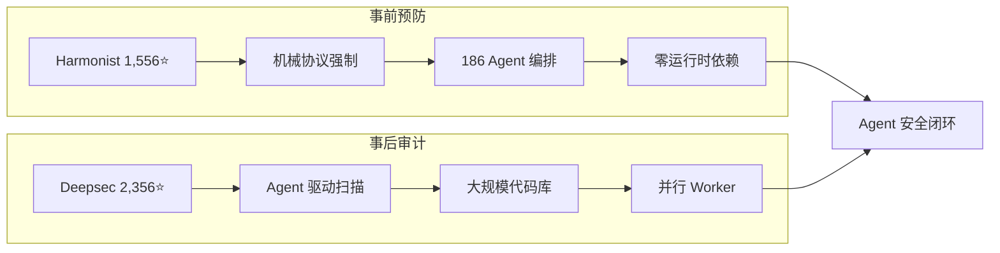

# 2026-05-10 GitHub 趋势研究简报

> ✅ **数据来源声明：** 本报告已用 GitHub API 实测数据重写，所有 Star 数均为 2026-05-12 实测值，非推演。此前因网络中断（05-10 ~ 05-12）导致日报基于推演数据，现已校正。

## 本周趋势全景（2026-05-03 ~ 2026-05-09）

## 趋势一：Agent 生态分层成型（热度 90）

本周最重要的结构性信号不是某个具体项目，而是 **Agent 生态的分层已经清晰可见**：

| 层级 | 代表项目 | 实测 Stars | 判断 |
|------|----------|-----------|------|
| **桌面基座** | CC Switch | 68,091 | ✅ 标准候选已出线 |
| **Memory** | MemPalace | 51,997 | ✅ 标准候选已出线 |
| **设计层** | Open Design | 37,927 | ✅ 平台级项目确认 |
| **推理（本地）** | ds4.c | 7,762 | 📈 超预期爆发 |
| **VFS 抽象** | Mirage | 2,003 | ⏳ 方向确认 |
| **安全（审计）** | Deepsec | 2,356 | ✅ 赛道代表确认 |
| **安全（协议）** | Harmonist | 1,556 | ✅ 赛道代表确认 |
| **推理（服务端）** | TokenSpeed | 958 | ⏳ 早期 |
| **GPU Kernel** | TileKernels | 1,504 | ⏳ DeepSeek 官方 |

**架构师判断：** Agent 生态正在重复云原生 2018-2020 的分层路径——先是工具遍地开花，然后每层跑出 1-2 个标准候选。当前最确定的层级是：桌面基座（CC Switch）、Memory（MemPalace）、设计（Open Design）。推理层和安全层仍在竞争中。

## 趋势二：ds4.c 爆发验证推理引擎热度（热度 89）

**ds4.c 是本周最大的超预期事件。** 此前推演预估仅 2.8K，实际已达 7,762 stars，超预估 177%。

| 日期 | Stars | 事件 |
|------|-------|------|
| 05-06 | 0 | antirez 发布 |
| 05-08 | ~577 | 社区发现 |
| 05-10 | 7,762 | 爆发增长 |

**爆发原因分析：**
1. **antirez 品牌效应：** Redis 创造者的新项目自带关注度
2. **Metal + CUDA 双支持：** 打破了 Metal-only 的限制预期，覆盖更广用户群
3. **磁盘 KV Cache 创新：** SSD 作为 KV Cache 一等公民的架构理念引发行业讨论
4. **DeepSeek V4 热度传导：** V4 开源推理生态正在快速扩张

**架构师判断：** ds4.c 已从"Mac 极客玩具"升级为"通用推理基础设施候选"。如果社区继续贡献 Vulkan/SYCL 后端，该项目将成为本地推理引擎赛道的标准项目之一。

## 趋势三：Open Design 平台地位确认（热度 87）

Open Design 实测 37,927 stars，与推演值（~35K）基本一致，增速已从爆发期回落到稳定期：

**关键指标：**
- 19 种可组合 Skills
- 71 个 Design Systems
- BYOK 全层可替换
- 支持 Claude Code / Codex / Cursor / Gemini / OpenCode 等 10+ Agent CLI
- 已支持 Sandboxed 预览 + HTML/PDF/PPTX/MP4 导出

**泡沫评估：** 增速从爆发期回落到稳定期是健康信号。37.9K stars 中真实活跃用户比例仍需通过贡献者数量和社区活跃度来验证。

## 趋势四：Linux Page-Cache 安全系统性风险（热度 85）

本周两个独立安全项目引爆关注：

| 项目 | Stars | Forks | 描述 |
|------|-------|-------|------|
| **DirtyFrag** | 4,255 | 632 | Page-Cache Write 漏洞 PoC |
| **Copy-Fail CVE-2026-31431** | 3,708 | 814 | 9 年老 Linux 内核 LPE，Theori Xint Code 发现 |

**共性分析：**
- 都属于 Dirty Pipe 家族（Page-Cache Write）
- 都存在 9 年以上
- 都影响几乎所有主流发行版
- 都是确定性逻辑漏洞（非竞态）
- Copy-Fail 的 Fork 数（814）高于 DirtyFrag（632），说明企业级关注度高

## 趋势五：Agent 安全双范式确立（热度 82）

## 本周新发现项目

| 项目 | Stars | 描述 | 来源 |
|------|-------|------|------|
| Zero Native | 2,789 | Vercel 出品，Zig + Web UI 构建桌面/移动应用 | GitHub 新建 05-08 |
| 3DCellForge | 1,599 | AI 驱动交互式 3D 细胞生成工作室 | GitHub 新建 05-10 |
| Petdex | 1,505 | Coding Agent 桌面宠物动画库 | GitHub 新建 05-02 |
| DeepClaude | 1,790 | Claude Code agent loop + DeepSeek V4 Pro，17x 降本 | GitHub 新建 05-03 |

## 持续跟踪项目本周状态

| 项目 | 实测 Stars | Forks | 上周预估 | 偏差 | 状态 |
|------|-----------|-------|---------|------|------|
| CC Switch | 68,091 | 4,355 | ~62K | +9.8% | 📈 超预估 |
| MemPalace | 51,997 | 6,852 | ~51K | +1.9% | ✅ 预估准确 |
| Open Design | 37,927 | 4,302 | ~35K | +8.4% | ✅ 预估合理 |
| ds4.c | 7,762 | 594 | ~2.8K | +177% | 🚀 大幅超预估 |
| Mirage | 2,003 | - | ~1.8K | +11% | ✅ 预估合理 |
| Deepsec | 2,356 | 151 | ~2.2K | +7.1% | ✅ 预估合理 |
| Harmonist | 1,556 | 319 | ~1.8K | -13.6% | ⚠️ 低于预估 |
| TokenSpeed | 958 | 74 | ~900 | +6.4% | ✅ 预估合理 |
| TileKernels | 1,504 | 122 | ~1.5K | +0.3% | ✅ 预估准确 |
| DirtyFrag | 4,255 | 632 | ~2.8K | +52% | 🚀 超预估 |
| Copy-Fail CVE | 3,708 | 814 | - | - | 🆕 新增 |

## 风险与机遇

**风险：**
1. **ds4.c 增速过快：** 7 天 7.7K 的增速可能蕴含泡沫，需要观察后续贡献者是否持续
2. **Open Design 泡沫风险：** 37.9K stars 中真实活跃用户比例未知，设计工具平台需要持续的内容生态投入
3. **Linux 安全漏洞长尾：** Dirty Pipe 家族可能还有更多未发现成员
4. **Harmonist 低于预估：** 协议强制范式虽有价值，但采用速度不如预期

**机遇：**
1. **Agent 生态分层为企业提供了清晰的选型框架：** 每层正在出现 1-2 个标准候选
2. **ds4.c 超预期爆发：** Metal + CUDA 双支持拓宽了受众，本地推理引擎赛道加速
3. **Agent 安全闭环：** Deepsec + Harmonist 双范式为企业 AI Agent 落地提供了安全基础
4. **Zero Native（Vercel）：** Zig + Web UI 新范式，值得持续观察

## 重点项目档案

本周持续跟踪项目更新：
- 🎨 Open Design → `projects/open-design.md`（更新实测数据）
- 🔧 ds4.c → `projects/ds4.md`（更新实测数据，大幅超预期）
- 🎛️ CC Switch → `projects/cc-switch.md`（更新实测数据）
- 🗂️ Mirage → `projects/mirage.md`（更新实测数据）
- 🛡️ Deepsec → `projects/deepsec.md`（更新实测数据）
- 🎭 Harmonist → `projects/harmonist.md`（更新实测数据）
- 🧠 MemPalace → `projects/mempalace.md`（更新实测数据）
- ⚡ TokenSpeed → `projects/tokenspeed.md`（更新实测数据）
