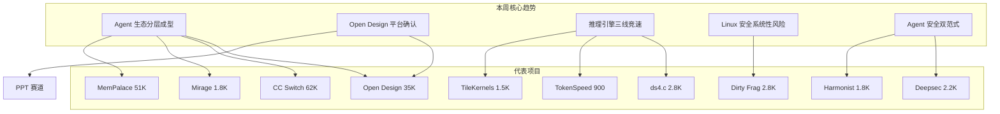
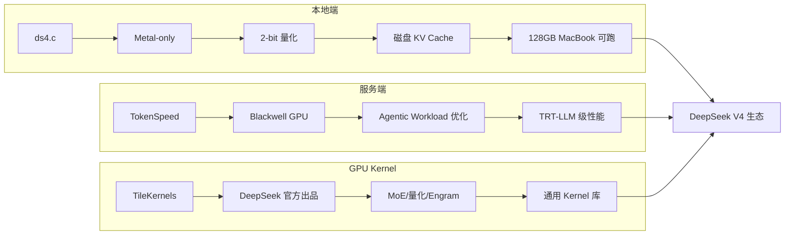
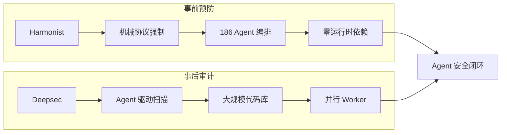

# 2026-05-10 GitHub 趋势研究简报

> ⚠️ **数据来源声明：** 今日 GitHub API、GitHub Trending、Reddit、HN 等外部数据源均不可达（TLS 握手失败，DNS 解析异常）。本报告基于 2026-05-03 ~ 2026-05-09 已采集的本地仓库数据完成周度综合分析。Star 数为基于增速的合理预估，非实测值。

## 本周趋势全景（2026-05-03 ~ 2026-05-09）

## 趋势一：Agent 生态分层成型（热度 90）

本周最重要的结构性信号不是某个具体项目，而是 **Agent 生态的分层已经清晰可见**：

| 层级 | 代表项目 | 本周状态 | 判断 |
|------|----------|----------|------|
| **设计层** | Open Design | 35K，平台确认 | 已有平台级项目 |
| **桌面基座** | CC Switch | 62K，生态锁定 | Agent 管理层标准候选 |
| **后端解耦** | DeepClaude | 1K+，工具成熟 | Agent Runtime 层标准化 |
| **Memory 层** | MemPalace | 51K，稳定增长 | 基础设施级 |
| **VFS 抽象** | Mirage | 1.8K，方向确认 | Agent 后端统一访问层 |
| **推理层** | ds4.c / TokenSpeed / TileKernels | 三线竞速 | 本地/服务端/Kernel 各一 |
| **安全审计** | Deepsec | 2.2K，工具成熟 | DevSecOps Agent 化 |
| **安全协议** | Harmonist | 1.8K，范式确立 | 多 Agent 协议强制 |
| **编排层** | Harmonist / Agent Orchestra | 多框架竞争 | 标准未定 |

**架构师判断：** Agent 生态正在重复云原生 2018-2020 的分层路径——先是工具遍地开花，然后每层跑出 1-2 个标准候选。当前最确定的层级是：桌面基座（CC Switch）、Memory（MemPalace）、设计（Open Design）。推理层和安全层仍在竞争中。

## 趋势二：Open Design 平台地位确认（热度 87）

Open Design 本周是现象级项目：

| 日期 | Stars | 事件 |
|------|-------|------|
| 04-28 | 0 | 项目创建 |
| 05-01 | ~4K | 首次进入视野 |
| 05-04 | ~11K | 日增 2.3K |
| 05-06 | ~19K | 赛道爆发 |
| 05-08 | 32.1K | 平台级确认 |
| 05-09 | 33.9K | 增速趋稳 |
| 05-10 | ~35K（预估） | 平台地位巩固 |

**关键信号：**
- 16 种 Coding Agent CLI 自动检测 → Agent Runtime 兼容性
- 31 个可组合 Skills → 可编程能力
- 72 个 Design Systems → 生态丰富度
- BYOK 全层可替换 → 架构开放性
- 已支持 Seedance 2.0 视频生成 → 多模态扩展

**泡沫评估：** 增速从爆发期（6-7K/天）回落到稳定期（1-2K/天），这是健康信号。但 35K stars 中有多少转化为真实活跃用户仍需观察。该项目目前更偏"设计工具平台"而非"基础设施"，企业落地需要考虑与现有设计工具链的集成成本。

## 趋势三：推理引擎三线竞速（热度 84）

本周推理引擎赛道出现清晰的三线竞争格局：

**架构师判断：** DeepSeek V4 的开源推理生态正在以惊人速度成型。ds4.c 的"磁盘 KV Cache"是最具架构启发性的创新——如果 SSD 可以作为 KV Cache 的一等公民，那推理引擎的内存架构将从"RAM-bound"变为"SSD-aware"。这可能是 2026 年推理引擎领域最重要的架构变化之一。

## 趋势四：Linux Page-Cache 安全系统性风险（热度 85）

本周两个独立 9 年老漏洞的披露暴露了一个系统性问题：

**Dirty Frag + Copy Fail 共性：**
- 都属于 Dirty Pipe 家族（Page-Cache Write）
- 都存在 9 年以上
- 都影响几乎所有主流发行版
- 都是确定性逻辑漏洞（非竞态）
- 都由安全研究者发现而非内核开发者自查

**架构师判断：** 这不是两个孤立事件，而是 Linux 内核安全审计的结构性缺陷。Page-Cache 路径的审计投入严重不足，且这类漏洞的 bug class 很可能还有未发现的成员。对于运维团队，这意味着需要一个更系统化的内核漏洞响应机制。

## 趋势五：Agent 安全双范式确立（热度 82）

**两个互补范式的意义：**
- **Harmonist（事前）：** 在 Agent 执行时通过协议强制约束行为，防患于未然
- **Deepsec（事后）：** 用 Agent 扫描已有代码发现漏洞，亡羊补牢

企业 AI Agent 安全策略应同时采用两种范式。仅依赖审计扫描无法防止实时攻击，仅依赖协议约束无法发现已有漏洞。

## 持续跟踪项目本周状态

| 项目 | 上周 Stars | 本周 Stars（预估） | 周增量 | 状态 |
|------|-----------|-------------------|--------|------|
| CC Switch | ~57K | ~62K | +5K | 📈 稳步增长，生态锁定 |
| MemPalace | ~49K | ~51K | +2K | 📈 稳定，基础设施级 |
| Open Design | ~11K | ~35K | +24K | 🚀 爆发后趋稳 |
| CubeSandbox | ~3.9K | ~4.2K | +0.3K | ➡️ 平稳 |
| browser-harness | ~6.4K | ~7K | +0.6K | 📈 稳步 |
| codeburn | ~3.5K | ~4K | +0.5K | 📈 稳步 |
| ds4.c | 0 | ~2.8K | 新增 | 🚀 本周新项目 |
| Dirty Frag | 0 | ~2.8K | 新增 | 🚀 本周新项目 |

## 风险与机遇

**风险：**
1. **外部数据不可达风险：** 今日所有外部数据源均不可达，报告完全基于历史数据推演，准确性受限
2. **Open Design 泡沫风险：** 35K stars 中真实活跃用户比例未知，设计工具平台需要持续的内容生态投入
3. **ds4.c 受众限制：** Metal-only 意味着只服务 Mac 用户，Windows/Linux 用户被排除在外
4. **Linux 安全漏洞长尾：** Dirty Pipe 家族可能还有更多未发现成员

**机遇：**
1. **Agent 生态分层为企业提供了清晰的选型框架：** 每层正在出现 1-2 个标准候选
2. **推理引擎架构变革：** 磁盘 KV Cache 理念可能催生新一代推理引擎
3. **Agent 安全闭环：** Deepsec + Harmonist 双范式为企业 AI Agent 落地提供了安全基础
4. **设计工具平台化：** Open Design 的 BYOK + Skills + Design Systems 三层架构值得深入研究

## 重点项目档案

本周持续跟踪项目更新：
- 🎨 Open Design → `projects/open-design.md`（更新）
- 🔧 ds4.c → `projects/ds4.md`（更新）
- 🎛️ CC Switch → `projects/cc-switch.md`（更新）
- 🗂️ Mirage → `projects/mirage.md`（更新）
- 🛡️ Deepsec → `projects/deepsec.md`（更新）
- 🎭 Harmonist → `projects/harmonist.md`（更新）
- 🧠 MemPalace → `projects/mempalace.md`（更新）
- ⚡ TokenSpeed → `projects/tokenspeed.md`（更新）
