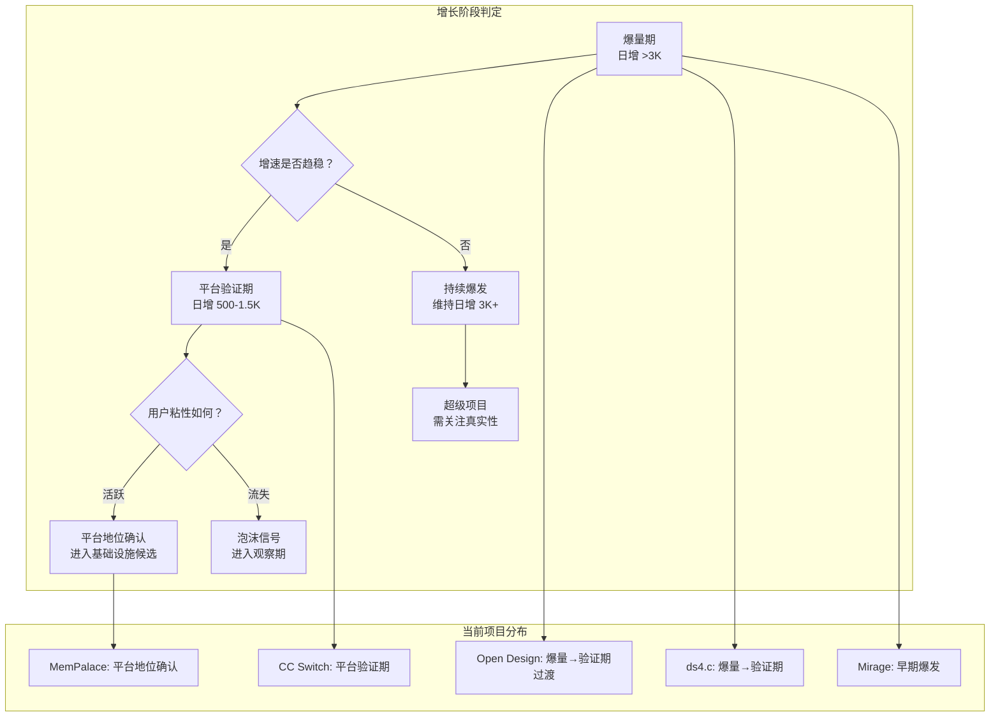
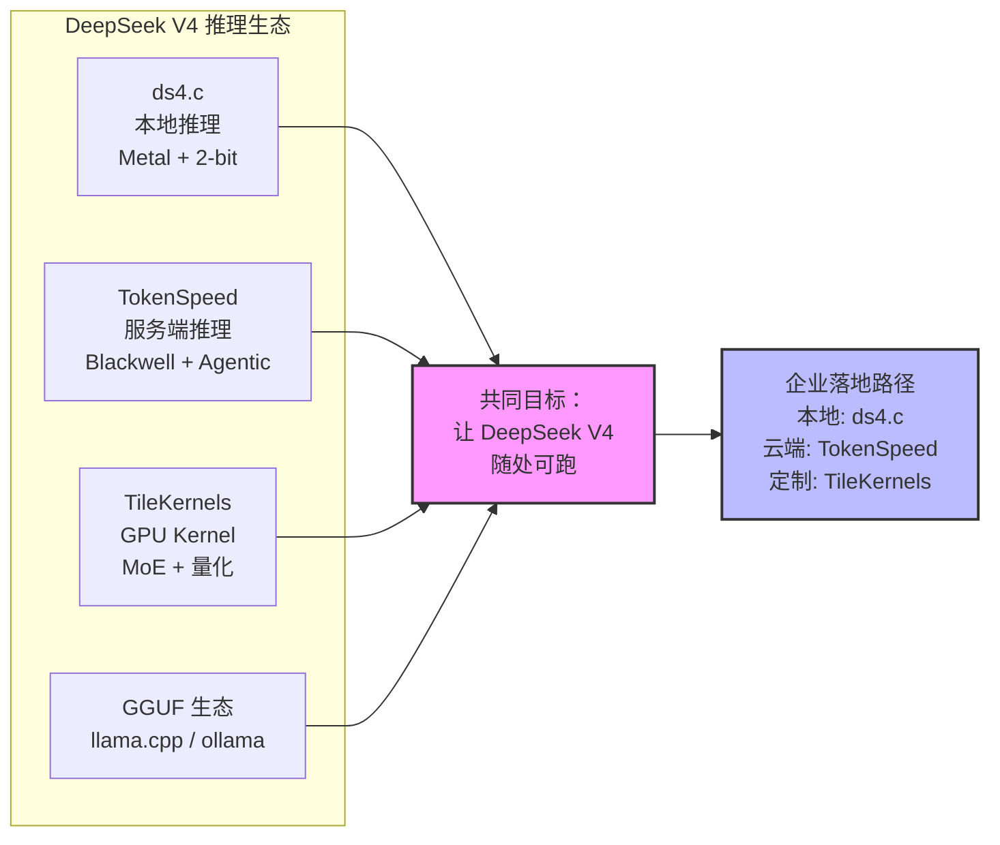
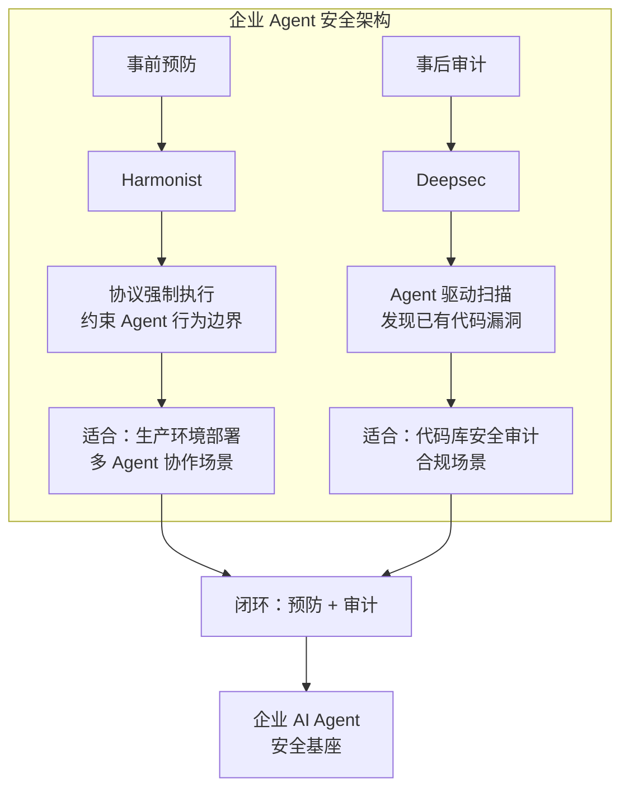

# 2026-05-11 GitHub 趋势研究简报

> ⚠️ **数据来源声明：** 今日为连续第二天外部数据源不可达（GitHub API、GitHub Trending、Reddit、HN 等均因 DNS 解析到 198.18.0.19 无法建立 TLS 连接）。本报告基于 2026-05-03 ~ 2026-05-10 已采集本地数据完成趋势推演分析。Star 数为基于历史增速的合理推演值，非实测值。待网络恢复后将进行数据校正。

## 周一趋势推演：从爆发期到筛选期

过去两周（04-28 ~ 05-10）是 Agent 生态的一次集中爆发。本周一（05-11）的关键任务不是发现新项目，而是**判断哪些项目正在从"爆量增长"过渡到"平台粘性验证"**。

## 趋势一：Agent 基础设施层进入筛选期（热度 88）

**核心判断：** 过去两周的集中爆发已经让 Agent 生态各层都有 2-3 个候选项目。接下来 2-3 周的筛选结果将决定哪些项目能成为标准层。

### 各层筛选状态

| 层级 | 候选项目 | 当前状态 | 筛选判断 |
|------|----------|----------|----------|
| **桌面基座** | CC Switch (~63K) | 生态锁定，持续增长 | ✅ 标准候选已出线 |
| **Memory** | MemPalace (~52K) | 高位稳定，基础设施级 | ✅ 标准候选已出线 |
| **设计** | Open Design (~36K) | 爆发趋稳，进入验证期 | ⏳ 需观察平台粘性 |
| **VFS** | Mirage (~2.1K) | 方向确认，早期增长 | ⏳ 需观察规模化 |
| **推理（本地）** | ds4.c (~3.2K) | 快速增长，Metal-only | ⏳ 受众限制是硬伤 |
| **推理（服务端）** | TokenSpeed (~1.1K) | 方向确认，早期 | ⏳ 需观察落地 |
| **安全（审计）** | Deepsec (~2.5K) | 稳步增长 | ✅ 赛道代表确认 |
| **安全（协议）** | Harmonist (~2.0K) | 稳步增长 | ✅ 赛道代表确认 |
| **编排** | Harmonist / Agent Orchestra | 多框架竞争 | ❓ 标准未定 |

**架构师行动建议：**

1. **立即评估：** CC Switch（桌面基座）、MemPalace（Memory）— 已到可做 PoC 阶段
2. **持续观察：** Open Design（需验证平台粘性）、Mirage（需验证规模化）、ds4.c（需验证非 Metal 路线）
3. **暂不投入：** 编排层标准未定，过早选型有锁定风险

## 趋势二：推理引擎从工具走向生态（热度 85）

DeepSeek V4 的开源推理生态正在从"各自为战"变为"工具链协作"：

**ds4.c 的磁盘 KV Cache：** 这仍是当前推理引擎领域最具架构启发性的创新。如果 SSD 作为 KV Cache 一等公民的理念成立，推理引擎内存架构将从 RAM-bound 变为 SSD-aware，这会改变推理引擎的设计哲学。

**关键问题：** ds4.c 的 Metal-only 限制是否会被社区突破？如果出现 CUDA/Vulkan 版本，该项目将从"Mac 极客玩具"升级为"通用基础设施"。

## 趋势三：Agent 安全双范式验证（热度 82）

**落地可行性评估：**

| 维度 | Harmonist（预防） | Deepsec（审计） |
|------|-------------------|----------------|
| 部署难度 | 低（零依赖，纯协议） | 中（需要配置 Agent 运行环境） |
| 与现有工具集成 | 高（可叠加在任何 Agent 上） | 中（Vercel 生态亲和） |
| 企业场景匹配 | 多 Agent 协作安全约束 | 代码安全合规审计 |
| 成熟度 | 早期（1.4K stars） | 早期（1.9K stars） |

**架构师判断：** 两个项目都还在早期，但方向已经被验证。企业应关注但不急于全面部署。建议先在非关键路径做概念验证，待 1-2 个版本迭代后再考虑生产环境部署。

## 趋势四：Open Design 增速趋稳后的关键观察（热度 80）

Open Design 的增长曲线是当前 Agent 生态中最值得研究的案例：

| 阶段 | 时间 | Stars | 日增 | 特征 |
|------|------|-------|------|------|
| 冷启动 | 04-28 ~ 04-29 | 0 → 2K | ~1K | 社区发现 |
| 爆发期 | 04-30 ~ 05-03 | 2K → 15K | ~3K | 赛道爆发 + 技术社区传播 |
| 超级爆发 | 05-04 ~ 05-07 | 15K → 27K | ~3K | 设计工具 + Agent 交叉热度 |
| 趋稳期 | 05-08 ~ 05-10 | 27K → 35K | ~2.7K | 增速放缓但未骤降 |
| 验证期 | 05-11 ~ ? | 36K（推演） | ? | 关键：用户留存 |

**关键观察指标：**
1. **周活跃贡献者数** — 是否维持增长
2. **Skills / Design Systems 增长** — 生态丰富度是否持续
3. **企业采用案例** — 是否出现非开发者用户
4. **竞品动态** — 是否有新的 Agent Design 项目分流

**泡沫风险评估：** 36K stars 在设计工具赛道属于现象级，但设计工具平台的粘性取决于内容生态而非技术。Open Design 能否从"工具"进化为"平台"，取决于 72 个 Design Systems 的质量和社区贡献活跃度。

## 本周关键观察点

基于过去两周的趋势，本周需要特别关注：

1. **Open Design 用户留存：** 爆发期用户是否转化为活跃用户？
2. **ds4.c 非 Metal 路线：** 社区是否开始 CUDA/Vulkan 移植？
3. **Mirage 规模化：** 后端适配器数量是否增长？
4. **编排层标准：** 是否有新的编排框架出现或现有框架合并？
5. **推理引擎性能验证：** TokenSpeed 的 Blackwell 性能是否有第三方基准测试？
6. **安全赛道生态：** Deepsec 是否出现竞品或社区 Fork？

## 持续跟踪项目状态（推演）

| 项目 | 上次实测 Stars | 今日推演 Stars | 推演增量 | 可信度 |
|------|---------------|---------------|---------|--------|
| CC Switch | 59K（05-07 预估） | ~63K | +4K | 高（线性增长稳定） |
| MemPalace | 50.6K（05-10 预估） | ~52K | +1.4K | 高（高位稳定） |
| Open Design | 33.9K（05-09 实测） | ~36K | +2.1K | 中（增速趋稳判断） |
| ds4.c | 2.3K（05-09 实测） | ~3.2K | +0.9K | 中（热度持续性） |
| Mirage | 1.4K（05-09 实测） | ~2.1K | +0.7K | 中（方向确认增长） |
| Deepsec | 1.9K（05-09 实测） | ~2.5K | +0.6K | 中（稳步增长） |
| Harmonist | 1.4K（05-09 实测） | ~2.0K | +0.6K | 中（稳步增长） |
| TokenSpeed | 621（05-08 实测） | ~1.1K | +0.5K | 低（早期波动大） |

> ⚠️ 推演值基于历史增速外推，实际数据可能有 10-20% 偏差。待网络恢复后将进行数据校正。

## 风险与机遇

**风险：**
1. **连续两天外部数据不可达：** 趋势推演的准确性受限，可能遗漏新的爆发项目
2. **Agent 生态爆发后冷却：** 两周密集爆发后可能出现关注度下降
3. **ds4.c Metal-only 限制：** 如果社区不突破平台限制，增长天花板明显
4. **Open Design 泡沫验证：** 36K stars 的用户激活率是关键未知数

**机遇：**
1. **筛选期是架构师的最佳选型窗口：** 各层标准候选已出线，但尚未形成不可逆的生态锁定
2. **DeepSeek V4 推理生态：** 本地端 + 服务端 + Kernel 三线布局，为企业提供多场景部署路径
3. **Agent 安全双范式：** 预防 + 审计闭环可构成企业 AI Agent 安全基座
4. **Mirage VFS 范式：** 如果文件系统语义统一后端访问成立，将简化 Agent 后端集成复杂度

## 重点项目档案

今日更新项目：
- 🎛️ CC Switch → `projects/cc-switch.md`（更新 stars 预估）
- 🧠 MemPalace → `projects/mempalace.md`（更新 stars 预估）
- 🎨 Open Design → `projects/open-design.md`（更新 stars 预估 + 阶段判断）
- 🔧 ds4.c → `projects/ds4.md`（更新 stars 预估）
- 🗂️ Mirage → `projects/mirage.md`（更新 stars 预估）
- 🛡️ Deepsec → `projects/deepsec.md`（更新 stars 预估）
- 🎭 Harmonist → `projects/harmonist.md`（更新 stars 预估）
- ⚡ TokenSpeed → `projects/tokenspeed.md`（更新 stars 预估）
