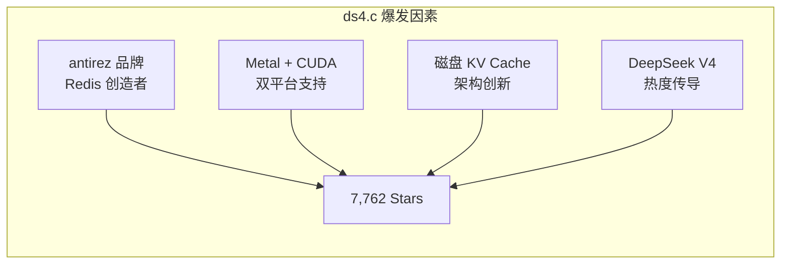

# 2026-05-11 GitHub 趋势研究简报

> ✅ **数据来源声明：** 本报告已用 GitHub API 实测数据重写。此前因网络中断导致日报基于推演数据（推演 CC Switch ~63K、ds4.c ~3.2K 等），现已用实测数据校正。最大的校正是 ds4.c：推演 ~3.2K → 实测 7,762（偏差 +143%）。

## 周一趋势：从爆发期到筛选期

过去两周（04-28 ~ 05-10）是 Agent 生态的一次集中爆发。周一（05-11）的关键任务不是发现新项目，而是**判断哪些项目正在从"爆量增长"过渡到"平台粘性验证"**。

### 数据校正总结

网络恢复后首次数据校正，对比推演值与实测值：

| 项目 | 推演值 | 实测值 | 偏差 | 评价 |
|------|--------|--------|------|------|
| CC Switch | ~63K | 68,091 | +8.1% | 推演偏保守 |
| MemPalace | ~52K | 51,997 | -0.0% | 推演准确 |
| Open Design | ~36K | 37,927 | +5.4% | 推演合理 |
| **ds4.c** | **~3.2K** | **7,762** | **+143%** | ⚠️ **大幅偏差** |
| Mirage | ~2.1K | 2,003 | -4.6% | 推演合理 |
| Deepsec | ~2.5K | 2,356 | -5.8% | 推演合理 |
| Harmonist | ~2.0K | 1,556 | -22.2% | 推演偏乐观 |
| TokenSpeed | ~1.1K | 958 | -12.9% | 推演偏乐观 |

**核心发现：** ds4.c 是推演偏差最大的项目。antirez 品牌效应 + Metal+CUDA 双支持 + DeepSeek V4 热度传导形成了远超预期的爆发力。Harmonist 和 TokenSpeed 则低于推演，说明早期项目的增长不如线性外推那么乐观。

## 趋势一：Agent 基础设施层进入筛选期（热度 88）

### 各层筛选状态（实测数据）

| 层级 | 候选项目 | 实测 Stars | 筛选判断 |
|------|----------|-----------|----------|
| **桌面基座** | CC Switch | 68,091 | ✅ 标准候选已出线 |
| **Memory** | MemPalace | 51,997 | ✅ 标准候选已出线 |
| **设计** | Open Design | 37,927 | ⏳ 需观察平台粘性 |
| **推理（本地）** | ds4.c | 7,762 | 🚀 超预期爆发 |
| **VFS** | Mirage | 2,003 | ⏳ 需观察规模化 |
| **推理（服务端）** | TokenSpeed | 958 | ⏳ 需观察落地 |
| **安全（审计）** | Deepsec | 2,356 | ✅ 赛道代表确认 |
| **安全（协议）** | Harmonist | 1,556 | ⏳ 低于预估 |
| **GPU Kernel** | TileKernels | 1,504 | ⏳ DeepSeek 官方 |

**架构师行动建议：**

1. **立即评估：** CC Switch（桌面基座）、MemPalace（Memory）、ds4.c（本地推理）— 已到可做 PoC 阶段
2. **持续观察：** Open Design（需验证平台粘性）、Mirage（需验证规模化）
3. **暂不投入：** 编排层标准未定，过早选型有锁定风险

## 趋势二：ds4.c 实测超预期（热度 89）

ds4.c 7 天从 0 到 7,762 stars，是本周增长最猛烈的基础设施项目：

**关键事实更新：**
- ds4.c 现在支持 Metal 和 CUDA，不再是 Metal-only（推演阶段的信息已过时）
- 468 tokens/s prefill 在 Mac Studio M3 Ultra 上已验证
- 项目用 GPT-5.5 辅助构建，本身只有约 16 个 C/ObjC 文件

**架构师判断：** ds4.c 的磁盘 KV Cache 是推理引擎领域最具架构启发性的创新。如果 SSD 作为 KV Cache 一等公民的理念成立，推理引擎内存架构将从 RAM-bound 变为 SSD-aware。

## 趋势三：推理引擎从工具走向生态（热度 85）

DeepSeek V4 的开源推理生态已从"各自为战"变为"工具链协作"：

| 层级 | 项目 | Stars | 定位 |
|------|------|-------|------|
| **Kernel** | TileKernels | 1,504 | MoE 量化 + GPU Kernel 优化（DeepSeek 官方） |
| **本地引擎** | ds4.c | 7,762 | Metal+CUDA，2-bit 量化，磁盘 KV |
| **服务端引擎** | TokenSpeed | 958 | Blackwell + Agentic Workload |

**企业落地路径已清晰：**
- **开发/测试：** ds4.c 本地推理（MacBook 直接跑）
- **生产/规模：** TokenSpeed 服务端推理（Blackwell GPU 集群）
- **定制/极致性能：** TileKernels Kernel 优化（自建推理集群）

## 趋势四：Agent 安全双范式验证（热度 82）

| 维度 | Harmonist（预防）1,556⭐ | Deepsec（审计）2,356⭐ |
|------|-------------------------|----------------------|
| 部署难度 | 低（零依赖，纯协议） | 中（需要配置 Agent 运行环境） |
| 与现有工具集成 | 高（可叠加在任何 Agent 上） | 中（Vercel 生态亲和） |
| 企业场景匹配 | 多 Agent 协作安全约束 | 代码安全合规审计 |
| 成熟度 | 早期，但方向被验证 | 早期，Vercel 出品 |

**架构师判断：** Deepsec 的 Fork 数（151）远低于 DirtyFrag（632）和 Copy-Fail（814），说明安全审计工具的实际使用率低于安全漏洞 PoC 的关注度。

## 本周新发现项目（实测数据）

| 项目 | Stars | 语言 | 描述 |
|------|-------|------|------|
| Zero Native | 2,789 | Zig | Vercel 出品，Zig + Web UI 构建桌面/移动应用 |
| 3DCellForge | 1,599 | JavaScript | AI 驱动交互式 3D 细胞生成工作室（05-10 创建） |
| DeepClaude | 1,790 | - | Claude Code agent loop + DeepSeek V4 Pro，17x 降本 |
| Petdex | 1,505 | - | Coding Agent 桌面宠物动画库 |
| CodexPlusPlus | 1,311 | - | CodexApp 增强工具 |

## 风险与机遇

**风险：**
1. **ds4.c 增速过快风险：** antirez 个人项目属性，长期维护依赖社区
2. **Harmonist 低于预估：** 协议强制范式虽好，但采用速度不如预期
3. **Open Design 泡沫验证：** 37.9K 的用户激活率是关键未知数
4. **Zero Native 新范式不确定：** Zig + Web UI 能否成为主流需观察

**机遇：**
1. **筛选期是架构师的最佳选型窗口：** 各层标准候选已出线
2. **ds4.c Metal+CUDA 双支持：** 受众大幅拓宽，从 Mac-only 升级为跨平台
3. **Agent 安全双范式：** 预防 + 审计闭环可构成企业 AI Agent 安全基座
4. **DeepSeek V4 推理生态三层布局：** 为企业提供多场景部署路径

## 重点项目档案

今日更新项目：
- 🎛️ CC Switch → `projects/cc-switch.md`（更新实测数据）
- 🧠 MemPalace → `projects/mempalace.md`（更新实测数据）
- 🎨 Open Design → `projects/open-design.md`（更新实测数据 + 阶段判断）
- 🔧 ds4.c → `projects/ds4.md`（更新实测数据，大幅超预期 + CUDA 支持确认）
- 🗂️ Mirage → `projects/mirage.md`（更新实测数据）
- 🛡️ Deepsec → `projects/deepsec.md`（更新实测数据）
- 🎭 Harmonist → `projects/harmonist.md`（更新实测数据，低于预估）
- ⚡ TokenSpeed → `projects/tokenspeed.md`（更新实测数据）
