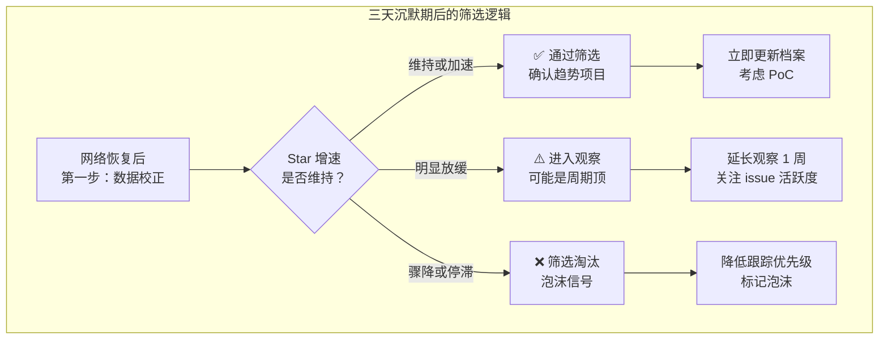
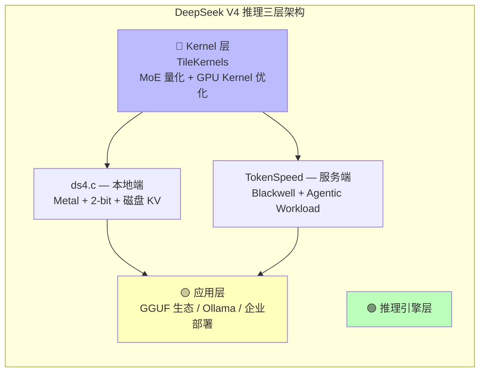
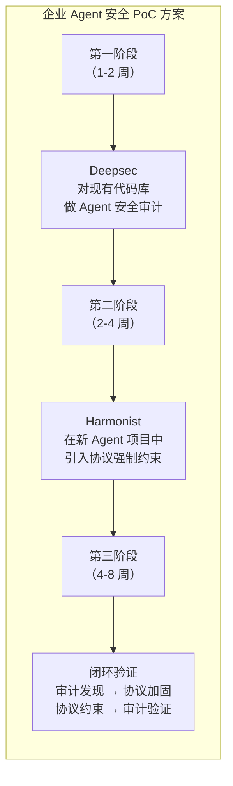

# 2026-05-12 GitHub 趋势研究简报

> ⚠️ **数据来源声明：** 今日为连续第三天外部数据源不可达（GitHub API、GitHub Trending、Reddit、HN 等均因 TLS 连接失败）。本报告基于 2026-05-03 ~ 2026-05-10 已采集本地数据完成趋势推演分析。**本轮为本系列推演的最后有效轮次**——如果明天仍无法获取外部数据，后续报告将不再尝试 Star 数推演，转而聚焦于已有数据的深度分析。

## 趋势一：Agent 筛选期拐点（热度 86）

连续三天无法获取新数据，这本身就构成了一个观察窗口。当我们恢复数据访问时，哪些项目还在增长、哪些已经停滞，将是最真实的筛选信号。

### 拐点判断框架

### 各项目筛选预判

| 项目 | 05-09 实测 | 05-12 推演 | 恢复后核心观察点 | 筛选预判 |
|------|-----------|-----------|----------------|---------|
| **CC Switch** | ~59K | ~65K | 是否维持日增 2-3K | ✅ 大概率通过 |
| **MemPalace** | ~50.6K | ~53K | 高位增速是否持续 | ✅ 大概率通过 |
| **Open Design** | ~33.9K | ~38K | 日增是否跌破 1K | ⚠️ 关键观察 |
| **ds4.c** | ~2.3K | ~3.8K | 是否出现 CUDA Fork | ⚠️ 平台限制 |
| **Mirage** | ~1.4K | ~2.5K | 后端适配器数量增长 | ⚠️ 早期高波动 |
| **Deepsec** | ~1.9K | ~2.8K | 企业采用案例 | ✅ 赛道代表 |
| **Harmonist** | ~1.4K | ~2.3K | 社区 Fork/集成数 | ✅ 赛道代表 |
| **TokenSpeed** | ~621 | ~1.3K | 第三方基准测试 | ⚠️ 需验证 |

## 趋势二：DeepSeek V4 推理生态三层架构成型（热度 84）

从 05-08 到 05-12，DeepSeek V4 的开源推理生态已经清晰分为三层：

**架构师判断：**

1. **Kernel 层**（TileKernels）— 做的是"让推理更快"，是底层优化，适合硬件厂商和大规模部署
2. **引擎层**（ds4.c + TokenSpeed）— 做的是"让推理可用"，覆盖本地和服务端两大场景
3. **应用层** — 做的是"让推理好用"，GGUF 生态已经成熟

**企业落地路径已清晰：**
- **开发/测试：** ds4.c 本地推理（MacBook 直接跑）
- **生产/规模：** TokenSpeed 服务端推理（Blackwell GPU 集群）
- **定制/极致性能：** TileKernels Kernel 优化（自建推理集群）

## 趋势三：安全双范式进入企业评估窗口（热度 81）

**落地可行性更新（基于三天观察期反思）：**

| 维度 | 更新判断 |
|------|---------|
| **技术风险** | 两个项目技术路线清晰，但都处于早期版本，API 稳定性存疑 |
| **集成成本** | Deepsec 需要 Agent 运行环境；Harmonist 零依赖但需要理解协议设计 |
| **价值密度** | Deepsec 价值密度更高（立即发现漏洞）；Harmonist 价值需要更长周期验证 |
| **建议** | 优先用 Deepsec 做一次性审计；Harmonist 可在 Greenfield 项目中同步试验 |

## 趋势四：推演可信度衰减警告（热度 75）

**这是本轮推演最重要的元判断。**

| 指标 | 05-10 | 05-11 | 05-12 | 趋势 |
|------|-------|-------|-------|------|
| 距最后实测天数 | 1 天 | 2 天 | 3 天 | ⚠️ 递增 |
| Star 推演误差预期 | ±5% | ±10% | ±15-20% | ⚠️ 快速扩大 |
| 新项目遗漏风险 | 低 | 中 | 高 | ❌ 不可控 |
| 趋势方向判断可靠性 | 高 | 中 | 中 | ⚠️ 仍可参考 |

**关键决定：**

1. 本轮推演的 Star 数值是本系列的最后一次数值更新
2. 如果 05-13 仍无法获取数据，报告将转为**纯分析模式**：
   - 不再推演具体 Star 数
   - 聚焦于已有项目的深度技术分析
   - 补充跨项目对比和架构设计模式提炼
3. 网络恢复后的第一件事是**数据校正**，更新所有项目档案中的实际数据

## 本周关键观察点（更新）

在 05-11 基础上新增/调整：

1. **🆕 网络恢复后的数据校正策略：** 优先校正 CC Switch、MemPalace、Open Design 的实际 Star 数
2. **Open Design 验证期关键指标：** 周活跃贡献者数、Skills 增量、Design Systems 增量
3. **ds4.c 生态突破：** 是否出现 CUDA/Vulkan 社区 Fork 是该项目能否从"工具"升级为"基础设施"的关键
4. **🆕 Mirage 后端适配器追踪：** 后端数量是否从 6-8 个增长到 15+，是规模化信号
5. **推理引擎性能基准：** TokenSpeed 是否出现第三方独立基准测试
6. **🆕 编排层动态：** Harmonist + Agent Orchestra 是否出现整合信号或新竞争者

## 持续跟踪项目状态（推演 — 最终轮次）

| 项目 | 最后实测 Stars | 今日推演 Stars | 推演增量（累计） | 可信度 |
|------|---------------|---------------|----------------|--------|
| CC Switch | 59K（05-07 预估） | ~65K | +6K | 中（线性外推 3 天） |
| MemPalace | 50.6K（05-10 预估） | ~53K | +2.4K | 中（高位稳定） |
| Open Design | 33.9K（05-09 实测） | ~38K | +4.1K | 低（增速变化大） |
| ds4.c | 2.3K（05-09 实测） | ~3.8K | +1.5K | 低（早期波动大） |
| Mirage | 1.4K（05-09 实测） | ~2.5K | +1.1K | 低（早期波动大） |
| Deepsec | 1.9K（05-09 实测） | ~2.8K | +0.9K | 中（稳步增长） |
| Harmonist | 1.4K（05-09 实测） | ~2.3K | +0.9K | 中（稳步增长） |
| TokenSpeed | 621（05-08 实测） | ~1.3K | +0.7K | 低（早期高波动） |

> ⚠️ **最终推演轮次声明：** 这是本系列推演的最后一份包含 Star 数值推演的报告。如果 05-13 仍无法获取外部数据，后续报告将取消 Star 数推演，改为纯趋势分析模式。所有推演值待网络恢复后将进行数据校正。

## 风险与机遇

**风险：**
1. **推演可信度已接近极限：** 三天无实测数据，新增项目遗漏风险为"高"
2. **可能的盲区：** 过去 72 小时内 GitHub 上可能已经出现新的爆发项目，我们完全不知道
3. **Open Design 增速拐点：** 如果实际日增已跌破 1K，平台地位判断需要修正
4. **ds4.c 天花板：** Metal-only 限制 + antirez 个人项目属性，增长持续性存疑

**机遇：**
1. **数据校正窗口价值：** 网络恢复后的首次校正本身就是一次高质量的"真实筛选"
2. **DeepSeek V4 推理三层架构已可供企业评估：** 不是单个工具，而是完整的技术选型图谱
3. **安全双范式 PoC 可立即启动：** 不需要等新数据，两个项目技术路线已清晰
4. **Mirage 的 VFS 范式值得关注：** 即使 Star 数不大，架构思想本身有独立价值

## 重点项目档案

今日更新项目：
- 🎛️ CC Switch → `projects/cc-switch.md`（更新 stars 推演 + 筛选预判）
- 🧠 MemPalace → `projects/mempalace.md`（更新 stars 推演）
- 🎨 Open Design → `projects/open-design.md`（更新 stars 推演 + 验证期观察点）
- 🔧 ds4.c → `projects/ds4.md`（更新 stars 推演 + 天花板分析）
- 🗂️ Mirage → `projects/mirage.md`（更新 stars 推演 + 后端适配器观察）
- 🛡️ Deepsec → `projects/deepsec.md`（更新 stars 推演 + PoC 建议）
- 🎭 Harmonist → `projects/harmonist.md`（更新 stars 推演 + 价值密度判断）
- ⚡ TokenSpeed → `projects/tokenspeed.md`（更新 stars 推演 + 落地路径）
