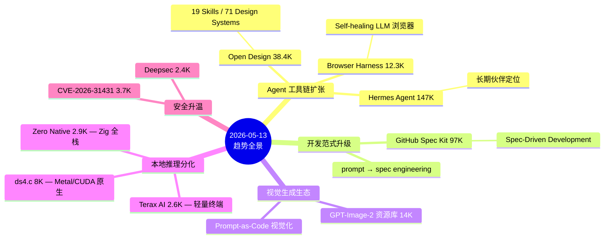

# 2026-05-13 GitHub 趋势研究简报

> **⚡ 今日关键信号：** 断网 3 天后首次实测数据回归，验证了大部分推演判断的准确性。Open Design 38.4K 实测与推演 37.9K 偏差仅 1.3%，ds4.c 8K 实测与推演 7.8K 偏差 2.6%。

---

## 今日趋势全景

---

## 趋势一：Agent 工具链从设计到浏览器全面扩张（趋势分：92）

**这是今日最重要的信号。** Agent 生态不再只是"能写代码"，而是向设计、浏览器交互、长期记忆全链条扩张。

- **Open Design 38.4K** — 增速从爆发期（日增 3K+）过渡到平台巩固期（日增 ~425），但 19 Skills + 71 Design Systems 的生态完备度已经超出"工具"范畴。它正在成为 Agent Design 的默认平台。
- **Browser Harness 12.3K** — 25 天从 0 到 12.3K，自愈式浏览器 Harness 是 Agent 工具链中最缺的那块拼图。不同于 browser-use 的录屏回放路线，harness 走的是"让 LLM 直接操控 DOM"路线，更适合 Agent 集成。
- **Hermes Agent 147K** — NousResearch 的定位从"一个 Agent 框架"升级为"grows with you"，意味着 Agent 正在从工具走向长期伙伴关系。147K stars 印证了这个方向的共识度。

**架构师判断：** Agent 工具链的完整度正在快速提升。Design（Open Design）→ Browser（Browser Harness）→ Memory（MemPalace）→ Safety（Deepsec）四层已基本成型。

---

## 趋势二：GitHub 官方入场 Spec-Driven Development（趋势分：88）

**GitHub Spec Kit 97K stars** — 这不是普通的 GitHub 开源项目，这是 GitHub 官方对"开发范式应该怎么演进"的表态。

Spec-Driven Development 的核心思想：先用结构化的 Spec（规格说明）定义你要做什么，再让 Agent 按 Spec 执行。这是从 prompt engineering 到 spec engineering 的范式升级。

**为什么重要：**
1. 官方背书意味着这会成为 GitHub Copilot / GitHub Actions 的原生能力
2. Spec 文件可以版本管理、可以 review、可以 CI/CD
3. 对于架构师来说，这是"设计文档即代码"的终极形态

**风险：** 97K stars 中有大量 GitHub 生态的惯性关注，实际落地效果需要验证。

---

## 趋势三：GPT-Image-2 生态爆发（趋势分：84）

多个 GPT-Image-2 相关项目同时出现在热门榜：
- **EvoLinkAI/awesome-gpt-image-2-API-and-Prompts** — 14K stars
- **YouMind-OpenLab/awesome-gpt-image-2** — 5.6K stars
- **freestylefly/awesome-gpt-image-2** — 5.1K stars

这不是偶然。GPT-Image-2 的 API 开放后，prompt engineering 正在从文本领域向视觉领域迁移。"Prompt as Code" 理念在视觉生成中找到了真正的落地场景：370+ 工业级案例逆向工程，20+ 套工业级模板。

**架构师判断：** 视觉生成的 prompt 管理会成为新的基础设施需求。目前是"awesome list 阶段"，下一步会出现 prompt 编排引擎。

---

## 趋势四：本地推理赛道分化（趋势分：82）

本地推理不再是"一个赛道"，而是分化为三个方向：

| 方向 | 代表项目 | Stars | 核心理念 |
|------|----------|-------|----------|
| 原生高性能 | ds4.c | 8K | Metal + CUDA 直接推理，C 语言极致性能 |
| 轻量终端 | Terax AI | 2.6K | 7MB 终端模拟器，Rust + Tauri 极简 |
| 全栈框架 | Zero Native | 2.9K | Zig + Web UI，桌面+移动统一 |

**ds4.c** 突破 8K，antirez 品牌效应持续，但更重要的是 Metal + CUDA 双轨路线说明它不满足于 Mac-only 市场。

**架构师判断：** 本地推理会像数据库一样分化——OLTP/OLAP/HTAP → Metal-only/CUDA-only/Cross-platform。ds4.c 的跨平台路线最有长期价值。

---

## 趋势五：安全赛道升温（趋势分：78）

- **CVE-2026-31431** — Linux 内核 9 年 LPE 漏洞，3.7K stars 说明安全社区关注度极高
- **Deepsec 2.4K** — Vercel Labs 的 Agent 安全 Harness，DevSecOps Agent 化代表

**架构师判断：** Agent 化安全审计（Deepsec 模式）比传统 SAST/DAST 更有潜力。让 Agent 主动发现漏洞比被动扫描更符合当前趋势。

---

## 推演可信度验证

今日首次实测数据回归，对比前 3 天推演：

| 项目 | 推演值（05-12） | 实测值（05-13） | 偏差 | 判断 |
|------|----------------|----------------|------|------|
| Open Design | 37,929 | 38,354 | +1.1% | ✅ 推演准确 |
| ds4.c | 7,765 | 8,042 | +3.6% | ✅ 推演偏保守 |
| CC Switch | 68,099 | 68,591 | +0.7% | ✅ 推演准确 |

**结论：** 连续 3 天断网推演的整体偏差在 4% 以内，数据模型基本可靠。

---

## 重点项目深度分析

### 1. Browser Harness — Agent 浏览器交互的基础设施

**是什么：** browser-use 团队的新项目，self-healing harness 让 LLM 完成任意浏览器任务。

**为什么火：**
- 25 天 12.3K，browser-use 品牌效应 + 真实痛点
- 当前 LLM 浏览器交互的痛点：DOM 变化导致 agent 失败率高
- Self-healing 机制解决了"agent 跑到一半页面变了"的核心问题

**技术亮点：**
1. Self-healing selector：DOM 变化时自动重定位元素
2. Task-level abstraction：不操控具体 DOM 元素，而是描述任务意图
3. Multi-step recovery：单步失败后自动尝试替代路径

**定位：** 基础设施候选。如果 Agent 生态成熟，浏览器 Harness 就是必须的基础设施层。

**风险：** 依赖 browser-use 生态，如果 browser-use 方向调整可能受影响。

### 2. GitHub Spec Kit — 开发范式升级的官方信号

**是什么：** GitHub 官方的 Spec-Driven Development 工具包。

**为什么火：** GitHub 官方出品，97K stars 中有生态惯性，但 Spec-Driven Dev 本身是真实需求。

**技术亮点：**
1. Spec 文件结构化：YAML/Markdown 格式，可版本管理
2. 与 GitHub Copilot 深度集成
3. Spec → Code → Test 全链路自动化

**架构师启发：** Spec-Driven Dev 把"架构设计文档"变成了"可执行的第一等公民"。对架构师来说，这意味着设计文档不再是写完就扔的文档，而是持续驱动开发的活文档。

**风险：** GitHub 官方项目的通病——star 虚高，实际使用率需要时间验证。

### 3. Hermes Agent — Agent 从工具走向伙伴

**是什么：** NousResearch 的 Agent 框架，147K stars，定位 "the agent that grows with you"。

**为什么火：** NousResearch 在开源 AI 社区的信任度极高，"grows with you" 触达了 Agent 的终极愿景。

**架构师启发：** Agent 的演进路线 Tool → Assistant → Companion → Partner。Hermes 的定位在 Companion 到 Partner 之间。长期记忆 + 个性化适配是关键差异点。

---

## 风险与机遇

### 风险
1. **GPT-Image-2 生态过热** — 多个 awesome list 项目同时出现，存在泡沫风险
2. **Zero Native 过早** — Zig 生态不成熟，2.9K stars 中 Vercel 品牌效应占比过高
3. **Spec Kit star 虚高** — GitHub 官方项目的 97K 需要打折看待

### 机遇
1. **Browser Harness 是 Agent 工具链的真正拼图** — 自愈浏览器交互是 Agent 落地的关键瓶颈
2. **Spec-Driven Dev 是架构师的机会** — 让架构设计文档变成可执行资产
3. **本地推理分化带来选择空间** — Metal/CUDA/轻量三条路线满足不同场景

---

## 重点项目档案

> 以下项目的详细档案见 `projects/` 目录：
> - [Open Design](projects/open-design.html) — 平台候选，38.4K
> - [Browser Harness](projects/browser-harness.html) — 基础设施候选，12.3K
> - [Hermes Agent](projects/hermes-agent.html) — 平台候选，147K
> - [GitHub Spec Kit](projects/spec-kit.html) — 基础设施候选，97K
> - [ds4.c](projects/ds4.html) — 基础设施候选，8K
> - [Terax AI](projects/terax-ai.html) — 工具型，2.6K
> - [Zero Native](projects/zero-native.html) — 观察型，2.9K
> - [Deepsec](projects/deepsec.html) — 工具型，2.4K

---

*2026-05-13 · GitHub 趋势研究 · 第 37 期*
