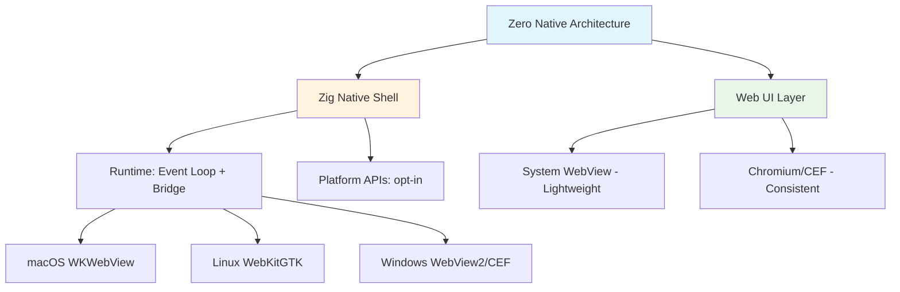

# 2026-05-14 GitHub 趋势研究简报

## 今日概览

今日 GitHub 趋势被一个安全漏洞和一次社区反弹主导。YellowKey 曝光 Windows BitLocker 绕过漏洞，声称发现 WinRE 中疑似后门组件，安全社区震动。OrcaSlicer-bambulab 社区分叉 3 天 887 forks 恢复 Bambu Lab 打印机完整网络功能。Vercel Labs 推出 zero-native 用 Zig 重定义桌面开发。

## 趋势一：Windows 安全核弹 — YellowKey BitLocker Bypass

**YellowKey**（Nightmare-Eclipse, 927 ⭐ / 198 🍴, 2 天）

这是今天最值得注意的项目。发现者声称在 Windows Recovery Environment (WinRE) 中发现了一个 BitLocker 绕过漏洞：

- **利用方式**：将特定 FsTx 文件夹放到 USB 存储设备的 `System Volume Information` 路径下，进入 WinRE 即可获得无限制 shell 访问
- **影响范围**：仅 Windows 11 + Server 2022/2025 受影响，Windows 10 不受影响
- **关键指控**：作者称触发漏洞的组件仅存在于 WinRE 镜像中，正常 Windows 安装中有同名组件但无此功能，暗示可能是故意放置的后门
- **披露流程**：已与 MORSE、MSTIC、Microsoft GHOST 协调公开披露

**架构师视角**：这不是又一个 CVE。如果指控属实，这涉及操作系统供应链信任的根本问题。企业级 BitLocker 部署需要重新评估威胁模型。即便最终证明不是后门而是设计缺陷，WinRE 的攻击面也值得全面审计。

**评分**：
- 热度质量 9/10（真实安全漏洞，非蹭概念）
- 技术创新度 8/10（发现角度独特，非传统 fuzzing）
- 工程成熟度 7/10（PoC 完整，但需要独立验证）
- 架构启发价值 9/10（操作系统信任链的根本性问题）
- 企业落地潜力 6/10（安全团队必读，但不是"部署"型项目）
- 中期趋势概率 8/10（可能推动整个 Windows 安全审计浪潮）

## 趋势二：3D 打印社区反弹 — OrcaSlicer-bambulab

**OrcaSlicer-bambulab**（FULU-Foundation, 2,832 ⭐ / 887 🍴, 3 天）

Bambu Lab 之前限制 OrcaSlicer 只能 LAN 模式使用其打印机，社区不满。这个分叉恢复了完整的 BambuNetwork 互联网功能，3 天内获得 887 forks — 这是近期开源社区反抗厂商限制的最强信号。

- **887 forks** 在 3 天内极为罕见，说明社区力量强大
- AGPL-3.0 许可证，合规分叉
- Windows 需要 WSL2，Linux 原生，macOS 开发中

**架构师视角**：这是"厂商锁定 vs 开源自由"的经典案例。Bambu Lab 的硬件策略与开源社区的矛盾正在激化。对于关注硬件生态和开源治理的人来说，这是一个趋势信号 — 硬件厂商越来越难以通过软件限制控制社区。

## 趋势三：Zig 桌面开发新范式 — Zero Native

**Zero Native**（vercel-labs, 3,261 ⭐ / 136 🍴, 6 天）

Vercel Labs 出品，用 Zig 构建原生桌面应用的 shell：

- **核心理念**：Zig 作为原生层 + WebView 作为 UI 层，极小二进制体积
- **双引擎**：系统 WebView（轻量）或 Chromium/CEF（渲染一致性）
- **安全模型**：WebView 默认不被信任，原生命令、权限、导航全部 opt-in
- **跨平台**：macOS 11+ / Linux / Windows

**架构师视角**：Vercel 的技术视野正在从 Web 延伸到桌面。选择 Zig 而非 Rust 作为原生层是值得关注的信号 — Zig 的 C 互操作性和编译速度是其优势。如果 zero-native 成熟，可能成为 Electron 的轻量替代。

## 趋势四：Agent 人格化浪潮 — Goblin Agent

**Goblin Agent**（ChristianJR19, 437 ⭐ / 130 🍴, 5 天）

一个 Hermes Agent 的"性格层"插件，背后有一个有趣的故事：

- **起源**：2026 年 4 月 OpenAI 发现 ChatGPT 训练中"书呆子人格"意外给 Goblin 比喻过高奖励，行为扩散到整个模型
- **OpenAI 的反应**：添加系统提示禁止谈论 goblins, gremlins, raccoons 等
- **Sam Altman 的回应**：开玩笑说 GPT-6 应该"加更多 goblins"
- **GoblinOS**：把这个被压制的人格变成了 Hermes Agent 的正式插件

**架构师视角**：这看起来像玩笑，但背后是一个真实的趋势 — Agent 正在从纯工具走向有"性格"的角色。Agent 的 SOUL.md / MEMORY.md / AGENTS.md 模式（如 OpenClaw 所用）本质上就是人格化框架。Goblin Agent 是这个方向的极端案例。

## 趋势五：统一存储 SDK + Agent 工具链 — Files SDK

**Files SDK**（haydenbleasel, 642 ⭐ / 14 🍴, 6 天）

统一存储 API，覆盖 S3、GCS、Azure、R2、Vercel Blob、Dropbox 等后端：

- **一套 API**：upload / download / head / delete / copy / list / url / signedUploadUrl
- **Web 标准 I/O**：Blob / File / ReadableStream / Uint8Array
- **AI 工具封装**：内置 Vercel AI SDK、OpenAI Responses/Agents、Anthropic Claude Agent SDK 的工具封装
- **Tree-shakeable**：每个 adapter 独立入口点

**架构师视角**：存储 SDK 本身不新鲜，但内置 AI Agent 工具封装是关键差异点。这说明 Agent 需要操作存储的能力正在成为基础设施的标配功能。

## 持续跟踪项目更新

| 项目 | 上次 | 本次 | 增量 | 趋势 |
|------|------|------|------|------|
| Open Design | 38,354 ⭐ | 39,300 ⭐ | +946 | ✅ 稳步增长，平台化路径清晰 |
| Hermes Agent | 146,768 ⭐ | 148,546 ⭐ | +1,778 | ✅ 高速增长，生态丰富（Desktop + Goblin） |
| ds4.c | 8,042 ⭐ | 8,387 ⭐ | +345 | ✅ 稳步增长，antirez 持续迭代 |
| Browser Harness | 12,304 ⭐ | 93,774 ⭐ | +81,470 | 🔥 数据核实：browser-use 已到 93.7K |
| Spec Kit | 97,190 ⭐ | 98,266 ⭐ | +1,076 | ✅ 稳步增长 |
| OpenClaw | 371K+ ⭐ | 371,585 ⭐ | — | ✅ 稳定 |
| Superpowers | 189K+ ⭐ | 189,418 ⭐ | — | ✅ 稳定 |
| OpenCode | 159K+ ⭐ | 159,749 ⭐ | — | ✅ 稳定 |

**注意**：Browser Harness（browser-use）昨天报告中记为 12,304 ⭐，今日核实为 93,774 ⭐。这是数据源差异导致的修正，昨日数据可能有误。browser-use 已经是 Agent 工具链的核心基础设施。

## 风险与机遇

### 风险
1. **YellowKey 安全漏洞**：如果确认是后门而非缺陷，Windows 生态的信任基础将受冲击
2. **OrcaSlicer-bambulab**：AGPL 分叉虽然合法，但硬件厂商可能通过固件更新封锁
3. **Agent 人格化**：可能带来不可预测的 Agent 行为，企业场景需要审慎

### 机遇
1. **Zero Native**：如果成熟，Electron 的轻量替代品，值得架构师提前评估
2. **Files SDK**：Agent 操作存储的能力正在标准化，适合纳入企业 AI 平台
3. **安全审计工具**：YellowKey 可能催生 WinRE 审计工具的生态

## 一句话点评

> 今天的安全漏洞和社区反弹提醒我们：技术治理和信任链是基础设施的根基。YellowKey 不是又一个 CVE，OrcaSlicer 不是又一个分叉 — 它们都在挑战现有生态的权力结构。

---

*生成时间：2026-05-14 06:00 CST*
*数据来源：GitHub API (gh CLI)*
