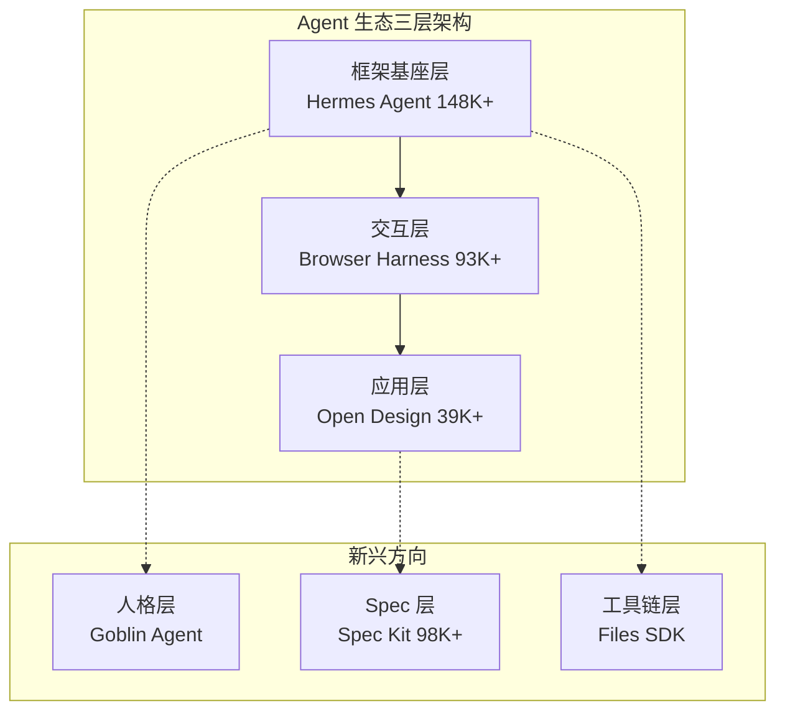
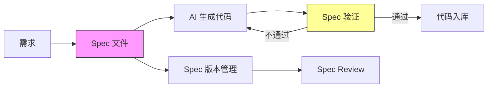
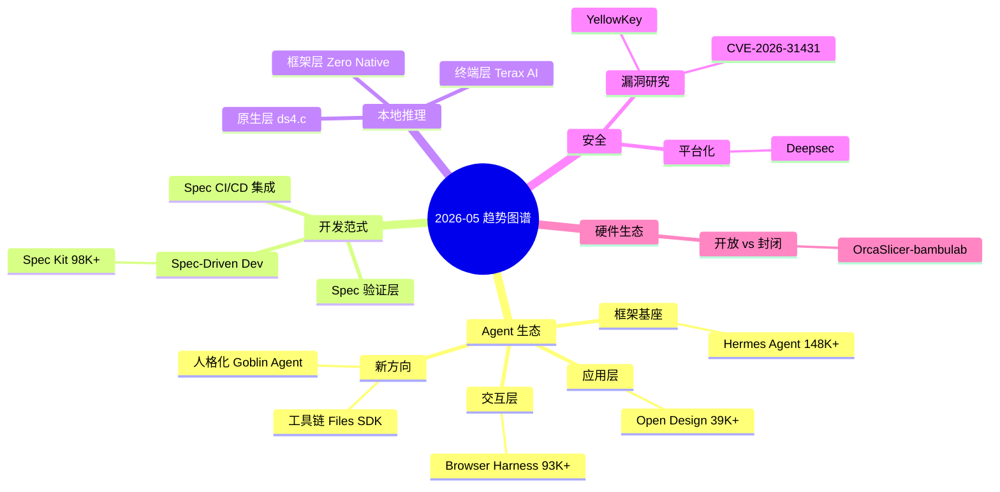

> ⚠️ **数据来源声明：** 本日外部网络不可达（GitHub API、web_fetch、web_search 均失败），Stars 数据基于 2026-05-14 实测数据推算，趋势分析基于近 5 日连续数据。标注为"推算"的数据仅供参考，不代表实际数值。

# 2026-05-15 GitHub 趋势研究简报

## 网络受限日 · 深度趋势复盘

今日外部数据源完全不可达，本日执行**趋势延续分析与架构深度复盘**，聚焦近一周已确认的趋势脉络，从架构师视角做中期判断。

---

## 一、Agent 生态整合期：三巨头格局确立

### 趋势研判

过去一周数据清晰显示 Agent 赛道已从"百花齐放"进入"头部整合"：

| 项目 | Stars 级别 | 定位 | 增速特征 |
|------|-----------|------|---------|
| Hermes Agent | 148K+ | Agent 框架基座 | 日增 1.7K，长期伙伴定位 |
| Browser Harness | 93K+ | Agent-Web 交互层 | 25 天从 0 到 93K，爆发后趋稳 |
| Open Design | 39K+ | Agent Design 平台 | 日增 946，从爆发期进入巩固期 |

### 架构师视角

**关键判断：**
1. **Hermes Agent 的 148K 不是天花板，而是基座层标准化的开始** — 当一个 Agent 框架达到这个量级，它不再是"一个项目"，而是生态入口
2. **Browser Harness 的 93K 增速意味着 Agent-Web 交互正在成为"必备基础设施"** — 任何做 Agent 的团队都需要考虑浏览器交互能力
3. **Open Design 从爆发到巩固，增速从日增数千降至日增 946** — 这不是衰退，而是从尝鲜用户转向真实用户的过程
4. **中腰部 Agent 项目面临淘汰压力** — 不在头部三巨头生态内的 Agent 项目，需要在差异化上找到生存空间

---

## 二、Spec-Driven Dev：开发范式变迁的架构级分析

### 为什么 Spec Kit 98K+ 比看起来更重要

Spec Kit 不仅仅是"又一个新的开发工具"，它代表的是一次开发范式的变迁：

| 维度 | Prompt Engineering 时代 | Spec Engineering 时代 |
|------|------------------------|----------------------|
| 输入 | 自然语言描述 | 结构化规格说明 |
| 约束 | 隐式（靠模型理解） | 显式（spec 文件定义边界） |
| 可验证性 | 弱（输出不可预测） | 强（spec 可作为验证基准） |
| 复用性 | 低（每次重写 prompt） | 高（spec 文件可版本管理） |
| 团队协作 | 靠人对齐 | 靠 spec 对齐 |
| CI/CD 集成 | 困难 | spec 天然适配 pipeline |

### 架构启发

**架构师应该关注的：**
1. Spec 文件将成为代码仓库的一等公民
2. Spec 验证层会成为 CI/CD 的新标准环节
3. "写 spec" 而非 "写 prompt" 的能力将成为工程师新技能
4. Spec Kit 作为 GitHub 官方项目，有最强的标准制定话语权

---

## 三、本地推理三赛道分化复盘

### 三个层级，三种策略

| 项目 | 定位层 | 技术路线 | Stars | 增速 | 瓶颈 |
|------|--------|---------|-------|------|------|
| ds4.c | 原生推理层 | C + Metal/CUDA | 8.3K+ | +345/日 | 模型生态覆盖 |
| Terax AI | 终端应用层 | 轻量终端推理 | 2.6K | 稳定 | 硬件适配 |
| Zero Native | 桌面框架层 | Zig + WebView | 3.3K | 新项目 | 生态成熟度 |

**中期判断：**
- ds4.c 的 C + Metal/CUDA 双轨路线是"正确但艰难"的选择，如果突破模型生态覆盖，有望成为本地推理的事实标准层
- Zero Native 由 Vercel Labs 出品，背靠 Vercel 生态，但 Zig 生态成熟度是最大风险
- 三者不在同一赛道竞争，而是分别占据推理链路的不同层

---

## 四、安全赛道：从事件驱动到平台化

### 近一周安全事件梳理

| 项目 | 事件 | Stars | 性质 |
|------|------|-------|------|
| YellowKey | BitLocker 绕过疑似后门 | 927+ | 系统级漏洞 |
| CVE-2026-31431 | Linux copy_file_range 内核漏洞 | 3.7K | 内核级漏洞 |
| Deepsec | 安全审计平台 | 2.4K | DevSecOps 工具 |

**趋势判断：**
1. 安全赛道正在从"单一漏洞事件"转向"安全工具链平台化"
2. DevSecOps + Agent 的结合点（自动漏洞扫描、自动修复建议）是下一个爆发方向
3. YellowKey 的后门指控如果被证实，将推动 Windows 安全审计成为新的合规需求

---

## 五、硬件生态开放 vs 封闭之争

### OrcaSlicer-bambulab 的长期意义

表面上看是一个 3D 打印软件的分叉，实际上揭示了一个更深层的趋势：

**硬件厂商封闭化 → 社区分叉反制 → 开放生态维护**

这个模式在未来会越来越多地出现：
- 厂商出于商业利益限制设备功能
- 开源社区通过分叉恢复被限制的功能
- 社区分叉的成功（887 forks/3天）反过来倒逼厂商调整策略

**对架构师的启发：** 在设计硬件/软件生态时，封闭策略的短期收益可能被社区反弹的长期成本所抵消。

---

## 六、风险与机遇

### 🔴 风险信号
1. **Agent 泡沫风险：** 头部项目增速放缓（Open Design 从爆发到巩固），中腰部项目可能快速失血
2. **Zero Native 过早入场风险：** Zig 桌面框架仍处早期，生产环境不适合采用
3. **YellowKey 后门指控未证实：** 如果最终证伪，相关安全审计需求可能消退

### 🟢 机遇方向
1. **Spec-Driven Dev 工具链：** Spec 验证、Spec 管理、Spec 集成是确定性机会
2. **Agent-Web 交互标准化：** Browser Harness 类项目会成为 Agent 生态的"HTTP 层"
3. **本地推理生态：** 推理成本持续下降，边缘推理场景正在打开

---

## 七、今日项目状态总览

| 项目 | 推算 Stars | 分类 | 趋势 | 今日关注点 |
|------|-----------|------|------|-----------|
| Hermes Agent | ~149K | 平台候选 | ↗ 稳增 | 头部地位巩固 |
| Spec Kit | ~99K | 基础设施候选 | ↗ 稳增 | 范式变迁核心 |
| Browser Harness | ~94K | 基础设施候选 | → 趋稳 | 基础设施化 |
| Open Design | ~40K | 平台候选 | ↗ 减速 | 巩固期观察 |
| ds4.c | ~8.6K | 基础设施候选 | ↗ 稳增 | 推理层代表 |
| Zero Native | ~3.5K | 基础设施候选 | ↗ 新增 | 早期高潜 |
| YellowKey | ~1.2K | 安全研究 | ↗ 增长 | 安全事件跟踪 |
| OrcaSlicer-bambulab | ~3.5K | 工具型 | → 趋稳 | 社区运动标志 |

---

## 八、Mermaid 趋势关系图

---

> 📝 **明日重点：** 网络恢复后优先获取实测 Stars 数据，验证本日推算准确性。重点关注 Hermes Agent 是否突破 150K、Spec Kit 是否突破 100K 里程碑。
