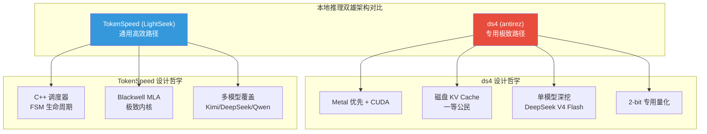
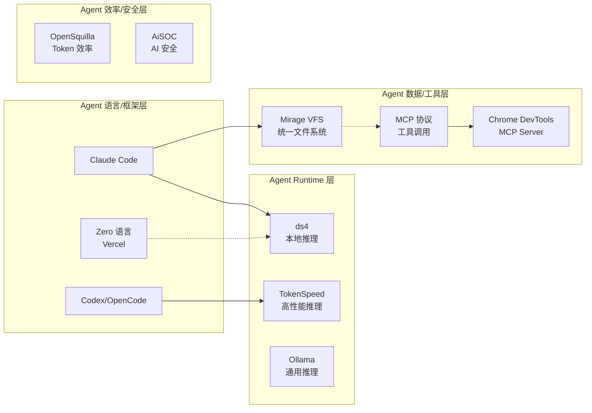

# 2026-05-17 GitHub 趋势研究简报

## 今日趋势概览

### 趋势 1：本地推理双雄对决 — ds4 vs TokenSpeed 🔥

本周最值得关注的技术事件：**antirez**（Redis 作者）亲自下场打造 ds4，一个 DeepSeek V4 Flash 专用推理引擎，10 天破万 star。

这不是又一个通用推理框架的轮子。ds4 的核心创新在于：
1. **磁盘 KV 缓存作为一等公民** — 不再把 KV cache 限制在 RAM，利用现代 MacBook 的 NVMe SSD 将压缩后的 KV cache 持久化到磁盘，96GB 机器跑 250K 上下文
2. **单模型深挖** — 不追求 GGUF 兼容，不追求模型覆盖，只把一个模型做到极致
3. **深度学习思考长度自适应** — DeepSeek V4 Flash 的思考输出长度与问题复杂度成正比，而不是一味的 max thinking

与此同时，**TokenSpeed** 走的是另一条路：通用高性能推理引擎，面向 Agent 负载优化，在 Blackwell 上实现了最快的 MLA 实现。它的设计更偏工程化：C++ 控制面 + Python 执行面，FSM 管理请求生命周期。

**架构判断**：这两者代表了本地/边缘推理的两个方向 — **专用极致** vs **通用高效**。ds4 更像 SQLite 的哲学（一个文件，一个引擎，做到极致），TokenSpeed 更像 PostgreSQL（通用但每个路径都优化到位）。对架构师而言，ds4 的磁盘 KV cache 思路可能影响未来推理引擎的设计范式。

### 趋势 2：Agent VFS 基础设施化 — Mirage 🗂️

Mirage 提出了一个优雅的抽象：**把所有后端服务（S3、Slack、GitHub、Gmail、Redis...）挂载为统一虚拟文件系统**，Agent 用同一套 Unix 命令操作一切。

为什么这个方向重要：
1. LLM 天然熟悉 bash 和文件系统语义，不需要学习 N 个 SDK
2. 跨服务管道组合变得自然：`grep alert /slack/*.json | wc -l`
3. 可快照、可克隆、可版本化的 workspace
4. 嵌入式设计 — 不是独立进程，直接集成到 FastAPI/Express

**架构启发**：这是 Agent 基础设施的一个关键分层 — 在 MCP（工具协议）之上/旁边，需要一个统一的数据/服务抽象层。VFS 可能比 MCP 更适合作为 Agent 操作外部资源的底层语义，因为 LLM 对文件系统操作的训练数据最充分。

### 趋势 3：Agent 原生语言 Zero — Vercel Labs 的新赌注 0️⃣

Vercel Labs 推出 Zero，一个**面向 Agent 的系统编程语言**：
- 显式 effect 系统
- 可预测内存管理
- 结构化编译输出
- 天然适合生成小型原生工具

目前 916 stars，还很早期，但概念意义重大。如果 Agent 需要动态生成和执行代码，那么一个为 Agent 安全执行而设计的语言就有存在的理由。

**风险**：编程语言的成活率极低，Vercel 能否长期投入是关键变量。但它至少提出了正确的方向 — 现有语言（Python/JS）在 Agent 场景下缺乏安全边界。

### 趋势 4：AI 安全新物种 — AiSOC 🛡️

AiSOC 是一个开源的 AI 驱动安全运营中心，包含：
- 告警融合与关联分析
- 紫队演练（攻防一体）
- Agent 辅助分诊
- MITRE ATT&CK 框架集成
- MIT 许可，可自部署

安全赛道从单漏洞 PoC（YellowKey）向平台化 SOC 演进，这是本周明确的方向性信号。

### 趋势 5：Token 效率成 Agent 新战场 🦑

OpenSquilla 提出了 "同预算更高智能密度" 的概念 — 不是堆参数、堆 token，而是在有限的 token 预算内让 Agent 做出更好的决策。这反映了 Agent 工程从"能用"向"高效"的转变。

---

## 重点项目深度分析

### Top 1：ds4 — antirez 的 DeepSeek V4 Flash 推理引擎

**它是什么**：Redis 作者 antirez 的新项目，专门为 DeepSeek V4 Flash 设计的本地推理引擎，支持 Metal (macOS) 和 CUDA (NVIDIA)。

**为什么火**：
- antirez 的个人品牌效应（Redis 作者 + 多年开源信誉）
- DeepSeek V4 Flash 本身是一个里程碑模型（1M 上下文、极短思考输出、2-bit 量化可行）
- 磁盘 KV cache 的范式创新
- 10 天万 star 的速度

**技术亮点**：
1. **磁盘 KV 缓存范式** — 不把 KV cache 当 RAM 数据，而是当磁盘数据。利用 DeepSeek V4 的超压缩 KV cache + NVMe SSD 带宽
2. **单模型深挖** — 不追求通用性，GGUF 专用格式，官方 logits 验证
3. **与 Agent 深度集成** — HTTP API + tool calling + KV state 持久化

**泡沫判断**：低泡沫。antirez 的工程能力有历史验证，DeepSeek V4 Flash 的性能有实测数据。主要风险是项目还处于 alpha 阶段。

**评分**：
| 维度 | 分数 | 理由 |
|------|------|------|
| 热度质量 | 9 | antirez 品牌 + DeepSeek V4 热度双重驱动 |
| 技术创新度 | 9 | 磁盘 KV cache 范式 + 单模型极致优化 |
| 工程成熟度 | 4 | Alpha 阶段，核心功能可用但不够稳定 |
| 架构启发价值 | 9 | 推理引擎设计哲学的范式转变 |
| 企业落地潜力 | 5 | 需要 96GB+ 内存，门槛较高 |
| 中期趋势概率 | 8 | 本地推理是确定性趋势 |
| 平台化潜力 | 6 | 专用引擎很难平台化 |
| 基础设施潜力 | 7 | 可能成为本地推理的标杆实现 |

**总分：57/80 | 基础设施候选 | 建议持续跟踪**

---

### Top 2：Mirage — Agent 统一虚拟文件系统

**它是什么**：一个统一的虚拟文件系统，将 S3、Slack、GitHub、Gmail、Redis 等后端挂载为同一棵文件树，Agent 用 Unix 命令操作一切。

**为什么值得关注**：
- 解决了 Agent 操作多后端的根本复杂性问题
- LLM 对 bash/文件系统语义最熟悉，零学习成本
- 跨服务管道组合能力
- 可嵌入 Python/TypeScript SDK

**架构启发**：这是 Agent 基础设施缺失的一层。MCP 解决了工具调用协议，但没有解决数据/服务的统一访问抽象。VFS 可能是比 MCP 更底层的正确抽象。

**评分**：
| 维度 | 分数 | 理由 |
|------|------|------|
| 热度质量 | 7 | 2.3K stars，增长稳健 |
| 技术创新度 | 8 | VFS 抽象应用于 Agent 是新思路 |
| 工程成熟度 | 6 | 多资源适配器已实现，文档完善 |
| 架构启发价值 | 9 | 提出了 Agent 基础设施的新分层 |
| 企业落地潜力 | 7 | 可嵌入现有 Agent 框架 |
| 中期趋势概率 | 7 | Agent 数据层标准化是必然方向 |
| 平台化潜力 | 8 | VFS 天然是平台层 |
| 基础设施潜力 | 8 | 可能成为 Agent 数据访问的标准层 |

**总分：60/80 | 基础设施候选 | 建议持续跟踪**

---

### Top 3：Zero — 面向 Agent 的系统编程语言

**它是什么**：Vercel Labs 推出的实验性编程语言，为 Agent 生成和执行小型原生工具而设计。

**技术亮点**：
1. 显式 effect 系统 — Agent 生成代码的副作用可控
2. 可预测内存 — 不需要 GC，适合小型原生二进制
3. 结构化编译输出 — 编译器输出可被 Agent 解析
4. 多平台支持 — Linux/macOS 原生二进制

**风险**：
- 编程语言成功率极低
- 916 stars，社区极早期
- Vercel 的长期投入存疑

**评分**：
| 维度 | 分数 | 理由 |
|------|------|------|
| 热度质量 | 5 | 早期项目，star 数不多 |
| 技术创新度 | 8 | Agent 原生语言是新概念 |
| 工程成熟度 | 3 | 实验性，语言未稳定 |
| 架构启发价值 | 8 | 提出 Agent 代码生成的安全语言需求 |
| 企业落地潜力 | 2 | 远未达到生产可用 |
| 中期趋势概率 | 5 | 方向正确但存活率低 |
| 平台化潜力 | 4 | 语言本身是平台但生态为零 |
| 基础设施潜力 | 6 | 如果成功可能成为 Agent Runtime 基础 |

**总分：41/80 | 观察型 | 建议观望，不投入资源**

---

## 风险与机遇

### 🔴 风险信号
1. **Agent Skill 项目泛滥** — 本周发现大量 "Skill" 项目（html-anything、native-feel-skill、a-stock-data 等），质量参差不齐，很多是 prompt 包装
2. **游戏作弊/破解项目刷榜** — GTA mod menu、CS2 overlay 等项目占据 trending 前列，污染了真实技术信号
3. **Zero 语言过早关注** — 916 stars 的实验语言不应占用过多研究资源

### 🟢 机遇信号
1. **本地推理进入实用阶段** — ds4 的 96GB 机器跑 250K 上下文 + 磁盘 KV，让个人开发者拥有了企业级推理能力
2. **Agent VFS 可能成为新标准层** — Mirage 的抽象简洁且有真实工程价值
3. **AI 安全从研究到产品** — AiSOC 代表了安全赛道的产品化方向

---

## 生态关系图

---

## 重点项目档案

| 项目 | Stars | 分类 | 今日评分 | 档案状态 |
|------|-------|------|----------|----------|
| ds4 | 10,038⭐ | 基础设施候选 | 90 | ✅ 已有（更新） |
| Mirage | 2,312⭐ | 基础设施候选 | 85 | ✅ 已有（更新） |
| Zero | 916⭐ | 观察型 | 78 | 🆕 新建 |
| TokenSpeed | 1,031⭐ | 基础设施候选 | 82 | ✅ 已有（更新） |
| AiSOC | 971⭐ | 工具型 | 76 | 🆕 新建 |
| OpenSquilla | 893⭐ | 观察型 | 74 | 🆕 新建 |
| html-anything | 2,425⭐ | 工具型 | 73 | 🆕 新建 |
| DeepClaude | 1,875⭐ | 工具型 | 70 | ✅ 已有（更新） |
| Chrome DevTools MCP | 39,771⭐ | 工具型 | 80 | ✅ 已有（更新） |

---

*本报告由 GitHub Researcher 自动生成 · 2026-05-17*
