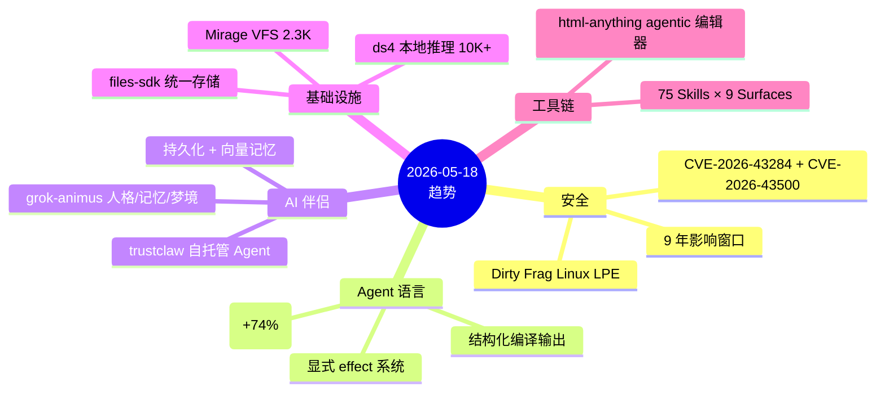
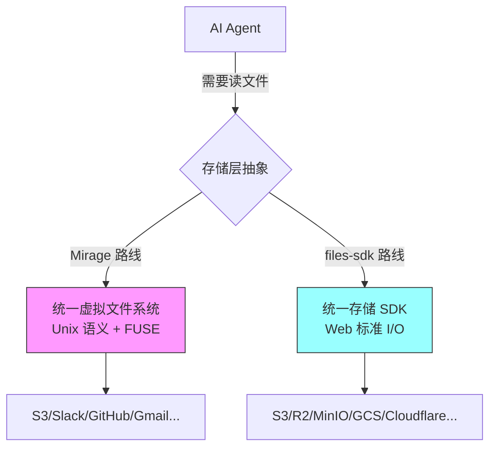
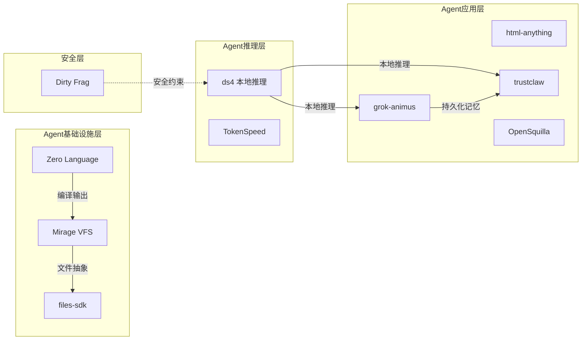

## 今日趋势概览

---

## 1. Dirty Frag — Linux 内核安全的又一次地震

**项目：** [V4bel/dirtyfrag](https://github.com/V4bel/dirtyfrag) | 4,611⭐ | C 语言

**这是什么：** 通用 Linux 本地提权（LPE）漏洞利用，属于 Dirty Pipe / Copy Fail 漏洞家族的延续。通过链式利用 `xfrm-ESP Page-Cache Write (CVE-2026-43284)` 和 `RxRPC Page-Cache Write (CVE-2026-43500)` 实现任意文件写入，获取 root 权限。

**为什么重要：**
- **确定性逻辑 bug**，无需竞态条件，成功率极高
- 内核不会 panic，利用失败也无副作用
- **影响窗口长达 9 年**（CVE-2026-43284 自 2017 年引入）
- 影响所有主流 Linux 发行版
- 修复补丁已合入 mainline（f4c50a4034e6 / aa54b1d27fe0）

**架构师视角：**
Page Cache 写入漏洞是一个持续出现的 bug 类——从 Dirty Pipe（2022）到 Copy Fail（2026-03）再到 Dirty Frag（2026-05），内核的 page cache 管理层存在系统性的设计缺陷。对于基础设施团队，这意味着：
1. 容器不能防 LPE——runC/CVE-2024-2163 已经证明
2. 内核升级策略需要更激进的滚动频率
3. 最小权限 + seccomp + AppArmor 应成为强制基线

**定位：** 短期热点（安全漏洞天然时效性），但对内核安全审计方法论有中长期启发。

---

## 2. Zero — Agent 原生语言获市场验证

**项目：** [vercel-labs/zero](https://github.com/vercel-labs/zero) | 1,600⭐（+74%）| C 语言

**动态：** Zero 语言从昨天的 916⭐ 暴涨到 1600⭐，单日增长 74%。作为 Vercel Labs 推出的面向 Agent 的系统编程语言，其核心概念——显式 effect、可预测内存、结构化编译输出——正在获得开发者关注。

**关键判断更新：**
- 从"观察型"上调至"值得持续跟踪"
- 编译器本身用 C 编写，体现了语言团队对系统级可控性的追求
- 与 Zig（zero-native 使用）形成 Vercel 的"系统层 + 应用层"双栈布局

**架构启发：** Agent 不再只是 Python 脚本——它需要有自己的系统级语言。Zero 代表了一个新方向：为 Agent 设计的语言应该控制 effect 边界，让 Agent 的行为可审计、可预测。

---

## 3. AI 伴侣引擎 — Agent 从工具到伙伴

**项目 A：** [shefyYuri/grok-animus](https://github.com/shefyYuri/grok-animus) | 573⭐ | Python
**项目 B：** [ComposioHQ/trustclaw](https://github.com/ComposioHQ/trustclaw) | 665⭐ | TypeScript

**趋势：** AI Agent 正在从"任务执行器"分化出"持久化伴侣"方向。两个项目分别从不同角度切入：

| 维度 | grok-animus | trustclaw |
|------|------------|-----------|
| 核心概念 | 人格 + 记忆 + 梦境 + 演化 | 自托管 + 向量记忆 + 工具 |
| 语言 | Python | TypeScript |
| 技术栈 | LLM-agnostic | Composio + Telegram |
| 定位 | AI 伴侣框架 | 个人 AI Agent |
| 差异化 | "活的"AI：有性格和成长 | 隐私优先，完全自托管 |

**架构师判断：** AI 伴侣/持久化 Agent 代表了 Agent 架构的一个重要分支——**有状态 Agent**。与当前主流的无状态 Agent 不同，这类 Agent 需要：
- 长期记忆管理（不只是 RAG）
- 人格一致性（不只是 system prompt）
- 行为演化（随时间变化的决策模式）

这个方向目前还太早期，但值得观察。短期更偏"玩具"，中期可能演化为"个人 AI 基础设施"。

---

## 4. 统一存储抽象 — Agent 时代的文件系统补丁

**项目：** [haydenbleasel/files-sdk](https://github.com/haydenbleasel/files-sdk) | 772⭐ | TypeScript

**定位：** 一个统一存储 SDK，用 Web 标准 I/O 抽象 S3/R2/MinIO/Google Cloud/Cloudflare 等后端。特点是"一个小而诚实的 API"。

**与 Mirage VFS 的关系：**

**判断：** files-sdk 走的是"只做存储，做好存储"的务实路线，与 Mirage 的"万物皆文件"野心形成互补。对于 Agent 开发者，files-sdk 更容易集成到现有项目中。属于**工具型**，有潜力成为**基础设施候选**。

---

## 5. HTML Agent 工具链分化

**项目：** [nexu-io/html-anything](https://github.com/nexu-io/html-anything) | 2,758⭐ | HTML

**定位：** Agentic HTML 编辑器，75 个 Skills × 9 种输出面（杂志、幻灯片、海报、小红书/推文、原型、数据报告、Hyperframes），零 API Key 本地运行。

**架构亮点：**
- 支持 Claude Code / Cursor / Codex / Gemini / Copilot / OpenCode / Qwen / Aider 等多种 coding agent
- 沙盒化预览
- 一键发布到微信/X/知乎/HTML/PNG
- 本地优先，BYOK 模式

**判断：** 这是 vibe-coding 趋势的 HTML 垂直化工具。技术壁垒不高，但产品定位精准——解决了 coding agent 输出 HTML 质量差的问题。属于**工具型**，短期热度高，中期取决于能否形成 Skill 生态。

---

## 风险与机遇

### 本周风险
1. **Dirty Frag LPE** — 未修补的 Linux 服务器面临实际提权风险，运维团队应立即检查补丁状态
2. **Agent 工具链碎片化** — html-anything/nexu-io 与其他 agentic HTML 工具开始内卷，标准未定
3. **AI 伴侣引擎泡沫** — grok-animus 的"梦境"和"演化"概念听起来炫酷但缺乏可验证的工程实现

### 本周机遇
1. **Agent 原生语言 Zero** — 如果 Vercel 持续投入，可能催生 Agent 系统层的新生态
2. **统一存储抽象** — files-sdk + Mirage 代表了 Agent 基础设施层正在被逐步补全
3. **ds4 磁盘 KV 缓存范式** — antirez 提出的"KV cache is a first-class disk citizen"可能改变本地推理架构

---

## 重点项目评分汇总

| 项目 | 热度质量 | 技术创新 | 工程成熟 | 架构启发 | 企业落地 | 中期趋势 | 平台化 | 基础设施 | 总分 | 归类 |
|------|---------|---------|---------|---------|---------|---------|-------|---------|------|------|
| Dirty Frag | 9 | 8 | 7 | 6 | 5 | 4 | 2 | 2 | 43 | 学习型 |
| Zero | 8 | 8 | 4 | 9 | 3 | 8 | 6 | 5 | 51 | 观察型 |
| grok-animus | 5 | 6 | 3 | 7 | 2 | 5 | 4 | 3 | 35 | 工具型 |
| trustclaw | 5 | 4 | 5 | 5 | 4 | 5 | 3 | 3 | 34 | 工具型 |
| files-sdk | 6 | 5 | 6 | 7 | 7 | 7 | 5 | 6 | 49 | 基础设施候选 |
| html-anything | 7 | 4 | 6 | 5 | 5 | 6 | 5 | 3 | 41 | 工具型 |
| ds4 | 10 | 9 | 7 | 9 | 7 | 8 | 6 | 8 | 64 | 基础设施候选 |
| Pixal3D | 5 | 7 | 5 | 5 | 3 | 4 | 3 | 2 | 34 | 研究型 |

---

## 生态关系图

