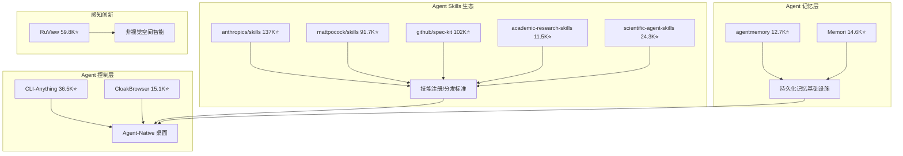
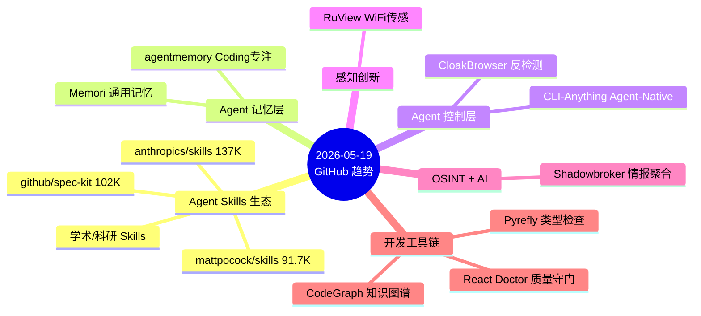

## 今日趋势概览

2026-05-19 的 GitHub Trending 呈现出三条清晰主线：

1. **Agent Skills 成为 GitHub 生态新货币** — anthropics/skills（137K⭐）、mattpocock/skills（91.7K⭐）、github/spec-kit（102K⭐）三大巨头同时登榜，加上学术/科研/专业领域的 Skills 仓库，Agent 技能生态从概念验证进入产业标准化阶段。
2. **Agent 记忆层从概念走向基建** — agentmemory 和 Memori 两个项目同时在榜，标志着「Agent 持久记忆」从论文讨论变成可部署的基础设施组件。
3. **CLI-Anything 引发 Agent-Native 范式讨论** — 36.5K⭐ 的 HKUDS 项目试图将所有桌面软件变为 Agent 可操控对象，CLI-Hub 模式值得关注。

---

## 重点趋势分析

### 1. Agent Skills 生态大爆发 ⭐ 95 分

**现象：** 6 个 Skills 相关项目同时登上今日 Trending，覆盖通用技能（anthropics/skills）、工程实践（mattpocock/skills）、规范驱动开发（spec-kit）、学术研究、科研分析、企业级安全注册等全谱系。

**判断：** 这不是巧合。Agent Skills 正在成为 AI 编程工具链的标准能力扩展机制。类似 npm 之于 Node.js，Skills 生态正在形成自己的注册表、分发机制和质量标准。

**关键问题：**
- tech-leads-club/agent-skills 提出了「安全验证的技能注册」概念，这是解决 Skills 供应链安全的关键一步
- anthropics/skills 和 github/spec-kit 代表了平台厂商的官方入场
- mattpocock/skills 则是个人开发者/咨询师驱动的长尾生态

**架构师启示：** Agent Skills 标准化窗口期已到。企业内部应开始评估：是接入公共 Skills 生态，还是建立私有 Skills Registry。

### 2. CLI-Anything：Agent-Native 桌面范式 ⭐ 92 分

HKUDS 出品，36.5K⭐，3.5K forks。核心思路：所有桌面软件都应该有 CLI 接口，这样 Agent 才能原生操控。CLI-Hub（clianything.cc）是社区贡献 CLI 包装器的市场。

**技术亮点：** 将"Agent-可操控性"作为软件可访问性的新维度，类似于无障碍（Accessibility）API 之于辅助技术。

**风险：** 桌面软件 GUI 变化频繁，CLI 包装器维护成本高。CLI-Hub 能否形成持续社区贡献是关键。

### 3. RuView：WiFi 传感突破 ⭐ 88 分

59.8K⭐，7.8K forks。将普通 WiFi 信号转化为空间智能，实现生命体征监测、存在检测。零视频、零摄像头、零隐私侵犯。

**技术判断：** 这是边缘感知领域的重要突破。WiFi CSI（Channel State Information）信号处理在学术界已有多年研究，但 RuView 是首个做到生产级可用的开源实现。Rust 实现保证了性能和安全性。

**平台化潜力：** 高。可作为智能家居、医疗监护、安防系统的感知层基础设施。

### 4. Agent Memory 持久化成新基建 ⭐ 86 分

agentmemory（12.7K⭐）专注 AI Coding Agent 的持久记忆，基于真实基准测试排名第一。Memori（14.6K⭐）提供更通用的 Agent 原生记忆基础设施。

**关键区别：**
- agentmemory：面向 Coding Agent 优化，更偏向开发工具链
- Memori：LLM 无关的结构化持久状态层，定位更底层

**架构师启示：** Agent 记忆层正在分化为「编码记忆」和「通用状态记忆」两条路线。类似数据库领域的 OLTP vs OLAP 分化。

### 5. Shadowbroker：OSINT + AI Agent ⭐ 80 分

7.7K⭐。聚合全球私人飞机轨迹、间谍卫星轨道、地震数据，统一接口，可接 AI Agent 做关联分析。

**判断：** 技术实现不算复杂，但数据聚合的广度和「让 AI 发现未被发现的相关性」的叙事极具传播力。偏工具型，不是基础设施。关注数据源的持续可用性和法律风险。

---

## 重点项目深度分析

### CLI-Anything — 深度评估

| 维度 | 评分 | 理由 |
|------|------|------|
| 热度质量 | 9 | 36.5K⭐，3.5K forks，Trending 多日 |
| 技术创新度 | 8 | CLI 包装思路不新，但 CLI-Hub 市场和 Agent-Native 定位是创新 |
| 工程成熟度 | 7 | 有 CLI-Hub 网站，但依赖社区贡献维护 |
| 架构启发价值 | 9 | Agent-Native 作为软件可访问性新维度的概念有价值 |
| 企业落地潜力 | 7 | 桌面自动化场景有限，Server/Cloud 场景更合适 |
| 中期趋势概率 | 8 | Agent-Native 是中期趋势，CLI 是手段之一 |
| 平台化潜力 | 8 | CLI-Hub 市场模式有平台潜力 |
| 基础设施潜力 | 6 | 更偏工具层，非基础设施 |

**总分：62/80**
**归类：平台候选**
**建议持续跟踪：是**

### RuView — 深度评估

| 维度 | 评分 | 理由 |
|------|------|------|
| 热度质量 | 9 | 59.8K⭐，7.8K forks，极高关注度 |
| 技术创新度 | 9 | WiFi CSI 信号处理做到生产级开源，突破性 |
| 工程成熟度 | 7 | Rust 实现，但实际部署场景验证还需时间 |
| 架构启发价值 | 9 | 非视觉感知是 IoT/边缘计算的新范式 |
| 企业落地潜力 | 7 | 智能家居/医疗监护/安防有真实需求 |
| 中期趋势概率 | 8 | 边缘感知 + 隐私计算是中期趋势 |
| 平台化潜力 | 8 | 可作为感知基础设施层 |
| 基础设施潜力 | 8 | 感知层基础设施定位清晰 |

**总分：65/80**
**归类：基础设施候选**
**建议持续跟踪：是**

---

## 其他值得关注的项目

| 项目 | Stars | 定位 | 一句话点评 |
|------|-------|------|-----------|
| OpenHuman | 16.9K | 个人 AI | Rust 实现的个人 AI 超级智能，隐私优先。概念大于实现，观察 |
| CloakBrowser | 15.1K | 反检测浏览器 | 通过全部 30 项机器人检测，Playwright 直接替换。爬虫/自动化刚需 |
| Pixelle-Video | 18.1K | AI 短视频引擎 | AI 全自动短视频引擎，内容生成赛道。泡沫风险中高 |
| AI-Trader | 18.1K | AI 交易 | HKUDS 出品全自动化 Agent 交易。学术验证价值大于生产价值 |
| Pyrefly | 6.2K | Python 类型检查 | Meta 出品，Rust 实现。pyright/mypy 的潜在替代者 |
| React Doctor | 10.2K | React 质量守门 | 专治 AI 写的烂 React。AI 编码质量工具链细分 |
| CodeGraph | 4.8K | 代码知识图谱 | 预索引减少 Coding Agent token 消耗。方向正确，工程待验证 |
| daily_stock_analysis | 37K | 股票分析 | LLM 驱动 A/H/美股分析，36K+ forks。实用工具，非基础设施 |
| supertonic | 8.3K | 端侧 TTS | 多语言端侧 TTS，ONNX 原生运行。嵌入式/移动场景有价值 |
| plausible/analytics | 25.9K | 隐私分析 | 老牌 Google Analytics 替代品，Elixir 实现。成熟稳定 |

---

## 风险与泡沫判断

1. **Agent Skills 泡沫信号：** 6 个 Skills 项目同日上榜，存在「人人做 Skills 注册」的跟风泡沫。最终存活 2-3 个标准化平台。注意区分「官方入口」（anthropics/github）和「个人品牌」（mattpocock）的定位差异。

2. **AI 短视频/交易类项目泡沫风险高：** Pixelle-Video、AI-Trader 等项目虽 Star 高，但赛道拥挤、变现路径不明，短期热度过高。

3. **WiFi 传感需要警惕「概念透支」：** RuView 的技术是真实的，但 59.8K⭐ 中有多少是「WiFi 能看穿墙壁」的猎奇驱动？需要关注实际部署案例。

4. **个人 AI（OpenHuman）概念模糊：** 16.9K⭐ 但定位描述过于抽象，需要看实际功能实现。

---

## 今日 Mermaid 图

