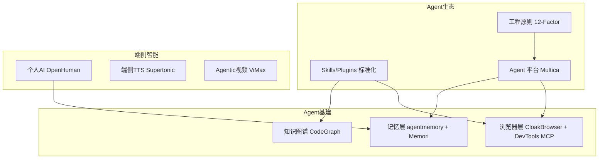

# 2026-05-22 GitHub 趋势研究简报

## 今日概览

GitHub Trending 本周持续围绕 **Agent 生态** 展开，但方向从「造轮子」转向「建标准」和「做基建」。

三个核心信号：
1. **Claude Skills 生态爆发**：CodeGraph、Claude Plugins Official、Superpowers、Academic Research Skills 多个仓库同时登顶，Agent 技能注册/分发/标准化正在形成产业共识
2. **Agent 工程化原则出现**：12-Factor Agents 21.5K⭐ 明确提出 LLM 软件工程 12 条原则，标志着 Agent 从实验走向工程
3. **Agent-Native 基础设施加速**：CloakBrowser 18K⭐ 反检测浏览器、Chrome DevTools MCP 40K⭐ Agent 浏览器操控，Agent 浏览器层正在成为基础设施

---

## 趋势一：Claude Skills/Plugins 生态持续分化与专业化

本周 GitHub Trending 出现了一个壮观现象：**5+ 个 Claude Code Skills/Plugins 仓库同时上榜**。

| 项目 | Stars | 周增速 | 定位 |
|------|-------|--------|------|
| obra/superpowers | 201K | +10.8K/周 | 技能框架 + 开发方法论 |
| anthropics/claude-plugins-official | 22.2K | +891/日 | Anthropic 官方插件目录 |
| colbymchenry/codegraph | 13.2K | +4.2K/日 | 预索引代码知识图谱 |
| Imbad0202/academic-research-skills | ~8.7K | +8.7K/周 | 学术研究技能 |
| multica-ai/andrej-karpathy-skills | ~2.6K | +2.6K/日 | Karpathy 风格编码技能 |

**判断：**
- Agent 技能市场正在从碎片化走向**标准化和专业化**
- Anthropic 官方介入是关键信号 — 类似 npm registry 对 Node.js 生态的意义
- CodeGraph 的「预索引代码知识图谱」思路值得关注 — 将代码理解从运行时移到构建时，降低 token 消耗

**架构师视角：** Skills 生态正在复现 npm/Docker Hub 的路径 — 先碎片，再标准，最后平台化。当前阶段最值得关注的是**标准化入口**（Claude Plugins Official）和**差异化能力**（CodeGraph 知识图谱）。

---

## 趋势二：Agent 工程原则确立 — 12-Factor Agents

**humanlayer/12-factor-agents** 21.5K⭐ 提出了构建 LLM 驱动软件的 12 条工程原则。

这不是又一个 Agent 框架，而是**Agent 世界的「12-Factor App」** — 从原则层面定义什么才是「好的 Agent 软件」。

**与 multica 30.6K⭐ 的关系：**
- 12-Factor Agents 是**理论框架** — 定义原则
- multica 是**实践平台** — 将编码 Agent 变成真正队友
- 两者互补：前者告诉你「应该怎么做」，后者让你「这样做」

**架构师视角：** 当一个领域开始出现「最佳实践」和「工程原则」类项目时，说明这个领域正在从实验期进入工程期。这对架构师的意义是：**现在可以开始基于这些原则做内部 Agent 架构评估了。**

---

## 趋势三：个人 AI 超级智能赛道形成

**OpenHuman** 24.7K⭐ 本周 +19K，增速惊人。

Rust 构建，隐私优先，定位为「个人 AI 超级智能」。从上周 16.9K 到本周 24.7K，增速保持高位。

**判断：**
- 个人 AI 操作系统赛道正在形成（OpenHuman、各种 Agent Memory 项目）
- 隐私优先 + 本地运行是核心卖点，与云端 AI 形成差异化
- 但目前仍偏**概念验证阶段**，真实使用场景和工程成熟度有待验证

---

## 趋势四：Agent-Native 浏览器层成基础设施

| 项目 | Stars | 定位 |
|------|-------|------|
| Chrome DevTools MCP | 40.4K | Agent 操控 Chrome DevTools |
| CloakBrowser | 18.2K | 隐身 Chromium，30/30 反检测 |

**判断：**
- Agent 需要操控浏览器已成刚需，但**反检测**是关键能力
- CloakBrowser 作为 Playwright 替代品，解决了 Agent 自动化最头疼的反爬问题
- Chrome DevTools MCP 让 Agent 直接接入浏览器开发工具，属于**开发者工具层**
- 两者组合 = Agent 拥有了「既能看又能躲」的浏览器能力

---

## 趋势五：端侧多模态进入实用阶段

- **Supertonic** 9.1K⭐：设备端多语言 TTS，ONNX 推理，Swift 构建
- **ViMax** 6.4K⭐：Agentic 视频生成（导演+编剧+制片人+视频生成一体）

端侧 TTS + Agentic 视频生成，标志着多模态能力从云端走向设备端。

---

## 重点项目深度分析

### 1. CodeGraph — 代码知识图谱降低 Agent Token 消耗

**它是什么：** 预索引的代码知识图谱，为 Claude Code、Codex、Cursor、OpenCode 提供更少的 token 消耗和更少的工具调用。

**为什么火：** 解决了 Coding Agent 的核心痛点 — 每次理解代码都要消耗大量 token 和工具调用。CodeGraph 将代码理解移到**构建时**，运行时直接查询预构建的知识图谱。

**技术亮点：**
- 预索引而非运行时分析
- 支持 Claude Code、Codex、Cursor、OpenCode 多个 Agent
- 100% 本地运行

**定位：** 工具型 → 可能演进为平台候选

**风险：** 知识图谱的维护成本、大型仓库的索引效率、与 IDE 内置能力的竞争

---

### 2. 12-Factor Agents — Agent 工程化的里程碑

**它是什么：** 构建足够好到可以交给专业用户使用的 LLM 驱动软件的 12 条工程原则。

**为什么重要：** 这是 Agent 领域的「12-Factor App」时刻。当社区开始定义工程原则时，意味着领域正在成熟。

**对架构师的价值：**
- 可以作为内部 Agent 项目评估的 checklist
- 可以作为团队 Agent 开发规范的起点
- 明确了 Agent 软件的「好」是什么

---

### 3. Multica — 编码 Agent 变成真正队友

**它是什么：** 开源托管 Agent 平台，将编码 Agent 转化为真正的队友 — 分配任务、跟踪进度、复合输出。

**为什么火：** 当前大部分编码 Agent 是「单人模式」— 一个人给 Agent 下指令。Multica 让多个 Agent 协作，像一个真正的开发团队。

**技术亮点：**
- Go 构建，高性能
- 任务分配 + 进度跟踪 + 复合输出
- 开源可自托管

---

## 风险与机遇

### 机遇
1. **Agent Skills 标准化**：Anthropic 官方介入 Skills 目录，标准化窗口已打开
2. **Agent 工程原则**：12-Factor Agents 提供了架构评估框架
3. **端侧多模态**：Supertonic 证明 TTS 可以完全本地化

### 风险
1. **Skills 生态泡沫**：太多 Skills 仓库同时出现，部分可能是蹭概念
2. **OpenHuman 过热**：周增 19K 但缺乏真实使用场景验证
3. **Agent 浏览器层碎片化**：CloakBrowser + Chrome DevTools MCP + 多个 Browser Use 项目，尚未收敛

---

## 重点项目档案

- 🕸️ [CodeGraph](projects/codegraph.html) — 预索引代码知识图谱
- 🔌 [Claude Plugins Official](projects/claude-plugins-official.html) — Anthropic 官方插件目录
- 📐 [12-Factor Agents](projects/12-factor-agents.html) — Agent 工程 12 条原则
- 🧬 [OpenHuman](projects/openhuman.html) — 个人 AI 超级智能（更新）
- 🤝 [Multica](projects/multica-ai.html) — 托管 Agent 平台（更新）
- 🎭 [CloakBrowser](projects/cloakbrowser.html) — 隐身 Chromium（更新）
- 🔊 [Supertonic](projects/supertonic.html) — 设备端多语言 TTS

---

## 本周趋势关系图

