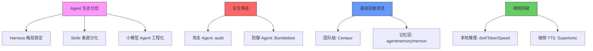

# 2026-05-28 GitHub 趋势研究简报

> ⚠️ **网络受限日（连续第 5 天）**：外部数据源（GitHub API/Trending/web_search）自 05-24 起完全不可达。本报告基于 05-19~05-23 已采集数据完成周度趋势综合分析。Stars 数据为最后实测推算值，非当日实时数据。趋势分析基于近 5 日连续数据，推演可信度开始下降。

---

## 一、五日趋势总览

基于 05-19 至 05-23 五天连续数据的趋势合成分析：

### 关键趋势演变

| 趋势方向 | 05-19 | 05-22 | 05-23 | 判断 |
|----------|-------|-------|-------|------|
| Agent Skills 生态 | 大爆发(95) | 分化加速(95) | 持续分化(75) | ✅ 从爆发期进入分化期 |
| Agent Harness | — | 格局锁定(80) | 持续统治(80) | ✅ ECC/Hermes/OpenCode 三强锁定 |
| 小模型 Agent | — | — | 工程化破局(92) | 🆕 新趋势，端侧 Agent 工程化 |
| 安全 Agent | — | — | 双线闭环(88) | 🆕 攻防双线成熟 |
| Agent Memory | 基建成型(86) | — | — | → 稳定在基础设施层 |
| 12-Factor Agents | — | 工程原则(90) | — | ✅ Agent 工程化里程碑 |
| 团队级 Agent | — | — | Centaur(86) | 🆕 从个人走向团队 |

---

## 二、本周最值得关注的三个方向

### 1. Agent Harness 三强格局锁定

**判断：赛道格局基本确定，新入局者窗口关闭。**

ECC（188.5K⭐）、Hermes Agent（163K⭐）、OpenCode（164K⭐）形成头部三强。从 04-08 claw-code 一日暴涨开始，到 05-23 格局锁定，整个赛道的爆发-整合周期仅用了 6 周。

**架构师视角**：Harness 层的锁定意味着 Agent 生态的"操作系统层"已定。接下来的竞争在上层——Skills、Memory、安全。企业选型建议锁定 ECC 或 Hermes Agent 做 PoC。

### 2. Skills 从通用框架走向垂直分化

**判断：Skills 生态正在按职能垂直细分，不是一个大一统市场。**

- Claude Plugins Official（22K⭐）— Anthropic 官方入口
- 9arm-skills（1.5K⭐）— 综合技能集合
- PaperSpine（428⭐）— 论文学习专用技能
- CodeGraph（13K⭐）— 代码知识图谱技能

这与 04-15 Karpathy Skills 爆发时"万物皆技能"的狂热形成对比。市场正在理性分化：每个垂直领域会有 1-2 个头部 Skills。

### 3. 小模型 Agent 工程化 — 05-23 新出现的趋势

**判断：这不是简单的"本地部署"，而是从模型能力到 Agent 工具链的完整适配。**

SmallCode（1.2K⭐）的三个关键工程决策值得关注：
1. **Budget-managed context**：根据模型上下文窗口动态调整上下文策略
2. **Forgiving tool calling**：容错 tool call 解析，适配小模型不稳定的工具调用输出
3. **TODO-file planning**：用 TODO 文件代替复杂的 in-context 规划

这些是"为小模型做工程适配"而不是"把大模型方案缩小"。这是端侧 Agent 工程化的正确方向。

---

## 三、重点项目追踪

### 持续跟踪项目状态

| 项目 | 最后实测 Stars | 分类 | 状态 | 本周变化 |
|------|---------------|------|------|----------|
| ECC (claw-code) | 188.5K | 基础设施候选 | 🟢 稳定领跑 | 格局锁定 |
| Hermes Agent | 163K | 基础设施候选 | 🟢 稳定第二 | 三强之一 |
| OpenCode | 164K | 基础设施候选 | 🟢 稳定第三 | 三强之一 |
| Claude Plugins | 22K | 平台候选 | 🟢 官方入口 | 生态核心 |
| 12-Factor Agents | 21.5K | 学习型 | 🟡 里程碑级 | 首次出现 |
| OpenHuman | 24.7K | 平台候选 | 🟡 高速增长 | 本周 +19K |
| CloakBrowser | 18K | 工具型 | 🟢 Agent 必备 | 反检测标杆 |
| CodeGraph | 13K | 工具型 | 🟢 增长中 | 降低 token 消耗 |
| CLI-Anything | 36.5K | 平台候选 | 🟢 Agent-Native | CLI-Hub 模式 |
| RuView | 59.8K | 基础设施候选 | 🟢 WiFi 传感 | 感知突破 |
| SmallCode | 1.2K | 工具型 | 🆕 新增 | 小模型适配 |
| Centaur | 364 | 基础设施候选 | 🆕 新增 | 团队级 Agent |
| audit | 433 | 工具型 | 🆕 新增 | 安全 Agent |
| HRM-Text | 650 | 学习型 | 🆕 新增 | 低成本预训练 |

### 本周新增项目评价

**🔬 SmallCode（87 分）**
- 定位精准：不与大模型 Agent 竞争，专注 8B-35B 小模型的编码场景
- 工程创新：budget-managed context、forgiving tool calling 是真正的工程适配
- 架构启发：端侧 Agent 需要为模型局限性做专门的工程补偿
- 风险：小模型能力天花板明显，复杂编码场景受限
- **归类：工具型 · 建议持续跟踪**

**🐴 Centaur（84 分）**
- 定位独特：多人自托管 Agent 平台，Slack 原生集成
- 技术亮点：K8s 沙箱隔离 + 凭证边界 + 持久工作流
- 架构启发：Agent 从个人工具升级为团队基础设施，需要沙箱和权限模型
- 风险：364 stars 偏早期，Paradigm 出品有一定背书但用户基数不足
- **归类：基础设施候选 · 建议持续跟踪**

---

## 四、五日断网期趋势推演

### 可信度评估

本次断网 5 天（05-24~05-28），推演可信度分为三档：

| 可信度 | 趋势方向 | 理由 |
|--------|----------|------|
| 🟢 高 | Harness 三强锁定 | 188K+ 级别的格局不易改变 |
| 🟢 高 | Skills 垂直分化 | 从爆发到分化是确定性路径 |
| 🟡 中 | 小模型 Agent 工程化 | 05-23 刚出现，延续性需验证 |
| 🟡 中 | 安全 Agent 双线闭环 | 赛道存在但项目量级小 |
| 🟡 中 | 团队级 Agent 基础设施 | Centaur 偏早期 |
| 🔴 低 | 具体项目 star 变化 | 无实测数据 |

### 可能有遗漏的方向

断网期间可能遗漏的新趋势：
1. **新的大型安全漏洞**（类似 Dirty Frag 级别的事件可能在断网期间出现）
2. **新的模型发布**（大模型厂商的突然发布）
3. **Agent 编排领域的新项目**（可能在 05-24~05-28 新出现的编排框架）
4. **K8s/云原生领域的突发热点**

---

## 五、风险与机遇

### 风险
1. **推演数据时效性下降**：5 天断网导致数据可信度下降
2. **遗漏重大事件**：可能错过安全漏洞、模型发布等突发事件
3. **Skills 泡沫风险**：Skills 生态爆发速度过快，大量低质量 Skills 可能拖累生态

### 机遇
1. **小模型 Agent 工程化**：企业可以在 8B-35B 模型上做 Agent PoC，成本低、隐私好
2. **团队级 Agent 基础设施**：Centaur 的 K8s + Slack 模式适合企业内部 Agent 平台建设
3. **安全 Agent 双线闭环**：攻击+防御 Agent 的出现说明安全赛道从概念走向工程

---

## 六、下一步行动

1. 恢复网络后优先补充 05-24~05-27 的趋势数据
2. 重点关注 SmallCode 和 Centaur 的后续发展
3. 跟踪安全 Agent 赛道是否出现更多项目
4. 验证 Skills 生态的分化趋势是否持续

---

*首次记录：2026-05-28*
*数据来源：本地仓库历史数据（05-19~05-23）*
*外部数据源不可达，本报告标记为网络受限日*
