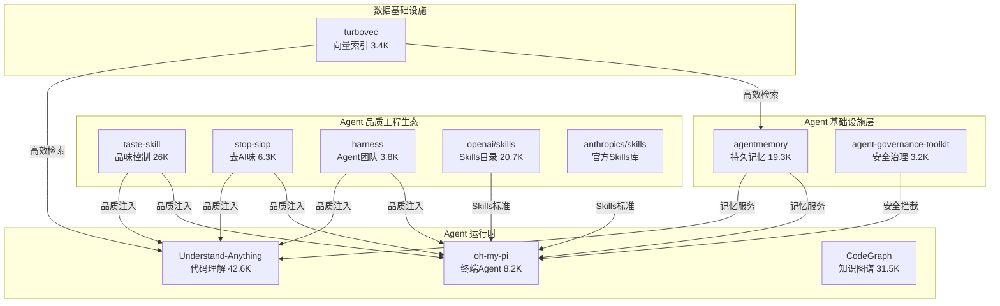

# 2026-05-29 GitHub 趋势研究简报

## 今日宏观判断

**Agent 生态正式进入「品质工程」阶段。** 本周 Trending 最显著的特征不是新模型或新框架，而是大量 Agent Skills 品质控制工具同时爆发：taste-skill（让 AI 有品味）、stop-slop（去除 AI 味）、harness（设计领域 Agent 团队）、openai/skills（OpenAI 官方 Skills 目录）、anthropics/skills（Anthropic 官方 Skills 仓库）。这意味着 Agent 从「能用」向「好用」的拐点已经到来。

**Agent 记忆层开始标准化。** agentmemory 19.3K 冲刺，基于 iii 引擎，通过 MCP/Hooks/Plugin 三种方式接入所有主流 Agent，正在成为 Agent 记忆的事实标准层。

**终端 Agent 竞争升级到 IDE 级别。** oh-my-pi 不满足于只是 CLI wrapper，而是将 LSP、DAP、Python sandbox、Browser 全部内置，定义了「终端里的 IDE」这个新形态。

---

## 趋势 1：Agent Skills 大爆发 — 品质控制成为刚需

### 现象
今日 GitHub Trending 前 15 名中，至少 5 个项目直接与 Agent 输出品质相关：

| 项目 | Stars | 周增速 | 定位 |
|------|-------|--------|------|
| taste-skill | 26.2K | +5.8K | 让 AI 有好品味 |
| stop-slop | 6.3K | +1.7K | 去除 AI 痕迹 |
| harness | 3.8K | 新增 | Meta-skill 设计 Agent 团队 |
| openai/skills | 20.7K | +883 | OpenAI 官方 Skills 目录 |
| anthropics/skills | 新增 | — | Anthropic 官方 Skills 仓库 |

### 判断
1. **这不是泡沫，是刚需。** 随着 Agent 进入生产环境，输出品质（代码风格、文本自然度、安全合规）成为第一优先级。企业不会接受一个「能工作但很丑」的 Agent。
2. **Skills 正在从「增强」变为「标配」。** taste-skill 一周涨 5.8K，说明开发者对 AI 输出的「塑料味」容忍度在快速下降。
3. **openai/skills + anthropics/skills 的出现，标志着 Skills 正式成为 Agent 生态的一等公民。** 这不是社区项目，是平台级标准。

### 架构师视角
如果你的团队在用 Claude Code / Codex / Cursor，现在就应该评估 taste-skill 和 stop-slop 是否能纳入开发流程。这不是可选项，是 Agent 工程化的必经之路。

---

## 趋势 2：agentmemory — Agent 记忆层标准化

### 核心数据
- **19.3K stars，本周 +3.8K**
- 支持 Claude Code / Codex CLI / Copilot CLI / Cursor / Gemini CLI / OpenClaw / Hermes / pi / OpenCode / Cline / Goose
- 三种接入方式：MCP Server、Hooks、Native Plugin
- 基于 [iii 引擎](https://github.com/iii-hq/iii)

### 为什么重要
Agent 最大的工程问题之一是**无状态**。每次对话都从零开始，无法记住上次做过什么、用户偏好是什么、项目上下文是什么。agentmemory 通过统一的记忆服务层解决了这个问题。

它不是简单的向量存储，而是实现了：
- 会话级 + 跨会话持久记忆
- 置信度评分 + 生命周期管理
- 知识图谱 + 混合搜索
- 实时 Viewer 可视化

### 判断
- **基础设施候选。** 记忆层是 Agent 的水电煤
- 与 iii 引擎的绑定既是优势（强大底层）也是风险（依赖第三方）
- 19.3K 的增速说明市场对 Agent 记忆的需求非常强烈

---

## 趋势 3：oh-my-pi — 终端 Agent IDE 化

### 核心数据
- **8.2K stars，本周 +2.5K**
- 40+ LLM providers、32 内置工具、13 LSP ops、27 DAP ops
- Rust + TypeScript，~27K 行 Rust 核心
- Hash-Anchored Edits 创新（编辑精度大幅提升）

### 技术亮点
1. **Hash-Anchored Edits**：不是传统 diff/patch，而是基于文件内容 hash 的精准定位编辑，Grok Code Fast 1 的通过率从 6.7% 提升到 68.3%
2. **持久 Python + Bun Worker**：Agent 内部有持久运行的 Python 和 JS 运行时，可以回调 Agent 自身的工具（read/search/task）
3. **LSP/DAP 全集成**：不是调用外部 LSP，而是把 IDE 的 LSP/DAP 能力内置到 Agent 中。Rename 操作走 `workspace/willRenameFiles`，重导出、barrel 文件、aliased imports 全部自动更新
4. **TTSR（Think-Then-Steer-and-Resume）**：规则注入不打断对话流，regex 匹配后 mid-token 中断注入

### 架构师视角
oh-my-pi 代表了终端 Agent 的下一代形态：**不是 CLI wrapper，而是 IDE 级开发环境**。它把 VS Code 级别的能力装进了终端。这个方向值得所有做 DevEx 的团队关注。

---

## 趋势 4：Microsoft Agent Governance Toolkit — Agent 安全基础设施

### 核心数据
- **3.2K stars，本周 +1.3K**
- 覆盖 OWASP Agentic Top 10 全部 10 项
- 确定性安全拦截（不是 prompt 级安全）
- Python / npm / NuGet 三平台 SDK

### 为什么值得关注
Microsoft 明确指出：**prompt 级安全是「礼貌请求」，不是「控制面」**。OWASP LLM01:2025 明确说「目前不清楚是否有万无一失的 prompt 注入防护方法」。JailbreakBench 上，自适应攻击对前沿模型达到近 100% 攻击成功率。

AGT 的方法是：在工具调用、消息发送、Agent 委托之前，用确定性代码拦截。被 AGT Kernel 拒绝的操作不是「不太可能」，而是**结构上不可能**。

### 判断
- **企业落地价值极高。** 任何在考虑 Agent 生产部署的团队都需要这个
- 这是 Agent 从「原型」到「生产」的关键桥梁
- Microsoft 出品，工程质量和长期维护有保障

---

## 趋势 5：turbovec — Rust 向量索引新势力

### 核心数据
- **3.4K stars，本周 +2K**
- 10M 文档从 31GB 压缩到 4GB
- 击败 FAISS IndexPQFastScan 12-20%（ARM）
- Google Research TurboQuant 算法
- Rust + Python bindings，支持 LangChain / LlamaIndex / Haystack / Agno

### 判断
- 解决了 RAG 系统中内存占用这个真实痛点
- 纯本地、无外部服务依赖，适合隐私敏感场景
- 在线 ingest（无需训练/重建索引）是实用性关键
- 3.4K 但周增速 2K，成长性极高

---

## 持续跟踪项目动态

| 项目 | 今日 Stars | 变化 | 状态 |
|------|-----------|------|------|
| Understand-Anything | 42.6K | +3.8K/day | 📈 持续霸榜 |
| MoneyPrinterTurbo | 66K | +4.7K/day | 📈 重回榜首 |
| CodeGraph | 31.5K | 稳定 | ✅ 高位稳定 |
| RuView | 67.3K | 稳定 | ✅ 高位稳定 |
| knowledge-work-plugins | 17.7K | 稳定 | ✅ 稳定增长 |
| taste-skill | 26.2K | +2.2K/day | 🔥 爆发 |
| openhuman | 29.2K | +5.7K/week | 📈 强劲 |

---

## 风险与机遇

### 泡沫警示
- **taste-skill / stop-slop 类项目属于「体验增强」，非核心基础设施。** 如果 LLM 本身的输出品质提升（如 Claude 4、GPT-5），这类工具的价值会被压缩。
- **agentmemory 与 iii 引擎的绑定**需要持续观察 iii 的独立健康度。

### 机遇识别
- **Agent Skills 标准化是大趋势**，openai/skills + anthropics/skills + cursor/plugins 三方标准化并行，最终会收敛。现在介入有机会参与标准制定。
- **Agent 治理（Governance）** 是企业 Agent 落地的最后一公里，microsoft/agent-governance-toolkit 可能成为行业标配。
- **Rust 在 AI Infra 中的渗透加速**：turbovec、oh-my-pi（Rust core）、RuView、iii 都是 Rust 实现。

---

## 重点项目评分汇总

### taste-skill
| 维度 | 分 | 理由 |
|------|---|------|
| 热度质量 | 8 | +5.8K/week，26K 总量，增速健康 |
| 技术创新度 | 5 | 本质是 prompt engineering + 规则文件，无技术创新 |
| 工程成熟度 | 7 | 简洁有效，即装即用 |
| 架构启发价值 | 6 | 启发 Agent 品质控制的必要性 |
| 企业落地潜力 | 7 | 所有使用 Agent 的团队都可用 |
| 中期趋势概率 | 7 | 品质控制是长期需求 |
| 平台化潜力 | 3 | 单一功能，无平台空间 |
| 基础设施潜力 | 4 | 非基础设施，依赖 LLM 进化 |
| **总分** | **47** | **工具型 · 建议跟踪** |

### agentmemory
| 维度 | 分 | 理由 |
|------|---|------|
| 热度质量 | 9 | 19.3K +3.8K/week，增速极快 |
| 技术创新度 | 7 | 统一记忆服务 + 置信度 + 生命周期 |
| 工程成熟度 | 8 | 多平台接入、实时 Viewer、完整 API |
| 架构启发价值 | 9 | Agent 记忆层标准化的方向性启发 |
| 企业落地潜力 | 9 | 所有 Agent 都需要记忆 |
| 中期趋势概率 | 9 | 记忆是 Agent 从玩具到工具的关键 |
| 平台化潜力 | 8 | 记忆服务天然是平台 |
| 基础设施潜力 | 9 | 水电煤级别 |
| **总分** | **68** | **基础设施候选 · 强烈建议跟踪** |

### oh-my-pi
| 维度 | 分 | 理由 |
|------|---|------|
| 热度质量 | 8 | 8.2K +2.5K/week |
| 技术创新度 | 9 | Hash-Anchored Edits + TTSR + LSP/DAP 内置 |
| 工程成熟度 | 8 | 27K 行 Rust 核心，多 provider 支持 |
| 架构启发价值 | 9 | 终端 Agent IDE 化的方向性启发 |
| 企业落地潜力 | 7 | 需要团队适应终端为主的工作流 |
| 中期趋势概率 | 8 | 终端 IDE 化是明确趋势 |
| 平台化潜力 | 7 | 可成为 Agent 运行时平台 |
| 基础设施潜力 | 7 | Agent 开发工具链的核心组件 |
| **总分** | **63** | **工具型偏平台 · 建议持续跟踪** |

### microsoft/agent-governance-toolkit
| 维度 | 分 | 理由 |
|------|---|------|
| 热度质量 | 7 | 3.2K +1.3K/week |
| 技术创新度 | 7 | 确定性拦截 + OWASP 全覆盖 |
| 工程成熟度 | 8 | Microsoft 出品，三平台 SDK |
| 架构启发价值 | 9 | Agent 安全的架构范式启发 |
| 企业落地潜力 | 10 | 企业 Agent 部署的必选项 |
| 中期趋势概率 | 9 | Agent 治理是合规刚需 |
| 平台化潜力 | 8 | 治理框架天然是平台层 |
| 基础设施潜力 | 9 | Agent 安全基础设施 |
| **总分** | **67** | **基础设施候选 · 强烈建议 PoC** |

### turbovec
| 维度 | 分 | 理由 |
|------|---|------|
| 热度质量 | 7 | 3.4K +2K/week，增速高 |
| 技术创新度 | 8 | TurboQuant 算法，击败 FAISS |
| 工程成熟度 | 7 | API 简洁，多框架集成 |
| 架构启发价值 | 7 | 向量索引的量化优化思路 |
| 企业落地潜力 | 8 | RAG 系统直接收益 |
| 中期趋势概率 | 8 | 向量检索是 AI Infra 核心组件 |
| 平台化潜力 | 6 | 索引库，非平台 |
| 基础设施潜力 | 8 | RAG 栈的基础组件 |
| **总分** | **59** | **工具型偏基础设施 · 建议评估** |
