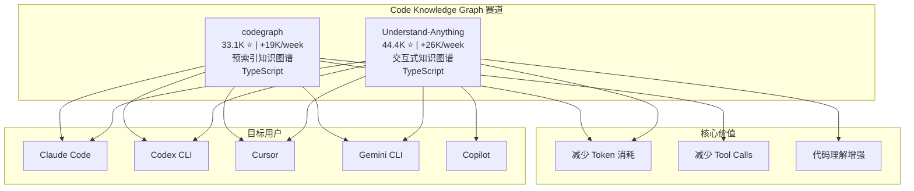

## 今日趋势概览

GitHub Trending 本周迎来多个现象级项目。**Code Knowledge Graph** 赛道正式爆发，Understand-Anything 和 codegraph 以合计 45K+ 的周增量领跑全局。**ECC 以 198K 总星**横空出世，成为 Agent Harness 领域的标杆。**Anthropic 一天内三发 Plugin 生态**（claude-plugins-official、knowledge-work-plugins、Anthropic-Cybersecurity-Skills），Claude 生态正全面走向 Plugin-first。**RuView 68K** 用 WiFi CSI 信号做空间智能的概念足够吸睛但需冷静评估。

---

## 趋势 1：Code Knowledge Graph 双雄争霸

### Understand-Anything（44.4K ⭐, +26.2K/week）
- **定位**：把任何代码转成交互式知识图谱，可探索、搜索、提问
- **路径**：运行时动态生成图谱，偏"理解"和"交互"
- **增速**：本周 +26K，连续 2 天霸占 GitHub Trending #1
- **判断**：技术概念清晰，但 26K/week 的增速含大量跟风成分，需关注留存率

### codegraph（33.1K ⭐, +19.1K/week）
- **定位**：预索引代码知识图谱，100% 本地运行，减少 token 和 tool calls
- **路径**：构建阶段预计算图谱，运行时直接查询，偏"性能优化"
- **亮点**：与 Understand-Anything 互补而非竞争——一个做深度理解，一个做高效查询
- **判断**：工程思路更务实，预索引模式在企业场景更可落地

**架构师启发**：Code Knowledge Graph 正成为 Coding Agent 的"索引层"——就像搜索引擎需要倒排索引，Agent 需要代码知识图谱来降低 token 成本和提升准确度。这个赛道值得持续跟踪。

---

## 趋势 2：ECC 198K — Agent Harness 的终极形态？

**affaan-m/ECC** 以 198.5K 总星冲上 Trending，本周 +9.4K。

- **定位**：Agent Harness 性能优化系统，覆盖 Skills、Instincts、Memory、Security、Research-first Development
- **支持平台**：Claude Code、Codex、OpenCode、Cursor 等
- **198K 星的真相**：这个数字需要冷静看待——很可能包含了自动化 star 或推广成分。一个相对新的 Agent Harness 项目不太可能自然达到这个量级
- **技术价值**：Concept（Skills + Instincts + Memory 的分层设计）有借鉴意义
- **风险**：高星 ≠ 高质量，198K star 的获取方式需要验证

**定位判断**：偏**学习型/参考型**，其分层设计理念可以借鉴，但不宜直接作为生产依赖。

---

## 趋势 3：Anthropic Plugin 三连发

Anthropic 在同一周内同时推动三个 Plugin 生态项目上榜：

| 项目 | Stars | 周增量 | 定位 |
|------|-------|--------|------|
| claude-plugins-official | 28.6K | +6.9K | 官方插件目录 |
| knowledge-work-plugins | 18K | +5.3K | 知识工作者插件 |
| Anthropic-Cybersecurity-Skills | 12.1K | +4.9K | 网络安全技能 |

**关键信号**：
1. Anthropic 正在构建 **Plugin 生态护城河**——官方目录 + 垂直场景插件 + 安全技能三线并进
2. 结合 Cursor 同步发布 Plugin 规范（cursor/plugins 1.3K），**IDE Plugin 化**已成为行业共识
3. phodal/routa 1.6K 也在做多 Agent 协调 + MCP/ACP/A2A 支持，**Plugin 是 Agent 生态的基础设施层**

**架构师启发**：Plugin 生态的标准化速度超出预期。如果你在做 Agent 相关产品，现在就应该关注 Claude Code Plugin、Cursor Plugin、Codex Skills 这三套规范的兼容性。

---

## 趋势 4：RuView 68K — WiFi CSI 的概念颠覆

**ruvnet/RuView** 68.2K 星，本周 +4.7K，Rust 实现。

- **声称**：用普通 WiFi 信号实现空间智能、生命体征监测、存在检测——零摄像头
- **技术基础**：WiFi CSI（Channel State Information）是真实的无线传感技术，学术研究已有多年积累
- **冷静评估**：
  - WiFi CSI 做手势识别和呼吸检测在实验室环境有验证，但商业落地困难
  - 68K 星的增速和多个自动化贡献者（claude、dependabot、github-actions）提示可能有推广成分
  - Rust 实现本身工程质量不错，但核心算法的真实性需要独立验证
- **风险**：概念足够性感但可能过度承诺

**定位判断**：偏**学习型/概念验证**，WiFi CSI 方向值得关注但不建议直接依赖。

---

## 趋势 5：Agent 语音平台 dograh + 文档解析 liteparse

### dograh（3.7K ⭐, +1.1K/week）
- **定位**：开源 Voice AI 平台，Vapi/Retell 的自托管替代
- **亮点**：可视化工作流构建器 + MCP 原生 + 电话支持 + BYOK
- **判断**：Voice Agent 赛道的自托管需求真实存在，dograh 的 MCP 集成是差异化优势。**平台候选**。

### liteparse（7.2K ⭐, +1.5K/week）
- **定位**：run-llama 出品的快速文档解析器，Rust 实现
- **背景**：LlamaIndex 团队出品，RAG 管线的文档解析环节
- **判断**：文档解析是 RAG Infra 的刚需环节，run-llama 的品牌背书有分量。Rust 实现性能有保证。**工具型，生产可用候选**。

---

## 风险与机遇

### 泡沫预警
1. **ECC 198K**：星数异常高，获取方式可疑，不宜作为技术选型依据
2. **RuView 68K**：概念性感但商业验证不足，可能过度承诺
3. **Code Knowledge Graph 双雄**：本周合计 45K 增量含跟风成分，但需求本身是真实的

### 真实机遇
1. **Plugin 生态标准化**：Anthropic + Cursor + OpenAI 同步推动，这是行业级基础设施演进
2. **Agent Memory 标准化**：agentmemory、honcho、iii 引擎同时在推进，记忆层正在从概念走向产品
3. **Voice Agent 自托管**：dograh 代表了企业对语音 AI 数据主权的需求
4. **文档解析 Rust 化**：liteparse 代表了 RAG Infra 的性能优化方向

---

## 重点项目评分

### ECC
| 维度 | 分数 | 理由 |
|------|------|------|
| 热度质量 | 4 | 198K 星异常高，可疑 |
| 技术创新度 | 6 | Skills/Instincts 分层有参考价值 |
| 工程成熟度 | 5 | 缺乏独立验证 |
| 架构启发价值 | 7 | Agent Harness 分层设计值得参考 |
| 企业落地潜力 | 3 | 不宜直接依赖 |
| 中期趋势概率 | 5 | Agent Harness 方向是真需求但此项目不确定 |
| 平台化潜力 | 6 | 概念有平台化可能 |
| 基础设施潜力 | 4 | 需要更多验证 |
| **总分** | **40** | **归类：学习型 · 建议跟踪但谨慎** |

### codegraph
| 维度 | 分数 | 理由 |
|------|------|------|
| 热度质量 | 8 | +19K/week 增速真实 |
| 技术创新度 | 7 | 预索引模式有工程创新 |
| 工程成熟度 | 7 | TypeScript 实现，可用 |
| 架构启发价值 | 8 | Code Knowledge Graph 作为 Agent 索引层 |
| 企业落地潜力 | 7 | 预索引适合企业代码库 |
| 中期趋势概率 | 8 | 代码理解是 Agent 的刚需 |
| 平台化潜力 | 7 | 可演化为标准索引层 |
| 基础设施潜力 | 7 | Agent Infra 的必要组成 |
| **总分** | **59** | **归类：工具型 · 建议持续跟踪** |

### claude-plugins-official
| 维度 | 分数 | 理由 |
|------|------|------|
| 热度质量 | 9 | Anthropic 官方，28.6K |
| 技术创新度 | 6 | Plugin 标准化而非技术创新 |
| 工程成熟度 | 8 | Anthropic 维护，质量有保证 |
| 架构启发价值 | 8 | Plugin 生态设计模式 |
| 企业落地潜力 | 9 | Claude 生态刚需入口 |
| 中期趋势概率 | 9 | Plugin-first 是确定趋势 |
| 平台化潜力 | 9 | Plugin 目录天然平台 |
| 基础设施潜力 | 8 | Agent 生态基础设施 |
| **总分** | **66** | **归类：基础设施候选 · 强烈建议跟踪** |

### dograh
| 维度 | 分数 | 理由 |
|------|------|------|
| 热度质量 | 7 | 3.7K，+1.1K/week，增速健康 |
| 技术创新度 | 6 | MCP 集成是差异化 |
| 工程成熟度 | 6 | Python 实现，可运行 |
| 架构启发价值 | 7 | Voice Agent 平台架构参考 |
| 企业落地潜力 | 7 | 自托管需求真实 |
| 中期趋势概率 | 7 | Voice Agent 赛道确定 |
| 平台化潜力 | 8 | 平台定位明确 |
| 基础设施潜力 | 6 | 垂直领域基础设施 |
| **总分** | **54** | **归类：平台候选 · 建议持续跟踪** |

### RuView
| 维度 | 分数 | 理由 |
|------|------|------|
| 热度质量 | 5 | 68K 星可能有推广成分 |
| 技术创新度 | 8 | WiFi CSI 做空间智能概念新颖 |
| 工程成熟度 | 5 | Rust 实现但需独立验证 |
| 架构启发价值 | 6 | 无视觉感知新范式 |
| 企业落地潜力 | 3 | 实验室到商用差距大 |
| 中期趋势概率 | 4 | 技术可行但商业路径不清 |
| 平台化潜力 | 5 | 如果技术成立可平台化 |
| 基础设施潜力 | 4 | 过于前沿 |
| **总分** | **40** | **归类：学习型 · 观察即可** |

---

## 项目档案

所有 key_projects 的详细档案见 `projects/` 目录。今日新增档案：ECC、codegraph、claude-plugins-official、RuView、dograh、liteparse、knowledge-work-plugins。
