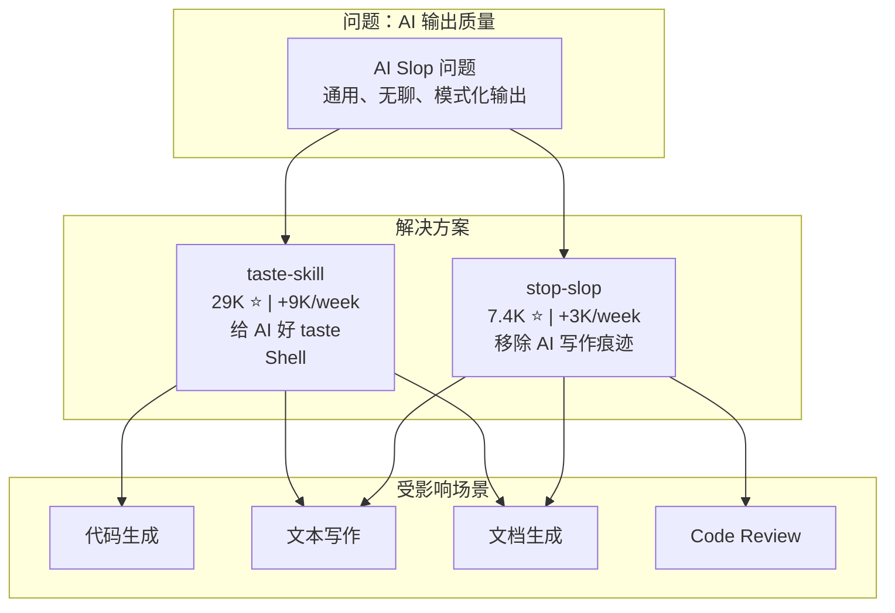
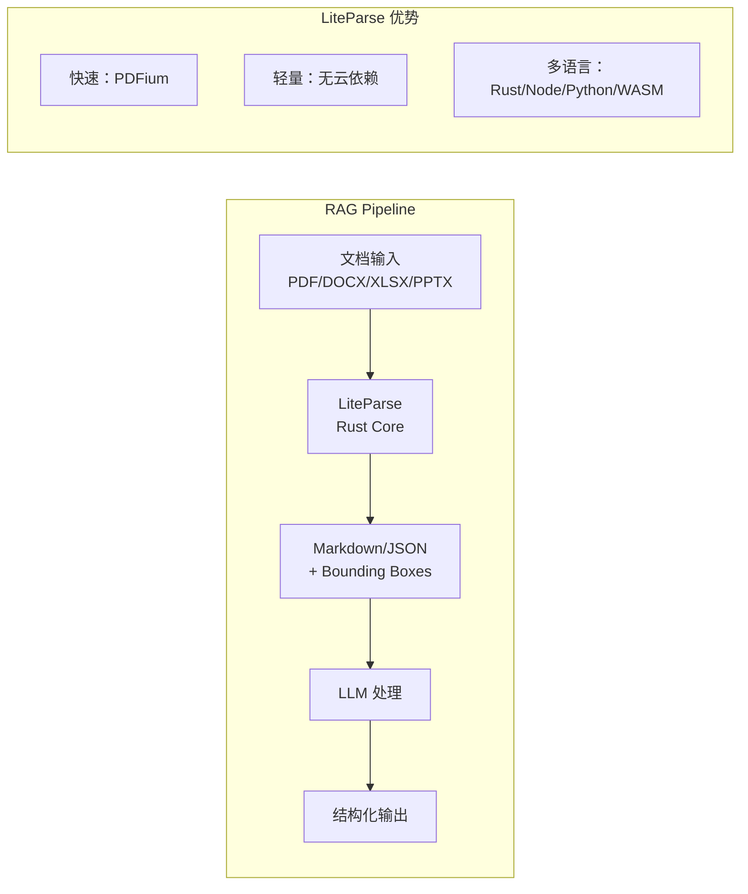

## 今日趋势概览

GitHub Trending 今日延续 Plugin/Skill 赛道热度，但出现一个值得注意的**元趋势转向**——**"AI Taste"控制**。taste-skill 和 stop-slop 两个项目本周合计 +12K，反映出一个深层需求：用户不再满足于 AI 能生成内容，而是要求 AI 生成的内容有"品味"。与此同时，ai-engineering-from-scratch 以 13.1K/week 的增速证明 AI 教育赛道的巨大需求，LiteParse 日增 929 星持续加速，Microsoft Agent Governance Toolkit 正式切入 Agent 安全治理。

---

## 趋势 1：AI Taste/Slop Control 元趋势

### taste-skill（29K ⭐, +9K/week）
- **定位**：给 AI "好品味"，阻止生成无聊、通用的内容
- **本周爆发**：从约 20K 暴涨到 29K，Shell 实现极简
- **本质**：这是一个 **Skill 文件**而非独立工具——通过系统指令引导 AI 产生更高质量的输出
- **信号意义**：大于项目本身——用户对 AI 输出质量的控制需求正在显式化

### stop-slop（7.4K ⭐, +3K/week）
- **定位**：从文章中移除 AI 写作痕迹
- **与 taste-skill 的关系**：一个预防、一个治疗——taste-skill 让 AI 不生成 slop，stop-slop 清理已有的 slop

**架构师启发**：AI Taste 控制本质上是一种 **输出质量治理层**。在企业 AI 应用中，这对应的是内容审核、风格一致性、品牌语调控制。taste-skill 的 Skill 化思路（而非独立服务化）值得借鉴——把质量控制嵌入到 AI 工具链中，而不是做成独立服务。

---

## 趋势 2：AI 工程教育赛道爆发

**rohitg00/ai-engineering-from-scratch** 25.1K，本周 +13.1K。

- **定位**："Learn it. Build it. Ship it." — AI 工程从零开始
- **与 FareedKhan-dev/train-llm-from-scratch**（2.2K, +316/day）形成教育矩阵
- **增速判断**：13.1K/week 是本周全站第三高增速，纯教育类项目达到这个量级很少见
- **信号**：AI 工程人才缺口巨大，开发者正在从"用 API"转向"理解原理"
- **风险**：教育项目热度通常短期爆发后回落，不适合作为技术选型参考

---

## 趋势 3：LiteParse 持续加速 — +929/天

**run-llama/liteparse** 从昨天的 7.2K 涨到 7.9K，日增 929 星。

- **本周累计**：+1.5K/week → 日增 929，加速度明显
- **Rust 实现**：PDFium C 库做文本提取 + Tesseract OCR + Grid Projection 做空间布局重建
- **多语言绑定**：Rust / Node.js (napi-rs) / Python (PyO3) / WASM 全覆盖
- **定位**：RAG Infra 的文档解析环节，LlamaIndex 生态的补充
- **判断**：作为 **RAG 文档解析的轻量级开源方案**，工程成熟度和品牌背书都不错。对于不需要 LlamaParse 云服务的场景，这是最好的本地替代

---

## 趋势 4：Microsoft Agent Governance Toolkit — Agent 安全治理工具化

**microsoft/agent-governance-toolkit** 3.5K，本周 +1.5K。

- **定位**：AI Agent 治理工具包——Policy enforcement、zero-trust identity、execution sandboxing、reliability engineering
- **覆盖范围**：10/10 OWASP Agentic Top 10
- **多语言 SDK**：Python (PyPI)、TypeScript (npm)、.NET (NuGet)、Rust、Go
- **核心能力**：
  1. **Policy Engine**：YAML 声明策略，每个工具调用经过策略评估
  2. **Zero-Trust Identity**：每个 Agent 有独立身份，不再共享 API Key
  3. **Execution Sandboxing**：在应用层而非 prompt 层拦截危险操作
  4. **Audit Trail**：防篡改的审计记录
- **与 prompt-level safety 的本质区别**：不依赖 prompt 来控制行为，而是在确定性代码层拦截——"结构上不可能犯错" vs "请求 AI 不要犯错"

**架构师启发**：这是目前看到的**最实用的 Agent 安全治理方案**。核心思路是把 Agent 安全从 prompt 层移到应用层，用确定性的 Policy Engine 拦截所有工具调用。这个设计模式——"intercept in deterministic code, not in stochastic prompts"——值得所有 Agent 开发者学习。对于企业级 Agent 部署，这应该是标配。

---

## 趋势 5：世界模型与离线 AI

### stable-worldmodel（1.4K ⭐, +319/day）
- **定位**：可复现的世界模型研究与评估平台
- **意义**：世界模型（World Model）是 Agent 从"文本理解"走向"环境理解"的关键能力
- **判断**：学术研究导向，目前偏学习型，但世界模型赛道是中期确定性方向

### project-nomad（27.3K ⭐, +473/day）
- **定位**：自包含的离线生存计算机，打包工具/知识/AI，无需网络
- **信号**：离线 AI 需求在增长——与 Edge AI、本地部署趋势一致
- **27.3K 的真相**：概念足够吸引生存主义者/户外爱好者，但与我们的技术关注点重叠有限
- **判断**：偏**概念型/社区型**项目，技术参考价值有限

---

## 风险与机遇

### 泡沫预警
1. **taste-skill 29K**：作为单个 Skill 文件达到 29K 星，增速含跟风成分，实际使用价值需验证
2. **ai-engineering-from-scratch 13.1K/week**：教育类项目热度短期爆发后通常回落
3. **project-nomad 27.3K**：社区驱动热度，非技术驱动

### 真实机遇
1. **Agent Governance 工具化**：Microsoft AGT 把 Agent 安全从概念变成可安装的工具包，企业级部署必备
2. **AI 输出质量治理层**：taste-skill/stop-slop 代表了一个新需求层——AI 输出质量控制，企业场景对应内容审核/品牌一致性
3. **Rust 文档解析赛道**：LiteParse 确立了 Rust 在 RAG 文档解析环节的优势地位
4. **世界模型评估标准化**：stable-worldmodel 代表了 Agent 能力评估的基础设施化

---

## 重点项目评分

### taste-skill
| 维度 | 分数 | 理由 |
|------|------|------|
| 热度质量 | 7 | 29K 但增速含跟风 |
| 技术创新度 | 5 | 本质是 Skill 文件/系统提示词工程 |
| 工程成熟度 | 4 | Shell 脚本，无复杂工程 |
| 架构启发价值 | 7 | AI 输出质量控制作为独立关注点 |
| 企业落地潜力 | 6 | 需求真实但需服务化 |
| 中期趋势概率 | 7 | AI 质量控制是确定趋势 |
| 平台化潜力 | 5 | Skill 模式不适合直接平台化 |
| 基础设施潜力 | 4 | 需要演进为服务层 |
| **总分** | **45** | **归类：学习型 · 代表元趋势** |

### agent-governance-toolkit
| 维度 | 分数 | 理由 |
|------|------|------|
| 热度质量 | 7 | 3.5K，Microsoft 官方 |
| 技术创新度 | 7 | Policy Engine + 确定性拦截思路 |
| 工程成熟度 | 8 | 多语言 SDK，PyPI/npm/NuGet，CI 完善 |
| 架构启发价值 | 9 | Agent 安全从 prompt 层移到应用层 |
| 企业落地潜力 | 9 | 企业 Agent 部署必备 |
| 中期趋势概率 | 9 | Agent 安全治理是确定性趋势 |
| 平台化潜力 | 8 | 治理框架天然平台属性 |
| 基础设施潜力 | 9 | Agent 安全基础设施 |
| **总分** | **66** | **归类：基础设施候选 · 强烈建议跟踪** |

### liteparse（更新）
| 维度 | 分数 | 理由 |
|------|------|------|
| 热度质量 | 8 | 7.9K，+929/天，加速中 |
| 技术创新度 | 7 | Rust + PDFium + OCR Pipeline |
| 工程成熟度 | 8 | 多语言绑定，CI 完善 |
| 架构启发价值 | 7 | RAG 文档解析的工程化 |
| 企业落地潜力 | 8 | run-llama 品牌 + 本地部署 |
| 中期趋势概率 | 8 | RAG Infra 刚需 |
| 平台化潜力 | 6 | 垂直工具 |
| 基础设施潜力 | 7 | RAG Pipeline 标准组件 |
| **总分** | **59** | **归类：生产可用 · 建议持续跟踪** |

### ai-engineering-from-scratch
| 维度 | 分数 | 理由 |
|------|------|------|
| 热度质量 | 8 | 25.1K，+13.1K/week |
| 技术创新度 | 3 | 教育内容，非技术创新 |
| 工程成熟度 | 6 | Python/Jupyter 教程 |
| 架构启发价值 | 5 | 教学而非架构 |
| 企业落地潜力 | 4 | 教育用途 |
| 中期趋势概率 | 7 | AI 教育需求持续增长 |
| 平台化潜力 | 4 | 教育课程 |
| 基础设施潜力 | 2 | 非基础设施 |
| **总分** | **39** | **归类：学习型 · 教育价值高但非技术选型** |

### oh-my-pi
| 维度 | 分数 | 理由 |
|------|------|------|
| 热度质量 | 7 | 8.7K，+2.3K/week |
| 技术创新度 | 7 | hash-anchored edits + LSP 集成 |
| 工程成熟度 | 7 | TypeScript，多能力集成 |
| 架构启发价值 | 8 | 终端 Coding Agent 的功能组合 |
| 企业落地潜力 | 6 | 个人工具为主 |
| 中期趋势概率 | 8 | Coding Agent 赛道确定 |
| 平台化潜力 | 5 | 工具属性 |
| 基础设施潜力 | 5 | 开发者工具 |
| **总分** | **53** | **归类：工具型 · 值得关注** |

---

## 项目档案

所有 key_projects 的详细档案见 `projects/` 目录。今日新增档案：stable-worldmodel、project-nomad。今日更新档案：taste-skill、liteparse、agent-governance-toolkit、compound-engineering-plugin、oh-my-pi、ai-engineering-from-scratch。
