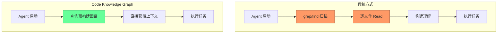
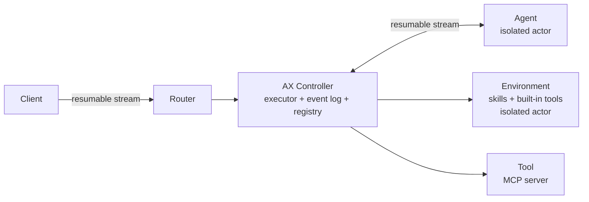

## 今日趋势概览

### 1. Code Knowledge Graph：AI Agent 的「索引层」正在成型

本周 GitHub 最引人注目的不是某个 AI 模型，而是两个**代码知识图谱**项目同时爆发：

| 项目 | Stars | 周增速 | 核心差异 |
|------|-------|--------|----------|
| Understand-Anything | 47.1K | +25.6K | 多 Agent 流水线分析 → 交互式 Dashboard，全量图谱 |
| codegraph | 35.3K | +15.9K | 预索引 + MCP Server，零文件读取，57% token 节省 |

**判断**：这不是巧合。当 AI Coding Agent 成为开发主力工具后，**"Agent 如何高效理解代码库"** 成为关键瓶颈。传统做法是 Agent 启动后用 grep/find/read 逐文件扫描——token 浪费巨大。Code Knowledge Graph 的本质是**预计算代码结构**，让 Agent 直接查询图谱而非暴力扫描。

这对架构师的意义：**这可能是 AI Agent 工具链中继 MCP 之后的下一个标准化层**。



### 2. AI Coding Plugin 生态：Agent 的「包管理器时刻」

本周 GitHub Trending 被 Plugin/Skill 项目刷屏：

| 项目 | Stars | 周增速 | 平台 |
|------|-------|--------|------|
| ECC | 200.4K | +10.8K | Claude Code / Codex / Cursor 等 7 平台 |
| claude-plugins-official | 29K | +2.8K | Anthropic 官方 |
| knowledge-work-plugins | 18.4K | +5.5K | Claude Cowork |
| compound-engineering-plugin | 18.7K | +1.3K | Claude Code / Codex / Cursor |
| openai/skills | 21K | +0.9K | Codex |
| cursor/plugins | 1.6K | +0.7K | Cursor |

**判断**：Plugin/Skill 正在成为 AI Coding Agent 的通用接口。这个趋势类似 2010 年 npm/pip 之于 Node.js/Python——**生态的繁荣程度决定平台的胜出**。但需要警惕：ECC 200K star 中大量是"配置包"而非工程创新，存在泡沫。

### 3. Agent Runtime 基础设施：Google + Microsoft 同时入局

| 项目 | 出品方 | 定位 | 语言 | 状态 |
|------|--------|------|------|------|
| google/ax | Google | 分布式 Agent Runtime | Go | 早期开发 |
| Agent Governance Toolkit | Microsoft | Agent 治理/策略/审计 | Python | Public Preview |
| herdr | 独立开发者 | Agent 终端多路复用器 | Rust | v0.4 |

**google/ax 的关键设计**：
- Single-Writer Controller + Event Log = 持久化执行状态
- 支持 Agent/Tool/Skill 的分布式隔离部署
- 面向 Kubernetes 原生
- 早期阶段，暂不接受 PR

**判断**：Google 和 Microsoft 同时推出 Agent Runtime 层，标志着**Agent 基础设施从"大家各做各的框架"走向"统一运行时标准"**。这是中期趋势，不是短期热点。

### 4. Rust AI Infra 工具链持续扩展

本周 Rust 在 AI 基础设施领域的项目表现突出：

- **RuView** (69K, +4.4K/week) — WiFi CSI 信号转空间感知，纯边缘计算
- **cc-switch** (86K, +6.7K/week) — 跨平台 AI Coding Agent 桌面助手
- **Handy** (23K, +0.6K/week) — 完全离线语音转文字
- **herdr** (3.4K, +0.9K/week) — Agent 多路复用器
- **LiteParse** (8.3K, +2.6K/week) — 高性能文档解析器

Rust 在 AI 基础设施领域的渗透已经从"趋势观察"变成"既定事实"。

### 5. Voice AI 开源替代

**dograh** (3.9K, +1.2K/week) — 开源 Voice AI 平台，Vapi/Retell 自托管替代：
- Speech-to-Speech 或 LLM/STT/TTS 拆分模式
- 可视化工作流构建器
- MCP 原生 + 电话集成
- BYOK 支持

---

## 重点项目深度分析

### 🧠 Understand-Anything — Code Knowledge Graph 的标杆

**它是什么**：一个 Claude Code Plugin，用多 Agent 流水线分析项目，构建包含每个文件/函数/类/依赖的知识图谱，然后通过交互式 Web Dashboard 可视化。

**为什么火**（+25.6K/week）：
1. 解决了 AI Coding Agent 的核心痛点——代码理解效率
2. 不只是静态分析，有 LLM 加持的语义理解
3. 支持 Claude Code / Codex / Cursor / Copilot / Gemini CLI 等几乎所有主流 Agent
4. 交互式 Dashboard 体验好，demo 直接能看

**技术亮点**：
- 多 Agent Pipeline：扫描 → 提取 → 关联 → 生成图谱
- 支持 Domain View（代码映射到业务流程）
- 增量更新（只重分析变更文件）
- 自动生成 Onboarding Guide
- Impact Analysis（变更影响范围分析）

**架构师启发**：
> Code Knowledge Graph 可能成为 CI/CD 管线中的标准环节。未来每次 build 不仅编译代码，还更新代码知识图谱。Agent 查询图谱而非扫描源码，这和数据库用索引而非全表扫描是同一个思路。

**定位**：工具型 → 有平台化潜力

**风险**：
- 图谱质量依赖 LLM 分析准确性
- 大型 monorepo 的图谱构建耗时和成本未验证
- 与 codegraph 有功能重叠，赛道可能快速内卷

---

### 🕸️ codegraph — Token 经济学驱动的代码图谱

**它是什么**：预构建的代码知识图谱 MCP Server，让 AI Agent 直接查询代码结构，避免暴力文件扫描。

**核心数据**（7 个真实项目测试）：

| 项目 | 语言 | Cost 节省 | Token 节省 | 速度提升 | Tool Call 减少 |
|------|------|-----------|-----------|---------|---------------|
| VS Code | TypeScript | 33% | 70% | 27% | 80% |
| Django | Python | 23% | 70% | 28% | 77% |
| Tokio | Rust | 35% | 70% | 37% | 79% |

**为什么值得关注**：
1. **数据说话**：不是概念验证，是 7 个真实项目的 benchmark
2. **MCP 原生**：作为 MCP Server 集成，不需要改 Agent 代码
3. **100% 本地**：不依赖云服务，数据不出本机
4. **一键安装/卸载**：`codegraph init -i` / `codegraph uninstall`

**与 Understand-Anything 的区别**：

| 维度 | codegraph | Understand-Anything |
|------|-----------|-------------------|
| 定位 | MCP Server，Agent 无感集成 | Claude Plugin，交互式 Dashboard |
| 核心价值 | Token 经济学 | 代码理解可视化 |
| 集成方式 | MCP 协议 | Plugin 命令 |
| 可视化 | 无 | 强 |
| 适用场景 | 日常编码效率 | 项目理解/Onboarding |

**架构师启发**：
> MCP 是正确的集成协议选择。未来每个 CI/CD pipeline 都应该跑 `codegraph index`，把图谱作为构建产物的一部分。

---

### ⚡ google/ax — 分布式 Agent Runtime

**它是什么**：Google 开源的分布式 Agent 运行时，协调 Agent 循环、管理执行状态、与本地和远程 Actor 通信。

**关键设计**：
- **Controller-Skills-Tools-Agents** 分层架构
- **Event Log**：持久化执行状态，支持故障恢复
- **Single-Writer**：单控制器保证状态一致性
- **Kubernetes Native**：计算层无关，但瞄准 K8s 最佳体验



**为什么值得关注**：
1. **Google 出品**，Agent Runtime 层的标准制定者之一
2. **分布式**——不是单机框架，是面向数据中心级部署的 Runtime
3. **审计+策略**——所有 Agent 调用都经过 Controller，天然可审计
4. **K8s Native**——与现有云原生基础设施无缝衔接

**风险**：
- 早期开发，明确标注"会有 breaking changes"
- 暂不接受外部 PR，社区参与受限
- 1.3K star 说明还在"圈内"阶段

**定位**：基础设施候选。如果 Google 持续投入，这可能是 Agent 领域的 Kubernetes。

---

### 🛡️ Microsoft Agent Governance Toolkit — Agent 的「安全带」

**它是什么**：Microsoft 的 AI Agent 治理工具包，通过策略执行、零信任身份、执行沙箱和可靠性工程来管控自主 Agent。

**核心设计哲学**：

> "Prompt-level safety is not a control surface. It is a polite request to a stochastic system."
> "Actions the AGT kernel denies are not 'unlikely.' They are structurally impossible."

这个定位非常清晰——**不依赖 prompt 约束 Agent，而是在代码层面拦截每个 tool call**。

**覆盖 OWASP Agentic Top 10 全部 10 项**：
1. 策略执行（YAML 定义，代码层拦截）
2. 零信任身份（谁在做什么）
3. 执行沙箱（隔离危险操作）
4. 审计日志（防篡改记录）

**两行代码集成**：
```python
from agentmesh.governance import govern
safe_tool = govern(my_tool, policy="policy.yaml")
```

**架构师启发**：
> 这是 Agent 走向生产环境的必要条件。任何企业部署 Agent 都需要这种确定性控制层。它和 google/ax 互补——ax 管 Agent 怎么跑，AGT 管 Agent 不能做什么。

---

### 🐏 herdr — Agent 终端多路复用器

**它是什么**：终端里的 Agent 多路复用器，类似 tmux 但专为 AI Agent 设计。

**核心特性**：
- Workspace / Tab / Pane 管理
- Agent 状态感知（blocked / working / done / idle）
- Detach / Reattach，Agent 保持运行
- 无 Electron，纯终端
- 支持鼠标操作

**架构师启发**：
> 当开发者同时使用 Claude Code + Codex + Cursor 时，需要一个统一的终端管理器。herdr 解决的是多 Agent 并行开发的 DevEx 问题。工具型，但切中了真实痛点。

---

## 风险与机遇

### 机遇
1. **Code Knowledge Graph 可能成为 AI Agent 工具链的标准层**——类似搜索引擎的倒排索引
2. **google/ax + Microsoft AGT 标志着 Agent Runtime 层的标准化开始**
3. **Plugin/Skill 生态的爆发意味着 Agent 平台的竞争从模型能力转向生态能力**

### 风险
1. **ECC 200K star 有明显泡沫成分**——大量是配置文件而非工程创新
2. **Code Knowledge Graph 赛道已有 2 个强竞争者**，可能快速内卷
3. **google/ax 早期不接受 PR**，如果 Google 半途放弃就是又一个 Google Graveyard 项目
4. **Plugin/Skill 生态碎片化严重**——每个平台都有自己的格式，缺乏统一标准

---

## 评分汇总

### Understand-Anything
| 维度 | 分数 | 理由 |
|------|------|------|
| 热度质量 | 9 | +25K/week 周增速，47K 总 star，数据扎实 |
| 技术创新度 | 8 | 多 Agent 流水线 + 知识图谱 + 语义搜索 |
| 工程成熟度 | 7 | 支持多平台，增量更新，但大型项目未验证 |
| 架构启发价值 | 9 | Code KG 作为 Agent 基础设施层的思路 |
| 企业落地潜力 | 7 | 需要验证大规模 monorepo 场景 |
| 中期趋势概率 | 9 | Code KG 是 Agent 工具链的必然需求 |
| 平台化潜力 | 8 | 可以成为代码理解的标准接口 |
| 基础设施潜力 | 8 | 类似数据库索引的定位 |
| **总分** | **65/80** | **平台候选** |

### codegraph
| 维度 | 分数 | 理由 |
|------|------|------|
| 热度质量 | 9 | +15.9K/week，35K star |
| 技术创新度 | 7 | 预索引 + MCP 集成，工程导向 |
| 工程成熟度 | 8 | 7 个项目 benchmark，数据说话 |
| 架构启发价值 | 9 | Token 经济学驱动的 Agent 效率优化 |
| 企业落地潜力 | 8 | MCP 集成，100% 本地，易于部署 |
| 中期趋势概率 | 9 | 与 Understand-Anything 共同定义赛道 |
| 平台化潜力 | 7 | MCP Server 定位限制了平台化空间 |
| 基础设施潜力 | 8 | 可以成为 CI/CD 标准环节 |
| **总分** | **65/80** | **生产可用** |

### google/ax
| 维度 | 分数 | 理由 |
|------|------|------|
| 热度质量 | 5 | 1.3K star，+480/week，圈内阶段 |
| 技术创新度 | 9 | 分布式 Agent Runtime，Event Log，K8s Native |
| 工程成熟度 | 4 | 早期开发，明确 breaking changes |
| 架构启发价值 | 10 | 定义了 Agent Runtime 的参考架构 |
| 企业落地潜力 | 6 | 需要等稳定版，但方向正确 |
| 中期趋势概率 | 9 | Google + Agent Runtime = 高概率持续 |
| 平台化潜力 | 10 | 定位就是平台层 |
| 基础设施潜力 | 10 | 目标是 Agent 领域的 Kubernetes |
| **总分** | **63/80** | **基础设施候选** |

### Agent Governance Toolkit
| 维度 | 分数 | 理由 |
|------|------|------|
| 热度质量 | 7 | 3.6K star，+1.5K/week，Microsoft 出品 |
| 技术创新度 | 8 | 确定性拦截而非 prompt 约束，OWASP 全覆盖 |
| 工程成熟度 | 8 | Public Preview，pip install 即用 |
| 架构启发价值 | 9 | "结构上不可能犯错"的设计哲学 |
| 企业落地潜力 | 9 | Agent 走向生产的必要条件 |
| 中期趋势概率 | 9 | Agent 治理是确定性趋势 |
| 平台化潜力 | 7 | 治理层，不是完整平台 |
| 基础设施潜力 | 8 | 可以成为 Agent 安全的标准层 |
| **总分** | **65/80** | **生产可用** |

### herdr
| 维度 | 分数 | 理由 |
|------|------|------|
| 热度质量 | 6 | 3.4K star，+923/week |
| 技术创新度 | 6 | tmux for Agents，不算全新 |
| 工程成熟度 | 7 | v0.4，Rust 实现，功能完整 |
| 架构启发价值 | 6 | 多 Agent 管理 DevEx |
| 企业落地潜力 | 7 | 解决真实痛点 |
| 中期趋势概率 | 7 | 多 Agent 并行开发是趋势 |
| 平台化潜力 | 5 | 工具型，不易平台化 |
| 基础设施潜力 | 4 | 终端工具，不是基础设施 |
| **总分** | **48/80** | **工具型** |

---

## 项目归类建议

| 项目 | 归类 | 持续跟踪 | PoC 建议 |
|------|------|----------|---------|
| Understand-Anything | 平台候选 | ✅ 是 | 可在中小项目试点 |
| codegraph | 生产可用 | ✅ 是 | 建议立即在 Claude Code 中试用 |
| google/ax | 基础设施候选 | ✅ 是 | 关注，等稳定版再评估 |
| Agent Governance Toolkit | 生产可用 | ✅ 是 | 企业 Agent 部署必选 |
| herdr | 工具型 | 🔍 观察 | 多 Agent 用户可试用 |

---

## 与昨日趋势的延续性

| 昨日趋势 | 今日状态 | 判断 |
|----------|---------|------|
| AI Taste/Slop Control (taste-skill + stop-slop) | 仍在 Trending 但增速放缓 | 短期热点，正在被 Plugin 生态吸收 |
| ai-engineering-from-scratch | 25.7K (+12K/week) 持续爆发 | 教育赛道确认，学习型不持续跟踪 |
| LiteParse | 8.3K (+2.6K/week) 稳步增长 | 趋势确认，Rust 文档解析赛道确立 |
| Microsoft AGT | 3.6K (+1.5K/week) 继续增长 | 从昨日发现到今日深度分析 |
