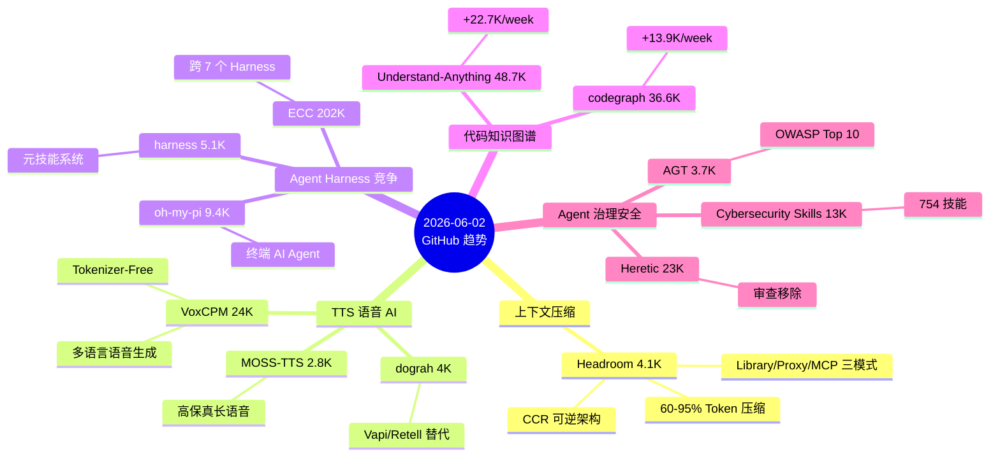

# 2026-06-02 GitHub 趋势研究简报

## 今日趋势总览

## 趋势 1：AI Agent 上下文压缩赛道浮现

**Headroom** 本周 +1.5K 至 4.1K stars，是今天最值得注意的新项目。

它解决的核心问题极其精准：AI Agent 在处理 tool output、日志、RAG 结果时，大量 Token 被浪费在冗余信息上。Headroom 提供 60-95% 的 Token 压缩，同时保持回答质量不变。

**架构亮点：**
- **三种接入模式**：Library 内联、Proxy 透明代理、MCP Server — 适配任意 Agent 架构
- **CCR（可逆压缩）**：原始数据不删除，LLM 按需 retrieve，这是关键差异化
- **ContentRouter**：自动检测内容类型（JSON/代码/文本），选择对应压缩器
- **CacheAligner**：稳定前缀使 Provider KV Cache 命中，这不仅是压缩，更是缓存优化

**实测数据可信：**
- 代码搜索 92% Token 节省
- SRE 事件调试 92% 节省
- GSM8K/TruthfulQA 基准无精度损失

**判断：** 这是 Agent 基础设施层的关键组件。随着 Agent 处理的上下文越来越长，Token 优化会从「锦上添花」变成「必须」。建议持续跟踪，适合企业内部 PoC。

与 Code Knowledge Graph（Understand-Anything/codegraph）形成互补：索引层减少搜索次数，压缩层减少每次搜索的 Token 消耗。

## 趋势 2：TTS 开源模型爆发

三个语音 AI 项目同时爆发：

| 项目 | Stars | 周增量 | 定位 |
|------|-------|--------|------|
| VoxCPM | 24.2K | +4.2K | Tokenizer-Free 多语言 TTS |
| MOSS-TTS | 2.8K | +0.9K | 高保真长语音/多角色对话/环境音效 |
| dograh | 4.1K | +1.3K | Vapi/Retell 开源替代平台 |

**VoxCPM** 是 OpenBMB 出品，Tokenizer-Free 是真创新：不用传统语音 Tokenizer，直接建模语音生成，意味着更自然的韵律和跨语言迁移。24K stars 说明市场需求强劲。

**dograh** 定位为 Vapi/Retell 自托管替代，关键特性：可视化工作流构建器、MCP 原生、电话集成。企业级语音 AI 部署的刚需。

**判断：** 语音 AI 开源生态正在快速追赶闭源 API。对企业架构师而言，dograh 值得 PoC（语音客服/内部助手），VoxCPM 值得技术评估。中期趋势。

## 趋势 3：Agent Harness 深度竞争

ECC (202K)、oh-my-pi (9.4K)、harness (5.1K) 三个 Agent Harness 项目同时 Trending。

**关键观察：**
- ECC 从 Claude Code 单一 Harness 扩展到跨 7 个 Harness（Claude Code/Codex/Cursor/OpenCode/Gemini/Zed/Copilot），v2.0 引入 Hermes operator，定位为「Harness 无关的 Agent 操作系统」
- oh-my-pi 是终端原生 AI Coding Agent，hash-anchored edits + LSP + subagents，定位偏极客
- harness 是元技能系统，能自动设计 Agent 团队、定义专业 Agent、生成所需技能

**判断：** Agent Harness 正从单一工具向平台化演进。ECC 的跨 Harness 策略最值得关注 — 如果 Harness 成为 Agent 的「操作系统」，那么跨 Harness 兼容层就是基础设施。但 ECC 202K stars 的增速和质量需要警惕泡沫（部分可能来自刷 star）。

## 趋势 4：Agent 治理与安全持续升温

Microsoft AGT (+1.6K/week) 和 Anthropic Cybersecurity Skills (13K) 持续走高，Heretic (23K) 审查移除工具本周 +1.4K。

AGT 的核心价值是**确定性拦截**：不依赖 prompt 约束，而是在应用代码层面拦截所有 tool call/message/delegation，被拒绝的动作「结构性不可能」。

这对企业 Agent 部署至关重要：
- 金融/医疗行业的合规审计需要 tamper-evident 记录
- 多 Agent 系统需要身份隔离和权限分级
- OWASP Agentic Top 10 正在成为安全标准

## 趋势 5：AI 写作品质治理

stop-slop (8K) 和 taste-skill (30.9K) 本周合计 +14.5K stars。

本质是 AI 生成内容的「去模板化」工具。taste-skill 30K stars 说明痛点很真实 — AI 生成的内容越来越同质化。但这类项目的长期价值有限，更多是当前 LLM 输出风格的临时解决方案。

**判断：** 短期热点。随着模型自身输出质量提升，这类工具的需求会下降。不作为持续跟踪项。

## 重点项目深度分析

### Top 1: Headroom — Agent 上下文压缩层

**它做什么：** 在 Agent 和 LLM 之间插入压缩层，减少 60-95% Token 消耗。

**为什么火：** 触及了所有 Agent 开发者的真实痛点 — Token 成本和上下文窗口限制。多模式接入（Library/Proxy/MCP）让任何 Agent 都能用。

**技术亮点：**
1. CCR 可逆压缩 — 原始数据本地存储，LLM 按需 retrieve，不丢信息
2. ContentRouter — 自动识别 JSON/代码/文本，选最佳压缩策略
3. CacheAligner — 优化 KV Cache 命中率，不仅压缩还提速
4. SmartCrusher (JSON) / CodeCompressor (AST) / Kompress-base (文本) 三引擎

**架构启发：** Agent 系统的 Token 管理应该分层：索引层（codegraph）减少搜索范围 → 压缩层（Headroom）减少每次传输量 → 缓存层（CacheAligner）减少重复计算。

**定位：** 工具型 → 平台候选。如果能成为 Agent 与 LLM 之间的标准中间件，有基础设施潜力。

**风险：**
- 压缩质量依赖内容类型识别准确性
- 单人项目，工程成熟度待验证
- LLM Provider 可能原生支持类似能力

### Top 2: VoxCPM — Tokenizer-Free 多语言 TTS

**它做什么：** 不使用传统语音 Tokenizer 的端到端多语言语音生成模型。

**为什么火：** Tokenizer-Free 是 TTS 领域的真实创新，解决了传统方案韵律不自然、跨语言迁移难的问题。OpenBMB 出品有品牌背书。

**技术亮点：** Tokenizer-Free 架构意味着直接从文本到语音波形，跳过了传统 TTS 的中间 Token 表示，理论上能捕获更自然的语音特征。

**定位：** 生产可用级别。24K stars + OpenBMB 维护，适合实际部署评估。

### Top 3: Microsoft AGT — Agent 治理工具

**它做什么：** 为自主 Agent 提供策略执行、零信任身份、执行沙箱、可靠性工程。

**为什么火：** 企业部署 Agent 的头号问题是安全和合规。AGT 直接覆盖 OWASP Agentic Top 10 全部 10 项，而且用确定性代码拦截而非 prompt 约束。

**架构启发：** Agent 安全应该分为两层：
1. 模型层：prompt-based safety（概率性）
2. 应用层：AGT-style 确定性拦截（结构性）

只有两层叠加，才能达到企业级安全要求。

## 风险与机遇

### 🔴 泡沫信号
- **ECC 202K stars**：增速异常快，部分可能来自刷 star。代码质量和实际生产使用需要独立验证
- **taste-skill / stop-slop**：30K+ stars 的 AI 写作品质工具，属于当前 LLM 输出风格的临时解药

### 🟢 潜力信号
- **Headroom**：Token 压缩是 Agent 基础设施刚需，MCP 原生是正确方向
- **VoxCPM + dograh**：语音 AI 开源栈正在完整化（模型 + 平台）
- **Microsoft AGT**：企业 Agent 安全的缺失环节，有成为标准工具的潜力

## 项目评分汇总

| 项目 | 热度 | 技术创新 | 工程成熟 | 架构启发 | 落地潜力 | 趋势概率 | 平台化 | 基础设施 | 总分 | 归类 |
|------|------|---------|---------|---------|---------|---------|--------|---------|------|------|
| Headroom | 7 | 8 | 6 | 9 | 8 | 8 | 7 | 8 | 61 | 平台候选 |
| VoxCPM | 8 | 8 | 7 | 7 | 8 | 7 | 6 | 5 | 56 | 生产可用 |
| AGT | 7 | 7 | 8 | 8 | 9 | 8 | 7 | 8 | 62 | 基础设施候选 |
| Dograh | 7 | 6 | 6 | 7 | 8 | 7 | 7 | 6 | 54 | 工具型 |
| ECC | 9 | 6 | 7 | 7 | 7 | 6 | 7 | 6 | 55 | 工具型 |
| Heretic | 8 | 5 | 5 | 4 | 4 | 5 | 2 | 2 | 35 | 学习型 |
| AI Eng Scratch | 8 | 4 | 6 | 4 | 6 | 5 | 2 | 2 | 37 | 学习型 |
| LiteParse | 7 | 7 | 8 | 7 | 8 | 7 | 6 | 7 | 57 | 生产可用 |

---

*本报告由 GitHub 趋势研究助理自动生成 | 数据来源：GitHub Trending + gh CLI | 2026-06-02*
