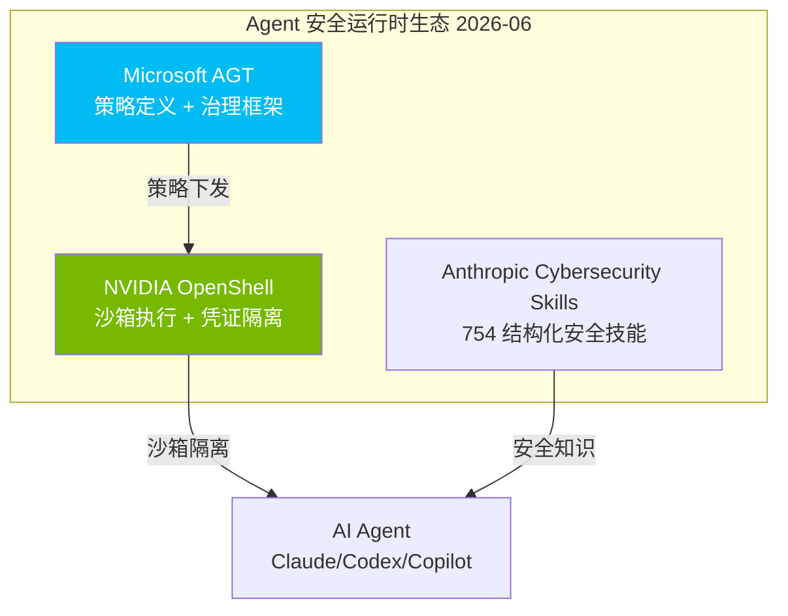

# 2026-06-03 GitHub 趋势研究简报

## 今日核心判断

> Agent 安全运行时从「建议」变成「基础设施」。NVIDIA OpenShell 的出现意味着：Agent 沙箱不再是可选的安全加固，而是 Agent 运行时的标准组件。这和 Microsoft AGT 形成互补——AGT 管策略，OpenShell 管执行。

## 趋势一：Agent 运行时安全沙箱成新赛道（★92）

**核心信号：NVIDIA OpenShell 6.6K stars, Rust, 策略引擎 + GPU 直通**

NVIDIA 正式入场 Agent 安全运行时。OpenShell 不是又一个 Docker wrapper，而是从内核层到应用层的四层防御体系：

| 层级 | 防护内容 | 生效时机 |
|------|----------|----------|
| 文件系统 | 阻止未授权路径读写 | 沙箱创建时锁定 |
| 网络 | 拦截未授权出站连接 | 运行时热重载 |
| 进程 | 阻止提权和危险 syscall | 沙箱创建时锁定 |
| 推理 | 重路由模型 API 调用到受控后端 | 运行时热重载 |

**架构师视角：**
- 与 Microsoft AGT 互补：AGT 做策略定义和治理框架，OpenShell 做沙箱执行和隔离
- GPU 直通能力是差异化：本地推理场景有真实需求
- 凭证不进沙箱文件系统，通过环境变量注入——这是正确的设计
- Alpha 阶段，单租户模式，企业部署还需等
- Helm chart 已有，K8s 路线正在开发

**风险：** NVIDIA 出品但 Elastic License 2.0（引擎部分），商业使用有限制。SDK 是 Apache 2.0。

## 趋势二：Agent Terminal 基础设施三层成型（★89）

Agent 开发工具栈正在分化出清晰的三个层次：

| 层次 | 代表项目 | 功能 |
|------|----------|------|
| 会话管理 | herdr 3.9K | Agent 多路复用，workspace/tab/pane，状态感知 |
| 上下文优化 | headroom 6.1K | Token 压缩 60-95%，MCP 原生 |
| 知识索引 | fff 7.4K + codegraph 37.9K + Understand-Anything 50K | 文件搜索 / 代码图谱 |

**fff 值得关注：**
- 起源于 Neovim 插件，扩展为 AI Agent 文件搜索工具
- Frecency 排序（使用频率 + 最近使用）比纯 grep/find 更适合 Agent 场景
- MCP 原生支持，Claude Code / Codex / Pi 均可接入
- 424 stars/day 增速健康，Rust 性能保障

**架构启发：** Agent 不再「自己 grep」，而是通过 MCP 调用专业索引服务。这是 Agent 工具链分工细化的明确信号。

## 趋势三：AI Memory API 标准化加速（★85）

**supermemory 24.6K stars, TypeScript, +677/day**

定位「AI 时代的 Memory API」——为 Agent 提供长期记忆基础设施。这不是又一个向量数据库 wrapper，而是尝试定义记忆层的标准接口。

**判断：**
- Memory 标准化是 Agent 从「一次性对话」到「持续运行」的关键缺失层
- 24.6K stars 说明需求真实，但「Memory API」的标准定义权尚未确立
- 需观察：API 设计是否足够通用，是否能适配不同 LLM 后端
- 中期趋势概率高，但具体项目能否成为标准仍不确定

## 趋势四：AI 视频生成大爆发（★83）

**MoneyPrinterTurbo 78K stars, +18.9K/week（周增速 GitHub 第一）**

AI 视频生成工具的爆发式增长。一周近 2 万 star，说明短视频 + AI 生成是当前最热赛道之一。

**Hermes WebUI 12.5K, +1.7K/day** — Agent 的 Web 化入口，从终端到浏览器的延伸。

**判断：** MoneyPrinterTurbo 偏内容创作工具，非基础设施。Hermes WebUI 更值得架构师关注——它代表 Agent 从 CLI 到 Web UI 的交互范式迁移。

## 趋势五：服务组合新范式（★80）

**iii 17.5K stars, Rust, Worker/Function/Trigger 三原语**

iii 提出一个有意思的抽象：所有后端能力统一为 Worker → Function → Trigger 三个原语。新能力通过 `iii worker add` 接入，Agent 也能在运行时动态扩展系统。

**架构启发：**
- 零集成思路值得借鉴：不需要为每个新工具写适配器
- 实时可观测是承诺，但 Rust engine 用 Elastic License 2.0 限制商用
- 更适合中小团队快速原型，大规模生产环境需验证

## 全局观察

### 持续跟踪项目变化

| 项目 | 昨日 | 今日 | 变化 |
|------|------|------|------|
| ECC | 202K | 203.8K | +1.8K/week 持续 |
| markitdown | 141K | 141K | 稳定 |
| Understand-Anything | 48.7K | 50K | +1.3K |
| herdr | 3.4K | 3.9K | +500 |
| Scrapling | - | 59K | +1.2K/day |

### 本周 Star 增速 Top 5

1. MoneyPrinterTurbo: +18.9K/week
2. Understand-Anything: +19.2K/week
3. markitdown: +12K/week
4. codegraph: +12.4K/week
5. taste-skill: +11.5K/week

### 泡沫预警

- **taste-skill / stop-slop**：AI 写作去模板化工具周增速惊人，但本质是 prompt engineering 的打包，技术壁垒低，属于短期热点
- **MoneyPrinterTurbo**：78K stars 多数来自内容创作者，技术深度有限

### 值得持续跟踪

- **NVIDIA OpenShell**：Agent 安全运行时，NVIDIA 背书，可能成为标准
- **herdr**：终端 Agent 多路复用，解决真实痛点
- **supermemory**：Memory 标准化尝试
- **fff**：Agent 文件搜索工具，MCP 生态补充
- **iii**：服务组合范式，观察是否能跑通

---

## 重点项目深度分析

### 1. NVIDIA OpenShell — Agent 安全运行时

**是什么：** Rust 实现的 Agent 沙箱运行时，提供四层策略防御（文件系统/网络/进程/推理），支持 Claude Code/Codex/Copilot/OpenCode 等主流 Agent，具备 GPU 直通能力。

**为什么火：** Agent 安全是当前最被低估的刚需。NVIDIA 出品 + Rust 性能 + 完整策略引擎 = 信任度高。Alpha 阶段 6.6K stars，增速健康。

**技术亮点：**
- 凭证隔离：不进入沙箱文件系统，环境变量注入
- 推理路由：Agent API 调用经策略引擎审计后转发，可替换后端
- GPU 直通：CDI + NVIDIA Container Toolkit，本地推理场景
- Helm chart + K8s 路线

**定位判断：基础设施候选。** 如果 Agent 成为标准开发模式，沙箱运行时就是必须的基础设施。

**风险：** Elastic License 2.0 引擎部分限制商用。Alpha 阶段。单租户。

### 2. fff — AI Agent 文件搜索

**是什么：** Rust 实现的高速文件搜索工具包，支持 MCP/Nvim/Pi，提供 Frecency 排序、智能大小写、定义行优先等 Agent 友好特性。

**为什么火：** Agent 每次搜索都在浪费 Token 做 grep。fff 提供结构化、排序后的结果，直接减少 Token 消耗。

**技术亮点：**
- Frecency 排序：使用频率 + 最近使用，比 ripgrep 更适合 Agent
- 定义行优先：Rust 侧分类代码定义行，Agent 直接定位
- 智能回退：精确匹配失败自动切换模糊搜索
- Git 感知：标记 modified/untracked 文件

**定位判断：工具型，但可能成为 Agent 工具链标准组件。**

### 3. supermemory — AI Memory 引擎

**是什么：** TypeScript 实现的可扩展 Memory API，为 AI Agent 提供长期记忆能力。

**为什么火：** Agent 的记忆问题是公认的瓶颈。24.6K stars 说明开发者对 Memory 标准化有强烈需求。

**定位判断：平台候选。** Memory 层可能成为 Agent 基础设施的标准组件，但具体接口标准尚未统一。

---

*本报告由 GitHub Researcher 自动生成 · 数据截止 2026-06-03 06:00 CST*
