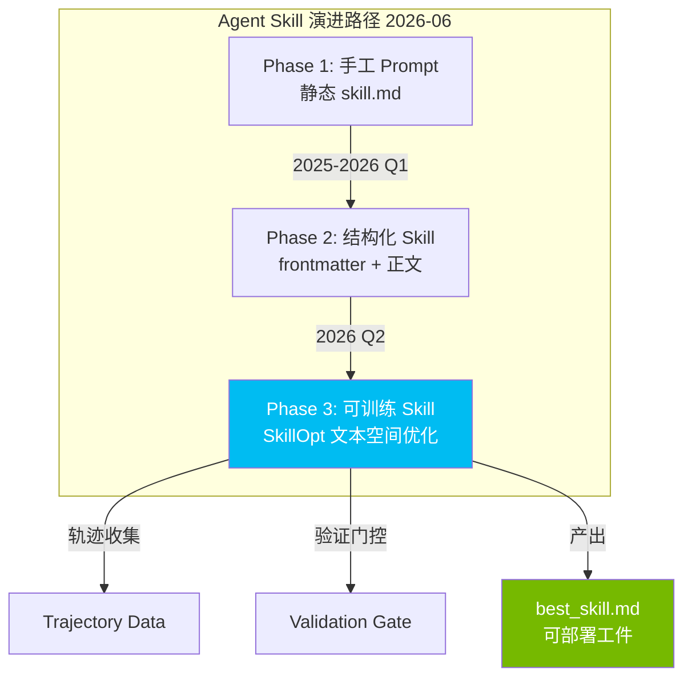
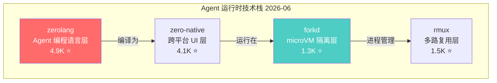

# 2026-06-05 GitHub 趋势研究简报

## 今日核心判断

> Agent Skill 正在从「手工编写 prompt」进化为「可训练、可优化的文本空间工件」。Microsoft SkillOpt 的出现意味着：Agent 的自然语言技能不再是静态的 prompt，而是可以通过轨迹驱动、验证门控来迭代训练的「文本空间模型参数」。这是 Agent 自主演化能力的基础设施级突破。

---

## 趋势一：Agent Skill 从手工编写进化为可训练优化单元（★92）

**核心信号：Microsoft SkillOpt 4.9K stars, Python, MIT**

SkillOpt 不是又一个 prompt 管理工具。它提出了一个新范式：**Agent 的自然语言技能本身就是可优化的参数**。

| 维度 | 传统 Skill | SkillOpt 范式 |
|------|-----------|--------------|
| 编写方式 | 手工编写 | 轨迹驱动自动编辑 |
| 质量保证 | 人工审查 | 验证门控自动筛选 |
| 迭代方式 | 版本控制 | 训练循环 |
| 产出物 | .md 文件 | best_skill.md 可部署工件 |
| 适用场景 | 简单指令 | 复杂多步推理 |

**架构师视角：**
- 这本质上是把「prompt engineering」升级为「prompt training」
- 文本空间优化 ≠ 修改模型权重。LLM 冻结，只优化自然语言技能描述
- 验证门控设计是关键：防止优化方向跑偏
- Microsoft 出品，MIT 协议，可商用
- 487 forks 说明社区在积极尝试

**与生态的关系：**
- html-anything 6.1K — 75 种 Skill 的 agentic HTML 编辑器
- gsd-core 2.7K — Git. Ship. Done，spec-driven 的 Agent 开发流程
- 9arm-skills 2.7K — Shell 技能集合

这些项目代表了 Skill 生态的不同层：Skill 市场 → Skill 应有 → **Skill 训练（SkillOpt）**

## 趋势二：自托管 AI 工作空间现象级项目（★90）

**核心信号：Odysseus 50.6K stars, 5.9K forks, Python, MIT**

一个 Python 项目在一个月内突破 50K stars，5.9K forks。这不是普通的增长曲线。

**为什么重要：**
- **自托管需求验证**：用户不想把代码和数据发给 SaaS AI 工具
- **5.9K forks 意味着真实部署**：不只是「收藏吃灰」
- 346 个 open issues + 498 PRs = 社区活跃度极高
- MIT 协议消除了商用障碍

**判断：**
- 50K+ stars 但缺乏 topics 和详细描述，需观察是否为「集中式爆发」还是持续增长
- 自托管 AI 工作空间如果成熟，会吃掉部分 SaaS AI 工具的市场
- 对架构师的启发：私有部署 + 本地推理 + 开源协议是 AI 工具的「不可能三角」最优解

**风险：** 项目名和组织名不够正规（pewdiepie-archdaemon），需确认是否为正式项目而非个人实验。

## 趋势三：Agent 专用语言与运行时涌现（★88）

**Vercel Labs 连续推出两个 Agent 基础设施项目，标志 Agent 运行时进入语言层竞争。**

| 项目 | Stars | 语言 | 定位 |
|------|-------|------|------|
| zerolang | 4.9K | C | Agent 的编程语言 |
| zero-native | 4.1K | Zig | Zig + Web UI 构建桌面/移动应用 |
| forkd | 1.3K | Rust | Agent microVM，KVM 隔离 |
| rmux | 1.5K | Rust | 通用 Rust 多路复用器 |

**架构师视角：**

- **zerolang** 是最大胆的赌注：如果 Agent 需要专用语言，先发优势巨大
- **forkd** 解决了 Agent 隔离的核心痛点：100 个子进程在 ~100ms 内启动，KVM 级隔离 + CoW 快照
- fork() for AI agents 是正确的抽象：Agent 需要轻量级进程隔离，Docker 太重，thread 不够安全
- **rmux** 把任意 CLI/TUI 变为可编程接口，Agent 可以像调用函数一样驱动 vim/top/htop

**风险：** Vercel Labs 项目通常实验性强，可能随时停止维护。forkd 和 rmux 来自社区，更可能持续。

## 趋势四：AI 供应链安全成独立赛道（★84）

**核心信号：Perplexity bumblebee 4.3K + dirtyfrag 4.8K**

| 项目 | Stars | 语言 | 定位 |
|------|-------|------|------|
| bumblebee | 4.3K | Go | 开发者端点扫描，供应链安全 |
| dirtyfrag | 4.8K | C | 内核碎片化漏洞研究 |

**bumblebee 值得关注：**
- Perplexity 出品，Apache 2.0
- 只读扫描：不修改系统，不收集数据
- 检测目标：本地包、扩展、开发工具元数据
- 场景：开发者机器上的 npm/pip/extension 暴露面检测
- 10 issues + 16 PRs = 早期但活跃

**架构师视角：** AI Agent 在开发者机器上执行代码，会安装 npm 包、pip 包、浏览器扩展。这些依赖链构成了新的攻击面。bumblebee 是第一个面向「AI 编码时代」的供应链扫描器。

**dirtyfrag** 无描述、无 license、无 topics，但 4.8K stars，C 语言。推测为内核碎片化/堆利用安全研究工具。高风险高兴趣。

## 趋势五：开源情报平台与工具增强型项目持续走热（★80）

| 项目 | Stars | 语言 | 定位 |
|------|-------|------|------|
| osiris | 4.4K | TypeScript | 开源 OSINT Dashboard，Palantir 替代 |
| CodexPlusPlus | 13.3K | Rust | CodexApp 增强工具 |
| OpenLogi | 3.8K | Rust | Logitech Options+ 本地替代 |

**osiris 判断：**
- MIT 协议，902 forks 说明有真实部署需求
- 3 issues + 3 PRs = 极早期，更多是概念验证
- 开源 Palantir 替代一直是安全社区的高需求赛道

**CodexPlusPlus 13.3K：** Rust 实现的 Codex 增强工具，325 issues 反映活跃使用，但「增强工具」定位决定了它是依附型项目。

---

## 全局观察

### 今日最值得关注的项目矩阵

| 项目 | 热度 | 创新度 | 成熟度 | 架构启发 | 落地潜力 | 分类 |
|------|------|--------|--------|----------|----------|------|
| SkillOpt | 7 | 9 | 5 | 9 | 7 | 平台候选 |
| Odysseus | 10 | 5 | 4 | 6 | 6 | 观察型 |
| zerolang | 7 | 8 | 3 | 8 | 4 | 学习型 |
| forkd | 5 | 8 | 4 | 8 | 6 | 基础设施候选 |
| bumblebee | 7 | 6 | 5 | 7 | 7 | 工具型 |
| rmux | 5 | 7 | 5 | 7 | 6 | 工具型 |

### 泡沫预警

- **Odysseus** — 50K stars 但项目描述仅 "Self-hosted AI workspace"，无 topics，组织名异常。可能是「集中式 star 爆发」，需观察后续增长是否持续
- **CodexPlusPlus** — 13.3K stars 但本质是 Codex 的辅助增强工具，技术壁垒低，依附 Codex 生存
- **dirtyfrag** — 无描述、无 license、无 topics，纯靠神秘感吸引关注

### 值得持续跟踪

- **Microsoft SkillOpt** — Agent Skill 训练范式，Microsoft 背书，MIT 协议
- **forkd** — Agent microVM，fork() 抽象正确，Rust + KVM 组合
- **Vercel zerolang** — Agent 专用语言，大胆赌注
- **Perplexity bumblebee** — AI 时代供应链安全扫描器
- **rmux** — CLI/TUI 可编程化，Agent 工具链基础设施

---

## 重点项目深度分析

### 1. Microsoft SkillOpt — Agent 技能文本空间优化器

**是什么：** Microsoft 出品的文本空间优化器，为冻结的 LLM Agent 训练可复用的自然语言技能。通过轨迹驱动编辑（trajectory-driven edits）、验证门控更新（validation-gated updates）产出可部署的 best_skill.md 工件。

**为什么火：** Agent Skill 是当前最热赛道之一，但所有 Skill 都是手工编写。SkillOpt 第一个提出了系统化的 Skill 训练方法。4.9K stars + 487 forks 说明社区在积极尝试。

**技术亮点：**
- **文本空间优化**：不修改 LLM 权重，只优化自然语言技能描述
- **轨迹驱动**：从 Agent 执行轨迹中提取优化信号
- **验证门控**：每次技能更新必须通过验证才能合并
- **可部署工件**：产出 best_skill.md，直接可用

**定位判断：平台候选。** 如果 Skill 训练范式成立，SkillOpt 可能成为 Agent Skill 生命周期的核心工具。

**风险：** 实验性项目（Microsoft Research），可能缺乏长期维护承诺。文本空间优化的效果未经大规模验证。

### 2. Odysseus — 自托管 AI 工作空间

**是什么：** Python 实现的自托管 AI 工作空间，MIT 协议，一个月内 50.6K stars + 5.9K forks。

**为什么火：** 自托管 AI 是当前最被低估的需求。用户不想把代码、文档、对话发给 SaaS。Odysseus 提供了零成本私有部署选项。

**风险：** 组织名 pewdiepie-archdaemon 不够正规，缺乏 topics 和详细文档。50K stars 的集中式增长可能是社交媒体爆发而非技术社区自然增长。需观察 6 月后续增长。

### 3. forkd — AI Agent 的 fork()

**是什么：** Rust 实现的 AI Agent microVM 管理。从预热父 VM fork 100 个子进程只需 ~100ms，支持 KVM 隔离 + CoW 快照。

**技术亮点：**
- **fork() 抽象**：Unix fork 的现代实现，为 Agent 场景优化
- **热启动**：预热父 VM + CoW = 极快启动
- **KVM 隔离**：硬件级隔离，比 Docker 容器更安全
- **快照回滚**：~150ms 分支一个活动 VM

**架构启发：** Agent 并行执行需要轻量级隔离。Docker 太重（秒级启动），thread 不安全。microVM + fork() 是当前最佳抽象。

**定位判断：基础设施候选。** Agent 运行时隔离层标准组件。

---

*本报告由 GitHub Researcher 自动生成 · 数据截止 2026-06-05 06:00 CST*
