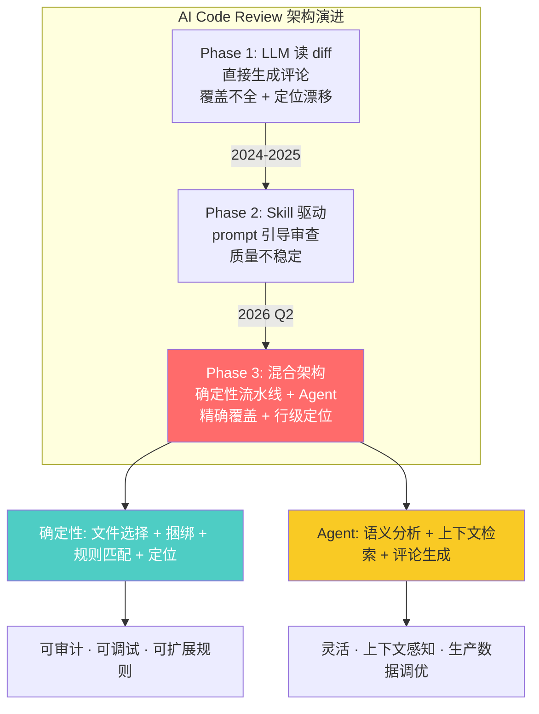
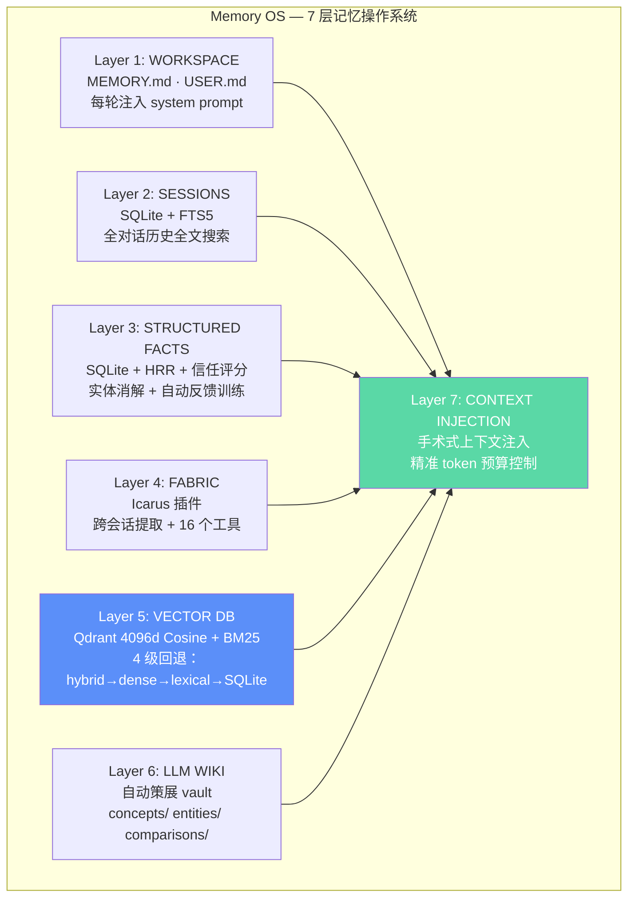

# 2026-06-06 GitHub 趋势研究简报

## 今日核心判断

> AI Code Review 正从「让 LLM 读 diff」的原始阶段跳到「确定性工程 + Agent 混合架构」的工业化阶段。Alibaba open-code-review 的核心洞察是：**纯语言驱动的 Agent 审查无法保证覆盖率和定位精度**。解法是把不该出错的部分（文件选择、规则匹配、评论定位）交给确定性代码，把需要判断的部分（语义分析、上下文检索）交给 Agent。这个混合范式不只适用于 code review，是所有 Agent 落地生产场景的通用模式。

---

## 趋势一：AI Code Review 进入混合架构时代（★91）

**核心信号：Alibaba open-code-review 2.7K stars, Go, Apache 2.0**

阿里内部两年、数万开发者验证，识别数百万代码缺陷后开源。这不是玩具——是经过生产规模验证的工具。

### 为什么纯 Agent 方案不够？

| 痛点 | 描述 |
|------|------|
| 覆盖不全 | 大变更集时 Agent 偷懒，只审部分文件 |
| 定位漂移 | 报告的行号和文件经常对不上 |
| 质量不稳定 | prompt 微调导致输出大幅波动 |

### 混合架构的解法

| 确定性工程（硬约束） | Agent（动态决策） |
|---------------------|-------------------|
| 精确文件选择 — 哪些要审、哪些过滤 | 语义级缺陷分析 |
| 智能文件捆绑 — 关联文件分组审查 | 代码库上下文检索 |
| 精细规则匹配 — 按文件特征分配规则 | 场景化评论生成 |
| 外部定位模块 — 保证行号准确 | 工具调用链优化 |
| 评论反思模块 — 自动验证评论准确性 | — |

**架构师视角：**
- 这是 Agent 落地生产的通用模式：不能出错的部分用代码，需要判断的部分用 LLM
- 内置 NPE / 线程安全 / XSS / SQL 注入规则集，OpenAI + Anthropic 兼容
- Go 语言实现，NPM 分发，一行命令安装
- 2754 stars + 130 forks + 14 issues = 生产级项目的特征
- 同赛道：openclaw/clawpatch 705 stars（Review + Patch + PR），更轻量但覆盖面窄

### 评分

| 维度 | 分数 | 理由 |
|------|------|------|
| 热度质量 | 7 | 2.7K stars，阿里背景，增长稳健 |
| 技术创新度 | 8 | 混合架构是生产级 AI Code Review 的正确范式 |
| 工程成熟度 | 9 | 阿里内部两年验证，数万开发者，数百万缺陷 |
| 架构启发价值 | 9 | 确定性 + Agent 混合模式适用于所有 Agent 生产场景 |
| 企业落地潜力 | 9 | NPM 一行安装，OpenAI/Anthropic 兼容，规则可扩展 |
| 中期趋势概率 | 8 | AI Code Review 是刚需，混合架构是正确方向 |
| 平台化潜力 | 7 | 规则系统 + Agent 工具链可扩展为通用审查平台 |
| 基础设施潜力 | 6 | 更偏 DevTools，不是基础设施 |
| **总分** | **63** | **生产可用 · 强烈推荐 PoC** |

---

## 趋势二：Agent Memory 分层操作系统化（★87）

**核心信号：Memory OS 869 stars + MemPalace 53.8K stars（持续跟踪）**

Agent 的记忆系统正在从「单一 RAG 检索」进化为「多层操作系统」。

### Memory OS 7 层架构

### 关键技术决策

| 决策 | 选择 | 理由 |
|------|------|------|
| 向量数据库 | Qdrant | 4096d Cosine + BM25 稀疏，混合检索 |
| 全文搜索 | SQLite FTS5 | 轻量，零依赖，O(1) 路径查找 |
| 语义去重 | cosine > 0.92 自动合并 | 防止记忆膨胀 |
| 知识衰减 | 每周扫描器 | 过期信息自动降权 |
| Provider | 全部本地 | OpenRouter/OpenAI/Anthropic/Ollama 兼容 |

**架构师视角：**
- 7 层不是过度设计——每一层解决不同时间尺度的记忆问题
- 信任评分 + 反馈回路 = 记忆的可演化性
- 一键安装（v0.2.0）说明项目认真对待用户体验
- 869 stars 对 Agent 基础设施来说不少了，说明是严肃开发者在使用

### 评分

| 维度 | 分数 | 理由 |
|------|------|------|
| 热度质量 | 5 | 869 stars，严肃项目但尚未爆发 |
| 技术创新度 | 8 | 7 层分层架构 + 信任评分 + 自动策展 |
| 工程成熟度 | 7 | v0.2.0，一键安装，社区贡献就绪 |
| 架构启发价值 | 9 | Agent 记忆系统的参考架构 |
| 企业落地潜力 | 6 | 需 Docker + Qdrant，有一定运维门槛 |
| 中期趋势概率 | 7 | Agent 记忆是刚需，分层方案是趋势 |
| 平台化潜力 | 7 | 可作为 Agent 基础设施层 |
| 基础设施潜力 | 8 | 记忆层是 Agent OS 的核心组件 |
| **总分** | **57** | **平台候选 · 值得跟踪** |

---

## 趋势三：本地优先运动从软件延伸到硬件（★85）

**核心信号：OpenLogi 4K + Goose 2.1K + Skylight 1.6K**

本地优先（Local-First）运动不再局限于软件，正在席卷硬件外设领域。

| 项目 | Stars | 语言 | 定位 |
|------|-------|------|------|
| OpenLogi | 4K | Rust | Logitech Options+ 本地替代，HID++ 协议 |
| Goose | 2.1K | Rust + Swift | WHOOP 5.0 本地健康数据，BLE 直连 |
| Skylight | 1.6K | TypeScript | RTL-SDR 飞机追踪 + 天花板投影 |

### 为什么重要？

**OpenLogi**（4K stars, Apache 2.0, Rust）
- 直接替代 Logitech Options+，无需账号、无遥测
- HID++ 协议实现，支持按键重映射、DPI、SmartShift
- 57 个 open issues = 活跃社区反馈
- Rust + GPUI 框架，原生性能

**Goose**（2.1K stars, Rust + Swift）
- WHOOP 5.0 健康手环的本地数据伴侣
- BLE 直连 + Rust 核心 + Swift UI
- 明确声明「独立项目，非 WHOOP 官方」
- 6 月 13 日 TestFlight 公测

**Skylight**（1.6K stars, TypeScript, MIT）
- RTL-SDR 接收 ADS-B 信号 → 实时飞机投射到天花板
- 包含太阳/月亮/星星/ISS 位置
- 树莓派 + 投影仪 = 硬件 + 软件的艺术装置

**架构师视角：**
- 本地优先 = 隐私 + 性能 + 数据主权
- 硬件外设本地化是 SaaS 模式的逆向运动
- Rust 成为本地优先硬件项目的首选语言（内存安全 + 嵌入式友好）
- 对开发者生态的启发：用户对「账号墙 + 遥测」的耐性在降低

---

## 趋势四：自托管团队 Agent 平台化（★83）

**核心信号：Paradigm Centaur 718 stars + Butterbase 1.3K + Odysseus 55.4K（持续跟踪）**

Agent 不再只是个人工具，开始出现团队级自托管平台。

### Paradigm Centaur — Slack 原生的团队 Agent

| 特性 | 实现 |
|------|------|
| 对话入口 | Slack @mention，线程级回复 |
| 执行环境 | K8s 隔离沙箱（k3s 即可） |
| Agent 引擎 | 可插拔：Claude Code / Codex / Amp / 自定义 |
| 工具系统 | Python 插件式，共享工具注册表 |
| 工作流 | 持久化 Python 步骤，支持 sleep/resume/子 Agent |
| 凭据安全 | iron-proxy 代理，Agent 只看到占位符 |
| 状态存储 | Postgres 持久化，可重放 |

**核心设计：凭据边界（Credential Boundaries）**
Agent 永远拿不到原始 API Key。iron-proxy 在出站请求时替换占位符为真实凭据，只替换到指定 host + header。这意味着 Agent 可以调用服务，但不能泄露密钥。

### Butterbase — AI 原生 BaaS

1.3K stars, Apache 2.0, TypeScript。Postgres + Auth + Storage + Functions + AI Gateway + MCP Server。定位为「开源 Supabase + AI 能力」。MCP Server 内建意味着 Agent 可以直接通过 MCP 协议操作后端。

### 评分（Centaur）

| 维度 | 分数 | 理由 |
|------|------|------|
| 热度质量 | 5 | 718 stars，Paradigm 出品 |
| 技术创新度 | 7 | K8s 沙箱 + 凭据隔离 + 持久工作流 |
| 工程成熟度 | 6 | 早期但架构清晰，有完整文档 |
| 架构启发价值 | 8 | 团队级 Agent 平台的参考架构 |
| 企业落地潜力 | 7 | K8s 依赖是门槛，但 k3s 降低了门槛 |
| 中期趋势概率 | 7 | 团队共享 Agent 是自然需求 |
| 平台化潜力 | 8 | 工具 + 工作流 + 沙箱 = 平台三要素 |
| 基础设施潜力 | 7 | 可成为企业 Agent 基础设施 |
| **总分** | **55** | **平台候选 · 早期观察** |

---

## 趋势五：Coding Agent CLI 新格局（★80）

**Moonshot Kimi Code 1.9K + Alibaba OCR 2.7K 形成「中国大厂 Coding Agent」赛道**

| 项目 | Stars | 出品方 | 定位 |
|------|-------|--------|------|
| Kimi Code CLI | 1.9K | Moonshot AI | 终端编程 Agent，Kimi 模型驱动 |
| Open Code Review | 2.7K | Alibaba | AI 代码审查，混合架构 |
| Claude Code | 193K | Anthropic | 终端编程 Agent 霸主 |
| OpenCode | 170K | anomalyco | 开源终端编程 Agent |

### Kimi Code CLI 亮点

- **单二进制分发**：curl 一行安装，不需要 Node.js
- **视频输入**：丢一个屏幕录像进去，Agent 看视频写代码
- **MCP 原生配置**：`/mcp-config` 对话式配置，不用手编 JSON
- **毫秒级启动**：TUI 瞬间就绪
- **插件生态**：Skills / MCP / 数据源 可从 marketplace 或 GitHub 安装

**判断：** Moonshot 是中国大模型公司的第一梯队。Kimi Code CLI 的定位是「Kimi 模型的终端入口」，策略类似 Claude Code 之于 Anthropic。单二进制 + 视频输入是差异化。

---

## 全局观察

### 今日项目矩阵

| 项目 | 热度 | 创新度 | 成熟度 | 架构启发 | 落地潜力 | 分类 |
|------|------|--------|--------|----------|----------|------|
| open-code-review | 7 | 8 | 9 | 9 | 9 | 生产可用 |
| Memory OS | 5 | 8 | 7 | 9 | 6 | 平台候选 |
| Centaur | 5 | 7 | 6 | 8 | 7 | 平台候选 |
| OpenLogi | 7 | 6 | 7 | 5 | 8 | 工具型 |
| Kimi Code | 6 | 6 | 6 | 5 | 6 | 工具型 |
| Butterbase | 6 | 6 | 5 | 6 | 6 | 观察型 |
| Skylight | 6 | 7 | 6 | 3 | 3 | 学习型 |
| Goose | 6 | 5 | 4 | 5 | 4 | 观察型 |

### 泡沫预警

- **Odysseus 55.4K stars** — 持续增长（昨日 50.6K → 今日 55.4K），但依然无 topics、无详细描述。增长真实但项目透明度不足。已在昨日报告中标记，今日继续观察。
- **Kimi Code CLI** — 1.9K stars 但 123 个 issues，稳定性待验证
- **Butterbase** — 零 issues 零 PR（除初始化），项目极早期

### 值得持续跟踪

- **Alibaba open-code-review** — 生产级 AI Code Review，混合架构范式
- **Memory OS** — 7 层记忆架构，Agent OS 参考设计
- **Paradigm Centaur** — 团队 Agent 平台架构
- **OpenLogi** — 本地优先硬件运动的标杆项目

### Odysseus 增长追踪

| 日期 | Stars | 日增 |
|------|-------|------|
| 06-05 | 50.6K | — |
| 06-06 | 55.4K | +4.8K |

日增 4.8K stars，增长仍在加速。

---

*本报告由 GitHub Researcher 自动生成 · 数据截止 2026-06-06 06:00 CST*