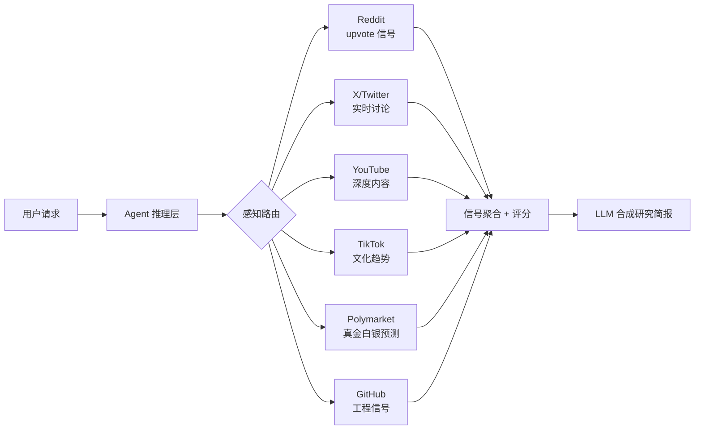
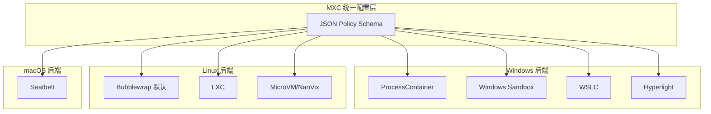

# 2026-06-07 GitHub 趋势研究简报

## 今日核心判断

> 今天 GitHub Trending 的信号很明确：**Agent 的瓶颈不再是推理，而是感知和执行**。
>
> last30days-skill（跨 10+ 平台信号聚合）和 Agent-Reach（零 API 费全网读取）代表了一个新赛道——**Agent 多源感知基础设施**。它们的核心洞察是：每个社交平台都是数据孤岛，但没有一个 AI 能同时访问所有平台。解决方式不是建一个新的搜索引擎，而是让 Agent 通过插件化方式桥接所有平台。
>
> 与此同时，MemPalace 以 96.6% R@5 的硬数据证明了**本地向量检索已经可以替代云端方案**——零 API 调用、零成本、隐私不离开机器。这对企业内网部署 RAG 系统有直接启发。
>
> Microsoft MXC 则补齐了 Agent 安全执行的最后一块拼图：跨平台、策略驱动、多后端的代码沙箱。虽然仍在早期 preview，但它代表了 **OS 级沙箱标准化**的方向。

## 趋势一：Agent 多源感知基础设施化（90 分）

### 为什么重要

Agent 要做有价值的决策，前提是能看到完整的外部世界。但目前每个社交/内容平台都是数据孤岛：Google 不搜 Reddit 评论，ChatGPT 只有 Reddit 协议但没有 X，Gemini 有 YouTube 但没有 Reddit。

### 两条技术路径

| 路径 | 代表项目 | 核心思路 | 优势 | 风险 |
|------|----------|----------|------|------|
| Agent Skill 插件化 | last30days-skill | 作为 skill 安装到 Claude Code/Cursor，BYOK 方式桥接平台 | 架构优雅，Agent 原生 | 依赖平台 API 稳定性 |
| CLI 脚手架统一 | Agent-Reach | 一行命令安装全网读取能力，Cookie 认证替代付费 API | 零成本，覆盖广 | 封号风险，维护成本高 |

### 架构启发

**关键判断：** 跨平台信号聚合将成为 Agent skill 生态的下一个大赛道。last30days-skill 的 v3 引擎不是简单关键词搜索，而是**先理解实体再路由搜索**（如输入"Peter Steinberger"自动解析为 @steipete + r/openclaw + GitHub profile），这是工程上的重要进步。

## 趋势二：AI Memory 本地优先成熟化（87 分）

### MemPalace 核心数据

| 模式 | R@5 召回率 | 是否需要 LLM | 是否需要 API |
|------|-----------|-------------|-------------|
| 纯语义搜索 | 96.6% | 否 | 否 |
| 混合 v4（held-out） | 98.4% | 否 | 否 |
| 混合 v4 + LLM rerank | ≥99% | 是 | 是 |

### 架构亮点

- **不摘要、不提取、不改写**——原文存储，语义检索
- **结构化索引**：people/projects → wings，topics → rooms，content → drawers
- **可插拔后端**：ChromaDB（默认）、Qdrant、pgvector、SQLite exact
- **29 个 MCP 工具**：覆盖 palace 读写、知识图谱、跨 wing 导航、agent 日记
- **实体-关系时间图**：带有效期窗口，SQLite 本地存储

### 对架构师的启发

MemPalace 的"原文 + 结构化索引"路线是对当前主流 RAG 方案的重要挑战。多数 RAG 系统先摘要再检索，会丢失细节。MemPalace 证明**不摘要的全文 + 好的语义索引**可以跑出更好的基准——而且不需要任何 API 调用。

## 趋势三：代码执行沙箱进入 OS 级（86 分）

### Microsoft MXC 核心设计

MXC（Microsoft Execution Containers）是微软发布的跨平台沙箱执行系统，专为运行不可信代码（模型输出、插件、工具）设计。

**关键定位：** MXC 不是一个新的沙箱，而是**所有沙箱的统一抽象层**。Agent 代码执行需要在 Windows/Linux/macOS 上用不同的隔离机制（AppContainer vs Bubblewrap vs Seatbelt），MXC 用 JSON Schema 统一了这些差异。

⚠️ **风险提示：** 当前 README 明确声明"no MXC profiles should be treated as security boundaries currently"——仍在早期 preview，策略可能过于宽松。

## 趋势四：Agent 终端多路复用器新物种（84 分）

### herdr 定位

herdr 是一个 **agent multiplexer**——tmux 的持久化能力 + GUI agent 管理器的状态感知，合在一个 Rust 单二进制中。250 stars/天的增速反映了一个真实痛点：**多 Agent 并行编排时缺乏统一管理**。

| 能力 | tmux | GUI 管理器 | herdr |
|------|------|-----------|-------|
| 持久化会话 | ✓ | — | ✓ |
| Agent 状态感知 | — | ✓ | ✓ |
| 生活在终端 | ✓ | — | ✓ |
| 鼠标原生操作 | — | ✓ | ✓ |
| Agent 可编排 | ? | ? | ✓ |

### 与 Multica 的对比

- **herdr**：终端原生的 Agent 多路复用器，适合个人开发者多 Agent 并行
- **Multica**（Go，新上 trending）：团队级 Agent 管理平台，有 issue 分配、Squad、Autopilots

两者代表不同层次的 Agent 编排：个人终端 vs 团队平台。

## 趋势五：HTML 原生视频渲染 Agent 化（82 分）

### HyperFrames 核心洞察

HyperFrames（HeyGen 出品，25K stars）的赌注是：**Agent 写 HTML 比写 React 组件容易得多**。所以视频渲染框架应该基于 HTML + CSS + seekable animations，而不是 React 组件。

与 Remotion 的对比：
- **HyperFrames**：HTML 原生，无 build step，Agent 直接生成
- **Remotion**：React 组件，需 bundler，更成熟生态

257 stars/天说明市场对"Agent 也能做视频"的需求是真实的。

## 其他值得关注

| 项目 | Stars | 一句话 |
|------|-------|--------|
| CopilotKit | 33.1K (+613/天) | Agent 前端栈 + AG-UI 协议，持续高增长 |
| open-notebook | 26.5K (+783/天) | 开源 Notebook LM 替代，今日增速最高 |
| AgentScope 2.0 | — | 阿里出品 Agent 框架，生产级 multi-tenancy + 事件系统 |
| agentgateway | 3.1K | Rust 实现的 Agent 代理网关，MCP server 支持 |
| HexStrike AI | 9.3K | MCP 安全测试 Agent，150+ 网络安全工具集成 |
| Panniantong/Agent-Reach | — | 零 API 费全网读取，中文社区热度 |
| IBM mcp-context-forge | 3.8K | AI Gateway + MCP 注册中心 + 统一代理 |

## 风险与机遇

### 机遇

1. **Agent 感知基础设施** 是下一个建项目机会——跨平台信号聚合 + 本地优先 + 可插拔
2. **本地 AI Memory** 已达到生产可用基准（96.6% R@5），企业内网 RAG 部署可参考
3. **沙箱标准化**（MXC）将推动 Agent 代码执行从"信任运行"走向"策略隔离"

### 风险

1. **Agent-Reach 的 Cookie 方式**有封号风险，不适合企业级使用
2. **MXC 当前策略过于宽松**，不可作为安全边界
3. **HyperFrames 的 Agent 友好路线**需要验证实际视频质量是否达到商用标准

## 重点项目档案

详见以下项目档案：

1. 🔎 [last30days-skill](projects/last30days-skill.html) — Agent 跨平台搜索 Skill
2. 🧠 [MemPalace](projects/mempalace.html) — 本地优先 AI 记忆系统
3. 🛡️ [Microsoft MXC](projects/mxc.html) — 跨平台沙箱执行系统
4. 🔀 [herdr](projects/herdr.html) — Agent 终端多路复用器
5. 🎬 [HyperFrames](projects/hyperframes.html) — HTML 原生视频渲染

---

*生成时间：2026-06-07 06:00 CST*
